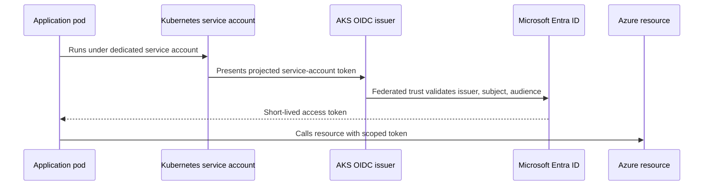

> **文档类型：** 应用与 Kubernetes 架构参考模型
> **规范性术语：** **MUST**、**MUST NOT**、**SHOULD**、**SHOULD NOT** 和 **MAY** 是要求级别。
> **适用范围：** AKS 平台边界、私有网络、身份、节点池、策略、供应链、可观测性和跨托管 Kubernetes 平台的生命周期。
> **例外流程：** 偏离要求需要记录风险评估、补偿控制、指定风险负责人和到期日期。

|控制领域|价值|
|---|---|
|文件编号 | `APP-04` |
|负责人|云卓越中心 |
|审核周期|至少每年一次，并且在云服务、Kubernetes、安全性或运营模型发生重大变化之后 |
|证据|平台架构记录、基础设施即代码计划、安全审查、集群测试和运营就绪证据 |

# AKS 平台架构

> **决策简述：** 将 AKS 作为受控平台进行运营，具有默认私有边界、工作负载身份、策略实施、经过测试的生命周期管理和明确的所有权。

## 目的

该标准定义了 Azure Kubernetes Service 的企业基线架构。它建立了生产集群所需的平台边界、集群拓扑、身份、网络、入口、出口、策略、节点池、注册表、机密、可观测性、弹性和生命周期控制。等效控制应用于 Amazon EKS、Google Kubernetes Engine 和 Oracle Kubernetes Engine。

AKS 是一个共享平台，而不仅仅是一个集群资源。生产平台包括云基础设施、Kubernetes 插件、交付控制、策略、身份、可观测性、操作程序和资助的所有权模型。

## 平台原则

1. 与不受控制的集群扩散相比，更喜欢管理良好的集群较少，但不要结合不兼容的信任、合规性、生命周期或可用性边界。
2. 使用私有集群进行生产，除非公共 API 访问明确合理且受到严格限制。
3. 将系统和用户工作负载分离到适当的节点池中。
4. 使用工作负载身份；不继承广泛的节点身份权限。
5. 将入口和出口视为受控安全边界。
6. 通过基础设施即代码或 GitOps 声明所有集群和附加配置。
7. 维护受支持的 Kubernetes 版本和经过测试的升级节奏。
8. 跨区域和（如果需要）跨区域构建应对故障的能力。

## 参考架构

## 簇边界决策

当以下一项或多项重要时，创建单独的集群：

- 监管或数据主权隔离。
- 不同的管理所有者或特权访问边界。
- 不兼容的 Kubernetes 或附加生命周期要求。
- 可用性或性能要求存在重大差异。
- 不受信任或嘈杂的工作负载带来的高爆炸半径风险。
- 专用成本、成本分摊或客户隔离要求。
命名空间是有用的租户边界，但并不等同于每个威胁模型的单独集群。共享集群需要准入控制、配额、网络策略、工作负载身份和强大的管理分离。

## 控制平面和访问

- 生产集群 **MUST** 使用私有 API 访问，除非批准例外。
- 人工访问 **MUST** 使用集中式身份、MFA、最小权限、短期凭证和经过审核的特权工作流程。
- 本地静态管理员凭据 **MUST** 被禁用或严格控制。
- Kubernetes RBAC **MUST** 与企业身份提供商集成。
- CI/CD 和 GitOps 控制器 **MUST** 使用具有范围权限的非人类身份。
- 管理网络路径 **MUST** 进行日志记录和测试，包括对私有 API 的 DNS 解析。

## 节点池架构

至少使用一个专用系统节点池和一个或多个用户节点池。额外的池可以隔离 Windows 工作负载、GPU 工作负载、内存密集型服务、不受信任的工作负载或特殊的合规域。

每个节点池**MUST**定义：

- VM 系列、体系结构、磁盘和网络要求。
- 最小、最大和浪涌容量。
- 需要时的可用区分布。
- 污点、容忍、标签和调度意图。
- 升级行为和中断预算。
- 操作系统镜像和 Kubernetes 版本生命周期。
- 成本和容量所有权。

除非明确允许，否则不要在系统池上安排普通应用工作负载。

## 网络架构

### 地址规划

IP 规划必须考虑节点、pod、服务、升级、自动扩展、蓝绿节点池、私有端点和未来增长。地址耗尽是设计失败，而不是操作意外。

### 入口

Ingress 应终止于批准的区域或全球边缘。设计必须定义 WAF 放置、TLS 所有权、内部与外部入口类、源限制、客户端 IP 处理和服务授权。 Kubernetes Ingress API 或网关 API 对象本身并不提供企业边缘安全。

### 出口

所有出站路径必须是明确的。需要时通过防火墙/NAT 架构使用受控出口。记录所需的提供程序端点、包仓库、注册表、身份端点、监控端点和工作负载依赖性。避免不受限制的互联网出口。

### 东西向控制

网络策略 **MUST** 为 CNI 和工作负载设计支持的生产命名空间实现默认拒绝行为。服务到服务的身份和授权仍然是必要的，因为网络位置不是身份。

## 身份架构

工作负载标识 **MUST** 是 pod 访问 Azure 资源的默认标识。节点身份不得用作共享应用凭证。每个工作负载身份应映射到一个应用信任边界，并仅接收所需的数据平面权限。

## 注册表和软件供应链

- 使用具有适合环境的网络限制的私有注册表。
- 部署前必须扫描镜像，并不断重新评估新披露的漏洞。
- 生产部署必须引用不可变的摘要。
- 准入策略应强制执行允许的注册表、所需的标签、非根执行、批准的功能、资源请求/限制以及支持的镜像或签名要求。
- 生成并保留生产制品的 SBOM 和来源。
- 基础镜像必须按照定义的节奏进行管理和刷新。

## 机密和证书

使用 Key Vault 和 Secrets Store CSI 驱动程序或通过工作负载身份进行直接 SDK 访问。 Kubernetes Secret 对象并不是一个企业机密管理系统，仅仅因为它们是 Base64 编码的并且 etcd 是加密的。如果使用 Kubernetes Secret，请定义加密、RBAC、轮换、命名空间边界、备份公开和同步控制。

证书颁发和更新必须自动化。入口证书、内部服务证书、信任捆绑和根/中间 CA 轮换的所有权必须明确。

## 策略和治理

平台基线 **MUST** 强制执行：

- 批准的命名空间、标签、注释和所有权元数据。
- 资源请求和限制。
- 受限特权、主机访问和 Linux 功能。
- 批准的注册和镜像策略。
- 网络策略要求。
- 工作负载身份和服务账户标准。
- 适合工作负载的 Pod 安全标准。
- 禁止废弃的 API。
- 关键工作负载所需的探测和中断控制。

策略应在实施之前在审核模式下进行测试，并以策略即代码形式进行版本控制。

## 可观测性

该平台必须收集控制平面审计数据、节点指标、容器指标、Kubernetes 事件、应用日志、跟踪、入口指标、DNS 运行状况、需要的网络流证据以及云资源活动日志。中央仪表板应区分平台健康状况和工作负载健康状况。

最低平台信号包括：

- API 可用性和准入失败。
- 节点准备情况、压力、磁盘、网络和Autoscaler 状态。
- 待处理的 Pod 和调度原因。
- 重启循环、镜像拉取失败、OOM 终止和驱逐。
- 入口延迟/错误和证书过期。
- DNS 错误和出站依赖性失败。
- 升级状态和不支持的版本暴露。

## 弹性和生命周期

- 使用区域服务和工作负载要求支持的多个区域。
- 定义 PodDisruptionBudgets、拓扑扩展、反关联性和关键工作负载的最小副本。
- 测试节点耗尽、节点池升级、区域丢失、注册表故障、机密存储故障和依赖项故障。
- 保持定期的 Kubernetes 升级节奏，并具有较低的环境资格。
- 使用存储原生方法备份持久工作负载数据，并在版本控制中保护集群所需的状态。
- 多区域恢复必须包括数据、DNS/流量管理、机密、身份、镜像、策略和操作激活，而不仅仅是第二个空集群。

## 多云映射

|能力|Azure|AWS | GCP |OCI |
|---|---|---|---|---|
|托管 Kubernetes | AKS |Amazon EKS | GKE |无完全等效项|
| Pod/工作负载云身份 | Microsoft Entra 工作负载 ID | EKS Pod 身份或 IRSA | GKE 的工作负载身份联合 |支持的集群类型上的 OKE 工作负载身份 |
|机密集成| Secrets Store CSI 驱动程序的 Key Vault 提供程序 |Secret Manager ASCP/CSI |Secret Manager 附加组件/CSI | OCI Vault CSI 提供商或批准的外部机密模式 |
|容器注册表 | ACR |ECR |Artifact Registry | OCIR |
|策略 | Kubernetes 的 Azure Policy/准入控制 | EKS 准入和策略生态系统 |策略控制器/准入控制|准入控制和 OCI 治理服务 |
|托管节点缩减模式 | AKS 自动或托管节点池，具体取决于要求 | EKS 自动模式/Fargate（如应用）| GKE 自动驾驶仪 | OKE 虚拟节点|

提供商管理模式减少了节点管理，但并没有消除工作负载策略、身份、网络、成本或可观测性责任。

## 平台服务目录

AKS 平台应作为版本化服务目录而不是不受约束的集群来交付。目录应定义以下支持的模式：

- 命名空间和租户入驻。
- 公共和私有入口。
- 工作负载身份和机密访问。
- 持久存储类和备份层。
- GitOps 或受控部署。
- 策略例外。
- 指标、日志、跟踪和审核保留。
- 批准的 Operator 和平台扩展。
- GPU、Windows、机密或其他专用节点池。

每个目录项都需要所有者、服务目标、支持的版本、请求流程、成本模型和弃用策略。不支持的定制不能默默地成为平台义务。

## 容量、配额和 IP 预测

集群容量规划必须同时考虑计算、IP 地址、云配额和依赖性限制。至少预测：

- 系统池储备和关键附加请求。
- 用户工作负载请求、限制和预期过量使用。
- 用于升级和镜像轮换的节点激增。
- 节点或区域故障的余量。
- 最大Autoscaler 扩展和云区域配额。
- 所选 CNI 模型下的 Pod 和服务地址使用量。
- 负载均衡器、公共 IP、私有端点、磁盘、快照和路由表限制。

平台应在配额或地址耗尽成为事件之前发出告警。容量测试必须包括节点耗尽和区域丢失下的调度，而不仅仅是正常稳定状态。

## 附加组件和扩展生命周期
每个集群附加组件都必须在维护的兼容性矩阵中表示。这包括 CNI、CSI、DNS、入口或网关实施、策略引擎、机密提供商、可观测性代理、GitOps 控制器、证书控制器、服务网格、备份工具和操作员。

对于每个附加组件，日志记录：

- 安装和配置源。
- 所需的权限和网络访问。
- 支持的 Kubernetes 版本。
- 升级顺序和回滚或前向恢复路径。
- 必须备份的数据或自定义资源。
- 健康信号和支持负责人。
- 退役和终结器移除程序。

集群升级不得假设提供商管理的控制平面兼容性证明了第三方附加组件的兼容性。

## 集群引导和重建

新的集群应该可以重现，无需手动配置门户。 Bootstrap 应按依赖顺序进行：网络和身份、集群、核心节点池、DNS 和策略、存储和机密集成、入口、可观测性、GitOps、备份和工作负载入驻。

引导过程应在干净的订阅或账户边界中进行测试。它必须建立私有 DNS、联邦身份、注册表访问、策略分配、监控目的地和 break-glass 管理。如果可以创建集群但无法安全地拉取镜像、检索机密、解析私有服务或接受受控部署，则该平台不可恢复。

## 集群舰队管理

运营多个集群的组织应维护一个队列清单，其中包含所有者、用途、环境、区域、版本、节点镜像年龄、附加版本、支持截止日期、数据分类、恢复层和成本中心。使用发布波次和代表性金丝雀来进行策略、附加组件和 Kubernetes 更改。集群舰队范围内的变化需要暂停标准和方法来识别偏离批准基线的集群。

## 常见的反模式

- 每个应用一个集群，无需运营或成本模型。
- 一个巨大的集群跨越了不兼容的信任边界。
- 公共 API 服务器广泛开放，以方便使用。
- 使用节点身份的应用。
- 没有默认拒绝网络策略。
- 生产中的可变镜像标签。
- 手动集群附加安装，无需版本控制。
- 跳过 Kubernetes 升级，直到版本接近支持结束。
- 假设仅使用 etcd 加密就足以使 Kubernetes Secrets 足够。
- 在没有具体要求和所有权模型的情况下安装服务网格。

## 验证

- [ ] 集群边界和租户模型是合理的。
- [ ] 测试私有 API 访问、DNS 和特权管理路径。
- [ ] 记录了系统和工作负载节点池、区域、自动扩缩容和升级。
- [ ] Pod、服务和节点 IP 容量包括增长和升级空间。
- [ ] 入口、出口和东西向控制是明确的。
- [ ] 工作负载身份取代节点共享应用权限。
- [ ] 实施注册、扫描、SBOM、签名和准入控制。
- [ ] 机密和证书被外部化并测试轮换。
- [ ] 平台和工作负载遥测支持 SLO 和事件诊断。
- [ ] 升级、区域故障、备份和区域恢复过程经过测试。

## 相关主题

- [交付和操作 AKS 工作负载](app-delivering-and-operating-aks-workloads.md)
- [Kubernetes 应用网络和网关架构](app-kubernetes-application-networking-and-gateway-architecture.md)
- [Kubernetes 应用安全和策略标准](app-kubernetes-application-security-and-policy-standards.md)
- [Kubernetes 升级和 API 生命周期管理](app-kubernetes-upgrade-and-api-lifecycle-management.md)

## 参考文档

使用提供商文档作为服务限制、区域可用性、支持的版本和功能行为的真实来源。
- [Azure Kubernetes Service 文档](https://learn.microsoft.com/en-us/azure/aks/)
- [Azure AKS 基线架构](https://learn.microsoft.com/en-us/azure/architecture/reference-architectures/containers/aks/baseline-aks)
- [Azure AKS 安全基线](https://learn.microsoft.com/en-us/security/benchmark/azure/baselines/azure-kubernetes-service-aks-security-baseline)
- [Kubernetes 生产环境指导](https://kubernetes.io/docs/setup/production-environment/)
- [Amazon EKS Pod 身份](https://docs.aws.amazon.com/eks/latest/userguide/pod-identities.html)
- [GKE 工作负载身份联合](https://docs.cloud.google.com/kubernetes-engine/docs/how-to/workload-identity)
- [OCI Kubernetes Engine 概述](https://docs.oracle.com/en-us/iaas/Content/ContEng/Concepts/contengoverview.htm)
- [OCI OKE 工作负载身份](https://docs.oracle.com/en-us/iaas/Content/ContEng/Tasks/contenggrantingworkloadaccesstoresources.htm)
