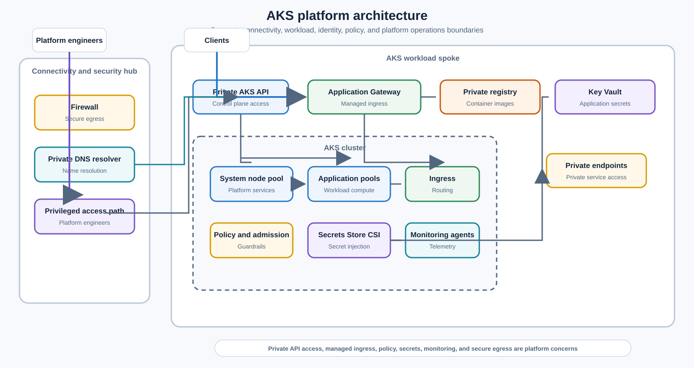
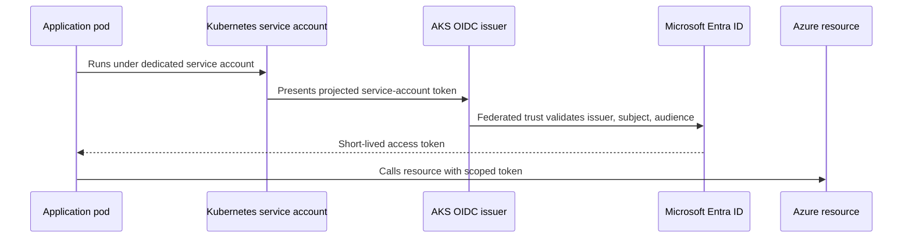

> **Document class:** Applications & Kubernetes architecture reference model
> **Normative terms:** **MUST**, **MUST NOT**, **SHOULD**, **SHOULD NOT**, and **MAY** are requirements levels.
> **Applicability:** AKS platform boundaries, private networking, identity, node pools, policy, supply chain, observability, and lifecycle across managed Kubernetes platforms.
> **Exception process:** Deviations require a documented risk assessment, compensating controls, named risk owner, and expiry date.

| Control field | Value |
|---|---|
| Document ID | `APP-04` |
| Owner | Cloud Center of Excellence |
| Review cycle | At least annually and after material cloud-service, Kubernetes, security, or operating-model changes |
| Evidence | Platform architecture record, infrastructure-as-code plan, security review, cluster tests, and operational readiness evidence |

# AKS Platform Architecture

> **Decision in brief:** Operate AKS as a governed platform with private-by-default boundaries, workload identity, policy enforcement, tested lifecycle management, and explicit ownership.

## Purpose

This standard defines the enterprise baseline architecture for Azure Kubernetes Service. It establishes the platform boundary, cluster topology, identity, networking, ingress, egress, policy, node-pool, registry, secret, observability, resilience, and lifecycle controls required for production clusters. Equivalent controls apply to Amazon EKS, Google Kubernetes Engine, and Oracle Kubernetes Engine.

AKS is a shared platform, not merely a cluster resource. A production platform includes cloud infrastructure, Kubernetes add-ons, delivery controls, policy, identity, observability, operating procedures, and a funded ownership model.

## Platform principles

1. Prefer fewer well-governed clusters over uncontrolled cluster proliferation, but do not combine incompatible trust, compliance, lifecycle, or availability boundaries.
2. Use private clusters for production unless public API access is explicitly justified and tightly restricted.
3. Separate system and user workloads into appropriate node pools.
4. Use workload identity; do not inherit broad node identity permissions.
5. Treat ingress and egress as controlled security boundaries.
6. Declare all cluster and add-on configuration through infrastructure as code or GitOps.
7. Maintain supported Kubernetes versions and a tested upgrade cadence.
8. Build for failure across zones and, where required, regions.

## Reference architecture

## Cluster boundary decision

Create a separate cluster when one or more of the following is material:

- Regulatory or data-sovereignty isolation.
- Different administrative owners or privileged-access boundaries.
- Incompatible Kubernetes or add-on lifecycle requirements.
- Materially different availability or performance requirements.
- High blast-radius risk from untrusted or noisy workloads.
- Dedicated cost, chargeback, or customer-isolation requirements.

Namespaces are useful tenancy boundaries but are not equivalent to separate clusters for every threat model. Shared clusters require admission controls, quotas, network policies, workload identity, and strong administrative separation.

## Control plane and access

- Production clusters **MUST** use private API access unless an exception is approved.
- Human access **MUST** use centralized identity, MFA, least privilege, short-lived credentials, and audited privileged workflows.
- Local static administrator credentials **MUST** be disabled or tightly break-glass controlled.
- Kubernetes RBAC **MUST** be integrated with the enterprise identity provider.
- CI/CD and GitOps controllers **MUST** use non-human identities with scoped permissions.
- Administrative network paths **MUST** be documented and tested, including DNS resolution to the private API.

## Node-pool architecture

At minimum, use a dedicated system node pool and one or more user node pools. Additional pools may isolate Windows workloads, GPU workloads, memory-intensive services, untrusted workloads, or special compliance domains.

Each node pool **MUST** define:

- VM family, architecture, disk, and network requirements.
- Minimum, maximum, and surge capacity.
- Availability-zone distribution where required.
- Taints, tolerations, labels, and scheduling intent.
- Upgrade behavior and disruption budget.
- OS image and Kubernetes version lifecycle.
- Cost and capacity ownership.

Do not schedule ordinary application workloads on the system pool unless explicitly allowed.

## Network architecture

### Address planning

IP planning must account for nodes, pods, services, upgrades, autoscaling, blue-green node pools, private endpoints, and future growth. Address exhaustion is a design failure, not an operational surprise.

### Ingress

Ingress should terminate at the approved regional or global edge. The design must define WAF placement, TLS ownership, internal versus external ingress classes, source restrictions, client-IP handling, and service authorization. The Kubernetes Ingress API or Gateway API object does not by itself provide enterprise edge security.

### Egress

All outbound paths must be explicit. Use controlled egress through firewall/NAT architecture when required. Document required provider endpoints, package repositories, registries, identity endpoints, monitoring endpoints, and workload dependencies. Avoid unrestricted internet egress.

### East-west controls

Network policies **MUST** implement default-deny behavior for production namespaces where the CNI and workload design support it. Service-to-service identity and authorization remain necessary because network location is not identity.

## Identity architecture

Workload identity **MUST** be the default for pod access to Azure resources. Node identities must not be used as a shared application credential. Each workload identity should map to one application trust boundary and receive only required data-plane permissions.

## Registry and software supply chain

- Use a private registry with network restrictions appropriate to the environment.
- Images must be scanned before deployment and continuously reassessed for newly disclosed vulnerabilities.
- Production deployments must reference immutable digests.
- Admission policy should enforce allowed registries, required labels, non-root execution, approved capabilities, resource requests/limits, and image or signature requirements where supported.
- Generate and retain an SBOM and provenance for production artifacts.
- Base images must be curated and refreshed on a defined cadence.

## Secrets and certificates

Use Key Vault and the Secrets Store CSI Driver or direct SDK access with workload identity. Kubernetes Secret objects are not an enterprise secret-management system merely because they are base64-encoded and etcd is encrypted. If Kubernetes Secrets are used, define encryption, RBAC, rotation, namespace boundaries, backup exposure, and synchronization controls.

Certificate issuance and renewal must be automated. Ownership must be clear for ingress certificates, internal service certificates, trust bundles, and root/intermediate CA rotation.

## Policy and governance

The platform baseline **MUST** enforce:

- Approved namespaces, labels, annotations, and ownership metadata.
- Resource requests and limits.
- Restricted privilege, host access, and Linux capabilities.
- Approved registries and image policies.
- Network policy requirements.
- Workload identity and service-account standards.
- Pod security standards appropriate to the workload.
- Prohibited deprecated APIs.
- Required probes and disruption controls for critical workloads.

Policies should be tested in audit mode before enforcement and versioned as code.

## Observability

The platform must collect control-plane audit data, node metrics, container metrics, Kubernetes events, application logs, traces, ingress metrics, DNS health, network-flow evidence where required, and cloud-resource activity logs. Central dashboards should distinguish platform health from workload health.

Minimum platform signals include:

- API availability and admission failures.
- Node readiness, pressure, disk, network, and autoscaler state.
- Pending pods and scheduling reasons.
- Restart loops, image pull failures, OOM kills, and evictions.
- Ingress latency/errors and certificate expiry.
- DNS errors and outbound dependency failures.
- Upgrade status and unsupported-version exposure.

## Resilience and lifecycle

- Use multiple zones where the regional service and workload requirements support them.
- Define PodDisruptionBudgets, topology spread, anti-affinity, and minimum replicas for critical workloads.
- Test node drain, node-pool upgrade, zone loss, registry failure, secret-store failure, and dependency failure.
- Maintain a regular Kubernetes upgrade cadence with lower-environment qualification.
- Back up persistent workload data using storage-native methods and protect cluster desired state in version control.
- Multi-region recovery must include data, DNS/traffic management, secrets, identities, images, policy, and operational activation—not only a second empty cluster.

## Multi-cloud mapping

| Capability | Azure | AWS | GCP | OCI |
|---|---|---|---|---|
| Managed Kubernetes | AKS | Amazon EKS | GKE | OKE |
| Pod/workload cloud identity | Microsoft Entra Workload ID | EKS Pod Identity or IRSA | Workload Identity Federation for GKE | OKE workload identity on supported cluster types |
| Secret integration | Key Vault provider for Secrets Store CSI Driver | Secrets Manager ASCP/CSI | Secret Manager add-on/CSI | OCI Vault CSI provider or approved external-secrets pattern |
| Container registry | ACR | ECR | Artifact Registry | OCIR |
| Policy | Azure Policy for Kubernetes / admission controls | EKS admission and policy ecosystem | Policy Controller / admission controls | Admission controls and OCI governance services |
| Managed node-reduced mode | AKS Automatic or managed node pools depending on requirements | EKS Auto Mode / Fargate where applicable | GKE Autopilot | OKE virtual nodes |

Provider-managed modes reduce node administration but do not eliminate workload policy, identity, networking, cost, or observability responsibilities.

## Platform service catalog

The AKS platform should be delivered as a versioned service catalog rather than an unconstrained cluster. The catalog should define supported patterns for:

- Namespace and tenant onboarding.
- Public and private ingress.
- Workload identity and secret access.
- Persistent storage classes and backup tiers.
- GitOps or controlled deployment.
- Policy exceptions.
- Metrics, logs, traces, and audit retention.
- Approved operators and platform extensions.
- GPU, Windows, confidential, or other specialized node pools.

Each catalog item needs an owner, service objective, supported version, request process, cost model, and deprecation policy. Unsupported customizations must not silently become platform obligations.

## Capacity, quota, and IP forecasting

Cluster capacity planning must consider compute, IP addresses, cloud quotas, and dependency limits together. Forecast at least:

- System-pool reserve and critical add-on requests.
- User workload requests, limits, and expected overcommit.
- Node surge for upgrades and image rotation.
- Headroom for a node or zone failure.
- Maximum autoscaler expansion and cloud regional quota.
- Pod and service address consumption under the selected CNI model.
- Load balancers, public IPs, private endpoints, disks, snapshots, and route-table limits.

The platform should alert before quota or address exhaustion becomes an incident. Capacity tests must include scheduling under node drain and zonal loss, not only normal steady state.

## Add-on and extension lifecycle

Every cluster add-on must be represented in an owned compatibility matrix. This includes CNI, CSI, DNS, ingress or Gateway implementation, policy engine, secret provider, observability agents, GitOps controller, certificate controller, service mesh, backup tooling, and operators.

For each add-on, record:

- Installation and configuration source.
- Required permissions and network access.
- Supported Kubernetes versions.
- Upgrade order and rollback or forward-recovery path.
- Data or custom resources that must be backed up.
- Health signals and support owner.
- Decommissioning and finalizer-removal procedure.

Cluster upgrades must not proceed on the assumption that provider-managed control-plane compatibility proves third-party add-on compatibility.

## Cluster bootstrap and rebuild

A new cluster should be reproducible without manual portal configuration. Bootstrap should proceed in dependency order: network and identity, cluster, core node pools, DNS and policy, storage and secret integrations, ingress, observability, GitOps, backup, and workload onboarding.

The bootstrap process should be tested in a clean subscription or account boundary. It must establish private DNS, federated identities, registry access, policy assignments, monitoring destinations, and break-glass administration. The platform is not recoverable if the cluster can be created but cannot securely pull images, retrieve secrets, resolve private services, or accept controlled deployments.

## Fleet governance

Organizations operating multiple clusters should maintain a fleet inventory containing owner, purpose, environment, region, version, node-image age, add-on versions, support deadline, data classification, recovery tier, and cost center. Use rollout waves and representative canaries for policy, add-on, and Kubernetes changes. Fleet-wide changes require pause criteria and a method to identify clusters that diverged from the approved baseline.

## Common anti-patterns

- One cluster for every application without an operating or cost model.
- One giant cluster spanning incompatible trust boundaries.
- Public API server open broadly for convenience.
- Applications using the node identity.
- No default-deny network policy.
- Mutable image tags in production.
- Manual cluster add-on installation without version control.
- Skipping Kubernetes upgrades until the version approaches end of support.
- Assuming etcd encryption alone makes Kubernetes Secrets sufficient.
- Installing a service mesh without a concrete requirement and ownership model.

## Validation

- [ ] Cluster boundary and tenancy model are justified.
- [ ] Private API access, DNS, and privileged administration paths are tested.
- [ ] System and workload node pools, zones, autoscaling, and upgrades are documented.
- [ ] Pod, service, and node IP capacity includes growth and upgrade headroom.
- [ ] Ingress, egress, and east-west controls are explicit.
- [ ] Workload identity replaces node-shared application permissions.
- [ ] Registry, scanning, SBOM, signature, and admission controls are implemented.
- [ ] Secrets and certificates are externalized and rotation is tested.
- [ ] Platform and workload telemetry support SLOs and incident diagnosis.
- [ ] Upgrade, zone-failure, backup, and regional-recovery procedures are tested.

## Related topics

- [Delivering and Operating AKS Workloads](app-delivering-and-operating-aks-workloads.md)
- [Kubernetes Application Networking and Gateway Architecture](app-kubernetes-application-networking-and-gateway-architecture.md)
- [Kubernetes Application Security and Policy Standards](app-kubernetes-application-security-and-policy-standards.md)
- [Kubernetes Upgrade and API Lifecycle Management](app-kubernetes-upgrade-and-api-lifecycle-management.md)

## References

Use provider documentation as the source of truth for service limits, regional availability, supported versions, and feature behavior.
- [Azure Kubernetes Service documentation](https://learn.microsoft.com/en-us/azure/aks/)
- [Azure AKS baseline architecture](https://learn.microsoft.com/en-us/azure/architecture/reference-architectures/containers/aks/baseline-aks)
- [Azure AKS security baseline](https://learn.microsoft.com/en-us/security/benchmark/azure/baselines/azure-kubernetes-service-aks-security-baseline)
- [Kubernetes production environment guidance](https://kubernetes.io/docs/setup/production-environment/)
- [Amazon EKS Pod Identity](https://docs.aws.amazon.com/eks/latest/userguide/pod-identities.html)
- [GKE Workload Identity Federation](https://docs.cloud.google.com/kubernetes-engine/docs/how-to/workload-identity)
- [OCI Kubernetes Engine overview](https://docs.oracle.com/en-us/iaas/Content/ContEng/Concepts/contengoverview.htm)
- [OCI OKE workload identity](https://docs.oracle.com/en-us/iaas/Content/ContEng/Tasks/contenggrantingworkloadaccesstoresources.htm)
