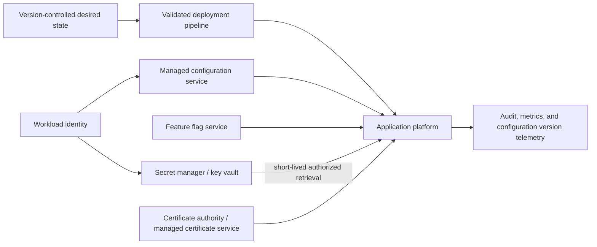
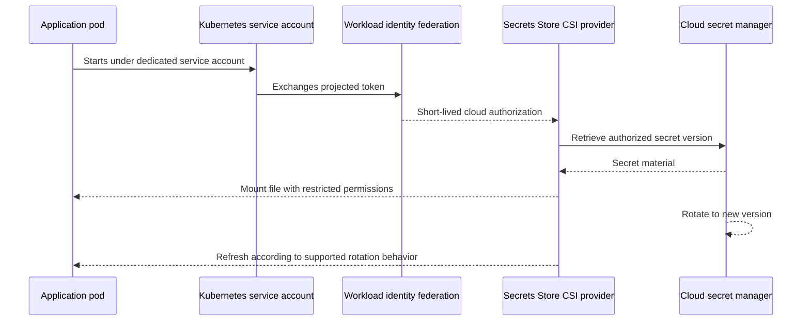

> **文档类型：** 应用和 Kubernetes 实施指南
> **规范性术语：** **MUST**、**MUST NOT**、**SHOULD**、**SHOULD NOT** 和 **MAY** 是要求级别。
> **适用范围：** 跨云和 Kubernetes 平台的应用配置、机密引用、证书、密钥、功能开关、轮换和故障行为。
> **例外流程：** 偏离要求需要记录风险评估、补偿控制、指定风险负责人和到期日期。

|控制领域|价值|
|---|---|
|文件编号 | `APP-07` |
|负责人|云卓越中心 |
|审核周期|至少每年一次，并且在云服务、Kubernetes、安全性或运营模型发生重大变化之后 |
|证据|配置分类、机密访问策略、轮换测试、部署日志、暴露响应演习和运营就绪证据 |

# 应用配置和机密管理

> **简要决定：** 保持非敏感配置可审查和可重复，在批准的管理器中保留机密值，并在生产使用之前测试轮换和故障行为。

## 目的

该标准定义了应用如何跨 Azure、AWS、GCP、OCI 和 Kubernetes 平台管理非机密配置、机密、证书、密钥、功能开关和特定于环境的设置。

配置和机密是不同的控制类。配置控制应用行为，并且应该是可审查和可重现的。机密授予访问权限并要求保密、狭窄授权、轮换和可审核检索。将两者混合会削弱这两种治理模式。

## 分类模型

|班级 |示例 |所需处理 |
|---|---|---|
|公共配置|功能默认值、公共端点名称、UI 设置 |版本控制和完整性保护 |
|内部配置|超时、队列名称、非机密服务端点 |访问控制、版本化的期望状态 |
|敏感配置|客户标识符、拓扑详细信息、策略阈值 |有限的可见性和审计|
|机密|密码、API 密钥、私有令牌、对称密钥 |外部 Secret Manager、最小权限、轮换 |
|证书/私钥 | TLS 身份、签名密钥 |管理生命周期，保护私有材料 |
|动态特征标志|渐进式推出或终止开关|经审核的变更、所有者、临时到期 |

## 参考架构

## 强制控制

1. 机密 **MUST NOT** 存储在源代码、容器镜像、Terraform 状态中，不受保护、构建日志、票证、聊天或文档。
2. 应用 **MUST** 使用工作负载身份来检索受支持的机密。
3. 机密访问**MUST** 是最小权限，并由环境和应用信任边界分隔。
4. 生产机密 **MUST** 存储在经批准的托管机密服务中。
5. 配置 **MUST** 具有所有者、模式、默认行为和验证。
6. 特定于环境的配置 **MUST NOT** 需要重建应用制品。
7.机密旋转**MUST**被测试；破坏应用的轮换策略不是控件。
8. 证书和密钥 **MUST** 具有自动到期监控和续订程序。
9. 配置和机密更改 **MUST** 可审核并与应用行为相关。
10. 应用 **MUST** 定义配置或机密提供程序不可用时的安全行为。

## 配置层次结构

使用确定性优先模型。从最低优先级到最高优先级的示例：

1. 使用代码提交的应用默认值。
2. 组织/平台基线。
3.环境配置。
4. 特定于应用的配置。
5. 部署时间覆盖。
6. 具有到期和增强审核的紧急优先权。

不受控制的优先级会产生配置漂移和困难事件。应用应该公开有效的配置版本和源，但永远不要公开机密值。

## 机密交付模式

###直接 SDK 检索

应用使用工作负载身份来调用提供商 Secret Manager。这提供了明确的控制、按需检索和提供商审计日志。应用必须安全地实现缓存、重试、超时和轮换行为。

### 平台参考

托管应用平台将机密引用解析为应用配置。这减少了代码，但可能会掩盖刷新时间和失败行为。团队必须测试轮换和平台重启语义。

### CSI 安装机密

Kubernetes 通过 Secrets Store CSI 驱动程序或托管等效项从外部存储安装机密信息。应用读取文件。必须了解轮换行为、文件监视、权限、pod 调度、提供程序可用性以及与 Kubernetes Secret 对象的可选同步。

### 外部机密同步

控制器将外部机密复制到 Kubernetes Secret 对象中。这提高了兼容性，但增加了存储副本的数量并扩大了曝光范围。仅在不适合直接安装或 SDK 访问时使用，并保护 etcd、RBAC、备份和控制器身份。

## Kubernetes 机密流程

## 多云映射

|能力|Azure|AWS | GCP |OCI |
|---|---|---|---|---|
|Secrets Manager| Azure Key Vault | AWS Secrets Manager | Google Secret Manager | OCI Vault 中的机密 |
|配置服务| Azure App Configuration | Systems Manager 参数存储/AppConfig |使用受支持的托管服务的运行时配置模式 |使用 Vault、Resource Manager 和特定于服务的配置的 OCI 配置模式 |
| Kubernetes 机密挂载 | Secrets Store CSI 驱动程序的 Key Vault 提供程序 | AWS 机密和配置提供商/CSI |Secret Manager 附加组件/CSI | OCI Secrets Store CSI 驱动程序提供商或批准的外部机密模式 |
|工作负载身份|托管身份/内部工作负载 ID | IAM 任务角色、Pod 身份或 IRSA |服务账户/工作负载身份联合 |资源主体/OKE 工作负载身份 |
|密钥管理| Key Vault 托管 HSM/Key Vault 密钥 | AWS KMS / CloudHSM | Cloud KMS / Cloud HSM | OCI Vault 密钥/专用 KMS 选项 |
|证书服务 | Key Vault 证书/App Service 托管证书（如果适用）| ACM / Private CA |Certificate Manager / CAS |Certificates service / Vault |

提供商服务在轮换、版本控制、复制、网络集成和托管证书范围方面有所不同。该架构必须根据当前的区域和服务文档进行验证。

## 机密版本控制和轮换

旋转设计必须定义：

- 机密所有者和相关应用。
- 自动旋转与手动旋转。
- 新旧值均有效的重叠期。
- 应用刷新行为。
- 回滚过程。
- 依赖性协调。
- 紧急撤销。
- 审计证据和成功标准。

对于支持它的凭证，请使用双密钥轮换：颁发新凭证、更新使用者、验证使用情况，然后撤销旧凭证。没有协调的立即单值替换是脆弱的。

## 配置部署策略

配置更改可能与代码更改一样危险。在可行的情况下使用拉取请求、架构验证、策略检查、分阶段部署和自动回滚。动态配置应包括：

- 强类型约束和验证。
- 安全默认值。
- 版本标识符。
- 缓存和刷新间隔。
- 失败行为。
- 审计追踪。
- 临时覆盖的所有者和到期日。

功能开关不应成为永久隐藏分支。每个临时标志都需要所有者、创建日期、预期删除日期和清理过程。

## 证书和密钥

- 私钥必须保留在经批准的受保护存储或托管终止服务中。
- 证书颁发和更新应自动化。
- 到期告警必须在运营影响之前发生。
- 信任存储更改和 CA 轮换需要分阶段测试。
- 签名密钥需要与普通应用机密严格分离。
- 密钥轮换必须考虑历史签名或加密数据的验证。
- 仅当契约、监管或风险要求证明其增加的运营负担合理时，才应使用客户管理的密钥。

## 提供商失败期间的应用行为
应用必须定义它是否可以：

- 在有限的时间内继续使用缓存的配置或机密。
- 当提供商不可用时启动。
- 验证或授权材料失败。
- 降低非关键功能。
- 缓存材料过期之前发出告警。

不要无限期地高频率地重试失败的机密提供程序。使用有界退避并显示清晰的健康信号。

## 日志记录和可观测性

收集机密和配置管理事件、访问事件、拒绝、轮换事件、证书过期、提供程序错误和应用刷新结果。对值进行严格脱敏。结构化日志应仅在元数据本身不敏感的情况下记录机密名称或逻辑标识符。

公开指标：

- 上次成功的配置刷新。
- 活动配置版本。
- 机密检索失败。
- 证书到期日。
- 轮换成功和消费者采用。
- 紧急优先当前处于活动状态。

## 基础设施即代码注意事项

机密值不应直接放置在基础结构代码或命令行参数中。 IaC 应该创建 Vault、策略、身份、私有端点、DNS 和机密元数据，同时通过受保护的流程注入机密信息。状态后端必须加密、访问控制、记录并按环境隔离。

将 IaC 输出标记为敏感会抑制某些界面中的显示；它不会从状态中删除该值。

## Bootstrap 身份和零机密问题

每个设计都必须解释应用如何获取其第一个可信凭证。首选答案是平台发布的工作负载身份。将 Vault 凭证放入环境变量中只会解决零机密问题并创建另一个要轮换的凭证。

引导依赖项必须包含在恢复计划中。如果已恢复的应用的工作负载身份、联合信任、私有 DNS、网络路由、Vault 策略或密钥层次结构尚未恢复，则该应用无法检索机密。

## 机密消费决策矩阵

|模式|更喜欢什么时候 |需要测试的主要风险|
|---|---|---|
|直接 SDK 检索|应用需要显式版本、缓存或刷新控制 |启动依赖、重试风暴、缓存过期、SDK 支持 |
|平台秘笈参考|平台集成满足刷新和网络需求 |刷新延迟、重启语义、不透明的错误处理 |
| CSI 文件挂载 |应用可以使用文件并需要外部真实来源 |挂载失败、文件权限、刷新检测、节点/插件运行状况 |
|同步到 Kubernetes Secret |旧版兼容性需要原生 Secret |额外副本、etcd 和备份暴露、控制器权限 |
|托管 TLS 终止 |私钥无需输入工作负载|证书范围、主机名覆盖范围、续订和故障转移 |

所选模式必须最大限度地减少机密副本的数量。方便并不足以将每个外部机密同步到 Kubernetes 中。

## 旋转测试程序

生产轮换练习应证明完整的消费者路径：
1. 创建或激活新的密钥或密钥版本。
2. 确认工作负载有权检索它。
3. 触发或等待记录在案的刷新机制。
4. 验证新连接或签名是否使用新材料。
5. 确认计划重叠期间新旧值共存（如果适用）。
6. 撤销旧值。
7. 验证没有工作负载、作业、副本或灾难恢复环境仍然依赖于它。
8. 日志记录计时、故障和回滚行为。

轮换成功与否必须在消费应用中进行度量，而不仅仅是在 Secret Manager 中。

## 配置模式和验证

配置应由定义类型、允许范围、所需状态、默认值、敏感度、环境范围、重新启动影响和所有者的日志记录模式表示。无效配置必须在 CI 或部署期间失败，而不是在第一次生产请求时失败。

应用应区分可以动态刷新的配置和需要重新启动的配置。从应用的角度来看，动态刷新必须是原子的；部分应用的配置可能比拒绝的更改更危险。

## 漂移、覆盖和紧急更改

平台应该检测声明的配置和有效的运行时配置之间的差异。紧急覆盖必须是明确的、有时间限制的、可归因的并且在遥测中可见。事件发生后，必须通过正常流程提交或删除覆盖。一个永久的、未记录的覆盖是配置漂移。

对于功能开关和终止开关，记录评估范围、默认状态、对标志服务的依赖关系、审核跟踪以及服务不可用时的行为。安全控制不能仅仅因为无法检索动态配置而无法打开。

## 机密曝光响应

可疑的机密曝光需要的不仅仅是删除可见值。响应应包括撤销或轮换、日志和仓库历史记录审查、镜像和制品审查、流水线变量审查、访问日志分析、依赖系统审查以及旧凭据不再有效的证据。从最新的 Git 提交中删除机密不会将其从历史记录或之前的制品中删除。

## 常见的反模式

- 即使当前文件被清理后，Git 历史记录中的机密也是如此。
- 跨应用或环境共享机密。
- 当工作负载身份存在时，将云访问密钥存储在 Kubernetes Secrets 中。
- 假设 base64 编码保护 Kubernetes Secret。
- 轮换机密而不测试应用刷新。
- 无论需要如何，将每个机密加载到环境变量中。
- 日志记录包含机密的有效配置对象。
- 没有所有者或删除日期的功能开关。
- 采用客户管理的密钥，但没有可运维的密钥恢复计划。

## 验证

- [ ] 配置和机密被分类和单独处理。
- [ ] 代码、镜像、日志、票证或未受保护的状态中不存在机密。
- [ ] 工作负载身份和最小权限控制机密访问。
- [ ] 特定于环境的值不需要重建制品。
- [ ] 测试机密传递方法和旋转刷新行为。
- [ ] 证书和密钥具有所有权、到期监控、续订和恢复程序。
- [ ] 配置更改经过架构验证、审查和审核。
- [ ] 定义了提供程序中断和缓存过期行为。
- [ ] 紧急覆盖具有所有者、到期和删除证据。

## 相关主题

- [应用身份、身份验证和 Easy Auth](app-application-identity-authentication-and-easy-auth.md)
- [AKS 平台架构](app-aks-platform-architecture.md)
- [Kubernetes 备份、恢复和灾难恢复](app-kubernetes-backup-restore-and-disaster-recovery.md)
- [Kubernetes 上的有状态工作负载和持久存储](app-stateful-workloads-and-persistent-storage-on-kubernetes.md)

## 参考文档

使用提供商文档作为服务限制、区域可用性、支持的版本和功能行为的真实来源。
- [Secrets Store CSI 驱动程序的 Azure Key Vault 提供程序](https://learn.microsoft.com/en-us/azure/aks/csi-secrets-store-driver)
- [Azure Key Vault CSI 身份访问](https://learn.microsoft.com/en-us/azure/aks/csi-secrets-store-identity-access)
- [AWS Secrets Manager 与 EKS 集成](https://docs.aws.amazon.com/eks/latest/userguide/manage-secrets.html)
- [具有 EKS Pod 身份的 AWS ASCP](https://docs.aws.amazon.com/secretsmanager/latest/userguide/ascp-pod-identity-integration.html)
- [GKE 使用工作负载身份访问 Secret Manager](https://docs.cloud.google.com/kubernetes-engine/docs/tutorials/workload-identity-secrets)
- [GKE Secret Manager 插件](https://docs.cloud.google.com/secret-manager/docs/secret-manager-managed-csi-component)
- [OCI OKE 工作负载身份](https://docs.oracle.com/en-us/iaas/Content/ContEng/Tasks/contenggrantingworkloadaccesstoresources.htm)
- [OCI Kubernetes Engine 概述](https://docs.oracle.com/en-us/iaas/Content/ContEng/Concepts/contengoverview.htm)
