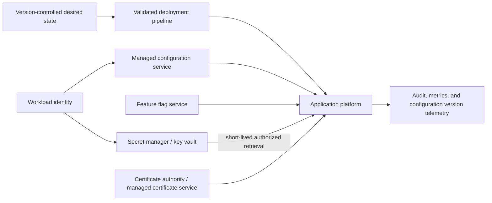
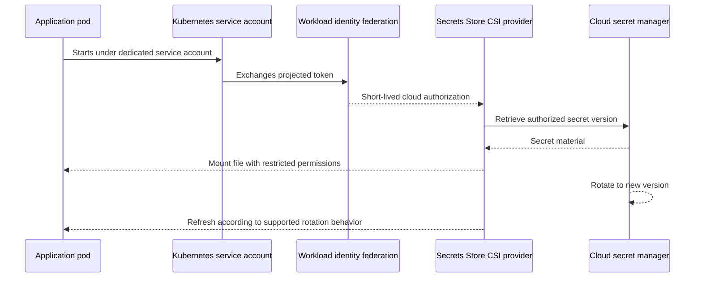

> **Document class:** Applications & Kubernetes implementation guide
> **Normative terms:** **MUST**, **MUST NOT**, **SHOULD**, **SHOULD NOT**, and **MAY** are requirements levels.
> **Applicability:** Application configuration, secret references, certificates, keys, feature flags, rotation, and failure behavior across cloud and Kubernetes platforms.
> **Exception process:** Deviations require a documented risk assessment, compensating controls, named risk owner, and expiry date.

| Control field | Value |
|---|---|
| Document ID | `APP-07` |
| Owner | Cloud Center of Excellence |
| Review cycle | At least annually and after material cloud-service, Kubernetes, security, or operating-model changes |
| Evidence | Configuration classification, secret-access policy, rotation tests, deployment records, exposure-response exercise, and operational readiness evidence |

# Application Configuration and Secret Management

> **Decision in brief:** Keep non-sensitive configuration reviewable and reproducible, keep secret values in approved managers, and test rotation and failure behavior before production use.

## Purpose

This standard defines how applications manage non-secret configuration, secrets, certificates, keys, feature flags, and environment-specific settings across Azure, AWS, GCP, OCI, and Kubernetes platforms.

Configuration and secrets are different control classes. Configuration controls application behavior and should be reviewable and reproducible. Secrets grant access and require confidentiality, narrow authorization, rotation, and auditable retrieval. Mixing the two weakens both governance models.

## Classification model

| Class | Examples | Required handling |
|---|---|---|
| Public configuration | Feature defaults, public endpoint names, UI settings | Version-controlled and integrity-protected |
| Internal configuration | Timeouts, queue names, non-secret service endpoints | Access-controlled, versioned desired state |
| Sensitive configuration | Customer identifiers, topology details, policy thresholds | Restricted visibility and audit |
| Secret | Password, API key, private token, symmetric key | External secret manager, least privilege, rotation |
| Certificate/private key | TLS identity, signing key | Managed lifecycle, protected private material |
| Dynamic feature flag | Progressive rollout or kill switch | Audited change, owner, expiry where temporary |

## Reference architecture

## Mandatory controls

1. Secrets **MUST NOT** be stored in source code, container images, Terraform state without protection, build logs, tickets, chat, or documentation.
2. Applications **MUST** use workload identity to retrieve secrets where supported.
3. Secret access **MUST** be least privilege and separated by environment and application trust boundary.
4. Production secrets **MUST** be stored in an approved managed secret service.
5. Configuration **MUST** have an owner, schema, default behavior, and validation.
6. Environment-specific configuration **MUST NOT** require rebuilding the application artifact.
7. Secret rotation **MUST** be tested; a rotation policy that breaks the application is not a control.
8. Certificates and keys **MUST** have automated expiry monitoring and renewal procedures.
9. Configuration and secret changes **MUST** be auditable and correlated to application behavior.
10. Applications **MUST** define safe behavior when a configuration or secret provider is unavailable.

## Configuration hierarchy

Use a deterministic precedence model. An example from lowest to highest precedence:

1. Application defaults committed with code.
2. Organization/platform baseline.
3. Environment configuration.
4. Application-specific configuration.
5. Deployment-time override.
6. Emergency override with expiry and enhanced audit.

Uncontrolled precedence produces configuration drift and difficult incidents. The application should expose the effective configuration version and source, but never expose secret values.

## Secret delivery patterns

### Direct SDK retrieval

The application uses workload identity to call the provider secret manager. This provides explicit control, on-demand retrieval, and provider audit logs. The application must implement caching, retry, timeout, and rotation behavior safely.

### Platform reference

A managed application platform resolves a secret reference into application configuration. This reduces code but can obscure refresh timing and failure behavior. Teams must test rotation and platform restart semantics.

### CSI-mounted secret

Kubernetes mounts secret material from an external store through the Secrets Store CSI Driver or a managed equivalent. The application reads a file. Rotation behavior, file watching, permissions, pod scheduling, provider availability, and optional synchronization to Kubernetes Secret objects must be understood.

### External Secrets synchronization

A controller copies external secrets into Kubernetes Secret objects. This improves compatibility but increases the number of stored copies and broadens exposure. Use only when direct mount or SDK access is unsuitable, and protect etcd, RBAC, backups, and controller identity.

## Kubernetes secret flow

## Multi-cloud mapping

| Capability | Azure | AWS | GCP | OCI |
|---|---|---|---|---|
| Secret manager | Azure Key Vault | AWS Secrets Manager | Secret Manager | OCI Vault Secrets |
| Configuration service | Azure App Configuration | Systems Manager Parameter Store / AppConfig | Runtime configuration patterns using supported managed services | OCI configuration patterns using Vault, Resource Manager, and service-specific configuration |
| Kubernetes secret mount | Key Vault provider for Secrets Store CSI Driver | AWS Secrets and Configuration Provider / CSI | Secret Manager add-on / CSI | OCI Secrets Store CSI Driver provider or approved external-secrets pattern |
| Workload identity | Managed identity / Entra Workload ID | IAM task role, Pod Identity, or IRSA | Service account / Workload Identity Federation | Resource principal / OKE workload identity |
| Key management | Key Vault Managed HSM / Key Vault keys | AWS KMS / CloudHSM | Cloud KMS / Cloud HSM | OCI Vault keys / Dedicated KMS options |
| Certificate service | Key Vault certificates / App Service managed certificates where suitable | ACM / Private CA | Certificate Manager / CAS | Certificates service / Vault |

Provider services differ in rotation, versioning, replication, network integration, and managed certificate scope. The architecture must be verified against current regional and service documentation.

## Secret versioning and rotation

A rotation design must define:

- Secret owner and dependent applications.
- Automatic versus manual rotation.
- Overlap period where old and new values are both valid.
- Application refresh behavior.
- Rollback procedure.
- Dependency coordination.
- Emergency revocation.
- Audit evidence and success criteria.

For credentials that support it, use dual-key rotation: issue a new credential, update consumers, verify use, then revoke the old credential. Immediate single-value replacement without coordination is fragile.

## Configuration deployment strategy

Configuration changes can be as risky as code changes. Use pull requests, schema validation, policy checks, staged rollout, and automated rollback where feasible. Dynamic configuration should include:

- Strong typing and validation.
- Safe defaults.
- Version identifier.
- Cache and refresh interval.
- Failure behavior.
- Audit trail.
- Owner and expiry for temporary overrides.

Feature flags should not become permanent hidden branches. Every temporary flag requires an owner, creation date, intended removal date, and cleanup process.

## Certificates and cryptographic keys

- Private keys must remain in approved protected stores or managed termination services.
- Certificate issuance and renewal should be automated.
- Expiry alerts must occur well before operational impact.
- Trust-store changes and CA rotation require staged testing.
- Signing keys require stricter separation from ordinary application secrets.
- Key rotation must account for verification of historical signatures or encrypted data.
- Customer-managed keys should be used only when contractual, regulatory, or risk requirements justify their added operational burden.

## Application behavior during provider failure

The application must define whether it can:

- Continue using a cached configuration or secret for a bounded period.
- Start when the provider is unavailable.
- Fail closed for authentication or authorization material.
- Degrade non-critical features.
- Alert before cached material expires.

Do not retry a failed secret provider indefinitely at high frequency. Use bounded backoff and surface a clear health signal.

## Logging and observability

Collect secret and configuration administrative events, access events, denials, rotation events, certificate expiry, provider errors, and application refresh outcomes. Redact values aggressively. Structured logs should record secret name or logical identifier only where that metadata is not itself sensitive.

Expose metrics for:

- Last successful configuration refresh.
- Active configuration version.
- Secret retrieval failures.
- Certificate days to expiry.
- Rotation success and consumer adoption.
- Emergency overrides currently active.

## Infrastructure-as-code considerations

Secret values should not be placed directly in infrastructure code or command-line arguments. IaC should create vaults, policies, identities, private endpoints, DNS, and secret metadata, while secret material is injected through a protected process. State backends must be encrypted, access-controlled, logged, and separated by environment.

Marking an IaC output as sensitive suppresses display in some interfaces; it does not remove the value from state.

## Bootstrap identity and secret-zero problem

Every design must explain how the application obtains its first trusted credential. The preferred answer is platform-issued workload identity. Placing a vault credential in an environment variable merely moves the secret-zero problem and creates another credential to rotate.

Bootstrap dependencies must be included in recovery planning. A restored application cannot retrieve secrets if its workload identity, federation trust, private DNS, network route, vault policy, or key hierarchy has not also been restored.

## Secret-consumption decision matrix

| Pattern | Prefer when | Key risks to test |
|---|---|---|
| Direct SDK retrieval | Application needs explicit version, cache, or refresh control | Startup dependency, retry storms, cache expiry, SDK support |
| Platform secret reference | Platform integration meets refresh and networking needs | Refresh delay, restart semantics, opaque error handling |
| CSI file mount | Application can consume files and needs external source of truth | Mount failure, file permissions, refresh detection, node/plugin health |
| Synchronization to Kubernetes Secret | Legacy compatibility requires a native Secret | Additional copies, etcd and backup exposure, controller privilege |
| Managed TLS termination | Private key need not enter the workload | Certificate scope, hostname coverage, renewal and failover |

The chosen pattern must minimize the number of secret copies. Convenience is not sufficient justification for synchronizing every external secret into Kubernetes.

## Rotation test procedure

A production rotation exercise should prove the complete consumer path:

1. Create or activate the new secret or key version.
2. Confirm the workload is authorized to retrieve it.
3. Trigger or wait for the documented refresh mechanism.
4. Verify new connections or signatures use the new material.
5. Confirm old and new values coexist for the planned overlap period where applicable.
6. Revoke the old value.
7. Verify no workload, job, replica, or disaster-recovery environment still depends on it.
8. Record timing, failures, and rollback behavior.

Rotation success must be measured at the consuming application, not only at the secret manager.

## Configuration schema and validation

Configuration should be represented by a documented schema that defines type, allowed range, required status, default, sensitivity, environment scope, restart impact, and owner. Invalid configuration must fail during CI or deployment rather than at first production request.

Applications should distinguish between configuration that can refresh dynamically and configuration that requires restart. Dynamic refresh must be atomic from the application's perspective; partially applied configuration can be more dangerous than a rejected change.

## Drift, overrides, and emergency changes

The platform should detect differences between declared configuration and effective runtime configuration. Emergency overrides must be explicit, time-limited, attributable, and visible in telemetry. After the incident, the override must either be committed through the normal process or removed. A permanent undocumented override is configuration drift.

For feature flags and kill switches, record the evaluation scope, default state, dependency on the flag service, audit trail, and behavior when the service is unavailable. Security controls must not fail open merely because dynamic configuration cannot be retrieved.

## Secret exposure response

A suspected secret exposure requires more than deleting the visible value. The response should include revocation or rotation, log and repository history review, image and artifact review, pipeline-variable review, access-log analysis, dependent-system review, and evidence that old credentials no longer work. Removing a secret from the latest Git commit does not remove it from history or prior artifacts.

## Common anti-patterns

- Secrets in Git history even after the current file is cleaned.
- Shared secrets across applications or environments.
- Storing cloud access keys in Kubernetes Secrets when workload identity exists.
- Assuming base64 encoding protects a Kubernetes Secret.
- Rotating a secret without testing application refresh.
- Loading every secret into environment variables regardless of need.
- Logging effective configuration objects that include secrets.
- Feature flags with no owner or removal date.
- Customer-managed keys adopted without an operational key-recovery plan.

## Validation

- [ ] Configuration and secrets are classified and handled separately.
- [ ] No secret exists in code, images, logs, tickets, or unprotected state.
- [ ] Workload identity and least privilege control secret access.
- [ ] Environment-specific values do not require artifact rebuild.
- [ ] Secret delivery method and rotation refresh behavior are tested.
- [ ] Certificates and keys have ownership, expiry monitoring, renewal, and recovery procedures.
- [ ] Configuration changes are schema-validated, reviewed, and auditable.
- [ ] Provider outage and cache-expiry behavior are defined.
- [ ] Emergency overrides have owner, expiry, and removal evidence.

## Related topics

- [Application Identity, Authentication, and Easy Auth](app-application-identity-authentication-and-easy-auth.md)
- [AKS Platform Architecture](app-aks-platform-architecture.md)
- [Kubernetes Backup, Restore, and Disaster Recovery](app-kubernetes-backup-restore-and-disaster-recovery.md)
- [Stateful Workloads and Persistent Storage on Kubernetes](app-stateful-workloads-and-persistent-storage-on-kubernetes.md)

## References

Use provider documentation as the source of truth for service limits, regional availability, supported versions, and feature behavior.
- [Azure Key Vault provider for Secrets Store CSI Driver](https://learn.microsoft.com/en-us/azure/aks/csi-secrets-store-driver)
- [Azure Key Vault CSI identity access](https://learn.microsoft.com/en-us/azure/aks/csi-secrets-store-identity-access)
- [AWS Secrets Manager integration with EKS](https://docs.aws.amazon.com/eks/latest/userguide/manage-secrets.html)
- [AWS ASCP with EKS Pod Identity](https://docs.aws.amazon.com/secretsmanager/latest/userguide/ascp-pod-identity-integration.html)
- [GKE access to Secret Manager with Workload Identity](https://docs.cloud.google.com/kubernetes-engine/docs/tutorials/workload-identity-secrets)
- [GKE Secret Manager add-on](https://docs.cloud.google.com/secret-manager/docs/secret-manager-managed-csi-component)
- [OCI OKE workload identity](https://docs.oracle.com/en-us/iaas/Content/ContEng/Tasks/contenggrantingworkloadaccesstoresources.htm)
- [OCI Kubernetes Engine overview](https://docs.oracle.com/en-us/iaas/Content/ContEng/Concepts/contengoverview.htm)
