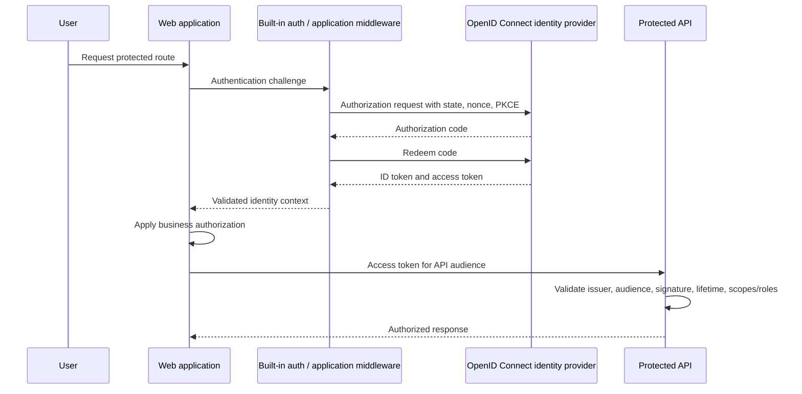
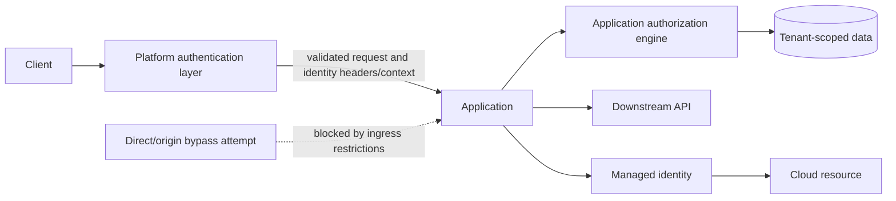

> **文档类型：** 应用和 Kubernetes 实施指南
> **规范性术语：** **MUST**、**MUST NOT**、**SHOULD**、**SHOULD NOT** 和 **MAY** 是要求级别。
> **适用范围：** 最终用户身份验证、应用授权、Easy Auth、工作负载身份、令牌、会话、联合和访问审核。
> **例外流程：** 偏离要求需要记录风险评估、补偿控制、指定风险负责人和到期日期。

|控制领域|价值|
|---|---|
|文件编号 | `APP-06` |
|负责人|云卓越中心 |
|审核周期|至少每年一次，并且在云服务、Kubernetes、身份、安全或运营模型发生重大变化之后 |
|证据|身份和信任设计、令牌验证测试、访问审查、联合策略、会话控制和 Easy Auth 验证 |

# 应用身份、身份验证和 Easy Auth

> **决策简述：** 将身份验证与授权分开，使用联合工作负载身份，并将 Easy Auth 视为身份验证边界，而不是应用安全性的替代品。

## 目的

该标准定义了云应用的身份、身份验证、令牌验证、应用授权、会话和工作负载身份模式。它包括 Azure App Service 和 Azure Container Apps 内置身份验证（通常称为 Easy Auth），同时保留基于 OpenID Connect、OAuth 2.0、工作负载身份联合和最小特权的多云架构模型。

身份验证确定谁或什么正在呼叫。授权决定了该身份可以做什么。 Easy Auth 可以减少身份验证流水线，但它不能取代业务授权、租户隔离、数据权利或安全应用设计。

## 身份类别

|身份类型|示例 |主要控制|
|---|---|---|
|员工用户|员工、承包商、管理员|企业身份提供商、MFA、条件访问 |
|外部用户|客户、合作伙伴、公民 |客户/外部身份租户和生命周期控制 |
|应用/工作负载| Web API、worker、pod、函数 |托管身份或工作负载身份联合 |
|部署自动化| CI/CD 流水线、GitOps 控制器 |具有范围权限的联合非人类身份 |
|break-glass 管理员|紧急操作员|强隔离、监控使用、定期测试 |

单一的身份设计不应模糊这些类别。

## 最终用户身份验证参考流程

## 强制控制

1. 交互式应用 **MUST** 使用经过批准的基于标准的身份提供商和 OpenID Connect/OAuth 2.0 流程。
2. 公共客户端**MUST**使用带有 PKCE 的授权码。新应用禁止隐式流程设计。
3. API **MUST** 验证令牌签名、发布者、受众、生命周期以及所需的范围或角色。
4. ID 令牌 **MUST NOT** 用作 API 访问令牌。
5、应用**MUST**通过认证后实现业务授权。
6. 多租户应用 **MUST** 在授权逻辑和数据访问中强制实施租户边界。
7. 工作负载 **MUST** 使用托管身份或工作负载身份联合，而不是支持的长期客户端密钥。
8. CI/CD 系统 **MUST** 使用来自源代码控制或自动化身份提供商的联合，而不是存储的云凭据。
9. 身份验证和授权失败 **MUST** 记录，而不会暴露令牌或敏感声明。
10. 会话 cookie **MUST** 使用安全、仅限 HTTP 和适当的 SameSite 设置，并在应用的情况下提供 CSRF 保护。

## Easy Auth 架构

Azure App Service 和 Azure Container Apps 可以在应用前面放置平台管理的身份验证层。该平台可以重定向未经身份验证的用户、与支持的身份提供商集成、验证令牌并向应用公开身份上下文。

在以下情况下使用简易身份验证：

- 该应用具有传统的 HTTP 入口模型。
- 支持的提供商和令牌流满足要求。
- 团队希望使用最少的框架代码进行平台管理的身份验证。
- 授权仍然足够简单，可以在应用中清晰地实现。

在以下情况下，请勿使用 Easy Auth 作为唯一控制：

- 应用需要复杂的令牌交换、自定义协议行为、高级多租户同意、专门的会话处理或平台未公开的身份提供商功能。
- 跨多个托管平台的端到端令牌处理必须相同。
- 该服务需要非 HTTP 入口或自定义网关级身份验证。

## Easy Auth 信任边界

仅当平台身份验证层无法绕过时，应用才必须信任身份标头。必须审查源暴露、备用主机名、侧通道和代理配置。

## 令牌验证要求

每个资源服务器必须验证：

- 使用当前提供商元数据和密钥的加密签名。
- 预期发布人。
- 确切的目标受众。
- 具有有限时钟偏差的到期时间和不早于时间。
- 所需的委派范围或应用角色。
- 应用的租户和主体限制。
- 当 API 不适合任意客户端时，授权客户端应用。

不要仅对电子邮件地址、显示名称或可变组名称进行授权。更喜欢不可变的主题、租户、组、角色或权利标识符。

## 授权模型

使用显式模型：

- **RBAC：** 角色映射到允许的操作。
- **ABAC：** 策略评估租户、数据分类、资源所有者、位置或交易风险等属性。
- **基于资源的授权：**调用者必须拥有特定对象的权限。
- **策略决策点：** 中央策略可用于复杂的资产，但必须设计可用性、缓存和审计行为。

授权应该默认拒绝并在服务器端评估。前端路由隐藏并不是授权。

## 工作负载身份

工作负载身份无需静态凭据即可建立服务到服务和服务到云的信任。

|能力|Azure|AWS | GCP |OCI |
|---|---|---|---|---|
|应用平台工作负载身份 |App Service、Container Apps、Functions 的托管身份 | IAM 任务角色、App Runner 实例角色、Lambda 执行角色 |附加到 Cloud Run/GKE/Functions 工作负载的服务帐号 |支持的资源主体和工作负载身份 |
| Kubernetes 工作负载身份 | AKS 的内部工作负载 ID | EKS Pod 身份或 IRSA | GKE 的工作负载身份联合 | OKE 工作负载身份 |
|流水线联盟| Entra 联合凭证 | IAM OIDC 联盟 |工作负载身份联合|基于受支持的 CI 提供商的 OCI IAM 联合模式 |
|外部用户身份| Microsoft Entra 外部 ID | Amazon Cognito 或外部 IdP |身份平台或外部 IdP | OCI IAM Identity Domains 或外部 IdP |

每个工作负载身份必须具有狭窄的主题、狭窄的受众、最低特权权限和短期令牌。在不相关的应用之间共享工作负载身份会削弱隔离性和可审计性。

## 服务到服务模式

首选订单：

1. 工作负载身份获取目标服务的短期令牌。
2. 目标 API 验证令牌并授权范围/角色。
3. 如果需要，可以添加相互 TLS 以进行传输级工作负载身份验证，但它不会自动表达业务授权。
4. API 密钥是最后手段的兼容性机制，必须在 Secret Manager 中进行范围界定、轮换、监控和存储。

请勿使用网络白名单作为唯一的服务标识。

## 多租户应用控制

多租户应用 **MUST** 定义：

- 租户入驻和离职。
- 接受的发布人和租户标识符。
- 同意和应用注册模型。
- 租户到数据分区映射。
- 跨租户管理规则。
- 声明规范化和不可变标识符。
- 审核租户敏感操作的事件。
- 防止混淆代理和令牌替换攻击。

来自错误租户的有效令牌仍然未经授权。

## 会话和浏览器安全

- 使用适合风险的短会话生命周期。
- 重新验证或加强敏感操作的验证。
- 保护状态更改请求免受 CSRF 的影响。
- 防止 URL、日志、浏览器存储、错误页面和遥测中的令牌暴露。
- 使用安全 cookie 属性并在身份验证后轮换会话标识符。
- 分别定义本地会话和身份提供商会话的注销行为。
- 准确验证重定向 URI；避免广泛的通配符重定向。

## 身份可观测性

收集并关联：

- 登录成功/失败和条件访问结果。
- 令牌验证失败的原因。
- 按策略和资源拒绝授权。
- 工作负载令牌发布和云资源访问。
- 对应用注册、凭据、角色、重定向 URI 和联邦身份进行管理更改。
- 可疑的租户、发布者、受众或客户模式。

切勿记录原始访问令牌、刷新令牌、授权代码、客户端机密或完整敏感声明集。

## OAuth 和 OpenID Connect 威胁控制

身份验证设计必须明确解决协议级威胁：

- 使用 `state` 将授权响应绑定到发起浏览器事务。
- 在 OpenID Connect 流中验证 ID 令牌时使用 `nonce`。
- 对公共客户使用 PKCE，并在支持机密客户的情况下使用 PKCE。
- 使用精确的重定向 URI 注册并拒绝开放重定向模式。
- 验证令牌类型、发布者、受众、签名算法、生命周期和授权方（如果适用）。
- 防止通过 URL、引荐来源网址、日志、浏览器历史记录或客户端遥测泄露授权代码、访问令牌和刷新令牌。
- 将刷新令牌视为高价值凭证，并应用适合风险的轮换、撤销和设备/会话控制。

库和平台中间件应该优先于自定义协议实现。所选库必须受支持、配置为拒绝不安全的默认值，并随着身份提供商行为的变化而更新。

## 浏览器应用模式选择

浏览器应用应该在服务器渲染会话模型、后端换前端 (BFF) 和浏览器持有的令牌模型之间进行选择。

|模式|优势|主要风险|
|---|---|---|
|服务器会话 |令牌保留在服务器端；成熟的 cookie 控件|需要会话存储和 CSRF 保护 |
|前端后端|浏览器使用安全会话 cookie，而 BFF 处理令牌 |添加服务器组件和可用性依赖项 |
|带有访问令牌的 SPA |简单的直接 API 调用|令牌暴露于浏览器泄露和存储错误|
高价值应用应该更喜欢将刷新令牌和长期凭据保留在浏览器可访问的存储之外。无论选择哪种模式，跨站点脚本防护仍然至关重要，因为即使注入的脚本无法读取纯 HTTP cookie，它也可以与用户的浏览器会话一起操作。

## 下游 API 的 Token 获取

调用另一个 API 的服务必须获取用于该 API 的令牌。当传入令牌的受众、范围或租户约束与下游服务不匹配时，不要盲目转发传入令牌。

如果需要委托的用户上下文，请使用批准的令牌交换或代表模式，并定义保留哪些声明和权限。如果不需要用户上下文，请使用服务工作负载标识。设计应通过将授权绑定到调用者、租户、请求的资源和允许的操作来防止代理混淆。

令牌缓存必须受到相关主题、租户、范围和受众的保护、限制和锁定。租户或用户之间的缓存冲突是一个安全缺陷。

## 身份生命周期和访问审查

应用注册、重定向 URI、证书、联合凭据、角色、组和特权分配需要生命周期所有权。至少：

- 分配业务和技术所有者。
- 检查未使用的凭据、过时的重定向 URI 和过多的权限。
- 当应用、环境、流水线或租户退役时删除身份。
- 将凭证添加和联合更改作为高风险事件进行监控。
- 测试紧急路径和 break-glass 路径，而不将其用于日常管理。
- 定义针对令牌签名密钥翻转、身份提供商中断和应用凭据受损的响应程序。

## Easy Auth 验证过程

在生产使用之前，测试未经身份验证的访问、有效登录、无效颁发者、错误受众、过期令牌、角色或范围不足、注销、会话过期、直接源访问、备用主机名访问和下游 API 调用。准确确认应用接收哪些标头或平台上下文，并确保外部客户端无法注入等效的可信值。当身份验证元数据缺失或格式错误时，应用必须安全地失败。

## 常见的反模式

- 将身份验证视为授权。
- 接受身份提供商签名的任何令牌而不验证受众。
- 使用 ID 令牌调用 API。
- 当可以绕过平台身份验证层时信任身份标头。
- 当联合可用时，将客户端机密嵌入到应用设置或流水线变量中。
- 为每个 Pod 提供节点身份。
- 通过可变电子邮件或显示名称进行授权。
- 使用广泛的多租户应用注册，没有租户限制。
- 将令牌放入浏览器本地存储中，无需故意的威胁模型。

## 验证

- [ ] 用户、外部、工作负载、部署和 break-glass 身份类别是分开的。
- [ ] OIDC/OAuth 流程、颁发者、受众、范围/角色和重定向 URI 均已日志记录。
- [ ] API 验证令牌签名、颁发者、受众、生命周期和授权声明。
- [ ] Easy Auth 来源绕过风险和受信任标头边界经过测试。
- [ ] 业务授权默认拒绝且租户感知。
- [ ] 托管身份或工作负载身份联合取代了长期凭据。
- [ ] 实现了会话、CSRF、cookie、注销和升级控制。
- [ ] 身份日志排除令牌并支持事件调查。
- [ ] 监控和审查凭证和联合更改。

## 相关主题

- [应用配置与机密管理](app-application-configuration-and-secret-management.md)
- [Azure App Service 架构和部署](app-azure-app-service-architecture-and-deployment.md)
- [Kubernetes 应用安全和策略标准](app-kubernetes-application-security-and-policy-standards.md)
- [服务网格架构和采用指南](app-service-mesh-architecture-and-adoption-guidelines.md)

## 参考文档

使用提供商文档作为服务限制、区域可用性、支持的版本和功能行为的真实来源。
- [Azure App Service 身份验证和授权](https://learn.microsoft.com/en-us/azure/app-service/overview-authentication-authorization)
- [Azure Container Apps 身份验证和授权](https://learn.microsoft.com/en-us/azure/container-apps/authentication)
- [AKS 工作负载身份部署](https://learn.microsoft.com/en-us/azure/aks/workload-identity-deploy-cluster)
- [Amazon EKS Pod 身份](https://docs.aws.amazon.com/eks/latest/userguide/pod-identities.html)
- [服务账户的 Amazon EKS IAM 角色](https://docs.aws.amazon.com/eks/latest/userguide/iam-roles-for-service-accounts.html)
- [GKE 工作负载身份联合](https://docs.cloud.google.com/kubernetes-engine/docs/how-to/workload-identity)
- [GCP 工作负载身份联合](https://docs.cloud.google.com/iam/docs/workload-identity-federation)
- [OCI OKE 工作负载身份](https://docs.oracle.com/en-us/iaas/Content/ContEng/Tasks/contenggrantingworkloadaccesstoresources.htm)
