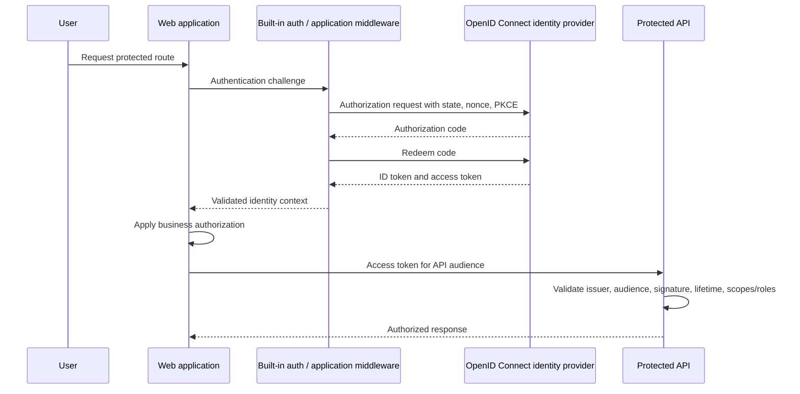
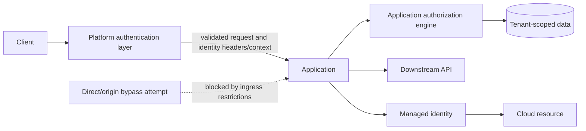

> **Document class:** Applications & Kubernetes implementation guide
> **Normative terms:** **MUST**, **MUST NOT**, **SHOULD**, **SHOULD NOT**, and **MAY** are requirements levels.
> **Applicability:** End-user authentication, application authorization, Easy Auth, workload identity, tokens, sessions, federation, and access reviews.
> **Exception process:** Deviations require a documented risk assessment, compensating controls, named risk owner, and expiry date.

| Control field | Value |
|---|---|
| Document ID | `APP-06` |
| Owner | Cloud Center of Excellence |
| Review cycle | At least annually and after material cloud-service, Kubernetes, identity, security, or operating-model changes |
| Evidence | Identity and trust design, token-validation tests, access reviews, federation policy, session controls, and Easy Auth verification |

# Application Identity, Authentication, and Easy Auth

> **Decision in brief:** Separate authentication from authorization, use federated workload identity, and treat Easy Auth as an authentication boundary rather than a substitute for application security.

## Purpose

This standard defines identity, authentication, token validation, application authorization, session, and workload-identity patterns for cloud applications. It includes Azure App Service and Azure Container Apps built-in authentication, commonly called Easy Auth, while preserving a multi-cloud architecture model based on OpenID Connect, OAuth 2.0, workload federation, and least privilege.

Authentication establishes who or what is calling. Authorization determines what that identity may do. Easy Auth can reduce authentication plumbing, but it does not replace business authorization, tenant isolation, data entitlements, or secure application design.

## Identity categories

| Identity type | Examples | Primary control |
|---|---|---|
| Workforce user | Employee, contractor, administrator | Enterprise identity provider, MFA, conditional access |
| External user | Customer, partner, citizen | Customer/external identity tenant and lifecycle controls |
| Application/workload | Web API, worker, pod, function | Managed identity or workload federation |
| Deployment automation | CI/CD pipeline, GitOps controller | Federated non-human identity with scoped permissions |
| Break-glass administrator | Emergency operator | Strong isolation, monitored use, periodic testing |

A single identity design should not blur these categories.

## End-user authentication reference flow

## Mandatory controls

1. Interactive applications **MUST** use an approved standards-based identity provider and OpenID Connect/OAuth 2.0 flow.
2. Public clients **MUST** use authorization code with PKCE. Implicit-flow designs are prohibited for new applications.
3. APIs **MUST** validate token signature, issuer, audience, lifetime, and required scopes or roles.
4. An ID token **MUST NOT** be used as an API access token.
5. Applications **MUST** implement business authorization after authentication.
6. Multi-tenant applications **MUST** enforce tenant boundaries in both authorization logic and data access.
7. Workloads **MUST** use managed identity or workload federation rather than long-lived client secrets where supported.
8. CI/CD systems **MUST** use federation from the source-control or automation identity provider rather than stored cloud credentials.
9. Authentication and authorization failures **MUST** be logged without exposing tokens or sensitive claims.
10. Session cookies **MUST** use secure, HTTP-only, and appropriate SameSite settings, with CSRF protection where applicable.

## Easy Auth architecture

Azure App Service and Azure Container Apps can place a platform-managed authentication layer in front of the application. The platform can redirect unauthenticated users, integrate with supported identity providers, validate tokens, and expose identity context to the application.

Use Easy Auth when:

- The application has a conventional HTTP ingress model.
- Supported providers and token flows meet the requirement.
- The team wants platform-managed authentication with minimal framework code.
- Authorization remains simple enough to implement clearly in the application.

Do not use Easy Auth as the sole control when:

- The application requires complex token exchange, custom protocol behavior, advanced multi-tenant consent, specialized session handling, or identity-provider features not exposed by the platform.
- End-to-end token handling must be identical across multiple hosting platforms.
- The service requires non-HTTP ingress or custom gateway-level authentication.

## Easy Auth trust boundary

The application must trust identity headers only when the platform authentication layer cannot be bypassed. Origin exposure, alternate hostnames, side channels, and proxy configuration must be reviewed.

## Token validation requirements

Every resource server must validate:

- Cryptographic signature using current provider metadata and keys.
- Expected issuer.
- Exact intended audience.
- Expiration and not-before times with bounded clock skew.
- Required delegated scopes or application roles.
- Tenant and subject constraints where applicable.
- Authorized client application when the API is not intended for arbitrary clients.

Do not authorize solely on email address, display name, or mutable group names. Prefer immutable subject, tenant, group, role, or entitlement identifiers.

## Authorization model

Use an explicit model:

- **RBAC:** Roles map to permitted actions.
- **ABAC:** Policy evaluates attributes such as tenant, data classification, resource owner, location, or transaction risk.
- **Resource-based authorization:** The caller must have permission on the specific object.
- **Policy decision point:** Central policy can be used for complex estates, but availability, caching, and audit behavior must be designed.

Authorization should be deny-by-default and evaluated server-side. Front-end route hiding is not authorization.

## Workload identity

Workload identity establishes service-to-service and service-to-cloud trust without static credentials.

| Capability | Azure | AWS | GCP | OCI |
|---|---|---|---|---|
| App platform workload identity | Managed identity for App Service, Container Apps, Functions | IAM task role, App Runner instance role, Lambda execution role | Service account attached to Cloud Run/GKE/function workloads | Resource principals and workload identity where supported |
| Kubernetes workload identity | Entra Workload ID for AKS | EKS Pod Identity or IRSA | Workload Identity Federation for GKE | OKE workload identity |
| Pipeline federation | Entra federated credentials | IAM OIDC federation | Workload Identity Federation | OCI IAM federation patterns based on supported CI provider |
| External user identity | Microsoft Entra External ID | Amazon Cognito or external IdP | Identity Platform or external IdP | OCI IAM identity domains or external IdP |

Each workload identity must have a narrow subject, narrow audience, least-privilege permissions, and short-lived tokens. Sharing a workload identity across unrelated applications weakens isolation and auditability.

## Service-to-service patterns

Preferred order:

1. Workload identity obtains a short-lived token for the target service.
2. Target API validates the token and authorizes scopes/roles.
3. Mutual TLS may be added for transport-level workload authentication where required, but it does not automatically express business authorization.
4. API keys are a last-resort compatibility mechanism and must be scoped, rotated, monitored, and stored in a secret manager.

Do not use a network allowlist as the sole service identity.

## Multi-tenant application controls

A multi-tenant application **MUST** define:

- Tenant onboarding and offboarding.
- Accepted issuers and tenant identifiers.
- Consent and application-registration model.
- Tenant-to-data partition mapping.
- Cross-tenant administrative rules.
- Claim normalization and immutable identifiers.
- Audit events for tenant-sensitive actions.
- Protection against confused-deputy and token-substitution attacks.

A valid token from the wrong tenant is still unauthorized.

## Session and browser security

- Use short session lifetimes appropriate to risk.
- Re-authenticate or step up authentication for sensitive actions.
- Protect state-changing requests against CSRF.
- Prevent token exposure in URLs, logs, browser storage, error pages, and telemetry.
- Use secure cookie attributes and rotate session identifiers after authentication.
- Define sign-out behavior for local session and identity-provider session separately.
- Validate redirect URIs exactly; avoid broad wildcard redirects.

## Identity observability

Collect and correlate:

- Sign-in success/failure and conditional-access outcomes.
- Token validation failures by reason.
- Authorization denials by policy and resource.
- Workload-token issuance and cloud-resource access.
- Administrative changes to app registrations, credentials, roles, redirect URIs, and federated identities.
- Suspicious tenant, issuer, audience, or client patterns.

Never log raw access tokens, refresh tokens, authorization codes, client secrets, or full sensitive claim sets.

## OAuth and OpenID Connect threat controls

The authentication design must address protocol-level threats explicitly:

- Use `state` to bind the authorization response to the initiating browser transaction.
- Use `nonce` when validating ID tokens in OpenID Connect flows.
- Use PKCE for public clients and where supported for confidential clients.
- Use exact redirect URI registration and reject open redirect patterns.
- Validate token type, issuer, audience, signature algorithm, lifetime, and authorized party where applicable.
- Prevent authorization-code, access-token, and refresh-token disclosure through URLs, referrers, logs, browser history, or client-side telemetry.
- Treat refresh tokens as high-value credentials and apply rotation, revocation, and device/session controls appropriate to risk.

Libraries and platform middleware should be preferred over custom protocol implementation. The selected library must be supported, configured to reject insecure defaults, and updated as identity-provider behavior changes.

## Browser application pattern selection

A browser application should deliberately choose between a server-rendered session model, a backend-for-frontend (BFF), and a browser-held token model.

| Pattern | Strength | Main risk |
|---|---|---|
| Server session | Tokens remain server-side; mature cookie controls | Requires session store and CSRF protection |
| Backend for frontend | Browser uses secure session cookie while BFF handles tokens | Adds a server component and availability dependency |
| SPA with access token | Simple direct API calls | Token exposure to browser compromise and storage mistakes |

High-value applications should prefer keeping refresh tokens and long-lived credentials out of browser-accessible storage. Whichever pattern is selected, cross-site scripting prevention remains critical because an injected script can act with the user's browser session even when it cannot read an HTTP-only cookie.

## Token acquisition for downstream APIs

A service calling another API must obtain a token intended for that API. Do not forward an incoming token blindly when its audience, scopes, or tenant constraints do not match the downstream service.

Where delegated user context is required, use an approved token-exchange or on-behalf-of pattern and define which claims and permissions are preserved. Where user context is not required, use the service workload identity. The design should prevent a confused deputy by binding authorization to the caller, tenant, requested resource, and permitted operation.

Token caches must be protected, bounded, and keyed by the relevant subject, tenant, scope, and audience. A cache collision across tenants or users is a security defect.

## Identity lifecycle and access reviews

Application registrations, redirect URIs, certificates, federated credentials, roles, groups, and privileged assignments require lifecycle ownership. At minimum:

- Assign business and technical owners.
- Review unused credentials, stale redirect URIs, and excessive permissions.
- Remove identities when an application, environment, pipeline, or tenant is retired.
- Monitor credential addition and federation changes as high-risk events.
- Test emergency and break-glass paths without using them for routine administration.
- Define response procedures for token-signing-key rollover, identity-provider outage, and compromised application credentials.

## Easy Auth validation procedure

Before production use, test unauthenticated access, valid login, invalid issuer, wrong audience, expired token, insufficient role or scope, sign-out, session expiry, direct-origin access, alternate hostname access, and downstream API calls. Confirm exactly which headers or platform context the application receives and ensure external clients cannot inject equivalent trusted values. The application must fail safely when authentication metadata is absent or malformed.

## Common anti-patterns

- Treating authentication as authorization.
- Accepting any token signed by the identity provider without validating audience.
- Using ID tokens to call APIs.
- Trusting identity headers when the platform authentication layer can be bypassed.
- Embedding client secrets in application settings or pipeline variables when federation is available.
- Giving every pod the node identity.
- Authorizing by mutable email or display name.
- Using a broad multi-tenant app registration without tenant restrictions.
- Putting tokens in browser local storage without a deliberate threat model.

## Validation

- [ ] User, external, workload, deployment, and break-glass identity categories are separated.
- [ ] OIDC/OAuth flow, issuer, audience, scopes/roles, and redirect URIs are documented.
- [ ] APIs validate token signature, issuer, audience, lifetime, and authorization claims.
- [ ] Easy Auth origin-bypass risk and trusted-header boundary are tested.
- [ ] Business authorization is deny-by-default and tenant-aware.
- [ ] Managed identity or workload federation replaces long-lived credentials.
- [ ] Session, CSRF, cookie, sign-out, and step-up controls are implemented.
- [ ] Identity logs exclude tokens and support incident investigation.
- [ ] Credential and federation changes are monitored and reviewed.

## Related topics

- [Application Configuration and Secret Management](app-application-configuration-and-secret-management.md)
- [Azure App Service Architecture and Deployment](app-azure-app-service-architecture-and-deployment.md)
- [Kubernetes Application Security and Policy Standards](app-kubernetes-application-security-and-policy-standards.md)
- [Service Mesh Architecture and Adoption Guidelines](app-service-mesh-architecture-and-adoption-guidelines.md)

## References

Use provider documentation as the source of truth for service limits, regional availability, supported versions, and feature behavior.
- [Azure App Service authentication and authorization](https://learn.microsoft.com/en-us/azure/app-service/overview-authentication-authorization)
- [Azure Container Apps authentication and authorization](https://learn.microsoft.com/en-us/azure/container-apps/authentication)
- [AKS workload identity deployment](https://learn.microsoft.com/en-us/azure/aks/workload-identity-deploy-cluster)
- [Amazon EKS Pod Identity](https://docs.aws.amazon.com/eks/latest/userguide/pod-identities.html)
- [Amazon EKS IAM roles for service accounts](https://docs.aws.amazon.com/eks/latest/userguide/iam-roles-for-service-accounts.html)
- [GKE Workload Identity Federation](https://docs.cloud.google.com/kubernetes-engine/docs/how-to/workload-identity)
- [GCP Workload Identity Federation](https://docs.cloud.google.com/iam/docs/workload-identity-federation)
- [OCI OKE workload identity](https://docs.oracle.com/en-us/iaas/Content/ContEng/Tasks/contenggrantingworkloadaccesstoresources.htm)
