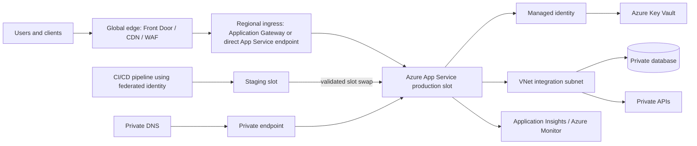
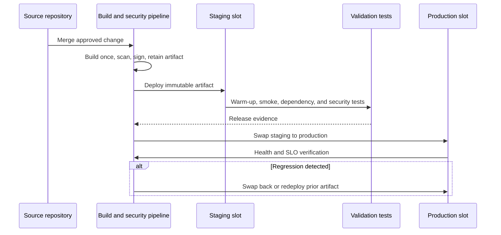

> **文档类型：** 应用与 Kubernetes 架构参考模型
> **规范性术语：** **MUST**、**MUST NOT**、**SHOULD**、**SHOULD NOT** 和 **MAY** 是要求级别。
> **适用范围：** Azure App Service 架构、网络、部署、配置、扩展、安全、操作和恢复。
> **例外流程：** 偏离要求需要记录风险评估、补偿控制、指定风险负责人和到期日期。

|控制领域|价值|
|---|---|
|文件编号 | `APP-02` |
|负责人|云卓越中心 |
|审核周期|至少每年一次，并且在云服务、安全或运营模式发生重大变化之后 |
|证据|架构决策记录、基础设施即代码计划、部署和插槽测试、网络验证、安全审查和恢复证据 |

# Azure App Service 架构和部署

> **简要决策：** 将 App Service 用于适合其托管运行时边界的工作负载，并使网络、身份、部署槽、配置、扩展和恢复变得明确。

## 目的

此标准定义了 Azure App Service 的批准体系结构和部署模式。 Azure 是详细的参考实现，但控制目标应用于 AWS、GCP 和 OCI 中的类似托管应用平台。

App Service 适用于符合其支持的运行时或自定义容器模型的 Web 应用、API 和后台组件。当工作负载需要 Kubernetes 原生编排时，它不能替代 Kubernetes；当应用需要操作系统控制时，它也不能替代虚拟机。

## 范围

本文档涵盖 App Service 计划、Web 应用、部署槽、自定义域、证书、托管身份、虚拟网络集成、私有端点、私有 DNS、入口、出口、部署包、自定义容器、扩展、监控、备份和恢复。

## 参考架构

## 强制架构控制

1. 生产应用 **MUST** 使用专用 App Service 计划，除非经批准的多租户计划设计证明兼容的安全性、性能、扩展、维护和成本分摊要求。
2. 生产和非生产环境**MUST**通过订阅/账户边界或等效策略边界进行隔离；部署槽并不是完整的环境隔离机制。
3. 应用 **MUST** 在支持时使用托管标识进行 Azure 服务访问。存储的客户端机密是一个例外。
4. 当应用面向互联网且业务关键时，公共入口 **MUST** 受到批准的边缘/WAF 模式的保护。
5. 专用应用 **MUST** 使用私有端点、正确的私有 DNS 和受控管理访问。
6. 对私有资源的出站访问**MUST**使用虚拟网络集成和显式路由。私有端点和 VNet 集成解决不同的流量方向，并且不可互换。
7. 强制执行 TLS **MUST**。在服务允许控制的情况下，禁用旧协议和弱密码配置 **MUST**。
8. 诊断日志、平台指标、应用遥测和部署事件 **MUST** 发送到具有定义保留的集中监控。
9. 部署**MUST** 是不可变的和可复制的。禁止在生产文件系统中直接编辑。
10. 生产变更**MUST**支持通过插槽交换、包版本回滚或镜像摘要回滚来快速回滚。

## 网络设计

### 入站路径

使用三种批准的模式之一：

- **全球边缘/WAF 背后的公共端点：** 应用于面向互联网的应用。在支持的情况下限制源访问并安全地验证转发的标头。
- **Application Gateway 背后的区域私有源：** 应用于需要区域 WAF、私有前端或更严格的网络分段的情况。
- **仅限私有端点：** 应用于内部应用、私有网络使用的 API 和管理服务。

访问限制很有用，但并不等同于私有端点。私有端点在虚拟网络中放置专用 IP 以进行入站访问。 VNet 集成使应用能够出站访问虚拟网络。

### 出站路径

应用**SHOULD**通过批准的集成子网和出口架构路由私有和检查的流量。团队必须考虑 SNAT 行为、DNS 解析、防火墙规则、依赖端点和连接重用。应用应使用连接池并避免为每个请求打开新的出站连接。

### DNS

私有端点实现**MUST**包括权威的私有 DNS 设计。应用主机名必须解析为每个使用网络的预期专用 IP。必须明确测试水平分割 DNS、转发链和本地解析器。

## 部署方法

|方法|批准使用 |关键控制|
|---|---|---|
|从包运行 |支持的代码包的首选 |包是不可变的和版本化的 |
|带构建的 ZIP 部署 |当有意需要平台构建时允许 |构建输入和运行时版本已固定 |
|外部构建和 ZIP 部署 | CI 生成完整制品时的首选 |经过测试的制品晋级|
|定制集装箱|用于不支持的依赖项或更强的打包一致性 |通过不可变镜像摘要部署，而不是可变标签 |
|本地 Git/FTP/手动拷贝 |禁止生产 |无法重现或无法充分控制|

部署源、构建流水线和部署机制是单独的决定。团队必须知道编译发生在哪里、测试了哪个制品以及生产是否准确地收到了该制品。

## 基于插槽的发布模式

插槽设置 **MUST** 需刻意分类。特定于环境的值、身份、连接端点和机密必须保持附加到正确的环境。除非测试了应用启动、架构兼容性、缓存行为和后台处理，否则插槽交换并不安全。

## 应用配置

- 非机密设置 **SHOULD** 根据需要的状态进行外部化和版本控制。
- 机密 **MUST** 存储在 Key Vault 或其他批准的 Secret Manager 中，并通过托管身份进行访问。
- Key Vault 引用可以简化检索，但团队仍负责授权、网络访问、轮换行为和故障处理。
- 配置更改 **MUST** 被视为发布，因为许多更改会立即重新启动应用或改变行为。
- 运行时、平台架构、最低 TLS 版本、运行状况检查路径、始终在线行为、扩展限制和诊断设置 **MUST** 通过基础设施即代码进行声明。

## 扩展性和可用性

App Service 在计划边界进行扩展。共享计划的应用共享计算容量和故障暴露。因此，该架构必须定义：

- 生产可用性的最小实例数。
- 需要并支持的区域冗余。
- 根据用户影响而不是仅根据 CPU 自动扩缩容信号。
- 每个实例的并发假设和负载测试证据。
- 热身行为和准备状态验证。
- 依赖性限制，包括数据库连接和下游 API 配额。
- 单个区域无法满足业务需求时的区域恢复设计。

自动扩缩容不会修复缓慢的依赖项、序列化代码路径或耗尽的数据库连接池。

## 安全设计

- 使用托管身份和最低权限 RBAC。
- 尽可能禁用未使用的发布方法和基本身份验证。
- 限制 SCM/Kudu 访问并保护部署端点。
- 在发布前扫描代码、依赖项、包和容器镜像。
- 将 WAF 用于公共高价值应用并验证来源限制。
- 将用户身份验证与应用授权分开。内置身份验证可以验证身份，但业务授权规则仍然是应用的责任。
- 仅在需要证明增加生命周期负担的情况下才使用客户管理的证书和密钥。
- 集中日志记录管理、配置、身份、网络和部署更改。

## 多云运营模型映射

|能力|Azure|AWS | GCP |OCI |
|---|---|---|---|---|
|托管网络应用| Azure App Service | Elastic Beanstalk 或 App Runner | App Engine 或 Cloud Run |没有确切的 PaaS 等效项；Container Instances、函数或 OKE |
|分阶段发布 |部署槽位和交换 |环境/版本部署或 App Runner revisions| Cloud Run revisions 和流量分割； App Engine 版本 |通过 DevOps 流水线进行镜像/版本部署 |
|工作负载身份|托管身份|服务/任务的 IAM 角色 |具有工作负载身份的服务账户 |支持的资源主体或工作负载身份 |
|Secrets Manager|Key Vault |Secret Manager/参数存储|Secrets Manager|Vault |
|私有入口 |私有端点| PrivateLink/VPC 模式因服务而异 |内部入口/私有服务连接模式因服务而异 |私有负载均衡器或私有服务端点模式|

不要在不存在的情况下声称功能等效。目标架构必须围绕目标提供商的本地服务模型进行重新设计。

## 运营就绪

每个生产应用 **MUST** 都提供：

- 健康端点，区分进程活跃度和依赖就绪度。
- 关键调用的关联 ID 和分布式跟踪。
- 请求率、延迟、错误、饱和度、实例计数、重新启动、部署事件和依赖项运行状况的仪表板。
- 告警与 SLO 错误预算消耗或用户影响相关，而不仅仅是原始平台噪音。
- 启动失败、DNS 失败、证书失败、机密访问失败、实例不正常、部署回滚和出站连接耗尽的运行手册。
- 测试了应用负责的数据的备份和恢复。App Service 备份不能替代数据库原生保护。

## 环境拓扑和规划布局

生产拓扑应有意将生命周期和故障域分开。至少，记录开发、测试、登台和生产是否使用单独的订阅、资源组、虚拟网络、App Service 计划、身份、私有端点、DNS 区域和监视目标。

仅当工作负载具有兼容的扩展、维护、安全性和成本分配要求时，计划共享才是可接受的。嘈杂或受损的应用可能会影响共享该计划的每个应用。业务关键型应用不应与实验性工作负载、不受信任的代码或具有实质上不同的扩展配置文件的工作负载共享计划。

部署槽仍然是同一应用资源和计划的一部分。它们是发布机制，不能替代生产和非生产隔离。插槽容量必须包含在计划大小中，尤其是在预热、验证和交换操作期间。

## 出站连接和连接工程

出站故障通常是由 DNS、路由、防火墙或连接管理缺陷引起的，而不是由 App Service 可用性引起的。设计应包括：

- 集成子网、路由表、NAT 或防火墙路径以及有效下一跃。
- 应用运行时的公共和私有依赖关系的 DNS 解析。
- 允许列出的依赖项的预期出站源地址。
- 连接池、保持活动、空闲超时和最大连接假设。
- SNAT 端口使用量和缓解，其中架构使用共享出站转换。
- 重试每个关键依赖项的所有权和超时预算。

综合测试应解析确切的主机名、建立 TLS、进行身份验证并执行低影响事务。仅 TCP 端口检查并不能验证应用连接。

## 制品和运行时强化
对于代码包，发布记录应采集包哈希、源代码提交、构建环境、依赖项锁定文件、运行时版本和部署方法。对于自定义容器，它应该采集镜像摘要、基础镜像、SBOM、漏洞结果、签名或来源证据、启动命令、暴露的端口和运行状况端点。

运行时配置必须固定支持的主要版本并定义升级过程。自动平台修补并不能消除应用兼容性测试。在生产部署之前，团队应在较低环境中测试框架更新、TLS 更改、证书链更改和运行时支持终止转换。

除非明确记录平台功能和持久性行为，否则应用文件系统必须被视为临时文件系统。用户上传、生成的报告和共享运行时状态属于外部数据服务，而不是实例本地路径。

## 数据库和后台工作协调

插槽交换和滚动部署可以临时同时运行旧代码和新代码。因此，数据库迁移必须向后兼容或通过显式维护过程执行。使用 Expand-migrate-contract 进行架构更改并避免破坏性的启动迁移。

后台处理器需要额外的控制：

- 确保仅预期的插槽或环境执行计划或单例工作。
- 使作业具有幂等性，并防止在交换或重新启动期间重复执行。
- 日志记录检查点和租户行为。
- 将请求处理的运行状况与后台工作的运行状况分开。
- 定义回滚如何处理新版本已生成的消息或数据。

## App Service 恢复证据

恢复测试应该证明可以从基础架构代码和保留的制品重新创建应用。测试应包括自定义域、证书、私有端点、DNS、身份、角色分配、配置、机密引用、监控和流量路由。如果需要区域恢复，请确认相关数据和身份服务可在目标区域中恢复，并且流量恢复不依赖于未记录的门户操作。

## 常见的反模式

- 将部署槽视为完全安全隔离的环境。
- 使用没有私有 DNS 验证的私有端点。
- 使用 VNet 集成并假设入站访问是私有的。
- 在生产中构建或部署未经测试的制品。
- 部署可变容器标签，例如 `latest`。
- 当托管身份可用时，在应用设置中存储服务主体机密。
- 在不测试下游限制的情况下扩展 App Service 计划。
- 允许不受限制地访问 SCM 端点。

## 验证

- [ ] App Service 针对 Container Apps、AKS、函数和虚拟机进行验证。
- [ ] 记录生产计划隔离、SKU、最小实例和区域要求。
- [ ] 入站和出站网络路径已绘制并经过测试。
- [ ] 私有 DNS 解析经过每个消费网络的验证。
- [ ] 托管身份和最低权限访问在支持的情况下替换存储的凭据。
- [ ] 构建制品是不可变的、可扫描、保留和升级，无需重建。
- [ ] 测试特定于插槽的设置、预热、运行状况检查和回滚。
- [ ] 部署、应用、平台、依赖遥测达到集中监控。
- [ ] 区域恢复符合记录在案的 RTO 和 RPO。

## 相关主题

- [云应用平台选择](app-cloud-application-platform-selection.md)
- [应用身份、身份验证和 Easy Auth](app-application-identity-authentication-and-easy-auth.md)
- [应用配置与机密管理](app-application-configuration-and-secret-management.md)
- [弹性、扩展和部署策略](app-resilience-scaling-and-deployment-strategies.md)

## 参考文档

使用提供商文档作为服务限制、区域可用性、支持的版本和功能行为的真实来源。
- [Azure App Service 文档](https://learn.microsoft.com/en-us/azure/app-service/)
- [Azure App Service 部署最佳实践](https://learn.microsoft.com/en-us/azure/app-service/deploy-best-practices)
- [Azure App Service 部署槽](https://learn.microsoft.com/en-us/azure/app-service/deploy-staging-slots)
- [Azure App Service 身份验证和授权](https://learn.microsoft.com/en-us/azure/app-service/overview-authentication-authorization)
- [AWS 容器服务决策指南](https://docs.aws.amazon.com/decision-guides/latest/containers-on-aws-how-to-choose/choosing-aws-container-service.html)
- [GCP：比较 App Engine 和 Cloud Run](https://docs.cloud.google.com/appengine/migration-center/run/compare-gae-with-run)
- [OCI Container Instances 概述](https://docs.oracle.com/en-us/iaas/Content/container-instances/overview-of-container-instances.htm)
