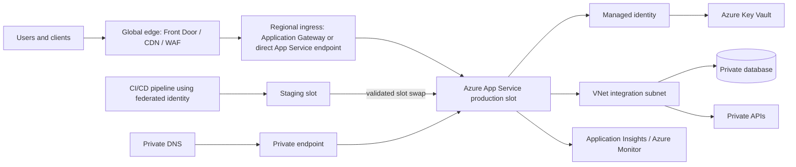
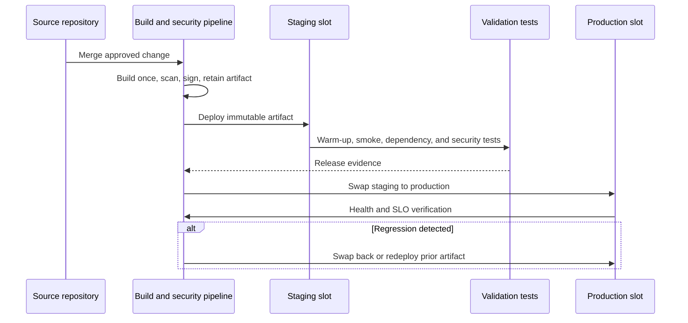

> **Document class:** Applications & Kubernetes architecture reference model
> **Normative terms:** **MUST**, **MUST NOT**, **SHOULD**, **SHOULD NOT**, and **MAY** are requirements levels.
> **Applicability:** Azure App Service architecture, networking, deployment, configuration, scaling, security, operations, and recovery.
> **Exception process:** Deviations require a documented risk assessment, compensating controls, named risk owner, and expiry date.

| Control field | Value |
|---|---|
| Document ID | `APP-02` |
| Owner | Cloud Center of Excellence |
| Review cycle | At least annually and after material cloud-service, security, or operating-model changes |
| Evidence | Architecture decision record, infrastructure-as-code plan, deployment and slot tests, network validation, security review, and recovery evidence |

# Azure App Service Architecture and Deployment

> **Decision in brief:** Use App Service for workloads that fit its managed runtime boundary, and make networking, identity, deployment slots, configuration, scaling, and recovery explicit.

## Purpose

This standard defines the approved architecture and deployment patterns for Azure App Service. Azure is the detailed reference implementation, but the control objectives apply to comparable managed application platforms in AWS, GCP, and OCI.

App Service is appropriate for web applications, APIs, and background components that fit its supported runtime or custom-container model. It is not a substitute for Kubernetes when the workload requires Kubernetes-native orchestration, nor is it a substitute for virtual machines when the application requires operating-system control.

## Scope

This document covers App Service plans, web apps, deployment slots, custom domains, certificates, managed identities, virtual network integration, private endpoints, private DNS, ingress, egress, deployment packages, custom containers, scaling, monitoring, backup, and recovery.

## Reference architecture

## Mandatory architecture controls

1. Production applications **MUST** use a dedicated App Service plan unless an approved multi-tenant plan design demonstrates compatible security, performance, scaling, maintenance, and chargeback requirements.
2. Production and non-production environments **MUST** be isolated by subscription/account boundary or an equivalent policy boundary; deployment slots are not a full environment-isolation mechanism.
3. Applications **MUST** use managed identity for Azure service access when supported. Stored client secrets are an exception.
4. Public ingress **MUST** be protected by the approved edge/WAF pattern when the application is internet-facing and business critical.
5. Private-only applications **MUST** use private endpoints, correct private DNS, and controlled administrative access.
6. Outbound access to private resources **MUST** use virtual network integration and explicit routing. Private endpoint and VNet integration solve different traffic directions and are not interchangeable.
7. TLS **MUST** be enforced. Legacy protocols and weak cipher configurations **MUST** be disabled where the service allows control.
8. Diagnostic logs, platform metrics, application telemetry, and deployment events **MUST** be sent to centralized monitoring with defined retention.
9. Deployments **MUST** be immutable and reproducible. Direct edits in the production file system are prohibited.
10. Production changes **MUST** support fast rollback through slot swap, package version rollback, or image digest rollback.

## Network design

### Inbound paths

Use one of three approved patterns:

- **Public endpoint behind global edge/WAF:** Appropriate for internet-facing applications. Restrict origin access where supported and validate forwarded headers safely.
- **Regional private origin behind Application Gateway:** Appropriate where a regional WAF, private frontend, or tighter network segmentation is required.
- **Private endpoint only:** Appropriate for internal applications, APIs consumed from private networks, and administrative services.

Access restrictions are useful but are not equivalent to a private endpoint. A private endpoint places a private IP in the virtual network for inbound access. VNet integration gives the application outbound access into a virtual network.

### Outbound paths

The application **SHOULD** route private and inspected traffic through the approved integration subnet and egress architecture. Teams must account for SNAT behavior, DNS resolution, firewall rules, dependency endpoints, and connection reuse. Applications should use connection pooling and avoid opening a new outbound connection for every request.

### DNS

Private endpoint implementations **MUST** include authoritative private DNS design. The application hostname must resolve to the intended private IP from each consuming network. Split-horizon DNS, forwarding chains, and on-premises resolvers must be tested explicitly.

## Deployment methods

| Method | Approved use | Key control |
|---|---|---|
| Run from package | Preferred for code packages where supported | Package is immutable and versioned |
| ZIP deployment with build | Allowed when platform build is intentionally required | Build inputs and runtime version are pinned |
| External build and ZIP deployment | Preferred when CI produces the complete artifact | The exact tested artifact is promoted |
| Custom container | Use for unsupported dependencies or stronger packaging consistency | Deploy by immutable image digest, not mutable tag |
| Local Git/FTP/manual copy | Prohibited for production | Not reproducible or sufficiently controlled |

The deployment source, build pipeline, and deployment mechanism are separate decisions. Teams must know where compilation occurs, which artifact is tested, and whether production receives exactly that artifact.

## Slot-based release pattern

Slot settings **MUST** be classified deliberately. Environment-specific values, identities, connection endpoints, and secrets must remain attached to the correct environment. A slot swap is not safe unless application startup, schema compatibility, cache behavior, and background processing have been tested.

## Application configuration

- Non-secret settings **SHOULD** be externalized and version-controlled as desired state.
- Secrets **MUST** be stored in Key Vault or another approved secret manager and accessed through managed identity.
- Key Vault references can simplify retrieval, but teams remain responsible for authorization, network access, rotation behavior, and failure handling.
- Configuration changes **MUST** be treated as releases because many changes restart the application or alter behavior immediately.
- Runtime, platform architecture, minimum TLS version, health-check path, always-on behavior, scaling limits, and diagnostic settings **MUST** be declared through infrastructure as code.

## Scaling and availability

App Service scales at the plan boundary. Applications sharing a plan share compute capacity and failure exposure. The architecture must therefore define:

- Minimum instance count for production availability.
- Zone redundancy where required and supported.
- Autoscale signals based on user impact, not CPU alone.
- Per-instance concurrency assumptions and load-test evidence.
- Warm-up behavior and readiness validation.
- Dependency limits, including database connections and downstream API quotas.
- A regional recovery design when a single region cannot meet the business requirement.

Autoscaling does not repair a slow dependency, a serialized code path, or an exhausted database connection pool.

## Security design

- Use managed identity and least-privilege RBAC.
- Disable unused publishing methods and basic authentication where possible.
- Restrict SCM/Kudu access and protect deployment endpoints.
- Scan code, dependencies, packages, and container images before release.
- Use a WAF for public high-value applications and validate origin restrictions.
- Separate user authentication from application authorization. Built-in authentication can validate identity, but business authorization rules remain an application responsibility.
- Use customer-managed certificates and keys only where the requirement justifies added lifecycle burden.
- Record administrative, configuration, identity, network, and deployment changes centrally.

## Multi-cloud operating-model mapping

| Capability | Azure | AWS | GCP | OCI |
|---|---|---|---|---|
| Managed web application hosting | Azure App Service | Elastic Beanstalk or App Runner | App Engine or Cloud Run | No exact PaaS equivalent; Container Instances, Functions, or OKE |
| Staged release | Deployment slots and swap | Environment/version deployment or App Runner revisions | Cloud Run revisions and traffic split; App Engine versions | Image/version deployment through DevOps pipelines |
| Workload identity | Managed identity | IAM role for service/task | Service account with workload identity | Resource principal or workload identity where supported |
| Secret manager | Key Vault | Secrets Manager / Parameter Store | Secret Manager | Vault |
| Private ingress | Private Endpoint | PrivateLink/VPC patterns vary by service | Internal ingress / Private Service Connect patterns vary by service | Private load balancer or private service endpoint patterns |

Do not claim feature equivalence where none exists. The target architecture must be redesigned around the destination provider's native service model.

## Operational readiness

Every production application **MUST** provide:

- Health endpoint that distinguishes process liveness from dependency readiness.
- Correlation IDs and distributed tracing for critical calls.
- Dashboards for request rate, latency, errors, saturation, instance count, restarts, deployment events, and dependency health.
- Alerts tied to SLO burn or user impact rather than raw platform noise alone.
- Runbooks for failed startup, DNS failure, certificate failure, secret-access failure, unhealthy instance, deployment rollback, and exhausted outbound connections.
- Tested backup and recovery for application-owned data. App Service backup is not a substitute for database-native protection.

## Environment topology and plan placement

A production topology should separate lifecycle and failure domains deliberately. At minimum, document whether development, test, staging, and production use separate subscriptions, resource groups, virtual networks, App Service plans, identities, private endpoints, DNS zones, and monitoring destinations.

Plan sharing is acceptable only when workloads have compatible scaling, maintenance, security, and cost-allocation requirements. A noisy or compromised application can affect every application sharing the plan. Business-critical applications should not share a plan with experimental workloads, untrusted code, or workloads with materially different scaling profiles.

Deployment slots remain part of the same application resource and plan. They are release mechanisms, not substitutes for production and non-production isolation. Slot capacity must be included in plan sizing, especially during warm-up, validation, and swap operations.

## Outbound connectivity and connection engineering

Outbound failures are frequently caused by DNS, route, firewall, or connection-management defects rather than App Service availability. The design should include:

- The integration subnet, route table, NAT or firewall path, and effective next hop.
- DNS resolution for public and private dependencies from the application runtime.
- Expected outbound source addresses for allow-listed dependencies.
- Connection pooling, keep-alive, idle timeout, and maximum connection assumptions.
- SNAT-port consumption and mitigation where the architecture uses shared outbound translation.
- Retry ownership and timeout budgets for each critical dependency.

Synthetic tests should resolve the exact hostname, establish TLS, authenticate, and execute a low-impact transaction. A TCP port check alone does not validate application connectivity.

## Artifact and runtime hardening

For code packages, the release record should capture the package hash, source commit, build environment, dependency lock file, runtime version, and deployment method. For custom containers, it should capture the image digest, base image, SBOM, vulnerability result, signature or provenance evidence, startup command, exposed port, and health endpoint.

The runtime configuration must pin supported major versions and define an upgrade process. Automatic platform patching does not eliminate application compatibility testing. Teams should test framework updates, TLS changes, certificate-chain changes, and runtime end-of-support transitions in lower environments before production rollout.

The application file system must be treated as ephemeral unless the platform feature and durability behavior are explicitly documented. User uploads, generated reports, and shared runtime state belong in an external data service, not in an instance-local path.

## Database and background-work coordination

Slot swaps and rolling deployments can temporarily run old and new code at the same time. Database migrations must therefore be backward compatible or executed through an explicit maintenance procedure. Use expand-migrate-contract for schema changes and avoid destructive startup migrations.

Background processors require additional controls:

- Ensure only the intended slot or environment performs scheduled or singleton work.
- Make jobs idempotent and protected against duplicate execution during swap or restart.
- Record checkpoint and lease behavior.
- Separate health of request processing from health of background work.
- Define how a rollback handles messages or data already produced by the new version.

## App Service recovery evidence

Recovery testing should prove that the application can be recreated from infrastructure code and a retained artifact. The test should include custom domains, certificates, private endpoints, DNS, identities, role assignments, configuration, secret references, monitoring, and traffic routing. Where regional recovery is required, confirm that dependent data and identity services are recoverable in the target region and that traffic restoration does not depend on undocumented portal actions.

## Common anti-patterns

- Treating deployment slots as full security-isolated environments.
- Using private endpoint without private DNS validation.
- Using VNet integration and assuming inbound access is private.
- Building in production or deploying artifacts that were not tested.
- Deploying mutable container tags such as `latest`.
- Storing service-principal secrets in application settings when managed identity is available.
- Scaling the App Service plan without testing downstream limits.
- Allowing unrestricted access to the SCM endpoint.

## Validation

- [ ] App Service is justified against Container Apps, AKS, functions, and virtual machines.
- [ ] Production plan isolation, SKU, minimum instances, and zone requirements are documented.
- [ ] Inbound and outbound network paths are diagrammed and tested.
- [ ] Private DNS resolution is validated from every consuming network.
- [ ] Managed identity and least-privilege access replace stored credentials where supported.
- [ ] The build artifact is immutable, scanned, retained, and promoted without rebuilding.
- [ ] Slot-specific settings, warm-up, health checks, and rollback are tested.
- [ ] Deployment, application, platform, and dependency telemetry reach centralized monitoring.
- [ ] Regional recovery meets documented RTO and RPO.

## Related topics

- [Cloud Application Platform Selection](app-cloud-application-platform-selection.md)
- [Application Identity, Authentication, and Easy Auth](app-application-identity-authentication-and-easy-auth.md)
- [Application Configuration and Secret Management](app-application-configuration-and-secret-management.md)
- [Resilience, Scaling, and Deployment Strategies](app-resilience-scaling-and-deployment-strategies.md)

## References

Use provider documentation as the source of truth for service limits, regional availability, supported versions, and feature behavior.
- [Azure App Service documentation](https://learn.microsoft.com/en-us/azure/app-service/)
- [Azure App Service deployment best practices](https://learn.microsoft.com/en-us/azure/app-service/deploy-best-practices)
- [Azure App Service deployment slots](https://learn.microsoft.com/en-us/azure/app-service/deploy-staging-slots)
- [Azure App Service authentication and authorization](https://learn.microsoft.com/en-us/azure/app-service/overview-authentication-authorization)
- [AWS container-service decision guide](https://docs.aws.amazon.com/decision-guides/latest/containers-on-aws-how-to-choose/choosing-aws-container-service.html)
- [GCP: Compare App Engine and Cloud Run](https://docs.cloud.google.com/appengine/migration-center/run/compare-gae-with-run)
- [OCI Container Instances overview](https://docs.oracle.com/en-us/iaas/Content/container-instances/overview-of-container-instances.htm)
