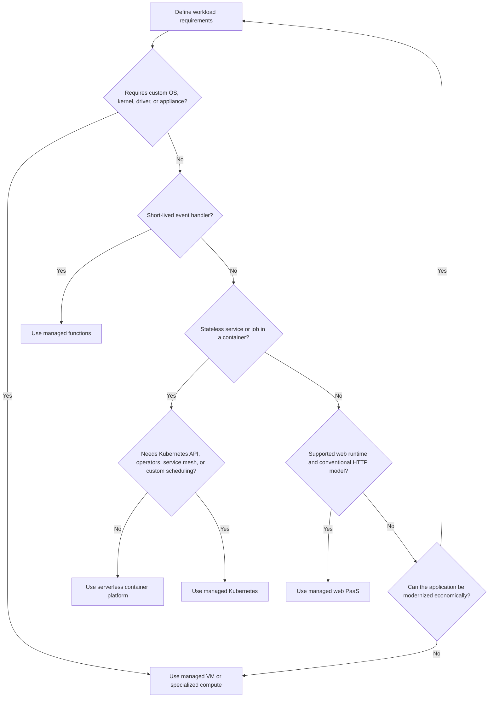
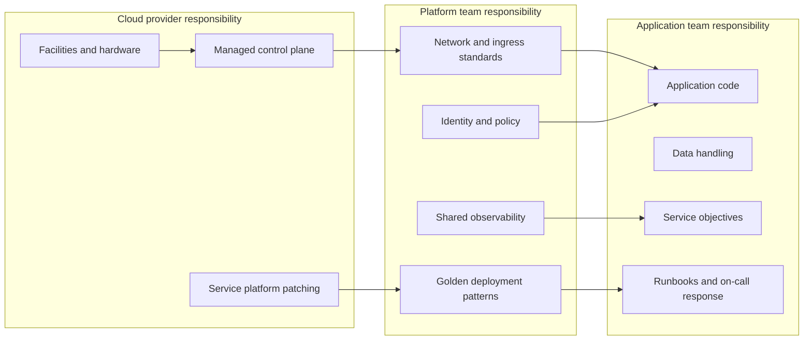

> **文档类型：** 应用和 Kubernetes 决策指南
> **规范性术语：** **MUST**、**MUST NOT**、**SHOULD**、**SHOULD NOT** 和 **MAY** 是要求级别。
> **适用范围：** 为云应用工作负载选择 App Service、无服务器容器、Kubernetes、VM 和提供商原生平台。
> **例外流程：** 偏离要求需要记录风险评估、补偿控制、指定风险负责人和到期日期。

|控制领域|价值|
|---|---|
|文件编号 | `APP-01` |
|负责人|云卓越中心 |
|审核周期|至少每年一次，并且在重大平台、提供商、安全性或运营模式发生变化之后 |
|证据|工作负载发现日志、加权决策模型、拟合证明结果、成本模型、ADR 和重新评估触发器 |

# 云应用平台选择

> **决策简述：** 选择满足经过验证的工作负载要求的最简单的平台，并明确记录可移植性、操作、安全性、成本和退出权衡。

## 目的

该标准定义了团队如何选择应用托管平台，而不会自动默认为 Kubernetes、虚拟机或特定于提供商的服务。该决策必须最大限度地减少总运营负担，同时满足安全性、可移植性、性能、弹性、监管和交付要求。

正确的平台是能够满足工作负载经过验证的要求的最简单的平台。可移植性不仅仅通过将软件打包在容器中来实现。真正的可移植性还取决于身份、网络、数据服务、可观测性、部署接口和操作技能。

## 范围

本文档涵盖新应用、现代化计划、平台迁移、Web 应用、API、事件驱动服务、后台工作进程、计划作业、容器化工作负载和托管 Kubernetes 工作负载。它没有规定数据库引擎选择或详细的网络拓扑，这些由单独的标准管辖。

## 强制选择原则

1. 团队 **MUST** 在选择平台之前记录业务关键性、预期流量、延迟、数据分类、恢复目标、运行时限制和运营所有权。
2. 当托管服务满足工作负载要求时，团队 **MUST** 更喜欢托管服务而不是自我管理的基础设施。
3. 选择 Kubernetes **MUST NOT** 仅仅是因为应用是容器化的。
4. 当托管应用平台支持运行时和所需的集成模型时，选择虚拟机 **MUST NOT**。
5. 选择 **MUST** 包括生命周期成本：平台工程、修补、升级、可观测性、安全操作、事件响应、容量管理和专业人员配置。
6. 提供商可移植性 **SHOULD** 仅在记录在案的业务场景证明额外复杂性合理的情况下才实施。
7. 平台决策 **MUST** 记录在架构决策记录中，并在每次主要生命周期变更时进行审查。

## 平台分类

|平台模式|最适合|主要权衡|
|---|---|---|
|托管网络 PaaS |具有受支持运行时的传统 Web 应用和 API |运营负担最低，但平台限制更多 |
|无服务器容器 |无状态 HTTP 服务、工作进程、作业、事件驱动的应用 |快速扩展并减少基础设施控制 |
|托管 Kubernetes |复杂的服务资产、自定义网络、平台扩展、混合工作负载 |最大的灵活性和重大的运营责任|
|Functions|短命事件处理程序和粘合逻辑 |具有执行和运行时约束的强大事件集成|
|虚拟机|遗留软件、自定义操作系统依赖项、不受支持的运行时、设备 |最高的控制力和最高的管理负担|
|批量/HPC 服务 |排队、有限、并行计算作业 |专业编排而非一般应用托管|

## 决策流程

## 加权决策模型

仅在确定硬约束后才使用评分模型。高分不能推翻强制约束。

|标准|建议权重|评估问题|
|---|---:|---|
|运维简便性 | 20% |团队还剩下多少基础设施和控制平面工作？ |
|安全与合规 | 20% |能否实施所需的隔离、身份、日志记录和策略控制？ |
|运行时适配性 | 15% |是否支持语言、协议、存储、流程和执行要求？ |
|弹性和规模| 15% |平台能否满足可用性、弹性、RTO 和 RPO 要求？ |
|交付速度| 10% |该平台是否支持安全、可重复、自动化的部署？ |
|成本可预测性| 10% |基线成本和突发成本是否可以理解和控制？ |
|可移植性要求| 5% |迁移到另一个环境是否可靠、资金充足？ |
|组织能力| 5% |运营团队能否持续支持平台？ |

每个标准都应根据证据从 1 到 5 进行评分。没有可度量证据的评分无效。

## 多云服务映射

|能力|Azure|AWS | GCP |OCI |
|---|---|---|---|---|
|托管网络 PaaS | Azure App Service | AWS Elastic Beanstalk 或 AWS App Runner，具体取决于打包方式 | App Engine 或 Cloud Run |没有完全等同的；根据需求使用 Container Instances、Functions 或 OKE |
|无服务器容器 | Azure Container Apps | AWS Fargate 上的 AWS App Runner 或 Amazon ECS |Cloud Run| OCI Container Instances |
|托管 Kubernetes | AKS |Amazon EKS | GKE |无完全等效项|
|Functions| Azure Functions | AWS Lambda |Cloud Run functions / Cloud Functions| OCI Functions |
|虚拟机| Azure Virtual Machines |Amazon EC2 | Compute Engine | OCI Compute |
|容器注册表 | Azure Container Registry |Amazon ECR |Artifact Registry | OCI Container Registry |

该表映射了操作模型，而不是相同的功能集。团队 **MUST** 评估特定于服务的网络、扩展、身份、可观测性、区域可用性和限制。

## 架构所有权边界

托管服务将基础设施任务迁移给提供商；它不迁移应用安全性、数据保护、授权、测试或操作责任。

## 选择护栏

### 选择托管 Web PaaS 时

- 工作负载主要是 HTTP/HTTPS，并使用受支持的运行时或容器模型。
- 团队重视集成的 TLS、部署槽或修订、托管证书、平台运行状况和简单的水平扩展。
- 不需要 Kubernetes API、特权容器、自定义节点配置或专门的调度。

### 何时选择无服务器容器

- 工作负载是无状态的或外部化状态。
- 扩缩容至零或事件驱动的扩缩容可显著改善成本或运营。
- 该服务可以容忍平台定义的启动、请求、网络和执行约束。
- 每服务部署和基于修订的流量管理是可取的。

### 何时选择托管 Kubernetes

- 多个工作负载需要一个通用的可扩展控制平面。
- 该解决方案需要 Kubernetes Operator、自定义资源、高级调度、服务网格、专门入口或一致的 Kubernetes 操作模型。
- 该组织具备一支受资助的平台团队和可靠的升级、安全性、可观测性和事件管理模型。

### 选择虚拟机时

- 应用需要不受支持的操作系统、内核功能、驱动程序、许可证模型或设备。
- 现代化成本大于预期生命周期的运营负担。
- 记录异常情况，包括修补、漏洞管理、备份、恢复和退役计划。

## 改变答案的非功能性需求

以下要求经常会使原本有吸引力的平台变得无效：

- 长期连接、非 HTTP 协议、固定源 IP、私有入口或复杂的东西向路由。
- 有状态本地存储、严格的写入顺序或低级存储控制。
- GPU、高内存、高网络吞吐量或自定义硬件要求。
- 监管隔离、客户管理的密钥、主权区域限制或强制数据包检查。
- 基线利用率非常高，而扩缩容为零不会带来经济效益。
- 极端的冷启动敏感性或启动时间与动态扩缩容不兼容。
- 提供商软件支持限制。

## 所需的架构决策记录

决策记录 **MUST** 包括：

- 工作负载摘要和关键用户旅程。
- 严格的限制和被拒绝的替代方案。
- 有证据的评分模型。
- 估计的稳态和峰值成本。
- 职责矩阵和所需技能。
- 可用性设计、扩展模型、RTO 和 RPO。
- 身份、机密、网络和日志记录设计。
- 退出触发因素：需要重新考虑平台的条件。

## 工作负载发现和证据基线

平台选择从证据收集开始，而不是产品比较。发现日志记录应区分当前行为和期望行为，并且至少应包括以下维度：
|尺寸|收集证据|为什么这很重要 |
|---|---|---|
|流量概况 |基线、峰值、突发持续时间、并发性、有效负载大小、地理分布 |确定扩展、入口和成本行为 |
|执行模型| HTTP、流式传输、后台、计划、事件驱动、长时间运行的进程 |消除具有不兼容请求或执行约束的平台 |
|状态|会话状态、本地文件、持久数据、缓存、排序、锁定 |确定状态是否必须外部化或需要专门的存储 |
|依赖关系 |数据库、队列、身份提供商、私有 API、第三方 |揭示网络、延迟、身份和故障依赖性 |
|运行时 |语言、框架、原生库、流程模型、启动时长 |识别运行时和打包约束 |
|运营|随叫随到的所有权、诊断需求、维护窗口、支持技能 |检验运营模式是否可信|
|合规|数据驻留、审计、隔离、加密、管理访问 |在评分前建立硬性约束 |

未知值必须记录为带有所有者和验证日期的假设。基于未经测试的假设的决定是临时的，未经批准。

## 拟合证明评估

在输入平台之前，团队 **SHOULD** 使用代表性工作负载切片运行有时间限制的适合证明。评估应验证：

- 从预期的 CI/CD 或 GitOps 路径进行部署。
- 无需静态云凭证的工作负载身份和机密检索。
- 私有入口、私有依赖访问、DNS 和出口控制。
- 启动时间、稳态延迟、突发布为和横向扩展延迟。
- 健康检查、正常终止、日志、跟踪和事件诊断。
- 回滚应用和配置更改。
- 现实的故障场景，例如依赖项超时、实例终止或不可用的机密提供程序。
- 最小容量、预期利用率和定义的峰值场景的成本。

适合证明必须根据明确的验收标准提供通过/失败的证据。成功的“hello world”部署并不足以作为生产选择的证据。

## 平台经济学和成本模型

成本比较必须包括超过列出的计算价格。至少估计：

- 闲置或最小容量成本。
- 峰值和突发计算成本。
- 网络出口、负载均衡、NAT、防火墙、私有连接和 DNS 成本。
- 日志、指标、跟踪和安全数据摄取和保留。
- 注册表、制品、备份和灾难恢复存储。
- 平台工程和应用迁移工作。
- 升级、补丁、事件和合规性证据工作。
- 为可用性、回滚和区域恢复而保留的容量成本。

当较低的单价产生永久性的专业操作要求时，经济上可能会更糟。相反，当最少实例、高可观测量或特定于提供商的网络组件占主导地位时，托管平台可能会变得昂贵。

## 退出标准和重新评估触发器
架构决策记录必须定义强制审查的条件。典型的触发因素包括：

- 不受支持的运行时或框架要求。
- 费用持续超出批准范围。
- 限制吞吐量、连接计数、执行时间或扩展的平台限制。
- 新的监管隔离或数据驻留要求。
- 平台限制导致事件重复发生。
- 需要自定义调度、操作员、特权执行或专用硬件。
- 组织无法安全操作所选平台。

重新评估并不意味着立即迁移。它需要对修复、重新设计和迁移选项进行日志记录比较。

## 常见的反模式

- 选择 Kubernetes 来标准化部署，而忽略标准化运营的成本。
- 声称多云可移植性，同时深度依赖提供商身份、数据库、消息传递和网络服务，而没有退出设计。
- 为长时间运行或延迟敏感的服务选择函数只是为了实现扩缩容到零。
- 选择无服务器平台而不测试并发、启动、连接和超时行为。
- 仅比较计算价格，而不包括平台员工和可靠性工程。
- 将容器镜像视为一个完整的操作架构。

## 验证

- [ ] 记录了业务关键性、数据分类、RTO、RPO、SLO、峰值负载和延迟目标。
- [ ] 硬平台约束与偏好分离。
- [ ] 至少评估了两种可靠的托管替代方案。
- [ ] 总运营所有权和所需技能得到资助。
- [ ] 日志记录网络、身份、机密、可观测性、弹性和部署模型。
- [ ] 服务限制和区域可用性已根据当前提供商文档进行检查。
- [ ] 负载测试和故障模式测试验证所选平台。
- [ ] 架构决策记录命名退出触发器和审核日期。

## 相关主题

- [Azure App Service 架构和部署](app-azure-app-service-architecture-and-deployment.md)
- [Container Apps 和无服务器容器](app-container-apps-and-serverless-containers.md)
- [AKS 平台架构](app-aks-platform-architecture.md)
- [弹性、扩展和部署策略](app-resilience-scaling-and-deployment-strategies.md)

## 参考文档

使用提供商文档作为服务限制、区域可用性、支持的版本和功能行为的真实来源。
- [AWS：选择 AWS 容器服务](https://docs.aws.amazon.com/decision-guides/latest/containers-on-aws-how-to-choose/choosing-aws-container-service.html)
- [GCP：GKE 和 Cloud Run](https://docs.cloud.google.com/kubernetes-engine/docs/concepts/gke-and-cloud-run)
- [OCI Container Instances 概述](https://docs.oracle.com/en-us/iaas/Content/container-instances/overview-of-container-instances.htm)
- [OCI Kubernetes 引擎概述](https://docs.oracle.com/en-us/iaas/Content/ContEng/Concepts/contengoverview.htm)
- [Azure App Service 文档](https://learn.microsoft.com/en-us/azure/app-service/)
- [Azure Container Apps 概述](https://learn.microsoft.com/en-us/azure/container-apps/overview)
- [Azure Kubernetes Service 文档](https://learn.microsoft.com/en-us/azure/aks/)
