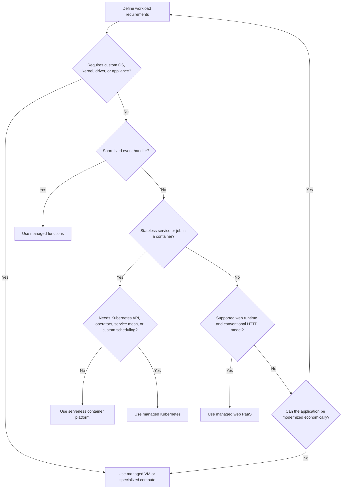
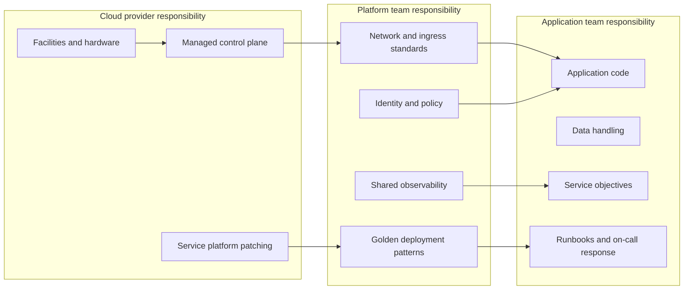

> **Document class:** Applications & Kubernetes decision guide
> **Normative terms:** **MUST**, **MUST NOT**, **SHOULD**, **SHOULD NOT**, and **MAY** are requirements levels.
> **Applicability:** Selection of App Service, serverless containers, Kubernetes, VMs, and provider-native platforms for cloud application workloads.
> **Exception process:** Deviations require a documented risk assessment, compensating controls, named risk owner, and expiry date.

| Control field | Value |
|---|---|
| Document ID | `APP-01` |
| Owner | Cloud Center of Excellence |
| Review cycle | At least annually and after material platform, provider, security, or operating-model changes |
| Evidence | Workload discovery record, weighted decision model, proof-of-fit results, cost model, ADR, and re-evaluation triggers |

# Cloud Application Platform Selection

> **Decision in brief:** Choose the least-complex platform that satisfies verified workload requirements, and record portability, operations, security, cost, and exit tradeoffs explicitly.

## Purpose

This standard defines how teams select an application hosting platform without defaulting automatically to Kubernetes, virtual machines, or a provider-specific service. The decision must minimize total operational burden while satisfying security, portability, performance, resilience, regulatory, and delivery requirements.

The correct platform is the least-complex platform that can meet the workload's verified requirements. Portability is not achieved merely by packaging software in a container. Real portability also depends on identity, networking, data services, observability, deployment interfaces, and operational skills.

## Scope

This document covers new applications, modernization initiatives, platform migrations, web applications, APIs, event-driven services, background workers, scheduled jobs, containerized workloads, and managed Kubernetes workloads. It does not prescribe database-engine selection or detailed network topology, which are governed by separate standards.

## Mandatory selection principles

1. Teams **MUST** document business criticality, expected traffic, latency, data classification, recovery objectives, runtime constraints, and operational ownership before selecting a platform.
2. Teams **MUST** prefer managed services over self-managed infrastructure when the managed service satisfies the workload requirements.
3. Kubernetes **MUST NOT** be selected solely because the application is containerized.
4. Virtual machines **MUST NOT** be selected when a managed application platform supports the runtime and required integration model.
5. The selection **MUST** include lifecycle cost: platform engineering, patching, upgrades, observability, security operations, incident response, capacity management, and specialist staffing.
6. Provider portability **SHOULD** be implemented only where a documented business scenario justifies the additional complexity.
7. The platform decision **MUST** be captured in an architecture decision record and reviewed at each major lifecycle change.

## Platform taxonomy

| Platform model | Best fit | Primary trade-off |
|---|---|---|
| Managed web PaaS | Conventional web apps and APIs with supported runtimes | Lowest operational burden, but more platform constraints |
| Serverless containers | Stateless HTTP services, workers, jobs, event-driven applications | Rapid scaling and reduced infrastructure control |
| Managed Kubernetes | Complex service estates, custom networking, platform extensions, mixed workloads | Maximum flexibility with significant operational responsibility |
| Functions | Short-lived event handlers and glue logic | Strong event integration with execution and runtime constraints |
| Virtual machines | Legacy software, custom OS dependencies, unsupported runtimes, appliances | Highest control and highest management burden |
| Batch/HPC services | Queued, finite, parallel compute jobs | Specialized orchestration rather than general application hosting |

## Decision flow

## Weighted decision model

Use a scored model only after hard constraints have been identified. A high score cannot override a mandatory constraint.

| Criterion | Suggested weight | Evaluation question |
|---|---:|---|
| Operational simplicity | 20% | How much infrastructure and control-plane work remains with the team? |
| Security and compliance | 20% | Can required isolation, identity, logging, and policy controls be enforced? |
| Runtime fit | 15% | Are language, protocol, storage, process, and execution requirements supported? |
| Resilience and scale | 15% | Can the platform meet availability, elasticity, RTO, and RPO requirements? |
| Delivery velocity | 10% | Does the platform support safe, repeatable, automated deployment? |
| Cost predictability | 10% | Are baseline and burst costs understandable and governable? |
| Portability requirement | 5% | Is migration to another environment a credible, funded scenario? |
| Organizational capability | 5% | Can the operating team support the platform continuously? |

Each criterion should be scored from 1 to 5 with evidence. Scores without measurable evidence are invalid.

## Multi-cloud service mapping

| Capability | Azure | AWS | GCP | OCI |
|---|---|---|---|---|
| Managed web PaaS | Azure App Service | AWS Elastic Beanstalk or AWS App Runner, depending on packaging | App Engine or Cloud Run | No exact equivalent; use Container Instances, Functions, or OKE based on requirements |
| Serverless containers | Azure Container Apps | AWS App Runner or Amazon ECS on AWS Fargate | Cloud Run | OCI Container Instances |
| Managed Kubernetes | AKS | Amazon EKS | GKE | OKE |
| Functions | Azure Functions | AWS Lambda | Cloud Run functions / Cloud Functions | OCI Functions |
| Virtual machines | Azure Virtual Machines | Amazon EC2 | Compute Engine | OCI Compute |
| Container registry | Azure Container Registry | Amazon ECR | Artifact Registry | OCI Container Registry |

The table maps operating models, not identical feature sets. Teams **MUST** evaluate service-specific networking, scaling, identity, observability, regional availability, and limits.

## Architecture ownership boundary

A managed service transfers infrastructure tasks to the provider; it does not transfer application security, data protection, authorization, testing, or operational accountability.

## Selection guardrails

### Choose managed web PaaS when

- The workload is primarily HTTP/HTTPS and uses a supported runtime or container model.
- The team values integrated TLS, deployment slots or revisions, managed certificates, platform health, and straightforward horizontal scaling.
- There is no requirement for Kubernetes APIs, privileged containers, custom node configuration, or specialized scheduling.

### Choose serverless containers when

- The workload is stateless or externalizes state.
- Scale-to-zero or event-driven scaling materially improves cost or operations.
- The service can tolerate platform-defined startup, request, networking, and execution constraints.
- Per-service deployment and revision-based traffic management are desirable.

### Choose managed Kubernetes when

- Multiple workloads require a common extensible control plane.
- The solution requires Kubernetes operators, custom resources, advanced scheduling, service mesh, specialized ingress, or a consistent Kubernetes operating model.
- The organization has a funded platform team and a credible upgrade, security, observability, and incident-management model.

### Choose virtual machines when

- The application requires an unsupported operating system, kernel capability, driver, license model, or appliance.
- Modernization cost is greater than the operational burden for the expected lifecycle.
- The exception is recorded and includes patching, vulnerability management, backup, recovery, and decommissioning plans.

## Non-functional requirements that change the answer

The following requirements frequently invalidate an otherwise attractive platform:

- Long-lived connections, non-HTTP protocols, fixed source IPs, private-only ingress, or complex east-west routing.
- Stateful local storage, strict write ordering, or low-level storage controls.
- GPU, high-memory, high-network-throughput, or custom hardware requirements.
- Regulatory isolation, customer-managed keys, sovereign-region constraints, or mandatory packet inspection.
- Very high baseline utilization where scale-to-zero provides no economic benefit.
- Extreme cold-start sensitivity or startup times incompatible with dynamic scaling.
- Vendor software support restrictions.

## Required architecture decision record

The decision record **MUST** include:

- Workload summary and critical user journeys.
- Hard constraints and rejected alternatives.
- Scoring model with evidence.
- Estimated steady-state and peak cost.
- Responsibility matrix and required skills.
- Availability design, scaling model, RTO, and RPO.
- Identity, secret, network, and logging design.
- Exit triggers: the conditions that require reconsidering the platform.

## Workload discovery and evidence baseline

Platform selection begins with evidence collection, not product comparison. The discovery record should distinguish current behavior from desired behavior and should include at least the following dimensions:

| Dimension | Evidence to collect | Why it matters |
|---|---|---|
| Traffic profile | Baseline, peak, burst duration, concurrency, payload size, geographic distribution | Determines scaling, ingress, and cost behavior |
| Execution model | HTTP, streaming, background, scheduled, event-driven, long-running process | Eliminates platforms with incompatible request or execution constraints |
| State | Session state, local files, durable data, cache, ordering, locking | Determines whether state must be externalized or specialized storage is required |
| Dependencies | Databases, queues, identity providers, private APIs, third parties | Reveals network, latency, identity, and failure dependencies |
| Runtime | Language, framework, native libraries, process model, startup duration | Identifies runtime and packaging constraints |
| Operations | On-call ownership, diagnostic needs, maintenance windows, support skills | Tests whether the operating model is credible |
| Compliance | Data residency, audit, isolation, encryption, administrative access | Establishes hard constraints before scoring |

Unknown values must be recorded as assumptions with an owner and validation date. A decision based on untested assumptions is provisional, not approved.

## Proof-of-fit assessment

Before committing to a platform, teams **SHOULD** run a time-bounded proof of fit using a representative workload slice. The assessment should validate:

- Deployment from the intended CI/CD or GitOps path.
- Workload identity and secret retrieval without static cloud credentials.
- Private ingress, private dependency access, DNS, and egress controls.
- Startup time, steady-state latency, burst behavior, and scale-out delay.
- Health checks, graceful termination, logging, tracing, and incident diagnostics.
- Rollback of application and configuration changes.
- A realistic failure scenario such as dependency timeout, instance termination, or unavailable secret provider.
- Cost at minimum capacity, expected utilization, and a defined peak scenario.

The proof of fit must produce pass/fail evidence against explicit acceptance criteria. A successful “hello world” deployment is not sufficient evidence for production selection.

## Platform economics and cost model

The cost comparison must include more than listed compute prices. At minimum, estimate:

- Idle or minimum-capacity cost.
- Peak and burst compute cost.
- Network egress, load-balancing, NAT, firewall, private connectivity, and DNS cost.
- Log, metric, trace, and security-data ingestion and retention.
- Registry, artifact, backup, and disaster-recovery storage.
- Platform engineering and application migration effort.
- Upgrade, patch, incident, and compliance evidence effort.
- Cost of capacity held for availability, rollback, and regional recovery.

A lower unit price can be economically worse when it creates a permanent specialist operating requirement. Conversely, a managed platform can become expensive when minimum instances, high observability volume, or provider-specific network components dominate the bill.

## Exit criteria and re-evaluation triggers

The architecture decision record must define conditions that force review. Typical triggers include:

- Unsupported runtime or framework requirements.
- Sustained cost outside the approved range.
- Platform limits that constrain throughput, connection count, execution time, or scaling.
- New regulatory isolation or data-residency requirements.
- Repeated incidents caused by platform constraints.
- A need for custom scheduling, operators, privileged execution, or specialized hardware.
- Organizational inability to operate the selected platform safely.

Re-evaluation does not imply immediate migration. It requires a documented comparison of remediation, redesign, and migration options.

## Common anti-patterns

- Selecting Kubernetes to standardize deployment while ignoring the cost of standardizing operations.
- Claiming multi-cloud portability while depending deeply on provider identity, database, messaging, and networking services without an exit design.
- Selecting functions for long-running or latency-sensitive services merely to obtain scale-to-zero.
- Selecting a serverless platform without testing concurrency, startup, connection, and timeout behavior.
- Comparing only compute prices while excluding platform labor and reliability engineering.
- Treating a container image as a complete operational architecture.

## Validation

- [ ] Business criticality, data classification, RTO, RPO, SLO, peak load, and latency targets are documented.
- [ ] Hard platform constraints are separated from preferences.
- [ ] At least two credible hosting alternatives were evaluated.
- [ ] Total operational ownership and required skills are funded.
- [ ] Network, identity, secrets, observability, resilience, and deployment models are documented.
- [ ] Service limits and regional availability were checked against current provider documentation.
- [ ] A load test and failure-mode test validate the selected platform.
- [ ] An architecture decision record names exit triggers and review dates.

## Related topics

- [Azure App Service Architecture and Deployment](app-azure-app-service-architecture-and-deployment.md)
- [Container Apps and Serverless Containers](app-container-apps-and-serverless-containers.md)
- [AKS Platform Architecture](app-aks-platform-architecture.md)
- [Resilience, Scaling, and Deployment Strategies](app-resilience-scaling-and-deployment-strategies.md)

## References

Use provider documentation as the source of truth for service limits, regional availability, supported versions, and feature behavior.
- [AWS: Choosing an AWS container service](https://docs.aws.amazon.com/decision-guides/latest/containers-on-aws-how-to-choose/choosing-aws-container-service.html)
- [GCP: GKE and Cloud Run](https://docs.cloud.google.com/kubernetes-engine/docs/concepts/gke-and-cloud-run)
- [OCI Container Instances overview](https://docs.oracle.com/en-us/iaas/Content/container-instances/overview-of-container-instances.htm)
- [OCI Kubernetes Engine overview](https://docs.oracle.com/en-us/iaas/Content/ContEng/Concepts/contengoverview.htm)
- [Azure App Service documentation](https://learn.microsoft.com/en-us/azure/app-service/)
- [Azure Container Apps overview](https://learn.microsoft.com/en-us/azure/container-apps/overview)
- [Azure Kubernetes Service documentation](https://learn.microsoft.com/en-us/azure/aks/)
