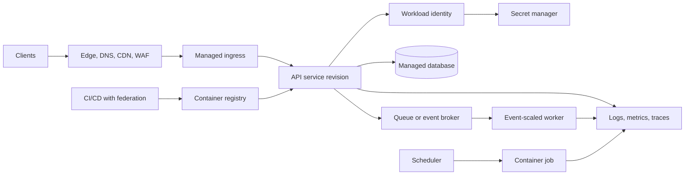
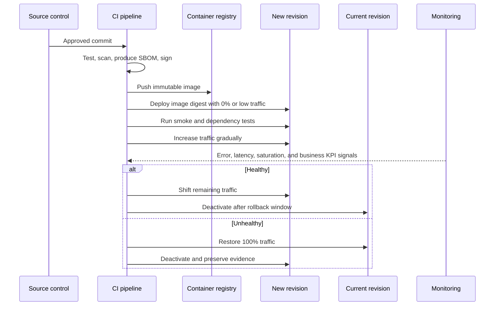

> **文档类型：** 应用和 Kubernetes 实施指南
> **规范性术语：** **MUST**、**MUST NOT**、**SHOULD**、**SHOULD NOT** 和 **MAY** 是要求级别。
> **适用范围：** 无服务器容器工作负载、基于修订的交付、网络、身份、扩展、成本、可靠性和操作。
> **例外流程：** 偏离要求需要记录风险评估、补偿控制、指定风险负责人和到期日期。

|控制领域|价值|
|---|---|
|文件编号 | `APP-03` |
|负责人|云卓越中心 |
|审核周期|至少每年一次，并且在云服务、容器平台、安全性或运营模式发生重大变化之后 |
|证据|工作负载适合评估、修订和流量测试、身份和网络配置、成本审查和运营就绪证据 |

# Container Apps 和无服务器容器

> **简要决定：** 当托管执行减少平台负担而不隐藏应用对身份、网络、规模、成本和故障处理的责任时，请使用无服务器容器。

## 目的

该标准定义了何时以及如何使用无服务器容器平台。 Azure Container Apps 是详细的参考实现； AWS Fargate、Cloud Run 和 OCI Container Instances 上的 AWS App Runner 和 Amazon ECS 按操作模型进行映射。

无服务器容器消除了节点和集群管理，但它们并没有消除应用架构责任。团队仍然负责无状态设计、身份、依赖性保护、可观测性、成本控制和故障处理。

## 适合的工作负载

无服务器容器非常适合：

- 无状态 HTTP API 和 Web 服务。
- 事件驱动的工作进程和队列消费者。
- 预定或按需工作。
- 可独立部署的微服务。
- 面向突发的工作负载，受益于快速弹性或扩缩容至零。
- 不需要 Kubernetes API 或节点级控制的容器化应用。

它们不适合需要特权容器、自定义内核、主机网络、专用存储语义、不受支持的协议、严格的固定主机假设或广泛的 Kubernetes 扩展点的工作负载。

## 参考架构

## 强制控制

1. 工作负载 **MUST** 外部化持久状态。
2. 镜像 **MUST** 一次构建、扫描、在支持的情况下签名、由不可变摘要保留和部署。
3. 工作负载身份 **MUST** 在可用时用于云服务访问。
4. 面向互联网的服务 **MUST** 使用经批准的入口、TLS、WAF、身份验证和适合风险的速率限制控制。
5. 私有服务 **MUST** 使用私有或内部入口以及经过验证的私有 DNS/路由。
6. 显式配置最小和最大副本或实例限制 **MUST**。
7. 为延迟敏感服务启用扩缩容至零 **MUST NOT**，无需测量冷启动接受度。
8. 并发和请求超时值**MUST**在实际负载下进行测试。
9. 部署修订 **MUST** 可监控且可回滚。
10. 应用**MUST**处理终止信号并在关机前停止接受工作。

## Azure Container Apps 设计

Container Apps 环境是网络、可观测性集成和某些平台功能的共享边界。环境中的应用需要经过深思熟虑的租户和爆炸半径设计。

### 修订

修订版是应用版本及其配置的不可变快照。使用单一修订模式进行简单的替换版本。对金丝雀、A/B、蓝绿或受控回滚场景使用多修订模式。必须声明并监控流量权重。

### 扩缩容

扩缩容可以通过 KEDA 兼容的 Scaler 使用 HTTP 并发、CPU/内存或基于事件的信号。规模规则必须与实际瓶颈相匹配。对于队列工作进程，扩展设计必须包括队列深度、消息寿命、处理时间、可见性超时、重试策略、毒消息处理和下游限制。

### 工作

使用作业进行有限执行，而不是强制持续运行的服务模型。作业可以是手动的、计划的或事件驱动的。作业必须是幂等的或具有明确的重复数据删除策略。

### Dapr 和服务调用

Dapr 可以标准化服务调用、发布/订阅、状态访问和机密接口，但它增加了运行时依赖性和操作复杂性。仅当多个工作负载受益于抽象并且团队可以对其进行操作和故障排除时才使用它。

## 基于修订的部署

## 多云服务映射

|能力|Azure|AWS | GCP |OCI |
|---|---|---|---|---|
|无服务器应用容器 | Azure Container Apps | AWS App Runner |Cloud Run| OCI Container Instances |
|无服务器编排任务 |Container Apps jobs | Fargate / AWS Batch 上的 ECS 任务取决于工作负载 |Cloud Run jobs |Container Instances 加上调度程序/编排服务|
|托管 Kubernetes 替代方案 | AKS | EKS | GKE |无完全等效项|
|基于事件的扩展 | KEDA 支持的规模规则 |服务自动扩展和事件集成| Cloud Run 自动扩展和事件集成 |自动扩展需要特定于服务的架构 |
|修订流量分配 |Container Apps revisions | App Runner 部署或 ALB/ECS 部署模式 |Cloud Run revisions |流水线/负载均衡器策略；没有完全等同的|
|工作负载身份|托管身份| IAM 任务角色/服务角色 |服务帐号 |支持的资源主体或工作负载身份 |

缺乏精确的等价物是重要的。例如，OCI Container Instances 提供无服务器容器计算，但不会重现 Container Apps 或 Cloud Run 的完整修订和自动扩展模型。

## 网络和入口架构

**MUST** 设计将每项服务分类为公共、合作伙伴、内部或仅限平台。对于每个分类，定义：

- 入口暴露和身份验证。
- TLS 终止和证书所有权。
- WAF 和拒绝服务保护。
- 私有 DNS 和服务发现。
- 出站出口路径和固定源 IP 要求。
- 访问私有数据库、缓存和消息服务。
- 跨服务授权，而不仅仅是连接。

不要公开暴露每个微服务。首选少量受控入口点和经过身份验证的内部服务调用。

## 身份和机密

应用 **MUST** 对每个服务或每个有意义的信任边界使用不同的工作负载身份。共享身份会产生过大的爆炸半径和较弱的可审计性。应通过 SDK、平台参考或批准的安装卷集成从外部 Secret Manager 获取机密。禁止在环境变量中使用长期的云访问密钥。

## 资源和成本治理

无服务器并不意味着无限制或自动便宜。每个服务必须声明：

- CPU 和内存分配。
- 延迟敏感服务的最小实例数。
- 限制失控成本和下游负载的最大实例数。
- 基于测量的应用行为的并发目标。
- 请求超时和作业执行超时。
- 日志量限制和保留。
- 成本分配标签/标签。

最大副本计数既是成本控制也是依赖性保护控制。

## 可靠性要求

- 应用必须实现正常关闭。
- 在关键初始化完成之前，运行状况检查不得报告就绪。
- 重试必须使用带抖动的有界指数退避，并且不得跨层相乘。
- 队列消费者必须是幂等的并且支持死信处理。
- 外部调用必须使用超时和连接重用。
- 关键服务必须定义冷启动违反 SLO 的最小热容量。
- 必须明确设计区域恢复；一个区域内的平台自动扩缩容不是灾难恢复。

## 可观测性

至少收集：

- 请求、延迟百分位数、错误、并发、实例计数、冷启动（如果可用）、CPU、内存、重新启动和限制。
- 队列深度、最旧消息年龄、处理速率、重试计数和工作线程死信计数。
- 修订、镜像摘要、配置版本和部署关联。
- 跨入口、服务到服务调用、消息传递和数据依赖性的分布式跟踪。
- 即使基础设施指标看起来正常，业务交易指标也会显示故障。

## 环境边界和租户设计

无服务器容器环境可以成为网络、可观测性、证书和平台配置的共享爆炸半径。因此，环境边界必须与信任、所有权、区域、生命周期和成本要求保持一致。

当工作负载需要不兼容的网络暴露、管理所有权、合规性控制、维护时间或可观测性保留时，隔离环境。共享环境应该有明确的租户模型、命名标准、身份边界、日志分配模型和配额策略。不要假设每个应用的修订提供与单独的环境或账户相同的隔离。

## 尺度规则工程

扩缩容规则必须识别工作信号、目标值、采样行为、激活阈值、冷却时间和故障模式。对于 HTTP 服务，验证并发、CPU、内存、延迟和下游连接之间的关系。对于事件使用者，验证队列深度、最旧消息年龄、分区延迟、处理时间、可见性或锁定持续时间以及重新传递行为。

扩展测试应回答四个问题：

1. 需求开始后，容量多快可以准备就绪？
2. 在不违反 SLO 的情况下，一个实例可以维持的最大吞吐量是多少？
3. 随着副本数量的增加，首先达到哪个下游限制？
4. 当 Scaler 无法验证或检索其指标时会发生什么？

最小副本必须反映延迟和可用性要求。最大副本数必须源自依赖项容量和成本限制，而不是设置为任意高值。

## 作业执行治理

有限作业需要与请求服务应用签订单独的操作契约。每个生产作业都应定义：

- 触发器类型和授权的触发器身份。
- 最大执行持续时间、重试次数、并行性和并发执行。
- 幂等性或重复数据删除密钥。
- 检查点位置和重启行为。
- 输入和输出数据所有权。
- 取消和超时行为。
- 成功、部分成功和失败标准。
- 保留执行历史记录、日志和生成的制品。

计划的作业必须说明时区和夏令时行为。事件触发的作业必须限制执行扇出，这样一次突发就不会产生不受控制的成本或使依赖项过载。

## 修订和配置兼容性
修订版不仅仅包括镜像。配置、机密引用、身份、扩展规则和入口设置可以像代码一样实质性地改变行为。发布记录应将镜像摘要绑定到完整的修订配置。

在渐进式交付期间，验证：

- 新旧版本可以安全共存。
- 消息和数据库模式兼容。
- 会话和缓存密钥不会导致跨版本损坏。
- 流量加权实际上应用于所需的主机名和路径。
- 回滚可恢复流量和配置。
- 停用的修订版无法意外地继续后台处理。

## 可移植性测试边界

可移植性必须在工作负载契约中进行测试，而不是从容器镜像中推断。测试应涵盖启动命令、端口绑定、关闭信号、可写路径、CPU 架构、身份获取、机密访问、私有网络、运行状况探测、扩展语义、请求超时和作业执行。特定于提供商的入口、事件源和修订行为应在部署配置中隔离，并记录为迁移工作。

## 常见的反模式

- 为有状态应用选择无服务器容器平台，而无需重新设计状态管理。
- 将最大副本数设置得足够高以淹没数据库。
- 依靠仅 CPU 的扩展来处理 I/O 密集型或队列驱动的工作负载。
- 无需测试冷启动即可将交互式流量扩缩容至零。
- 使用可变镜像标签。
- 将内置入口身份验证视为完整的业务授权。
- 将所有服务部署到一个共享环境中，无需进行信任边界分析。
- 假设提供商平台具有同等的联网和修订行为。

## 验证

- [ ] 工作负载不需要 Kubernetes API、特权访问或节点级自定义。
- [ ] 持久状态被外部化，会话状态被显式处理。
- [ ] 保留镜像摘要、漏洞扫描、SBOM 和来源证明。
- [ ] 日志记录公共/私有入口分类和出口路径。
- [ ] 工作负载身份和最低权限访问按服务配置。
- [ ] 对并发、超时、冷启动、最小/最大规模和依赖性限制进行了负载测试。
- [ ] 修订版推出和回滚是自动且可监控的。
- [ ] 队列工作线程是幂等的，并且包括重试/死信控制。
- [ ] 区域恢复符合 RTO 和 RPO。

## 相关主题

- [云应用平台选择](app-cloud-application-platform-selection.md)
- [事件驱动的应用、作业和批处理](app-event-driven-applications-jobs-and-batch-processing.md)
- [应用配置与机密管理](app-application-configuration-and-secret-management.md)
- [弹性、扩展和部署策略](app-resilience-scaling-and-deployment-strategies.md)

## 参考文档

使用提供商文档作为服务限制、区域可用性、支持的版本和功能行为的真实来源。
- [Azure Container Apps 概述](https://learn.microsoft.com/en-us/azure/container-apps/overview)
- [Azure Container Apps revisions](https://learn.microsoft.com/en-us/azure/container-apps/revisions)
- [Azure Container Apps 扩展](https://learn.microsoft.com/en-us/azure/container-apps/scale-app)
- [Azure Container Apps Well-Architected 指南](https://learn.microsoft.com/en-us/azure/well-architected/service-guides/azure-container-apps)
- [AWS 容器服务决策指南](https://docs.aws.amazon.com/decision-guides/latest/containers-on-aws-how-to-choose/choosing-aws-container-service.html)
- [Cloud Run](https://cloud.google.com/run)
- [GCP：GKE 和 Cloud Run](https://docs.cloud.google.com/kubernetes-engine/docs/concepts/gke-and-cloud-run)
- [OCI Container Instances 概述](https://docs.oracle.com/en-us/iaas/Content/container-instances/overview-of-container-instances.htm)
