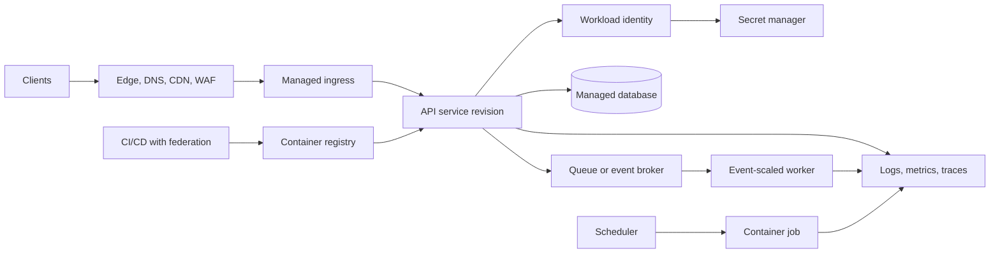
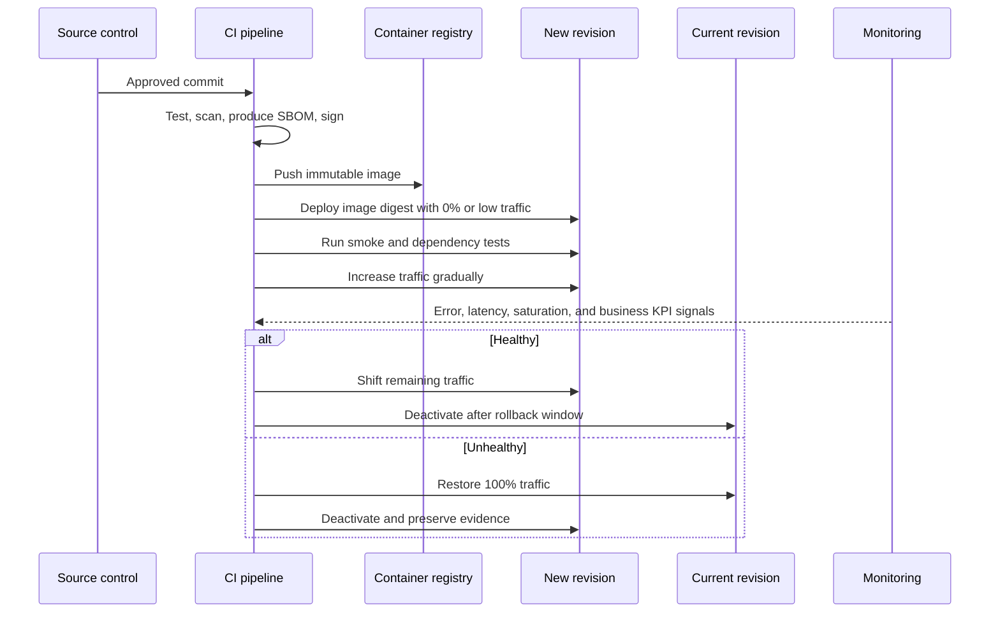

> **Document class:** Applications & Kubernetes implementation guide
> **Normative terms:** **MUST**, **MUST NOT**, **SHOULD**, **SHOULD NOT**, and **MAY** are requirements levels.
> **Applicability:** Serverless container workloads, revision-based delivery, networking, identity, scaling, cost, reliability, and operations.
> **Exception process:** Deviations require a documented risk assessment, compensating controls, named risk owner, and expiry date.

| Control field | Value |
|---|---|
| Document ID | `APP-03` |
| Owner | Cloud Center of Excellence |
| Review cycle | At least annually and after material cloud-service, container-platform, security, or operating-model changes |
| Evidence | Workload fit assessment, revision and traffic tests, identity and network configuration, cost review, and operational readiness evidence |

# Container Apps and Serverless Containers

> **Decision in brief:** Use serverless containers when managed execution reduces platform burden without hiding application responsibilities for identity, networking, scale, cost, and failure handling.

## Purpose

This standard defines when and how to use serverless container platforms. Azure Container Apps is the detailed reference implementation; AWS App Runner and Amazon ECS on AWS Fargate, Cloud Run, and OCI Container Instances are mapped by operating model.

Serverless containers remove node and cluster administration, but they do not remove application architecture responsibilities. Teams remain accountable for stateless design, identity, dependency protection, observability, cost controls, and failure handling.

## Suitable workloads

Serverless containers are a strong fit for:

- Stateless HTTP APIs and web services.
- Event-driven workers and queue consumers.
- Scheduled or on-demand jobs.
- Independently deployable microservices.
- Burst-oriented workloads that benefit from rapid elasticity or scale-to-zero.
- Containerized applications that do not require Kubernetes APIs or node-level control.

They are a poor fit for workloads requiring privileged containers, custom kernels, host networking, specialized storage semantics, unsupported protocols, strict fixed-host assumptions, or extensive Kubernetes extension points.

## Reference architecture

## Mandatory controls

1. Workloads **MUST** externalize durable state.
2. Images **MUST** be built once, scanned, signed where supported, retained, and deployed by immutable digest.
3. Workload identity **MUST** be used for cloud-service access when available.
4. Internet-facing services **MUST** use approved ingress, TLS, WAF, authentication, and rate-limiting controls appropriate to risk.
5. Private services **MUST** use private or internal ingress and validated private DNS/routing.
6. Minimum and maximum replica or instance limits **MUST** be configured explicitly.
7. Scale-to-zero **MUST NOT** be enabled for latency-sensitive services without measured cold-start acceptance.
8. Concurrency and request timeout values **MUST** be tested under realistic load.
9. Deployment revisions **MUST** be observable and rollback-capable.
10. Applications **MUST** handle termination signals and stop accepting work before shutdown.

## Azure Container Apps design

A Container Apps environment is the shared boundary for networking, observability integration, and certain platform capabilities. Applications within an environment require deliberate tenancy and blast-radius design.

### Revisions

A revision is an immutable snapshot of an application version and its configuration. Use single-revision mode for straightforward replacement releases. Use multiple-revision mode for canary, A/B, blue-green, or controlled rollback scenarios. Traffic weights must be declared and monitored.

### Scaling

Scaling may use HTTP concurrency, CPU/memory, or event-based signals through KEDA-compatible scalers. Scale rules must match the actual bottleneck. For queue workers, the scaling design must include queue depth, message age, processing time, visibility timeout, retry policy, poison-message handling, and downstream limits.

### Jobs

Use jobs for finite executions rather than forcing a continuously running service model. Jobs may be manual, scheduled, or event-driven. A job must be idempotent or have an explicit deduplication strategy.

### Dapr and service invocation

Dapr can standardize service invocation, pub/sub, state access, and secret interfaces, but it adds runtime dependencies and operational complexity. Use it only when multiple workloads benefit from the abstraction and the team can operate and troubleshoot it.

## Revision-based deployment

## Multi-cloud service mapping

| Capability | Azure | AWS | GCP | OCI |
|---|---|---|---|---|
| Serverless application container | Azure Container Apps | AWS App Runner | Cloud Run | OCI Container Instances |
| Serverless orchestrated tasks | Container Apps jobs | ECS tasks on Fargate / AWS Batch depending on workload | Cloud Run jobs | Container Instances plus scheduler/orchestration services |
| Managed Kubernetes alternative | AKS | EKS | GKE | OKE |
| Event-based scaling | KEDA-backed scale rules | Service autoscaling and event integrations | Cloud Run autoscaling and event integrations | Autoscaling requires service-specific architecture |
| Revision traffic split | Container Apps revisions | App Runner deployments or ALB/ECS deployment patterns | Cloud Run revisions | Pipeline/load-balancer strategy; no exact equivalent |
| Workload identity | Managed identity | IAM task role / service role | Service account | Resource principal or workload identity where supported |

The absence of an exact equivalent is material. OCI Container Instances, for example, provides serverless container compute but does not reproduce the complete revision-and-autoscaling model of Container Apps or Cloud Run.

## Network and ingress architecture

The design **MUST** classify each service as public, partner, internal, or platform-only. For each classification, define:

- Ingress exposure and authentication.
- TLS termination and certificate ownership.
- WAF and denial-of-service protections.
- Private DNS and service discovery.
- Outbound egress path and fixed-source-IP requirements.
- Access to private databases, caches, and messaging services.
- Cross-service authorization, not merely connectivity.

Do not expose every microservice publicly. Prefer a small number of controlled ingress points and authenticated internal service calls.

## Identity and secrets

Applications **MUST** use a distinct workload identity per service or per meaningful trust boundary. Shared identities produce excessive blast radius and weak auditability. Secrets should be fetched from an external secret manager by SDK, platform reference, or approved mounted-volume integration. Long-lived cloud access keys in environment variables are prohibited.

## Resource and cost governance

Serverless does not mean unbounded or automatically inexpensive. Each service must declare:

- CPU and memory allocation.
- Minimum instances for latency-sensitive services.
- Maximum instances to cap runaway cost and downstream load.
- Concurrency target based on measured application behavior.
- Request timeout and job execution timeout.
- Log volume limits and retention.
- Cost allocation labels/tags.

A maximum replica count is both a cost control and a dependency-protection control.

## Reliability requirements

- Applications must implement graceful shutdown.
- Health checks must not report ready before critical initialization completes.
- Retries must use bounded exponential backoff with jitter and must not multiply across layers.
- Queue consumers must be idempotent and support dead-letter handling.
- External calls must use timeouts and connection reuse.
- Critical services must define minimum warm capacity where cold starts violate the SLO.
- Regional recovery must be designed explicitly; platform autoscaling within one region is not disaster recovery.

## Observability

At minimum, collect:

- Requests, latency percentiles, errors, concurrency, instance count, cold starts where available, CPU, memory, restarts, and throttling.
- Queue depth, oldest-message age, processing rate, retry count, and dead-letter count for workers.
- Revision, image digest, configuration version, and deployment correlation.
- Distributed traces across ingress, service-to-service calls, messaging, and data dependencies.
- Business transaction indicators that reveal failure even when infrastructure metrics appear healthy.

## Environment boundary and tenancy design

A serverless container environment can become a shared blast radius for networking, observability, certificates, and platform configuration. The environment boundary must therefore align with trust, ownership, region, lifecycle, and cost requirements.

Separate environments when workloads require incompatible network exposure, administrative ownership, compliance controls, maintenance timing, or observability retention. A shared environment should have an explicit tenant model, naming standard, identity boundary, log-allocation model, and quota strategy. Do not assume that per-application revisions provide the same isolation as separate environments or accounts.

## Scale-rule engineering

A scaling rule must identify the work signal, target value, sampling behavior, activation threshold, cooldown, and failure mode. For HTTP services, validate the relationship between concurrency, CPU, memory, latency, and downstream connections. For event consumers, validate queue depth, oldest-message age, partition lag, processing time, visibility or lock duration, and redelivery behavior.

Scaling tests should answer four questions:

1. How quickly does capacity become ready after demand begins?
2. What maximum throughput can one instance sustain without violating the SLO?
3. What downstream limit is reached first as replicas increase?
4. What happens when the scaler cannot authenticate or retrieve its metric?

Minimum replicas must reflect latency and availability requirements. Maximum replicas must be derived from dependency capacity and cost limits, not set to an arbitrary high value.

## Job execution governance

Finite jobs require a separate operational contract from request-serving applications. Every production job should define:

- Trigger type and authorized trigger identities.
- Maximum execution duration, retry count, parallelism, and concurrent executions.
- Idempotency or deduplication key.
- Checkpoint location and restart behavior.
- Input and output data ownership.
- Cancellation and timeout behavior.
- Success, partial-success, and failure criteria.
- Retention of execution history, logs, and produced artifacts.

Scheduled jobs must state the timezone and daylight-saving behavior. Event-triggered jobs must bound execution fan-out so one burst cannot create uncontrolled cost or overload a dependency.

## Revision and configuration compatibility

A revision includes more than the image. Configuration, secret references, identity, scaling rules, and ingress settings can change behavior as materially as code. The release record should bind the image digest to the complete revision configuration.

During progressive delivery, verify:

- Old and new revisions can coexist safely.
- Message and database schemas are compatible.
- Session and cache keys do not cause cross-version corruption.
- Traffic weighting actually applies to the required hostname and path.
- Rollback restores both traffic and configuration.
- Deactivated revisions cannot continue background processing unexpectedly.

## Portability test boundary

Portability must be tested at the workload contract rather than inferred from the container image. The test should cover startup command, port binding, shutdown signal, writable paths, CPU architecture, identity acquisition, secret access, private networking, health probes, scaling semantics, request timeout, and job execution. Provider-specific ingress, event source, and revision behavior should be isolated in deployment configuration and documented as migration work.

## Common anti-patterns

- Choosing a serverless container platform for a stateful application without redesigning state management.
- Setting maximum replicas high enough to overwhelm a database.
- Relying on CPU-only scaling for I/O-bound or queue-driven workloads.
- Enabling scale-to-zero for interactive traffic without testing cold starts.
- Using mutable image tags.
- Treating built-in ingress authentication as complete business authorization.
- Deploying all services into one shared environment without trust-boundary analysis.
- Assuming provider platforms have equivalent networking and revision behavior.

## Validation

- [ ] The workload does not require Kubernetes APIs, privileged access, or node-level customization.
- [ ] Durable state is externalized and session state is handled explicitly.
- [ ] Image digest, vulnerability scan, SBOM, and provenance are retained.
- [ ] Public/private ingress classification and egress paths are documented.
- [ ] Workload identity and least-privilege access are configured per service.
- [ ] Concurrency, timeout, cold start, min/max scale, and dependency limits were load-tested.
- [ ] Revision rollout and rollback are automated and observable.
- [ ] Queue workers are idempotent and include retry/dead-letter controls.
- [ ] Regional recovery meets RTO and RPO.

## Related topics

- [Cloud Application Platform Selection](app-cloud-application-platform-selection.md)
- [Event-Driven Applications, Jobs, and Batch Processing](app-event-driven-applications-jobs-and-batch-processing.md)
- [Application Configuration and Secret Management](app-application-configuration-and-secret-management.md)
- [Resilience, Scaling, and Deployment Strategies](app-resilience-scaling-and-deployment-strategies.md)

## References

Use provider documentation as the source of truth for service limits, regional availability, supported versions, and feature behavior.
- [Azure Container Apps overview](https://learn.microsoft.com/en-us/azure/container-apps/overview)
- [Azure Container Apps revisions](https://learn.microsoft.com/en-us/azure/container-apps/revisions)
- [Azure Container Apps scaling](https://learn.microsoft.com/en-us/azure/container-apps/scale-app)
- [Azure Well-Architected guidance for Container Apps](https://learn.microsoft.com/en-us/azure/well-architected/service-guides/azure-container-apps)
- [AWS container-service decision guide](https://docs.aws.amazon.com/decision-guides/latest/containers-on-aws-how-to-choose/choosing-aws-container-service.html)
- [Cloud Run](https://cloud.google.com/run)
- [GCP: GKE and Cloud Run](https://docs.cloud.google.com/kubernetes-engine/docs/concepts/gke-and-cloud-run)
- [OCI Container Instances overview](https://docs.oracle.com/en-us/iaas/Content/container-instances/overview-of-container-instances.htm)
