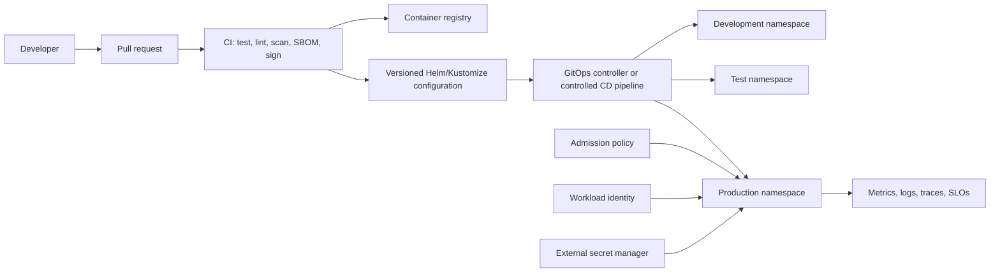
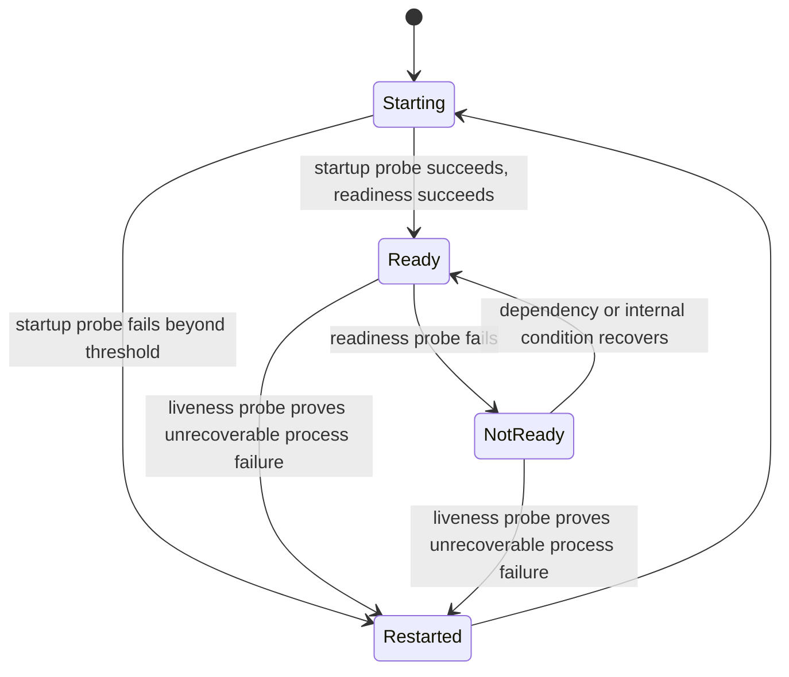

> **文档类型：** 应用和 Kubernetes 实施指南
> **规范性术语：** **MUST**、**MUST NOT**、**SHOULD**、**SHOULD NOT** 和 **MAY** 是要求级别。
> **适用范围：** AKS 工作负载打包、交付、升级、安全性、扩展、可观测性、事件、升级和退役。
> **例外流程：** 偏离要求需要记录风险评估、补偿控制、指定风险负责人和到期日期。

|控制领域|价值|
|---|---|
|文件编号 | `APP-05` |
|负责人|云卓越中心 |
|审核周期|至少每年一次，并且在云服务、Kubernetes、安全性或运营模型发生重大变化之后 |
|证据|工作负载清单一致性、部署和升级日志、SLO 证据、安全审查、事件测试和发布证据包 |

# 交付和操作 AKS 工作负载

> **简要决定：** 为每个工作负载提供一个可移植的 Kubernetes 契约，用于交付、运行状况、资源、身份、可观测性、扩展和安全操作。

## 目的

该标准定义了应用团队如何在 AKS 上打包、部署、保护、监控、扩展、升级和操作工作负载。它通过定义应用团队和平台团队之间的工作负载契约来补充集群平台标准。

工作负载契约可跨 AKS、EKS、GKE 和 OKE 移植，因为它主要依赖于 Kubernetes API 和云中立的交付控制。特定于云的身份、负载均衡、存储和机密集成仍然是显式扩展。

## 工作负载所有权模型

|责任|平台团队|应用团队|
|---|---|---|
|集群控制平面、节点池、CNI、共享入口、策略、日志管道 |负责任 |咨询 |
|命名空间、配额、服务账户、基线网络策略 |提供护栏|负责请求的配置 |
|应用镜像、清单/图表、探针、资源、扩缩容、SLO |提供标准|负责任 |
|数据架构和数据保护 |支持平台集成 |负责任 |
|事件响应 |平台事件|工作负载事件，在边界重叠的情况下进行联合响应 |
| Kubernetes/API 升级 |引领平台变革 |测试工作负载兼容性并进行修复 |

## 交付架构

## 强制工作负载清单基线

每个生产工作负载 **MUST** 定义（如应用）：

- 命名空间和所有权元数据。
- 专用 Kubernetes 服务账户。
- 适合执行语义的 Deployment、StatefulSet、Job 或 CronJob 控制器。
- 不可变的镜像摘要。
- CPU 和内存请求和限制。
- 具有不同目的的启动、就绪和活跃度探测。
- 安全上下文：非 root 用户、只读根文件系统（尽可能）、删除功能且无权限升级。
- 关键服务的最小副本数量和 PodDisruptionBudget。
- 故障域分布的拓扑扩展或反亲和力。
- 水平或事件驱动的自动扩缩容（如果合理）。
- 具有默认拒绝和显式流的网络策略。
- 用于非机密配置的 ConfigMap 和批准的机密外部机密集成。
- 仅在需要时提供服务和入口/网关对象。
- 应用、组件、版本、所有者、环境、成本中心和数据分类的标签。

## 探针设计

- **启动探针：** 保护缓慢的初始化免遭过早的活动重启。
- **就绪探针：** 控制 pod 是否接收流量。它可能包括关键依赖项准备情况，但必须避免在没有仔细设计的情况下在短暂的共享依赖项问题期间导致整个队列的删除。
- **活性探针：** 检测不重新启动就无法恢复的进程。它一定不是通用的深度依赖测试。

不正确的探测器可能会造成中断。必须对探测超时、阈值和端点进行负载测试。

## 资源管理

请求驱动调度和容量规划。限制会限制资源使用量，但也可能导致 CPU 限制或 OOM 终止。团队 **MUST** 使用测量的配置文件设置值，而不是复制默认值。

运营模式应包括：

- 来自实际测试和生产遥测的垂直分析。
- 命名空间配额和 LimitRanges。
- 保护成本和依赖性的最大自动扩缩容范围。
- 节点耗尽、升级和区域故障的余量。
- 优先级仅应用于明确合理的关键工作负载。
- 针对资源或安全特征不兼容的工作负载使用单独的节点池。

## 送货方式

### GitOps

GitOps 是声明性集群状态的首选。仓库是经过批准的期望状态日志记录，控制器负责协调漂移。应限制对集群的生产写入访问，以便紧急更改是例外、经过审核并立即向后移植。

### 受控流水线部署

当 GitOps 不适合时，流水线可以直接部署，但它必须使用联合非人类身份、范围命名空间权限、不可变制品、发布证据和回滚自动化。

### Helm 和 Kustomize

将 Helm 用于需要模板和发布元数据的可复用包。使用 Kustomize 进行基于覆盖的合成，并使用最少的模板。避免深度嵌套的抽象，这会导致渲染的资源难以查看。最终渲染的清单必须包含在放行证据中。

## 晋级模式

构建一次并在不同环境中晋级相同的镜像摘要。环境配置可能有所不同，但不得重建二进制制品。升级需要成功的自动化测试、策略评估、漏洞阈值、部署验证和适合风险的批准。

在滚动、金丝雀或蓝绿发布期间，数据库更改必须向后兼容先前的应用版本。破坏性的模式更改需要分阶段的扩展-迁移-契约过程。

## 部署策略

|战略|使用时 |必要的保障措施|
|---|---|---|
|滚动更新 |向后兼容的无状态服务的默认策略 |就绪性、激增/不可用限制、回滚 |
|金丝雀|通过有限的暴露和可度量的信号来降低风险 |流量控制、队列定义、自动分析 |
|蓝绿色|快速切换和回滚证明重复容量的合理性|数据/模式兼容性和会话处理 |
|重新创建 |工作负载无法同时运行两个版本 |批准停机并测试重启 |
|有状态分区部署 |有状态系统支持有序或分区变更 |数据保护和提供商特定程序 |

## 扩缩容

使用 Horizontal Pod Autoscaler 从 CPU、内存或自定义/外部指标进行副本扩展。对队列和流使用事件驱动的扩展。 Vertical Pod Autoscaler 可能会提供建议或受控更改，但团队必须了解其与中断和 HPA 的交互。

扩展规则必须基于受限资源。例如，对于消费者来说，队列深度通常比 CPU 更有意义。最大副本数必须反映数据库、缓存、API、许可和网络限制。

## 可靠性控制

- 关键服务的最少副本。
- PodDisruptionBudget 与副本数量和维护需求保持一致。
- 拓扑分布在区域/节点上。
- 优雅终止和足够的终止宽限期。
- 仅在必要且经过测试的情况下进行停车前处理。
- 重试请求和消息的幂等性。
- 具有抖动和显式超时的有限重试。
- 断路或减载，下游故障可能会级联。
- 异步工作的持久排队。
- 持久卷和应用数据的备份和恢复。

## 安全控制

- 以非 root 身份运行并禁止权限升级。
- 放弃除日志记录要求之外的所有 Linux 功能。
- 避免主机路径、主机网络、特权模式和主机 PID/IPC。
- 使用 seccomp 和批准的 pod 安全配置文件。
- 使用工作负载身份；不要挂载云密钥。
- 使用命名空间范围的 RBAC 和单独的服务账户。
- 通过 NetworkPolicy 限制东西向流量。
- 扫描镜像并执行批准的注册。
- 不断修补基础镜像和依赖项。
- 不要公开仪表板、指标、调试或执行器端点。

## 可观测性和 SLO

每项服务都必须为其关键用户旅程定义服务级别指标和目标。遥测必须包含版本和部署标识符。

最小工作负载信号：

- 请求率、延迟百分位数、错误、饱和度和依赖性结果。
- Pod 准备就绪、重新启动、OOM 终止、限制和挂起状态。
- HPA 所需/当前副本和规模限制事件。
- 异步服务的队列深度、消息期限、重试和死信计数。
- 检测逻辑上失败的事务的业务 KPI。
- 具有相关性和跟踪标识符的结构化日志。

告警应优先考虑 SLO 错误预算消耗、持续的用户影响和即将耗尽的容量。

## 事件和变更操作

Runbook 必须涵盖崩溃循环、镜像拉取错误、机密挂载失败、DNS 故障、资源耗尽、推出失败、终止卡住、入口故障、节点耗尽和不可用的依赖项。团队必须能够快速识别已部署的镜像摘要、配置修订、清单修订和最近的变更所有者。

紧急手动更改必须记录在案、有时间限制，并协调回源代码控制。

## 多云可移植边界

Kubernetes 工作负载基准具有广泛的可移植性。以下内容不会自动移植：

|能力|Azure|AWS | GCP |OCI |
|---|---|---|---|---|
|云工作负载身份 |内部工作负载 ID | EKS Pod 身份/IRSA | GKE 的工作负载身份联合 | OKE 工作负载身份 |
|外部机密存储| Key Vault CSI/提供商 |Secret Manager ASCP/CSI |Secret Manager 附加组件/CSI | OCI Vault 集成 |
|入口/负载均衡器 | Azure Load Balancer/Application Gateway 集成 | AWS 负载均衡器控制器 | GKE 入口/网关和 Cloud Load Balancing | OCI 原生入口/负载均衡器集成 |
|持久存储| Azure 磁盘/文件 CSI | EBS/EFS CSI |持久磁盘/文件存储 CSI |块卷/文件存储 CSI |
|容器注册表 | ACR |ECR |Artifact Registry | OCIR |

可移植性需要明确的抽象决策和测试；不能仅根据 YAML 语法来假定它。

## 工作负载一致性配置文件

平台团队应发布可机器测试的工作负载一致性配置文件。配置文件应包含架构验证、已弃用的 API 检查、策略测试、安全检查、资源要求、标签要求和部署策略约束。应用团队应该能够在入学前在本地和 CI 中运行相同的检查。

应根据渲染的资源评估一致性，而不仅仅是 Helm 模板或 Kustomize 基础。证据必须包括所有生成的对象以及用于生成它们的值或覆盖。

## 发布证据包

每个生产版本都应保留一个紧凑的证据包，其中包含：

- 源代码提交和批准的拉取请求。
- 镜像摘要、构建来源、SBOM 和漏洞结果。
- 渲染清单和配置修订。
- 策略和模式验证结果。
- 测试结果，包括冒烟测试和依赖性测试。
- 部署策略、部署状态和观测到的版本指标。
- 批准或自动入驻决策。
- 回滚目标和发布所有者。

证据应该允许事件响应者回答发生了什么变化，而无需从多个系统重建发布。

## 渐进式交付决策阈值

金丝雀和蓝绿版本需要预先定义的阈值。至少定义评估间隔、最小流量、错误率增量、延迟增量、饱和阈值、依赖性影响和业务事务成功标准。低流量会使金丝雀在统计上毫无意义；在这种情况下，请使用综合验证或特定于群组的验证，而不是从空仪表板中宣布成功。

自动回滚应仅限于误报风险较低且回滚路径安全的信号。数据迁移、消息发布和外部副作用可能导致回滚不完整。发布计划必须说明哪些影响是可逆的以及哪些需要提前恢复。

## 安全调试和临时访问

生产调试不得规范不受限制的 shell 访问。首选日志、跟踪、指标、临时容器、受控端口转发和只读诊断。当需要交互式访问时：

- 通过 MFA 使用命名的短期身份。
- 限制命名空间和动词权限。
- 记录事件或更改参考。
- 避免将机密或客户数据复制到本地设备。
- 自动使提升的访问权限失效。
- 将任何更改协调回声明性配置。

调试容器和工具必须来自批准的镜像，并且不得引入超出诊断需求的特权访问、包管理器或网络工具。

## 工作负载退役

删除工作负载的部署后，该工作负载并未停用。停用计划必须解决路由、DNS、证书、服务账户、联邦身份、角色分配、机密、队列、主题、数据库、持久卷、备份、仪表板、告警、GitOps 资源、成本分配和保留的审计证据。必须明确检查终结器和外部资源。数据保留和销毁需要所有者的批准和证据。

## 常见的反模式

- 无需请求和限制即可部署。
- 使用活性检查来测试每个下游依赖项。
- 运行数据库迁移是不受控制的应用启动副作用。
- 为每个环境建立一个新的镜像。
- 将 `cluster-admin` 授予部署流水线。
- 对整个命名空间使用一个服务账户。
- 将成功的推出状态视为应用正确性的证明。
- 自动扩展消费者而不考虑下游容量。
- 手动生产更改永远不会返回到源代码控制。
- 忽略弃用警告，直到集群升级失败。

## 验证

- [ ] 工作负载使用适当的 Kubernetes 控制器和私有服务账户。
- [ ] 呈现的清单通过架构、策略、安全性和弃用验证。
- [ ] 镜像是不可变的，根据需要进行扫描、签名，并且无需重建即可升级。
- [ ] 探针、资源、中断预算、拓扑和终止行为经过负载测试。
- [ ] 网络策略和工作负载身份强制执行最小特权。
- [ ] 部署和数据库更改与推出策略向后兼容。
- [ ] 自动扩缩容范围保护依赖性和成本。
- [ ] SLO、仪表板、告警、跟踪和运行手册可运行。
- [ ] 在平台版本更改之前测试升级兼容性。

## 相关主题

- [AKS 平台架构](app-aks-platform-architecture.md)
- [Kubernetes 应用安全和策略标准](app-kubernetes-application-security-and-policy-standards.md)
- [Kubernetes 可观测性和 OpenTelemetry 标准](app-kubernetes-observability-and-opentelemetry-standards.md)
- [Kubernetes 应用网络和网关架构](app-kubernetes-application-networking-and-gateway-architecture.md)

## 参考文档

使用提供商文档作为服务限制、区域可用性、支持的版本和功能行为的真实来源。
- [Kubernetes 部署](https://kubernetes.io/docs/concepts/workloads/controllers/deployment/)
- [Kubernetes 探针](https://kubernetes.io/docs/tasks/configure-pod-container/configure-liveness-readiness-startup-probes/)
- [Kubernetes 自动扩缩容工作负载](https://kubernetes.io/docs/concepts/workloads/autoscaling/)
- [Kubernetes 水平 Pod 自动扩缩容](https://kubernetes.io/docs/concepts/workloads/autoscaling/horizontal-pod-autoscale/)
- [Azure Kubernetes Service 文档](https://learn.microsoft.com/en-us/azure/aks/)
- [服务账户的 AWS IAM 角色](https://docs.aws.amazon.com/eks/latest/userguide/iam-roles-for-service-accounts.html)
- [GKE 工作负载身份联合](https://docs.cloud.google.com/kubernetes-engine/docs/how-to/workload-identity)
- [OCI OKE 工作负载身份](https://docs.oracle.com/en-us/iaas/Content/ContEng/Tasks/contenggrantingworkloadaccesstoresources.htm)
