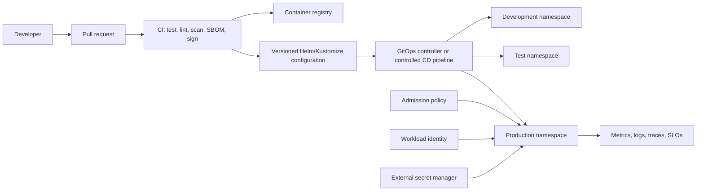
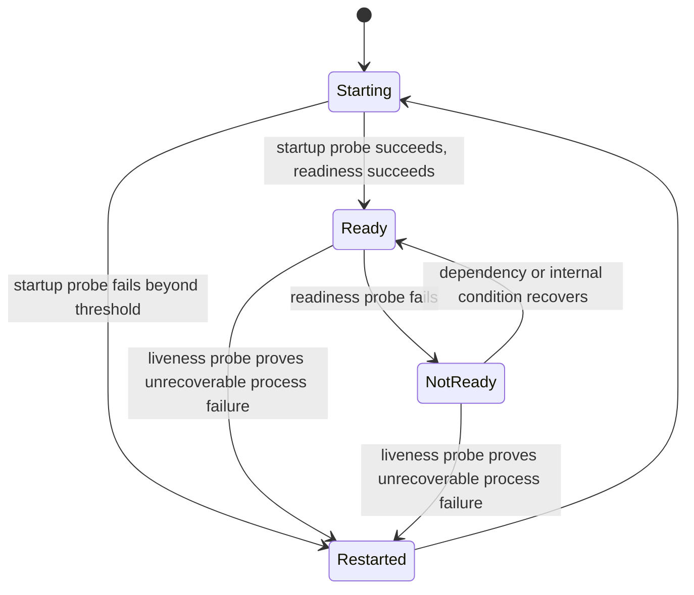

> **Document class:** Applications & Kubernetes implementation guide
> **Normative terms:** **MUST**, **MUST NOT**, **SHOULD**, **SHOULD NOT**, and **MAY** are requirements levels.
> **Applicability:** AKS workload packaging, delivery, promotion, security, scaling, observability, incidents, upgrades, and decommissioning.
> **Exception process:** Deviations require a documented risk assessment, compensating controls, named risk owner, and expiry date.

| Control field | Value |
|---|---|
| Document ID | `APP-05` |
| Owner | Cloud Center of Excellence |
| Review cycle | At least annually and after material cloud-service, Kubernetes, security, or operating-model changes |
| Evidence | Workload manifest conformance, deployment and promotion records, SLO evidence, security review, incident tests, and release evidence bundle |

# Delivering and Operating AKS Workloads

> **Decision in brief:** Give every workload a portable Kubernetes contract for delivery, health, resources, identity, observability, scaling, and safe operations.

## Purpose

This standard defines how application teams package, deploy, secure, observe, scale, upgrade, and operate workloads on AKS. It complements the cluster-platform standard by defining the workload contract between application teams and the platform team.

The workload contract is portable across AKS, EKS, GKE, and OKE because it relies primarily on Kubernetes APIs and cloud-neutral delivery controls. Cloud-specific identity, load balancing, storage, and secret integrations remain explicit extensions.

## Workload ownership model

| Responsibility | Platform team | Application team |
|---|---|---|
| Cluster control plane, node pools, CNI, shared ingress, policy, logging pipeline | Accountable | Consulted |
| Namespace, quota, service account, baseline network policy | Provides guardrails | Owns requested configuration |
| Application image, manifest/chart, probes, resources, scaling, SLO | Provides standards | Accountable |
| Data schema and data protection | Supports platform integrations | Accountable |
| Incident response | Platform incidents | Workload incidents, with joint response where boundaries overlap |
| Kubernetes/API upgrades | Leads platform change | Tests workload compatibility and remediates |

## Delivery architecture

## Mandatory workload manifest baseline

Every production workload **MUST** define, as applicable:

- Namespace and ownership metadata.
- Dedicated Kubernetes service account.
- Deployment, StatefulSet, Job, or CronJob controller appropriate to execution semantics.
- Immutable image digest.
- CPU and memory requests and limits.
- Startup, readiness, and liveness probes with distinct purposes.
- Security context: non-root user, read-only root filesystem where possible, dropped capabilities, and no privilege escalation.
- Minimum replica count and PodDisruptionBudget for critical services.
- Topology spread or anti-affinity for failure-domain distribution.
- Horizontal or event-driven autoscaling where justified.
- NetworkPolicy with default-deny and explicit flows.
- ConfigMap for non-secret configuration and approved external-secret integration for secrets.
- Service and ingress/gateway objects only when required.
- Labels for application, component, version, owner, environment, cost center, and data classification.

## Probe design

- **Startup probe:** Protects slow initialization from premature liveness restarts.
- **Readiness probe:** Controls whether the pod receives traffic. It may include critical dependency readiness but must avoid causing fleet-wide removal during a transient shared-dependency issue without careful design.
- **Liveness probe:** Detects a process that cannot recover without restart. It must not be a generic deep dependency test.

Incorrect probes can create outages. Probe timeouts, thresholds, and endpoints must be load-tested.

## Resource management

Requests drive scheduling and capacity planning. Limits constrain consumption but can also cause CPU throttling or OOM termination. Teams **MUST** set values using measured profiles, not copied defaults.

The operating model should include:

- Vertical profiling from realistic tests and production telemetry.
- Namespace quotas and LimitRanges.
- Maximum autoscale bounds that protect cost and dependencies.
- Headroom for node drain, upgrades, and zone failure.
- Priority classes only for clearly justified critical workloads.
- Separate node pools for workloads with incompatible resource or security characteristics.

## Delivery methods

### GitOps

GitOps is preferred for declarative cluster state. The repository is the approved desired-state record, and the controller reconciles drift. Production write access to the cluster should be restricted so emergency changes are exceptional, audited, and back-ported immediately.

### Controlled pipeline deployment

A pipeline may deploy directly when GitOps is unsuitable, but it must use a federated non-human identity, scoped namespace permissions, immutable artifacts, release evidence, and rollback automation.

### Helm and Kustomize

Use Helm for reusable packages requiring templating and release metadata. Use Kustomize for overlay-based composition with minimal templating. Avoid deeply nested abstractions that make rendered resources difficult to review. The final rendered manifest must be available in release evidence.

## Promotion model

Build once and promote the same image digest across environments. Environment configuration may differ, but the binary artifact must not be rebuilt. Promotion requires successful automated tests, policy evaluation, vulnerability thresholds, deployment verification, and approval appropriate to risk.

Database changes must be backward compatible with the preceding application version during rolling, canary, or blue-green releases. Destructive schema changes require a staged expand-migrate-contract process.

## Deployment strategies

| Strategy | Use when | Required safeguards |
|---|---|---|
| Rolling update | Default for backward-compatible stateless services | Readiness, surge/unavailable limits, rollback |
| Canary | Risk is reduced by limited exposure and measurable signals | Traffic control, cohort definition, automated analysis |
| Blue-green | Rapid cutover and rollback justify duplicate capacity | Data/schema compatibility and session handling |
| Recreate | Workload cannot run two versions concurrently | Approved outage and tested restart |
| Stateful partitioned rollout | Stateful system supports ordered or partitioned change | Data protection and vendor-specific procedure |

## Scaling

Use Horizontal Pod Autoscaler for replica scaling from CPU, memory, or custom/external metrics. Use event-driven scaling for queues and streams. Vertical Pod Autoscaler may provide recommendations or controlled changes, but teams must understand its interaction with disruption and HPA.

Scaling rules must be based on the constrained resource. For example, queue depth is often more meaningful than CPU for a consumer. Maximum replicas must reflect database, cache, API, licensing, and network limits.

## Reliability controls

- Minimum replicas for critical services.
- PodDisruptionBudget aligned with replica count and maintenance needs.
- Topology spread across zones/nodes.
- Graceful termination and sufficient termination grace period.
- Pre-stop handling only where necessary and tested.
- Idempotency for retried requests and messages.
- Bounded retries with jitter and explicit timeouts.
- Circuit breaking or load shedding where downstream failure could cascade.
- Durable queueing for asynchronous work.
- Backup and restore for persistent volumes and application data.

## Security controls

- Run as non-root and prohibit privilege escalation.
- Drop all Linux capabilities except documented requirements.
- Avoid hostPath, host networking, privileged mode, and host PID/IPC.
- Use seccomp and approved pod-security profiles.
- Use workload identity; do not mount cloud keys.
- Use namespace-scoped RBAC and separate service accounts.
- Restrict east-west traffic through NetworkPolicy.
- Scan images and enforce approved registries.
- Patch base images and dependencies continuously.
- Do not expose dashboards, metrics, debugging, or actuator endpoints publicly.

## Observability and SLOs

Every service must define service-level indicators and objectives for its critical user journeys. Telemetry must include version and deployment identifiers.

Minimum workload signals:

- Request rate, latency percentiles, errors, saturation, and dependency outcomes.
- Pod readiness, restarts, OOM kills, throttling, and pending state.
- HPA desired/current replicas and scale-limit events.
- Queue depth, message age, retry, and dead-letter count for asynchronous services.
- Business KPIs that detect logically failed transactions.
- Structured logs with correlation and trace identifiers.

Alerts should prioritize SLO burn, sustained user impact, and imminent capacity exhaustion.

## Incident and change operations

Runbooks must cover crash loops, image pull errors, failed secret mount, DNS failure, exhausted resources, failed rollout, stuck termination, ingress failure, node drain, and unavailable dependency. Teams must be able to identify the deployed image digest, configuration revision, manifest revision, and recent change owner rapidly.

Emergency manual changes must be recorded, time-limited, and reconciled back to source control.

## Multi-cloud portability boundary

The Kubernetes workload baseline is broadly portable. The following are not automatically portable:

| Capability | Azure | AWS | GCP | OCI |
|---|---|---|---|---|
| Cloud workload identity | Entra Workload ID | EKS Pod Identity / IRSA | Workload Identity Federation for GKE | OKE workload identity |
| External secret store | Key Vault CSI/provider | Secrets Manager ASCP/CSI | Secret Manager add-on/CSI | OCI Vault integration |
| Ingress/load balancer | Azure load balancer/Application Gateway integrations | AWS Load Balancer Controller | GKE Ingress/Gateway and Cloud Load Balancing | OCI native ingress/load balancer integrations |
| Persistent storage | Azure Disk/Files CSI | EBS/EFS CSI | Persistent Disk/Filestore CSI | Block Volume/File Storage CSI |
| Container registry | ACR | ECR | Artifact Registry | OCIR |

Portability requires explicit abstraction decisions and testing; it must not be assumed from YAML syntax alone.

## Workload conformance profile

The platform team should publish a machine-testable workload conformance profile. The profile should contain schema validation, deprecated-API checks, policy tests, security checks, resource requirements, label requirements, and deployment-strategy constraints. Application teams should be able to run the same checks locally and in CI before admission.

Conformance should be evaluated against the rendered resources, not only Helm templates or Kustomize bases. The evidence must include all generated objects and the values or overlays used to produce them.

## Release evidence bundle

Every production release should retain a compact evidence bundle containing:

- Source commit and approved pull request.
- Image digest, build provenance, SBOM, and vulnerability result.
- Rendered manifests and configuration revision.
- Policy and schema-validation results.
- Test results, including smoke and dependency tests.
- Deployment strategy, rollout status, and observed version metrics.
- Approval or automated gate decision.
- Rollback target and release owner.

The evidence should allow an incident responder to answer what changed without reconstructing the release from several systems.

## Progressive-delivery decision thresholds

Canary and blue-green releases require pre-defined thresholds. At minimum, define the evaluation interval, minimum traffic volume, error-rate delta, latency delta, saturation threshold, dependency impact, and business-transaction success criteria. Low traffic can make a canary statistically meaningless; in that case, use synthetic or cohort-specific validation rather than declaring success from an empty dashboard.

Automatic rollback should be limited to signals with a low false-positive risk and a safe rollback path. Data migrations, message publication, and external side effects can make rollback incomplete. The release plan must state which effects are reversible and which require forward recovery.

## Safe debugging and ephemeral access

Production debugging must not normalize unrestricted shell access. Prefer logs, traces, metrics, ephemeral containers, controlled port forwarding, and read-only diagnostics. When interactive access is required:

- Use named, short-lived identity with MFA.
- Restrict namespace and verb permissions.
- Record the incident or change reference.
- Avoid copying secrets or customer data to local devices.
- Expire elevated access automatically.
- Reconcile any change back to declarative configuration.

Debug containers and tools must come from approved images and must not introduce privileged access, package managers, or network tools beyond the diagnosed need.

## Workload decommissioning

A workload is not decommissioned when its Deployment is deleted. The retirement plan must address routes, DNS, certificates, service accounts, federated identities, role assignments, secrets, queues, topics, databases, persistent volumes, backups, dashboards, alerts, GitOps resources, cost allocations, and retained audit evidence. Finalizers and external resources must be checked explicitly. Data retention and destruction require owner approval and evidence.

## Common anti-patterns

- Deploying without requests and limits.
- Using liveness checks to test every downstream dependency.
- Running database migrations as an uncontrolled application startup side effect.
- Building a new image for each environment.
- Granting `cluster-admin` to deployment pipelines.
- Using one service account for an entire namespace.
- Treating a successful rollout status as proof of application correctness.
- Autoscaling consumers without considering downstream capacity.
- Manual production changes that never return to source control.
- Ignoring deprecation warnings until a cluster upgrade fails.

## Validation

- [ ] The workload uses an appropriate Kubernetes controller and dedicated service account.
- [ ] Rendered manifests pass schema, policy, security, and deprecation validation.
- [ ] Images are immutable, scanned, signed where required, and promoted without rebuild.
- [ ] Probes, resources, disruption budgets, topology, and termination behavior are load-tested.
- [ ] Network policies and workload identity enforce least privilege.
- [ ] Deployment and database changes are backward compatible with the rollout strategy.
- [ ] Autoscaling bounds protect dependencies and cost.
- [ ] SLOs, dashboards, alerts, traces, and runbooks are operational.
- [ ] Upgrade compatibility is tested before platform version changes.

## Related topics

- [AKS Platform Architecture](app-aks-platform-architecture.md)
- [Kubernetes Application Security and Policy Standards](app-kubernetes-application-security-and-policy-standards.md)
- [Kubernetes Observability and OpenTelemetry Standards](app-kubernetes-observability-and-opentelemetry-standards.md)
- [Kubernetes Application Networking and Gateway Architecture](app-kubernetes-application-networking-and-gateway-architecture.md)

## References

Use provider documentation as the source of truth for service limits, regional availability, supported versions, and feature behavior.
- [Kubernetes Deployments](https://kubernetes.io/docs/concepts/workloads/controllers/deployment/)
- [Kubernetes probes](https://kubernetes.io/docs/tasks/configure-pod-container/configure-liveness-readiness-startup-probes/)
- [Kubernetes autoscaling workloads](https://kubernetes.io/docs/concepts/workloads/autoscaling/)
- [Kubernetes Horizontal Pod Autoscaling](https://kubernetes.io/docs/concepts/workloads/autoscaling/horizontal-pod-autoscale/)
- [Azure Kubernetes Service documentation](https://learn.microsoft.com/en-us/azure/aks/)
- [AWS IAM roles for service accounts](https://docs.aws.amazon.com/eks/latest/userguide/iam-roles-for-service-accounts.html)
- [GKE Workload Identity Federation](https://docs.cloud.google.com/kubernetes-engine/docs/how-to/workload-identity)
- [OCI OKE workload identity](https://docs.oracle.com/en-us/iaas/Content/ContEng/Tasks/contenggrantingworkloadaccesstoresources.htm)
