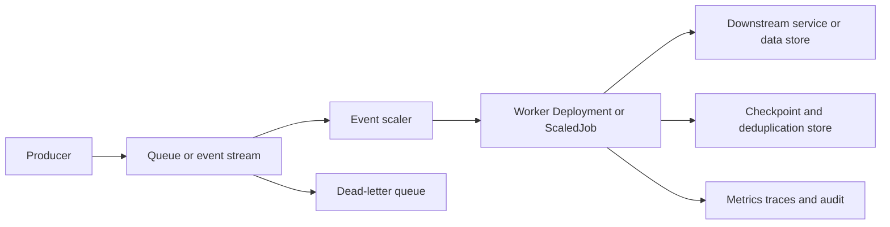

> **文档类型：** 应用和 Kubernetes 实施指南
> **规范性术语：** **MUST**、**MUST NOT**、**SHOULD**、**SHOULD NOT** 和 **MAY** 是要求级别。
> **适用范围：** 事件驱动的应用、作业、批处理、交付语义、重播、分区、扩展和故障处理。
> **例外流程：** 偏离要求需要记录风险评估、补偿控制、指定风险负责人和到期日期。

|控制领域|价值|
|---|---|
|文件编号 | `APP-18` |
|负责人|云卓越中心 |
|审核周期|至少每年一次，并且在云服务、消息传递、安全性或运营模式发生重大变化之后 |
|证据|模式和交付契约、幂等性和重放测试、检查点日志、毒消息处理和操作验收证据 |

# 事件驱动的应用、作业和批处理

> **简要决策：** 在扩展事件或批量工作负载之前，明确传递语义、幂等性、并发性、检查点、重播和毒消息处理。

## 目的

事件驱动和批处理工作负载的失败与请求驱动的服务不同。正确的设计需要显式的交付语义、幂等性、并发性、检查点、毒消息处理、扩展、完成和成本控制。

## 参考架构

## 工作负载选择

|模式|使用时 |主控|
|---|---|---|
|长时间运行的工作线程部署 |持续队列消费 |优雅关闭和自动扩缩容 |
| Kubernetes 工作 |有限执行|完成、重试、超时和清理 |
|计划任务 |预定执行 |并发和误点策略 |
|事件规模的工作 |每次执行一个或有限的事件 |启动延迟和作业爆炸控制|
|托管功能或批量服务 |最小编排或专门计算 |提供商限制和可移植性 |

## 传递语义

假设至少交付一次，除非整个系统证明并非如此。消费者必须是幂等的或使用由稳定事件标识符作为键控的重复数据删除。仅在持久完成后才确认。定义排序、分区、重播、保留和模式兼容性。

恰好一次语义通常只在有限范围内应用。记录跨队列、工作线程、数据库和外部副作用的行为。

## 岗位标准

- 显式设置 `backoffLimit`、`activeDeadlineSeconds`、完成模式、并行性和完成。
- 使用 `ttlSecondsAfterFinished` 或受控清理来完成作业。
- 绑定日志和临时数据。
- 在宽限期到期之前处理终止信号和检查点。
- 仅当工作分区稳定且可独立恢复时才使用索引作业。
- 保持作业容器不可变且非交互。

CronJobs 必须设置支持的时区、并发策略、开始截止时间行为、历史记录限制以及重复或延迟执行的幂等性。

## 事件驱动的自动扩缩容

从队列深度、延迟、最旧消息年龄或其他工作负载信号进行扩展，而不仅仅是 CPU。 KEDA 或提供商原生服务可以将外部指标映射到 Deployment、StatefulSet 或 Job。

定义最小和最大副本、轮询间隔、冷却时间、激活阈值、回退行为和身份验证。扩展到零可以节省成本，但会增加冷启动延迟，并且可以隐藏损坏的身份验证，直到工作到达。

## 背压和故障处理

- 根据下游容量限制并发数。
- 使用带有抖动的指数退避来处理瞬时故障。
- 不要无限期地重试永久验证或授权失败。
- 将毒消息移至带有原因和尝试历史记录在案的死信目的地。
- 通过重复数据删除和审核提供受控重播。
- 对最旧消息年龄、滞后增长、重复失败和死信量发出告警。

## 架构和兼容性

使用版本化事件契约和兼容性策略。消费者应该容忍新增字段，并在生产者依赖新的必需行为之前推出。保留契约测试的代表性事件，而不暴露敏感数据。

## 多云映射

|能力|Azure|AWS | GCP |OCI |
|---|---|---|---|---|
|消息 |Service Bus/Event Hubs| SQS / SNS / Kinesis |发布/订阅 |队列/流|
|管理批次| Azure Batch/Container Apps jobs | AWS Batch / ECS 任务 |批处理/Cloud Run jobs | OCI Batch / Container Instances |
|Kubernetes | AKS | EKS | GKE |无完全等效项|
保持事件契约、幂等性、遥测和故障规则与云无关。在特定于环境的配置中隔离提供商身份验证和Scaler 元数据。

## 安全控制

使用单独的发布、使用、死信和重播权限。使用工作负载身份进行身份验证。加密传输中和静态的事件，最大限度地减少敏感负载，验证不受信任的内容，并限制谁可以触发批量重放。

## 命令、事件、流的区别

契约应区分：

- **命令：** 对特定消费者执行操作的请求。它可能会被拒绝，并且往往有明确的成功或失败结果。
- **事件：**已经发生的事实。消费者不应改变事件的含义，可以独立处理。
- **流日志记录：** 分区日志中的有序项。处理位置、重播和保留是核心问题。

混淆这些模型会导致所有权和重试行为不明确。命令不应作为不可变的事实进行广播，并且事件使用者不应假设它是唯一的接收者。

## 事务一致性和副作用

数据库更新和消息发布通常是单独的事务。当事务发件箱、变更数据采集模式或其他发布机制都必须可靠成功时，请使用这两种机制。消费者方面可以使用收件箱或重复数据删除表来确保重复投递的安全。

在持久业务完成之前不要确认消息。在未确认锁更新和重新交付行为的情况下，请勿在无限制的外部工作中持有代理锁。支付、电子邮件或第三方 API 调用等外部副作用需要幂等密钥或协调。

## 分区和并发

分区键决定排序、并行性和热点风险。从业务订购需求中选择密钥，而不是单独随机分配。记录最大有用的消费者并发度、分区数量、重新平衡行为以及当一个分区变慢或出现无法处理的事件时会发生什么。

增加超出分区数量的副本可能会增加成本而不增加吞吐量。增加分区计数可能会改变排序和恢复行为，应将其视为架构更改。

## 批量分区和检查点

大型作业应将工作划分为稳定的、可独立重试的单元。每个单元应记录输入范围、代码和配置版本、检查点、尝试、输出位置和完成状态。检查点必须持久且足够原子地写入，以区分已完成的工作和部分工作。

避免单个协调器成为不受保护的瓶颈。在需要协调员的情况下，定义领导者选举、状态恢复和重复提交处理。

## 重放和再处理治理

重放可以产生合法的重复项和大量的下游负载。需要授权操作员、有限时间范围或事件集、试运行估计、目标环境、速率限制、重复数据删除计划和审计日志记录。将重放权限与普通消费分开。
在重播之前，验证架构、代码、参考数据和下游副作用是否仍然与历史事件匹配。根据当前的业务规则，技术上有效的旧消息在语义上可能不安全。

## 操作验收标准

生产准备情况应包括重复交付、无序交付、延迟交付、副作用后但确认前的消费者崩溃、代理中断、依赖项限制、毒消息、积压重放、Scaler 故障、节点耗尽和凭证轮换的测试。测量最大可信恢复场景下的积压排空时间和成本。

## 验证

- [ ] 记录交付、排序、保留和确认语义。
- [ ] 消费者是幂等的或使用持久重复数据删除。
- [ ] 作业重试、超时、并行性和清理是有限的。
- [ ] 自动扩缩容遵循工作负载信号和下游容量。
- [ ] 毒消息进入可监控的死信路径。
- [ ] 重播受到控制、测试和审核。
- [ ] 事件模式具有兼容性和所有权规则。
- [ ] 测试关闭、节点耗尽、队列中断和依赖失败。
- [ ] 工作负载身份使用最小权限。
- [ ] 监控滞后、时效、成功、失败、成本和饱和度。

## 操作注意事项

容量计划必须包括突发大小、分区计数、使用者启动时间、处理持续时间、下游限制和重播量。运行手册应涵盖卡住的分区、重复效应、积压耗尽、无法处理的事件、Scaler 故障、凭证轮换和安全暂停。

## 相关主题

- [Container Apps 和无服务器容器](app-container-apps-and-serverless-containers.md)
- [弹性、扩展和部署策略](app-resilience-scaling-and-deployment-strategies.md)
- [Kubernetes 可观测性和 OpenTelemetry 标准](app-kubernetes-observability-and-opentelemetry-standards.md)
- [应用配置与机密管理](app-application-configuration-and-secret-management.md)

## 参考文档

- [Kubernetes：工作](https://kubernetes.io/docs/concepts/workloads/controllers/job/)
- [Kubernetes：CronJobs](https://kubernetes.io/docs/concepts/workloads/controllers/cron-jobs/)
- [Kubernetes：自动扩缩容工作负载](https://kubernetes.io/docs/concepts/workloads/autoscaling/)
- [科达文档](https://keda.sh/docs/)
- [CloudEvents 规范](https://cloudevents.io/)
