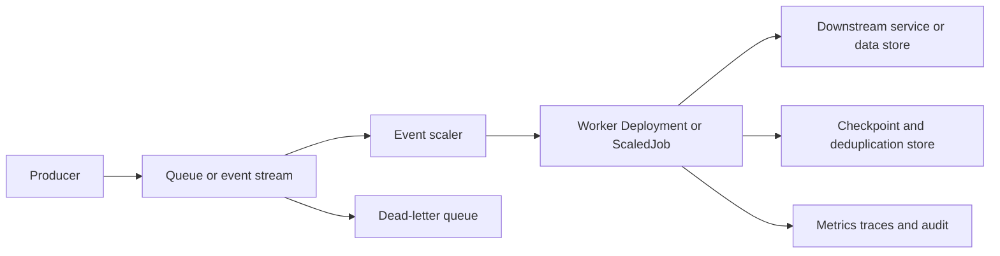

> **Document class:** Applications & Kubernetes implementation guide
> **Normative terms:** **MUST**, **MUST NOT**, **SHOULD**, **SHOULD NOT**, and **MAY** are requirements levels.
> **Applicability:** Event-driven applications, jobs, batch processing, delivery semantics, replay, partitioning, scaling, and failure handling.
> **Exception process:** Deviations require a documented risk assessment, compensating controls, named risk owner, and expiry date.

| Control field | Value |
|---|---|
| Document ID | `APP-18` |
| Owner | Cloud Center of Excellence |
| Review cycle | At least annually and after material cloud-service, messaging, security, or operating-model changes |
| Evidence | Schema and delivery contract, idempotency and replay tests, checkpoint records, poison-message handling, and operational acceptance evidence |

# Event-Driven Applications, Jobs, and Batch Processing

> **Decision in brief:** Make delivery semantics, idempotency, concurrency, checkpointing, replay, and poison-message handling explicit before scaling event or batch workloads.

## Purpose

Event-driven and batch workloads fail differently from request-driven services. Correct design requires explicit delivery semantics, idempotency, concurrency, checkpointing, poison-message handling, scaling, completion, and cost controls.

## Reference architecture

## Workload selection

| Pattern | Use when | Main control |
|---|---|---|
| Long-running worker Deployment | Continuous queue consumption | Graceful shutdown and autoscaling |
| Kubernetes Job | Finite execution | Completion, retry, timeout, and cleanup |
| CronJob | Scheduled execution | Concurrency and missed-schedule policy |
| Event-scaled Job | One or bounded events per execution | Startup latency and job explosion control |
| Managed function or batch service | Minimal orchestration or specialized compute | Provider limits and portability |

## Delivery semantics

Assume at-least-once delivery unless the complete system proves otherwise. Consumers must be idempotent or use deduplication keyed by a stable event identifier. Acknowledge only after durable completion. Define ordering, partitioning, replay, retention, and schema compatibility.

Exactly-once claims usually apply within a limited boundary. Document behavior across queue, worker, database, and external side effects.

## Job standards

- Set `backoffLimit`, `activeDeadlineSeconds`, completion mode, parallelism, and completions explicitly.
- Use `ttlSecondsAfterFinished` or governed cleanup for completed Jobs.
- Bound logs and temporary data.
- Handle termination signals and checkpoint before the grace period expires.
- Use indexed Jobs only when work partitions are stable and independently recoverable.
- Keep job containers immutable and non-interactive.

CronJobs must set timezone where supported, concurrency policy, starting-deadline behavior, history limits, and idempotency for duplicate or delayed execution.

## Event-driven autoscaling

Scale from queue depth, lag, oldest-message age, or another workload signal rather than CPU alone. KEDA or provider-native services can map external metrics to Deployments, StatefulSets, or Jobs.

Define minimum and maximum replicas, polling interval, cooldown, activation threshold, fallback behavior, and authentication. Scaling to zero saves cost but increases cold-start latency and can hide broken authentication until work arrives.

## Backpressure and failure handling

- Limit concurrency according to downstream capacity.
- Use exponential backoff with jitter for transient failures.
- Do not retry permanent validation or authorization failures indefinitely.
- Move poison messages to a dead-letter destination with reason and attempt history.
- Provide controlled replay with deduplication and audit.
- Alert on oldest-message age, lag growth, repeated failure, and dead-letter volume.

## Schema and compatibility

Use a versioned event contract and compatibility policy. Consumers should tolerate additive fields and roll out before producers depend on new required behavior. Retain representative events for contract tests without exposing sensitive data.

## Multi-cloud mapping

| Capability | Azure | AWS | GCP | OCI |
|---|---|---|---|---|
| Messaging | Service Bus / Event Hubs | SQS / SNS / Kinesis | Pub/Sub | Queue / Streaming |
| Managed batch | Azure Batch / Container Apps Jobs | AWS Batch / ECS tasks | Batch / Cloud Run Jobs | OCI Batch / Container Instances |
| Kubernetes | AKS | EKS | GKE | OKE |

Keep event contracts, idempotency, telemetry, and failure rules cloud-neutral. Isolate provider authentication and scaler metadata in environment-specific configuration.

## Security controls

Use separate publish, consume, dead-letter, and replay permissions. Authenticate with workload identity. Encrypt events in transit and at rest, minimize sensitive payloads, validate untrusted content, and restrict who can trigger bulk replay.

## Command, event, and stream distinction

The contract should distinguish:

- **Command:** A request for a specific consumer to perform an action. It may be rejected and often has a clear success or failure result.
- **Event:** A fact that already occurred. Consumers should not change the meaning of the event and may process it independently.
- **Stream record:** An ordered item in a partitioned log. Processing position, replay, and retention are central concerns.

Confusing these models creates unclear ownership and retry behavior. A command should not be broadcast as an immutable fact, and an event consumer should not assume it is the only recipient.

## Transactional consistency and side effects

A database update and message publication are usually separate transactions. Use a transactional outbox, change-data-capture pattern, or another documented mechanism when both must succeed reliably. The consumer side may use an inbox or deduplication table to make repeated delivery safe.

Do not acknowledge a message before durable business completion. Do not hold a broker lock across unbounded external work without confirming lock-renewal and redelivery behavior. External side effects such as payment, email, or third-party API calls need idempotency keys or reconciliation.

## Partitioning and concurrency

Partition keys determine ordering, parallelism, and hot-spot risk. Select keys from business ordering requirements, not random distribution alone. Record the maximum useful consumer concurrency, number of partitions, rebalancing behavior, and what happens when one partition is slow or poisoned.

Increasing replicas beyond partition count may add cost without throughput. Increasing partition count may change ordering and recovery behavior and should be treated as an architectural change.

## Batch partitioning and checkpointing

Large jobs should divide work into stable, independently retryable units. Each unit should record input range, code and configuration version, checkpoint, attempt, output location, and completion status. Checkpoints must be durable and written atomically enough to distinguish completed work from partial work.

Avoid a single coordinator becoming an unprotected bottleneck. Where a coordinator is required, define leader election, state recovery, and duplicate-submission handling.

## Replay and reprocessing governance

Replay can produce legitimate duplicates and large downstream load. Require an authorized operator, bounded time range or event set, dry-run estimate, target environment, rate limit, deduplication plan, and audit record. Separate replay permissions from ordinary consumption.

Before replay, verify whether schemas, code, reference data, and downstream side effects still match the historical event. A technically valid old message can be semantically unsafe under current business rules.

## Operational acceptance criteria

Production readiness should include tests for duplicate delivery, out-of-order delivery, delayed delivery, consumer crash after side effect but before acknowledgement, broker outage, dependency throttling, poison message, backlog replay, scaler failure, node drain, and credential rotation. Measure backlog drain time and cost under the largest credible recovery scenario.

## Validation

- [ ] Delivery, ordering, retention, and acknowledgement semantics are documented.
- [ ] Consumers are idempotent or use durable deduplication.
- [ ] Job retry, timeout, parallelism, and cleanup are bounded.
- [ ] Autoscaling follows workload signals and downstream capacity.
- [ ] Poison messages enter an observable dead-letter path.
- [ ] Replay is controlled, tested, and audited.
- [ ] Event schemas have compatibility and ownership rules.
- [ ] Shutdown, node drain, queue outage, and dependency failure are tested.
- [ ] Workload identities use least privilege.
- [ ] Lag, age, success, failure, cost, and saturation are monitored.

## Operational considerations

Capacity plans must include burst size, partition count, consumer startup time, processing duration, downstream limits, and replay volume. Runbooks should cover stuck partitions, duplicate effects, backlog drain, poison events, scaler failure, credential rotation, and safe suspension.

## Related topics

- [Container Apps and Serverless Containers](app-container-apps-and-serverless-containers.md)
- [Resilience, Scaling, and Deployment Strategies](app-resilience-scaling-and-deployment-strategies.md)
- [Kubernetes Observability and OpenTelemetry Standards](app-kubernetes-observability-and-opentelemetry-standards.md)
- [Application Configuration and Secret Management](app-application-configuration-and-secret-management.md)

## References

- [Kubernetes: Jobs](https://kubernetes.io/docs/concepts/workloads/controllers/job/)
- [Kubernetes: CronJobs](https://kubernetes.io/docs/concepts/workloads/controllers/cron-jobs/)
- [Kubernetes: Autoscaling workloads](https://kubernetes.io/docs/concepts/workloads/autoscaling/)
- [KEDA documentation](https://keda.sh/docs/)
- [CloudEvents specification](https://cloudevents.io/)
