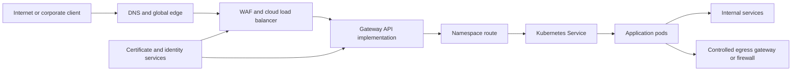

> **文档类型：** 应用与 Kubernetes 架构参考模型
> **规范性术语：** **MUST**、**MUST NOT**、**SHOULD**、**SHOULD NOT** 和 **MAY** 是要求级别。
> **适用范围：** Kubernetes 入口和网关 API、服务发现、TLS、网络策略、出口、DNS 和跨云提供商的流量所有权。
> **例外流程：** 偏离要求需要记录风险评估、补偿控制、指定风险负责人和到期日期。

|控制领域|价值|
|---|---|
|文件编号 | `APP-10` |
|负责人|云卓越中心 |
|审核周期|至少每年一次，并且在云服务、Kubernetes、网络、安全或运营模型发生重大变化之后 |
|证据|网络和网关设计、路由和 DNS 测试、证书日志、策略验证、流量测试和故障排除证据 |

# Kubernetes 应用网络和网关架构

> **简要决定：** 分离边缘、网关、服务、pod、出口和安全所有权，以便应用流量保持可移植、可检查和可恢复。

## 目的

本文定义了 Kubernetes 的可移植应用网络模型。它将云边缘、集群网关、服务发现、pod 流量、出口和安全所有权分开，因此应用可以跨 AKS、EKS、GKE、OKE 和一致平台移动，而无需采用相同的提供商实现。

## 参考架构

## 架构原则

- 将基础设施所有权与应用路由所有权分开。
- 优先选择私有集群和私有服务暴露，除非需要公共访问。
- 使用网关 API 进行新的 HTTP 和 TCP 路由设计，其中所选实现支持所需的功能。
- 仅出于既定的兼容性需求而保留 Ingress；它的 API 稳定但冻结了。
- 应用默认拒绝网络策略并明确授权流。
- 集中公共证书、WAF 策略、日志记录和 DDoS 控制。
- 避免通过非托管 `NodePort` 服务暴露工作负载。

## 服务发现

使用 Kubernetes 服务和集群 DNS 实现稳定的集群内发现。应用应该容忍端点更改、DNS 缓存行为、连接耗尽以及暂时缺少就绪端点。

仅当客户端需要直接端点发现时才使用无头服务。不依赖集群外部的 Pod IP 地址。当协议和探测器共享服务定义时，通过有意义的名称定义端口。

## 网关 API 设计

网关 API 区分角色：

- `GatewayClass`：平台选择的实现。
- `Gateway`：基础设施和侦听器策略。
- 路由资源：允许的命名空间和主机名内由应用负责的路由。
- 参考策略：显式跨命名空间授权。

这种分离优于共享平台的控制器特定注释。限制哪些命名空间可以附加路由、强制主机名所有权并限制允许的路由种类。

## 入口迁移

清单入口类、注释、TLS 行为、重写规则、运行状况检查、超时、源 IP 要求和特定于控制器的功能。一次迁移一个主机名或服务，并在切换 DNS 或负载均衡器流量之前比较路由、证书、标头、状态代码和遥测数据。

当语义不同时，不要机械地翻译注释。维护经过测试的回滚路径，直到网关行为得到验证。

## TLS 和证书控制

- 根据组织策略使用 TLS 1.2 或更高版本。
- 通过批准的颁发者自动颁发和轮换证书。
- 定义 TLS 是否在边缘、网关、sidecar 或应用处终止。
- 跨越信任边界时重新加密流量。
- 保护 Secret Manager 或批准的证书控制器中的私钥。
- 监控过期、颁发失败、主机名不匹配和弱密码配置。

## 网络策略基线

每个应用命名空间都应以默认拒绝入口和出口开始。添加明确的规则：

- DNS 解析。
- 网关到应用的流量。
- 应用到数据库和应用到服务的依赖关系。
- 遥测导出。
- 批准的控制平面或机密服务访问。
- 通过受控出口所需的外部 API。

测试策略强制执行，因为即使网络插件不强制执行，Kubernetes API 也可以接受 NetworkPolicy 资源。

## 出口架构
识别需要稳定源地址、域过滤、TLS 检查、私有端点或互联网访问的工作负载。根据需要通过防火墙、NAT 网关、代理或服务网格出口控制路由敏感出口。

基于 DNS 的允许列表有局限性，因为解析的地址可能会更改，并且加密协议会隐藏主机名。更喜欢云服务的私有服务端点和基于身份的授权。

## 多云映射

|层 |Azure|AWS | GCP |OCI |
|---|---|---|---|---|
|全球边缘|Front Door/Traffic Manager| CloudFront/Route 53 |Cloud Load Balancing/Cloud DNS |Traffic Management/DNS |
| WAF | Web 应用防火墙 | AWS WAF |Cloud Armor| Web 应用防火墙 |
|Kubernetes | AKS | EKS | GKE |无完全等效项|
|私有服务接入 |私有链接 |私有链接 |私有服务连接 |私有端点|
|出口 | NAT 网关/防火墙 | NAT 网关/网络防火墙|云 NAT/防火墙策略| NAT 网关/网络防火墙|

提供商控制器不得要求应用团队负责云范围的网络权限。

## 可用性和性能

跨区域和节点运行网关副本、设置中断预算、保留容量并测试控制器升级。根据应用行为定义连接、请求、空闲和耗尽超时。监控饱和度、拒绝的连接、DNS 延迟、TLS 错误、重试和端点准备情况。

避免跨客户端、网关、网格和应用层的重试放大。仅重试具有有限尝试和抖动的安全操作。

## 流量归属模型

流量配置应分隔四个所有权层：

|层 |典型负责人|控制对象|
|---|---|---|
|全球边缘和 DNS |网络或平台团队|公共 DNS、CDN、DDoS、WAF、全球路由|
|集群网关基础设施|平台团队| GatewayClass、网关、负载均衡器、共享证书 |
|应用路由 |护栏内的应用团队| HTTPRoute、GRPCRoute、TCPRoute、主机名和路径规则 |
|服务和 Pod 连接 |应用和平台团队|服务、网络策略、服务到服务授权 |

平台必须防止路由附加到未经授权的网关、主机名、命名空间或后端。应用团队不需要云范围的负载均衡器或网络权限来发布路由。

## 网关 API 策略和委托

对于网关 API 采用，定义允许的路由命名空间、主机名所有权、侦听器策略、TLS 证书源、跨命名空间引用规则、后端协议、超时行为和状态条件监控。对跨命名空间引用使用引用授予或等效的显式授权。

特定于实现的功能应隔离在记录在案的策略或扩展资源后面。不要在不透明注释中隐藏关键行为，而不影响所有权和可移植性。一致性配置文件因实现而异，因此必须测试所需的功能，而不是根据 API 的存在进行假设。

## DNS、地址族和服务发现
该架构必须定义搜索域、`ndots` 含义、缓存、负缓存、解析器转发和水平分割行为。过多的短名称查找可能会造成不必要的 DNS 负载；关键依赖项应使用经过深思熟虑的名称和连接重用。

在使用双栈网络的情况下，验证地址系列选择、负载均衡器支持、防火墙策略、NetworkPolicy 行为、应用绑定和监控。不要声明双堆栈支持，因为如果适用和依赖项尚未经过端到端测试，集群会分配两个地址系列。

## 东西向授权

NetworkPolicy 控制可达性，但通常不表达调用者可以执行的业务操作。敏感的服务到服务调用需要在 API、代理或服务网格层进行经过身份验证的工作负载身份和授权。设计应定义服务标识如何映射到允许的方法、路由、租户或资源。

使用网络策略作为深度防御，以减少可到达的攻击面。维护一个显式的流程矩阵，以便在依赖关系发生变化时可以测试和审查策略。

## 网络验证和故障排除证据

生产准备测试应采集：

- 根据实际名称空间和工作负载身份进行 DNS 解析。
- 路由和侦听器状态条件。
- TLS 证书链、主机名、协议和续订行为。
- 源 IP 和转发标头行为。
- NetworkPolicy 正面和负面测试。
- 出口路径、NAT 或防火墙决策以及预期源地址。
- Pod 和网关终止期间连接耗尽。
- DNS、网关、防火墙或后端不可用时的行为。

数据包可达性本身并不能验证主机名路由、TLS、身份或应用授权。

## 验证

- [ ] 每项服务的公开和私有暴露均有日志记录。
- [ ] 强制执行网关和路由所有权边界。
- [ ] 主机名和跨命名空间引用需要授权。
- [ ] 测试 TLS 颁发、轮换和终止点。
- [ ] 验证默认拒绝网络策略和显式流。
- [ ] 出口路径和源地址要求受到控制。
- [ ] DNS、端点更改、连接耗尽和故障行为经过测试。
- [ ] 网关具有区域弹性和容量监控功能。
- [ ] 特定于云的配置与可移植工作负载定义隔离。
- [ ] 记录了迁移和回滚过程。

## 相关主题

- [AKS 平台架构](app-aks-platform-architecture.md)
- [交付和操作 AKS 工作负载](app-delivering-and-operating-aks-workloads.md)
- [弹性、扩展和部署策略](app-resilience-scaling-and-deployment-strategies.md)
- [服务网格架构和采用指南](app-service-mesh-architecture-and-adoption-guidelines.md)

## 参考文档

- [Kubernetes：服务、负载均衡和网络](https://kubernetes.io/docs/concepts/services-networking/)
- [Kubernetes 网关 API](https://gateway-api.sigs.k8s.io/)
- [Kubernetes：入口](https://kubernetes.io/docs/concepts/services-networking/ingress/)
- [Kubernetes：服务和 Pod 的 DNS](https://kubernetes.io/docs/concepts/services-networking/dns-pod-service/)
- [Kubernetes：网络策略](https://kubernetes.io/docs/concepts/services-networking/network-policies/)
