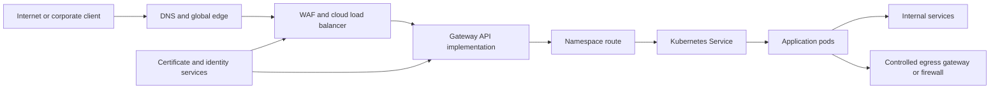

> **Document class:** Applications & Kubernetes architecture reference model
> **Normative terms:** **MUST**, **MUST NOT**, **SHOULD**, **SHOULD NOT**, and **MAY** are requirements levels.
> **Applicability:** Kubernetes ingress and Gateway API, service discovery, TLS, network policy, egress, DNS, and traffic ownership across cloud providers.
> **Exception process:** Deviations require a documented risk assessment, compensating controls, named risk owner, and expiry date.

| Control field | Value |
|---|---|
| Document ID | `APP-10` |
| Owner | Cloud Center of Excellence |
| Review cycle | At least annually and after material cloud-service, Kubernetes, networking, security, or operating-model changes |
| Evidence | Network and gateway design, route and DNS tests, certificate records, policy validation, traffic tests, and troubleshooting evidence |

# Kubernetes Application Networking and Gateway Architecture

> **Decision in brief:** Separate edge, gateway, service, pod, egress, and security ownership so application traffic remains portable, inspectable, and recoverable.

## Purpose

This article defines a portable application-networking model for Kubernetes. It separates cloud edge, cluster gateway, service discovery, pod traffic, egress, and security ownership so applications can move across AKS, EKS, GKE, OKE, and conformant platforms without assuming identical provider implementations.

## Reference architecture

## Architecture principles

- Separate infrastructure ownership from application route ownership.
- Prefer private clusters and private service exposure unless public access is required.
- Use Gateway API for new HTTP and TCP routing designs where the selected implementation supports required features.
- Retain Ingress only for established compatibility needs; its API is stable but frozen.
- Apply default-deny network policy and explicitly authorize flows.
- Centralize public certificates, WAF policy, logging, and DDoS controls.
- Avoid exposing workloads through unmanaged `NodePort` services.

## Service discovery

Use Kubernetes Services and cluster DNS for stable in-cluster discovery. Applications should tolerate endpoint changes, DNS caching behavior, connection draining, and temporary absence of ready endpoints.

Use headless Services only when clients need direct endpoint discovery. Do not depend on pod IP addresses outside the cluster. Define ports by meaningful names when protocols and probes share service definitions.

## Gateway API design

Gateway API separates roles:

- `GatewayClass`: platform-selected implementation.
- `Gateway`: infrastructure and listener policy.
- Route resources: application-owned routing within allowed namespaces and hostnames.
- Reference policy: explicit cross-namespace authorization.

This separation is preferable to controller-specific annotations for shared platforms. Restrict which namespaces may attach routes, enforce hostname ownership, and limit permitted route kinds.

## Ingress migration

Inventory ingress classes, annotations, TLS behavior, rewrite rules, health checks, timeouts, source-IP requirements, and controller-specific features. Migrate one hostname or service at a time and compare routing, certificates, headers, status codes, and telemetry before switching DNS or load-balancer traffic.

Do not translate annotations mechanically when semantics differ. Maintain a tested rollback path until Gateway behavior is proven.

## TLS and certificate controls

- Use TLS 1.2 or later according to organizational policy.
- Automate certificate issuance and rotation through an approved issuer.
- Define whether TLS terminates at the edge, gateway, sidecar, or application.
- Re-encrypt traffic when crossing trust boundaries.
- Protect private keys in a secret manager or approved certificate controller.
- Monitor expiration, issuance failures, hostname mismatch, and weak cipher configuration.

## Network policy baseline

Each application namespace should begin with default-deny ingress and egress. Add explicit rules for:

- DNS resolution.
- Gateway-to-application traffic.
- Application-to-database and application-to-service dependencies.
- Telemetry export.
- Approved control-plane or secret-service access.
- Required external APIs through controlled egress.

Test policy enforcement because the Kubernetes API can accept NetworkPolicy resources even when the network plugin does not enforce them.

## Egress architecture

Identify workloads that require stable source addresses, domain filtering, TLS inspection, private endpoints, or internet access. Route sensitive egress through a firewall, NAT gateway, proxy, or service-mesh egress control as appropriate.

DNS-based allow lists have limitations because resolved addresses can change and encrypted protocols hide hostnames. Prefer private service endpoints and identity-based authorization for cloud services.

## Multi-cloud mapping

| Layer | Azure | AWS | GCP | OCI |
|---|---|---|---|---|
| Global edge | Front Door / Traffic Manager | CloudFront / Route 53 | Cloud Load Balancing / Cloud DNS | Traffic Management / DNS |
| WAF | Web Application Firewall | AWS WAF | Cloud Armor | Web Application Firewall |
| Kubernetes | AKS | EKS | GKE | OKE |
| Private service access | Private Link | PrivateLink | Private Service Connect | Private Endpoint |
| Egress | NAT Gateway / Firewall | NAT Gateway / Network Firewall | Cloud NAT / firewall policy | NAT Gateway / Network Firewall |

Provider controllers must not require application teams to own cloud-wide networking permissions.

## Availability and performance

Run gateway replicas across zones and nodes, set disruption budgets, reserve capacity, and test controller upgrades. Define connection, request, idle, and drain timeouts from application behavior. Monitor saturation, rejected connections, DNS latency, TLS errors, retries, and endpoint readiness.

Avoid retry amplification across client, gateway, mesh, and application layers. Only retry safe operations with bounded attempts and jitter.

## Traffic ownership model

Traffic configuration should separate four ownership layers:

| Layer | Typical owner | Controlled objects |
|---|---|---|
| Global edge and DNS | Network or platform team | Public DNS, CDN, DDoS, WAF, global routing |
| Cluster gateway infrastructure | Platform team | GatewayClass, Gateway, load balancer, shared certificates |
| Application routing | Application team within guardrails | HTTPRoute, GRPCRoute, TCPRoute, hostname and path rules |
| Service and pod connectivity | Application and platform teams | Service, NetworkPolicy, service-to-service authorization |

The platform must prevent route attachment to unauthorized gateways, hostnames, namespaces, or backends. Application teams should not need cloud-wide load-balancer or network permissions to publish a route.

## Gateway API policy and delegation

For Gateway API adoption, define allowed route namespaces, hostname ownership, listener policy, TLS certificate sources, cross-namespace reference rules, backend protocol, timeout behavior, and status-condition monitoring. Use reference grants or equivalent explicit authorization for cross-namespace references.

Implementation-specific features should be isolated behind documented policy or extension resources. Do not hide critical behavior in opaque annotations without ownership and portability impact. Conformance profiles differ by implementation, so required features must be tested rather than assumed from API presence.

## DNS, address families, and service discovery

The architecture must define search domains, `ndots` implications, caching, negative caching, resolver forwarding, and split-horizon behavior. Excessive short-name lookups can create unnecessary DNS load; critical dependencies should use deliberate names and connection reuse.

Where dual-stack networking is used, verify address-family selection, load-balancer support, firewall policy, NetworkPolicy behavior, application binding, and monitoring. Do not declare dual-stack support because the cluster allocates both address families if the application and dependencies have not been tested end to end.

## East-west authorization

NetworkPolicy controls reachability but usually does not express the business operation a caller may perform. Sensitive service-to-service calls require authenticated workload identity and authorization at the API, proxy, or service-mesh layer. The design should define how service identity maps to permitted methods, routes, tenants, or resources.

Use network policy as defense in depth to reduce reachable attack surface. Maintain an explicit flow matrix so policy can be tested and reviewed when dependencies change.

## Network validation and troubleshooting evidence

A production readiness test should capture:

- DNS resolution from the actual namespace and workload identity.
- Route and listener status conditions.
- TLS certificate chain, hostname, protocol, and renewal behavior.
- Source IP and forwarded-header behavior.
- NetworkPolicy positive and negative tests.
- Egress path, NAT or firewall decision, and expected source address.
- Connection draining during pod and gateway termination.
- Behavior when DNS, gateway, firewall, or a backend is unavailable.

Packet reachability alone does not validate hostname routing, TLS, identity, or application authorization.

## Validation

- [ ] Public and private exposure is documented for every service.
- [ ] Gateway and route ownership boundaries are enforced.
- [ ] Hostname and cross-namespace references require authorization.
- [ ] TLS issuance, rotation, and termination points are tested.
- [ ] Default-deny network policies and explicit flows are verified.
- [ ] Egress paths and source-address requirements are controlled.
- [ ] DNS, endpoint changes, connection draining, and failure behavior are tested.
- [ ] Gateways are zone-resilient and capacity-monitored.
- [ ] Cloud-specific configuration is isolated from portable workload definitions.
- [ ] Migration and rollback procedures are documented.

## Related topics

- [AKS Platform Architecture](app-aks-platform-architecture.md)
- [Delivering and Operating AKS Workloads](app-delivering-and-operating-aks-workloads.md)
- [Resilience, Scaling, and Deployment Strategies](app-resilience-scaling-and-deployment-strategies.md)
- [Service Mesh Architecture and Adoption Guidelines](app-service-mesh-architecture-and-adoption-guidelines.md)

## References

- [Kubernetes: Services, Load Balancing, and Networking](https://kubernetes.io/docs/concepts/services-networking/)
- [Kubernetes Gateway API](https://gateway-api.sigs.k8s.io/)
- [Kubernetes: Ingress](https://kubernetes.io/docs/concepts/services-networking/ingress/)
- [Kubernetes: DNS for Services and Pods](https://kubernetes.io/docs/concepts/services-networking/dns-pod-service/)
- [Kubernetes: Network Policies](https://kubernetes.io/docs/concepts/services-networking/network-policies/)
