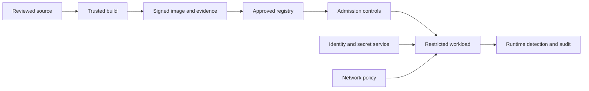

> **文档类型：**应用与 Kubernetes 强制工程标准
> **规范性术语：** **MUST**、**MUST NOT**、**SHOULD**、**SHOULD NOT** 和 **MAY** 是要求级别。
> **适用范围：** Kubernetes 工作负载准入、Pod 安全、身份、网络策略、镜像供应链、运行时检测和安全证据。
> **例外流程：** 偏离要求需要记录风险评估、补偿控制、指定风险负责人和到期日期。

|控制领域|价值|
|---|---|
|文件编号 | `APP-09` |
|负责人|云卓越中心 |
|审核周期|至少每年一次，并且在云服务、Kubernetes、安全性或运营模型发生重大变化之后 |
|证据|准入和策略测试、镜像来源、身份和网络控制、运行时检测、异常日志记录和安全验收证据 |

# Kubernetes 应用安全和策略标准

> **决策简述：** 通过明确的身份、网络、镜像、异常和证据控制，在源头、构建、准入和运行时强制执行工作负载安全。

## 目的

该标准定义了在托管或自我管理的 Kubernetes 上运行的工作负载的最低安全契约。它通过控制可以部署哪些应用、它们接收哪些身份、它们如何通信以及在准入之前必须存在哪些证据来补充集群强化。

## 安全模型

必须在源代码、构建、准入和运行时强制执行安全性。某一层的控件不会取代其他层的控件。

## 强制工作负载控制

- 在可行的情况下，使用 `runAsNonRoot: true` 和显式 UID 以非 root 用户身份运行。
- 在添加记录在案的异常之前禁用权限升级并删除所有 Linux 功能。
- 使用只读根文件系统，除非应用有批准的写入要求。
- 应用运行时默认 seccomp 配置文件和经批准的 AppArmor 或 SELinux 配置文件（如果支持）。
- 禁止特权容器、主机网络、主机 PID/IPC、不受限制的主机路径和主机容器引擎套接字。
- 根据测试的行为设置 CPU 和内存请求和限制。
- 使用来自批准的注册中心的不可变镜像摘要。
- 仅当工作负载调用 Kubernetes API 时才挂载服务账户令牌。
- 将凭证保留在镜像和清单之外；使用工作负载身份检索它们。
- 根据应用语义定义就绪、活跃和启动探测器。

## Pod 安全标准

使用 Kubernetes Pod 安全准入为应用命名空间强制执行 `restricted` 配置文件。仅针对已记录在案的兼容性需求应用 `baseline`，并将 `privileged` 工作负载隔离在专用平台命名空间和节点池中。

按以下顺序推出策略：

1. 为审计和警告标记命名空间。
2.清查违规行为并指定责任人。
3. 修复工作负载并测试控制器。
4. 在非生产中启用强制执行。
5. 通过受监控的异常情况启用生产执行。

固定策略版本，而不是允许集群升级意外地更改实施。

## 招生策略架构

内置 Pod 安全准入提供了基线。使用 ValidatingAdmissionPolicy、Gatekeeper、Kyverno 或等效引擎来实现组织特定的规则，例如批准的注册表、所需的标签、资源限制、工作负载身份、入口限制和受保护的资源类型。

录取策略必须：

- 故障关闭以实现高影响的生产控制。
- 明确定义超时和失败行为。
- 针对正负固定装置进行测试。
- 仅通过狭窄的、经过审查的规则排除系统名称空间。
- 记录策略版本和决定，不泄露机密。
- 提供一个有明确负责人的、即将到期的异常流程。

突变可能会添加安全默认值，但不能隐藏重要的行为。当团队需要理解并管理最终清单时，首选验证。

## 身份和授权

对每个工作负载身份边界使用专用的 Kubernetes 服务账户。仅绑定所需的 API 动词和资源名称。避免使用通配符 RBAC、默认服务账户、共享云身份和静态云密钥。

将 Kubernetes 服务账户映射到 Azure 工作负载身份、AWS 上服务账户的 IAM 角色、GCP 工作负载联邦身份验证或 OCI 工作负载/资源主体（如果支持）。按应用和环境区分身份。

## 网络安全

- 使用默认拒绝入口和出口策略启动应用命名空间。
- 为 DNS、依赖项、遥测和批准的外部端点添加显式流。
- 在适当的情况下，将公众暴露在经批准的网关和 Web 应用防火墙后面。
- 加密外部流量和敏感的东西向流量。
- 验证安装的网络插件确实强制执行所使用的策略功能。

## 镜像和供应链策略

需要漏洞扫描、SBOM、来源证明以及与镜像摘要绑定的签名证据。准入应拒绝可变或不可信的引用，并在平台支持强制执行的情况下验证签名。

不要永远依赖干净的扫描。随着漏洞情报的变化重新评估已部署的镜像，并根据严重性和暴露程度定义修复时间。

## 多云实施映射

|控制|Azure|AWS | GCP |OCI |
|---|---|---|---|---|
|托管 Kubernetes | AKS | EKS | GKE |无完全等效项|
|工作负载身份|内部工作负载身份 |服务账户的 IAM 角色 |工作负载身份联合|工作负载/资源主体 |
|注册中心 | ACR |ECR |Artifact Registry | OCI Container Registry |
|原生策略集成 | Kubernetes 的 Azure Policy | EKS 准入生态系统 |策略控制器或准入生态系统| OKE 准入生态系统|

云原生控制可以补充但不得削弱可移植工作负载基线。

## 异常标准

每个例外都必须标识资源、所有者、业务原因、威胁、补偿控制、批准权限、到期日期和删除计划。异常必须尽可能是机器可读的，并且不得使用一揽子命名空间排除。

## 工作负载威胁模型

安全审查应确定容器受损、恶意依赖、暴露的服务账户、易受攻击的节点、允许的准入异常和未经授权的镜像的后果。至少，评估工作负载是否可以：

- 访问 Kubernetes API 或云元数据和身份端点。
- 读取机密、预计的令牌、已安装的卷或邻近的工作负载流量。
- 修改集群范围的资源、准入策略或工作负载标识。
- 通过主机挂载、特权功能、设备访问或运行时套接字进行逃逸。
- 通过不受限制的出口或遥测技术泄露数据。
- 耗尽共享 CPU、内存、存储、对象计数或负载均衡器配额。

必须根据威胁模型选择控制。非根 UID 不能补偿不受限制的云权限或广泛的网络出口。

## 策略层级和执行模型

使用与工作负载风险一致的少量策略层。一个典型的模型是：

|等级 |预期工作负载|执法预期|
|---|---|---|
|标准|普通无状态应用 |受限的 Pod 安全性、默认拒绝网络、批准的镜像、工作负载身份 |
|高风险|提供商或遗留工作负载（经批准的例外情况） |专用命名空间或节点、补偿控制、更严格的监控 |
|平台|需要更广泛权限的集群附加组件 |中央所有权、隔离命名空间、显式集群权限 |
|禁止 |未经审查的特权或主机集成工作负载 |被共享生产集群拒绝 |
策略应通过测试、警告、审计和执行阶段进行版本化和晋级。策略更改需要针对代表性平台和应用清单进行兼容性测试。

## 原生和外部准入控制

使用进程内声明性准入策略来实现无需外部调用即可安全表达的规则。外部策略引擎仍然应用于更丰富的库、突变、镜像签名验证、清单或特定于组织的工作流程。 Webhook 引入了可用性依赖性，并且必须具有窄匹配、短超时、容量测试和明确的故障策略。

策略源、生成的资源、绑定、参数、排除和测试必须一起保留。广泛的命名空间排除不能替代作用域异常。

## 运行时检测和取证准备

准入验证所需的配置；它不证明运行时行为。生产集群应监视意外的流程执行、权限使用、敏感文件访问、可疑网络连接、服务账户滥用、加密货币挖掘指标以及与部署镜像的偏差。

取证准备应定义保留哪些审计、容器、网络、身份和云活动日志记录；谁可以访问它们；以及在事件期间如何保存证据。必须评估运行时工具的节点权限、性能开销、数据量和租户可见性。

## 安全验收证据

工作负载安全审查应保留：

- 呈现清单和策略结果。
- 镜像摘要、SBOM、来源证明和漏洞处置。
- RBAC 和云权限审查。
- 网络流矩阵和负连接测试。
- 机密交付和令牌安装行为。
- 过期的异常日志记录。
- 适合风险的渗透、滥用案例或威胁模型结果。
- 运行时告警所有权和事件运行手册。

通过准入的部署是必要的，但还不足以提供足够的安全证据。

## 验证

- [ ] 应用命名空间强制执行已批准的 Pod 安全级别。
- [ ] 容器以非 root 身份运行，无需权限升级。
- [ ] 功能、seccomp、文件系统和主机访问符合策略。
- [ ] 镜像使用批准的注册表和不可变的摘要。
- [ ] 保留 SBOM、扫描、来源证明和签名证据。
- [ ] 服务账户和云身份使用最小权限。
- [ ] 测试默认拒绝网络策略和显式流。
- [ ] 录取策略有负面测试和已知的失败行为。
- [ ] 例外情况已获批准、确定范围、受到监控并到期。
- [ ] 运行时和审核告警有负责任的响应者。

## 操作注意事项

监控拒绝准入、异常增长、特权工作负载清单、意外的服务账户令牌使用、网络策略违规、易受攻击的部署摘要和运行时异常。在依赖故障关闭行为之前测试策略引擎的不可用性和恢复。

## 相关主题

- [AKS 平台架构](app-aks-platform-architecture.md)
- [交付和操作 AKS 工作负载](app-delivering-and-operating-aks-workloads.md)
- [应用身份、身份验证和 Easy Auth](app-application-identity-authentication-and-easy-auth.md)
- [应用配置与机密管理](app-application-configuration-and-secret-management.md)

## 参考文档

- [Kubernetes：Pod 安全标准](https://kubernetes.io/docs/concepts/security/pod-security-standards/)
- [Kubernetes：Pod 安全准入](https://kubernetes.io/docs/concepts/security/pod-security-admission/)
- [Kubernetes：安全概念和清单](https://kubernetes.io/docs/concepts/security/)
- [Kubernetes：网络策略](https://kubernetes.io/docs/concepts/services-networking/network-policies/)
- [Kubernetes：RBAC 良好实践](https://kubernetes.io/docs/concepts/security/rbac-good-practices/)
