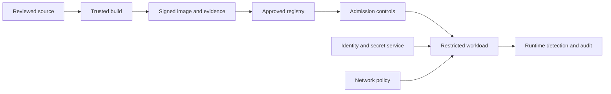

> **Document class:** Applications & Kubernetes mandatory engineering standard
> **Normative terms:** **MUST**, **MUST NOT**, **SHOULD**, **SHOULD NOT**, and **MAY** are requirements levels.
> **Applicability:** Kubernetes workload admission, pod security, identity, network policy, image supply chain, runtime detection, and security evidence.
> **Exception process:** Deviations require a documented risk assessment, compensating controls, named risk owner, and expiry date.

| Control field | Value |
|---|---|
| Document ID | `APP-09` |
| Owner | Cloud Center of Excellence |
| Review cycle | At least annually and after material cloud-service, Kubernetes, security, or operating-model changes |
| Evidence | Admission and policy tests, image provenance, identity and network controls, runtime detection, exception records, and security acceptance evidence |

# Kubernetes Application Security and Policy Standards

> **Decision in brief:** Enforce workload security at source, build, admission, and runtime, with explicit identity, network, image, exception, and evidence controls.

## Purpose

This standard defines the minimum security contract for workloads running on managed or self-managed Kubernetes. It complements cluster hardening by controlling what applications may deploy, which identities they receive, how they communicate, and which evidence must exist before admission.

## Security model

Security must be enforced at source, build, admission, and runtime. A control at one layer does not replace the others.

## Mandatory workload controls

- Run as a non-root user with `runAsNonRoot: true` and explicit UID where practical.
- Disable privilege escalation and drop all Linux capabilities before adding documented exceptions.
- Use a read-only root filesystem unless the application has an approved write requirement.
- Apply the runtime default seccomp profile and an approved AppArmor or SELinux profile where supported.
- Prohibit privileged containers, host networking, host PID/IPC, unrestricted host paths, and host container-engine sockets.
- Set CPU and memory requests and limits based on tested behavior.
- Use immutable image digests from approved registries.
- Mount service-account tokens only when the workload calls the Kubernetes API.
- Keep credentials outside images and manifests; retrieve them with workload identity.
- Define readiness, liveness, and startup probes according to application semantics.

## Pod Security Standards

Use Kubernetes Pod Security Admission to enforce the `restricted` profile for application namespaces. Apply `baseline` only for a documented compatibility need, and isolate `privileged` workloads in dedicated platform namespaces and node pools.

Roll out policy in this order:

1. Label namespaces for audit and warning.
2. Inventory violations and assign owners.
3. Remediate workloads and test controllers.
4. Enable enforcement in non-production.
5. Enable production enforcement with monitored exceptions.

Pin the policy version rather than allowing cluster upgrades to change enforcement unexpectedly.

## Admission policy architecture

Built-in Pod Security Admission provides a baseline. Use ValidatingAdmissionPolicy, Gatekeeper, Kyverno, or an equivalent engine for organization-specific rules such as approved registries, required labels, resource limits, workload identity, ingress restrictions, and protected resource types.

Admission policy must:

- Fail closed for high-impact production controls.
- Define timeout and failure behavior explicitly.
- Be tested against positive and negative fixtures.
- Exclude system namespaces only through narrow, reviewed rules.
- Record policy version and decision without exposing secrets.
- Provide an owned, expiring exception process.

Mutation may add safe defaults, but it must not hide significant behavior. Prefer validation when teams need to understand and own the final manifest.

## Identity and authorization

Use a dedicated Kubernetes service account for each workload identity boundary. Bind only required API verbs and resource names. Avoid wildcard RBAC, default service accounts, shared cloud identities, and static cloud keys.

Map Kubernetes service accounts to Azure workload identity, IAM roles for service accounts on AWS, GCP Workload Identity Federation, or OCI workload/resource principals where supported. Separate identity by application and environment.

## Network security

- Start application namespaces with default-deny ingress and egress policies.
- Add explicit flows for DNS, dependencies, telemetry, and approved external endpoints.
- Keep public exposure behind an approved gateway and web application firewall when appropriate.
- Encrypt external traffic and sensitive east-west traffic.
- Validate that the installed network plugin actually enforces the policy features used.

## Image and supply-chain policy

Require vulnerability scanning, SBOM, provenance, and signature evidence bound to the image digest. Admission should reject mutable or untrusted references and verify signatures where the platform supports enforcement.

Do not rely on a clean scan forever. Reassess deployed images as vulnerability intelligence changes and define remediation times by severity and exposure.

## Multi-cloud implementation mapping

| Control | Azure | AWS | GCP | OCI |
|---|---|---|---|---|
| Managed Kubernetes | AKS | EKS | GKE | OKE |
| Workload identity | Entra workload identity | IAM roles for service accounts | Workload Identity Federation | Workload/resource principals |
| Registry | ACR | ECR | Artifact Registry | OCI Container Registry |
| Native policy integration | Azure Policy for Kubernetes | EKS admission ecosystem | Policy Controller or admission ecosystem | OKE admission ecosystem |

Cloud-native controls may supplement, but must not weaken, the portable workload baseline.

## Exception standard

Every exception must identify the resource, owner, business reason, threat, compensating controls, approving authority, expiration date, and removal plan. Exceptions must be machine-readable where possible and must not use blanket namespace exclusions.

## Workload threat model

The security review should identify the consequences of a compromised container, malicious dependency, exposed service account, vulnerable node, permissive admission exception, and unauthorized image. At minimum, evaluate whether the workload can:

- Reach the Kubernetes API or cloud metadata and identity endpoints.
- Read secrets, projected tokens, mounted volumes, or neighboring workload traffic.
- Modify cluster-scoped resources, admission policy, or workload identities.
- Escape through host mounts, privileged capabilities, device access, or runtime sockets.
- Exfiltrate data through unrestricted egress or telemetry.
- Exhaust shared CPU, memory, storage, object count, or load-balancer quota.

Controls must be selected against the threat model. A non-root UID does not compensate for unrestricted cloud permissions or broad network egress.

## Policy tiers and enforcement model

Use a small number of policy tiers aligned to workload risk. A typical model is:

| Tier | Intended workload | Enforcement expectation |
|---|---|---|
| Standard | Ordinary stateless application | Restricted pod security, default-deny network, approved images, workload identity |
| Elevated | Vendor or legacy workload with approved exceptions | Dedicated namespace or nodes, compensating controls, tighter monitoring |
| Platform | Cluster add-ons requiring broader privileges | Central ownership, isolated namespace, explicit cluster permissions |
| Prohibited | Unreviewed privileged or host-integrated workload | Rejected from shared production clusters |

Policies should be versioned and promoted through test, warning, audit, and enforcement stages. Policy changes require compatibility testing against representative platform and application manifests.

## Native and external admission controls

Use in-process declarative admission policy for rules that can be expressed safely without external calls. External policy engines remain appropriate for richer libraries, mutation, image-signature verification, inventory, or organization-specific workflows. Webhooks introduce an availability dependency and must have narrow matching, short timeouts, capacity tests, and explicit failure policy.

The policy source, generated resources, bindings, parameters, exclusions, and tests must be retained together. A broad namespace exclusion is not an acceptable substitute for a scoped exception.

## Runtime detection and forensic readiness

Admission validates desired configuration; it does not prove runtime behavior. Production clusters should monitor for unexpected process execution, privilege use, sensitive file access, suspicious network connections, service-account abuse, cryptomining indicators, and drift from the deployed image.

Forensic readiness should define which audit, container, network, identity, and cloud activity records are retained; who can access them; and how evidence is preserved during an incident. Runtime tools must be evaluated for node privilege, performance overhead, data volume, and tenant visibility.

## Security acceptance evidence

A workload security review should retain:

- Rendered manifest and policy results.
- Image digest, SBOM, provenance, and vulnerability disposition.
- RBAC and cloud-permission review.
- Network-flow matrix and negative connectivity tests.
- Secret-delivery and token-mount behavior.
- Exception records with expiry.
- Penetration, abuse-case, or threat-model results appropriate to risk.
- Runtime alert ownership and incident runbook.

A deployment passing admission is necessary but not sufficient security evidence.

## Validation

- [ ] Application namespaces enforce an approved Pod Security level.
- [ ] Containers run non-root without privilege escalation.
- [ ] Capabilities, seccomp, filesystem, and host access meet policy.
- [ ] Images use approved registries and immutable digests.
- [ ] SBOM, scan, provenance, and signature evidence are retained.
- [ ] Service accounts and cloud identities use least privilege.
- [ ] Default-deny network policy and explicit flows are tested.
- [ ] Admission policies have negative tests and known failure behavior.
- [ ] Exceptions are approved, scoped, monitored, and expiring.
- [ ] Runtime and audit alerts have accountable responders.

## Operational considerations

Monitor denied admissions, exception growth, privileged workload inventory, unexpected service-account token use, network-policy violations, vulnerable deployed digests, and runtime anomalies. Test policy-engine unavailability and recovery before relying on fail-closed behavior.

## Related topics

- [AKS Platform Architecture](app-aks-platform-architecture.md)
- [Delivering and Operating AKS Workloads](app-delivering-and-operating-aks-workloads.md)
- [Application Identity, Authentication, and Easy Auth](app-application-identity-authentication-and-easy-auth.md)
- [Application Configuration and Secret Management](app-application-configuration-and-secret-management.md)

## References

- [Kubernetes: Pod Security Standards](https://kubernetes.io/docs/concepts/security/pod-security-standards/)
- [Kubernetes: Pod Security Admission](https://kubernetes.io/docs/concepts/security/pod-security-admission/)
- [Kubernetes: Security concepts and checklists](https://kubernetes.io/docs/concepts/security/)
- [Kubernetes: Network Policies](https://kubernetes.io/docs/concepts/services-networking/network-policies/)
- [Kubernetes: RBAC good practices](https://kubernetes.io/docs/concepts/security/rbac-good-practices/)
