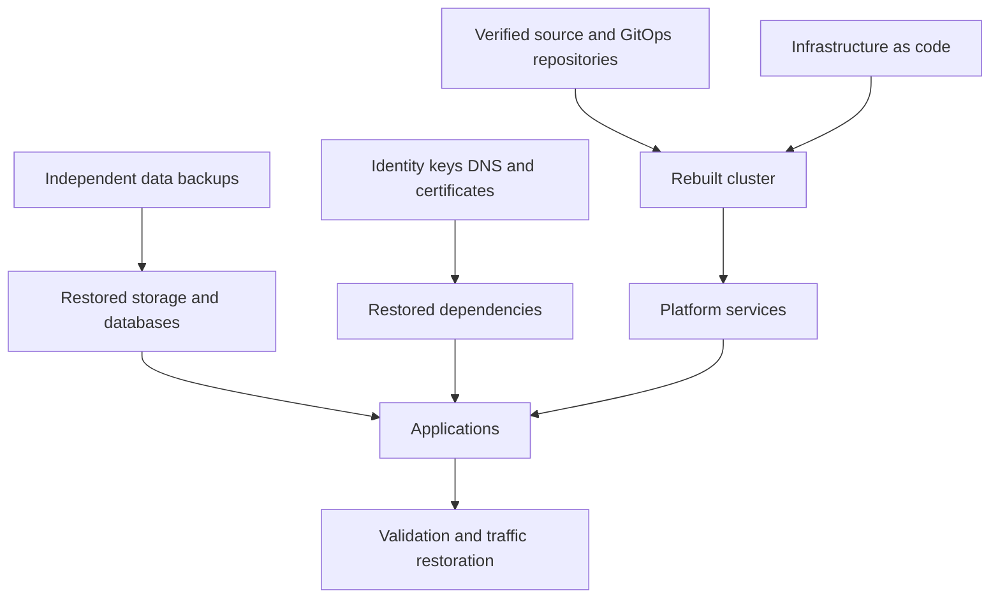

> **文档类型：** 应用和 Kubernetes 实施指南
> **规范性术语：** **MUST**、**MUST NOT**、**SHOULD**、**SHOULD NOT** 和 **MAY** 是要求级别。
> **适用范围：** Kubernetes 所需状态、持久数据、云基础设施、身份、密钥、依赖项、恢复排序和灾难恢复。
> **例外流程：** 偏离要求需要记录风险评估、补偿控制、指定风险负责人和到期日期。

|控制领域|价值|
|---|---|
|文件编号 | `APP-15` |
|负责人|云卓越中心 |
|审核周期|至少每年一次，并且在云服务、Kubernetes、安全性或运营模型发生重大变化之后 |
|证据|备份清单、恢复目标、恢复操作手册、依赖关系图、恢复测试、网络恢复控制和验证证据 |

# Kubernetes 备份、恢复和灾难恢复

> **简要决定：** 将 Kubernetes 恢复为所需状态、数据、基础设施、身份、密钥和依赖项的协调系统，并具有经过测试的目标和证据。

## 目的

Kubernetes 所需的状态、持久应用数据、云基础设施、身份、密钥和外部依赖项通过不同的机制恢复。本文定义了协调恢复设计，而不是假设集群快照是完整备份。

## 恢复层

## 恢复目标

为每个业务服务定义 RPO 和 RTO，而不仅仅是每个集群。包括数据丢失容忍度、最大服务中断、依赖性恢复、最小可行容量、恢复区域、决策权限和通信要求。

度量练习期间实现的目标。如果副本失败或无法恢复，配置的每小时备份不能保证一小时 RPO。

## 必须保护什么

- 受保护仓库中的应用和平台所需状态。
- 基础设施代码、模块版本、状态和部署参数。
- 持久卷和应用一致的数据库备份。
- CRD 和依赖项感知形式的自定义资源。
- 外部 DNS、证书、Secret Manager 元数据和身份配置。
- 通过批准的密钥管理恢复来加密和签名密钥。
- 发布清单、制品摘要、镜像和来源证明。
- 操作手册、所有权和恢复证据。

除非存在记录在案的恢复需求，否则请勿备份短期凭据或生成的运行时对象。

## 备份架构

将备份存储保留在源集群及其主要管理故障域之外。在适当的情况下使用不可变的保留或对象锁定，根据风险单独的备份和恢复权限、加密、恶意软件控制、删除保护以及跨区域或跨账户复制。

对于持久性应用，将文件系统或卷快照与数据库刷新、冻结、事务日志或原生备份机制协调起来。验证确切驱动程序的容器存储接口快照支持和一致性行为。

## 恢复序列

1. 声明事件并选择经过验证的恢复点。
2. 建立云账户、网络、身份、DNS、注册表和密钥依赖项。
3. 从固定的基础设施代码重建集群。
4. 安装 CRD、策略、存储、网络、机密、可观测性和 GitOps 服务。
5. 按照应用定义的顺序恢复持久数据。
6. 协调应用配置和不可变制品。
7. 验证身份、数据完整性、交易、SLO 和安全控制。
8. 逐步恢复交通并监测稳定情况。

不要盲目恢复所有 Kubernetes 对象。节点绑定的 pod、租约、令牌、端点和控制器生成的对象可能已过时或不安全。

## 多云策略

|能力|Azure|AWS | GCP |OCI |
|---|---|---|---|---|
|Kubernetes | AKS | EKS | GKE |无完全等效项|
|卷快照基础| Azure 磁盘快照 | EBS 快照 |持久磁盘快照 |块卷备份 |
|独立对象存储 | Blob 存储 | S3 |Cloud Storage |对象存储 |

提供商备份服务可以加速恢复，但保留可移植的所需状态和应用原生数据过程。跨云恢复需要经过测试的身份、负载均衡、存储语义、证书和托管数据库等价物。

## GitOps 恢复
通过分支控制、验证提交、独立备份或镜像以及有限的删除权限来保护配置仓库。记录最后一次已知的良好修订。协调应从平台依赖关系开始，分阶段进行；部分恢复期间不受控制的修剪可能会破坏恢复的资源。

## 测试标准

运行桌面演练、组件恢复、干净集群恢复、区域故障转移和遭入侵后的恢复练习。测试丢失的 CRD、不可用的注册表、丢失的控制器、损坏的备份、过期的证书和不可用的主要身份提供商。

记录恢复点、持续时间、手动步骤、数据验证、未满足的依赖关系、已实现的容量、缺陷和负责任的修复日期。

## 备份策略矩阵

为每个可恢复组件定义一个保护层：

|组件|典型保护方法|验证要求|
|---|---|---|
|基础设施和集群配置|版本控制的 IaC 和固定模块 |在隔离环境中进行干净重建 |
| Kubernetes 期望状态 |受保护的 GitOps 仓库和发布制品 |协调而不产生破坏性漂移 |
|持久卷 |支持 CSI 快照和独立备份 |挂载、文件系统和应用一致性 |
|托管数据库|原生备份、日志保留、复制 |时间点恢复和事务验证|
| CRD 和自定义资源 |依赖关系感知导出或备份工具 |恢复 CRD、版本、Webhooks，然后恢复资源 |
|钥匙和证书|批准的密钥备份或托管恢复流程 |恢复后解密、签名、续订和轮换 |
|镜像和包|复制或独立保留的注册表制品 |在恢复环境中按摘要拉取 |

备份频率、保留、不变性、复制位置和恢复测试节奏应源自业务服务 RPO 和威胁模型。

## 恢复依赖图

恢复过程应该维护一个依赖图而不是一个简单的对象列表。例如，应用可能需要网络、DNS、身份、注册表、存储类、CSI 驱动程序、机密提供程序、证书、策略和网关才能安全启动。

自动化恢复波并在它们之间加入准备门。 GitOps 协调应暂停或确定范围，直到所需的 CRD、机密、卷和外部服务存在；否则控制器可能会以不安全的顺序修剪、重新创建资源或反复使资源失败。

## 网络恢复注意事项

灾难恢复必须包括破坏性或恶意场景，而不仅仅是区域性中断。保护备份免受管理源集群的身份的影响。在合理的情况下使用不可变的保留或删除保护，单独的恢复授权，并监视备份策略更改和批量删除。

网络恢复练习应假设源凭据、Git 仓库、镜像或配置可能不受信任。恢复可能需要已知良好的制品集、干净的身份、轮换的机密和密钥以及在服务恢复之前进行取证保存。

## 恢复验证标准
仅当业务服务可用且安全时，恢复才会成功。验证应包括：

- 数据完整性和选定的交易对账。
- 身份发布、授权和租户隔离。
- 机密和证书检索和轮换。
- 网络策略、网关、DNS 和出口控制。
- 可观测性、审计、告警和备份恢复。
- 最小可行恢复能力下的性能。
- 确认临时恢复权限和例外已删除。

## 恢复操作手册质量

运行手册应确定决策权限、先决条件、命令或自动化参考、预期输出、暂停标准、升级、沟通以及回滚或前向恢复选项。避免依赖于特定个人的内存、本地工作站或未版本控制的脚本的指令。每个手动步骤都应该适合以后的自动化或明确的风险接受。

## 验证

- [ ] 商业服务已批准 RPO 和 RTO。
- [ ] 备份范围涵盖数据、所需状态、基础设施、身份和密钥。
- [ ] 副本是独立的、加密的、受保护的和受监控的。
- [ ] 有状态服务存在应用一致的过程。
- [ ] 恢复权限是单独的并经过测试。
- [ ] 集群重建使用固定的、经过验证的代码和制品。
- [ ] 记录恢复顺序和破坏性修剪保护措施。
- [ ] 数据和应用运行状况检查证明恢复成功。
- [ ] 定期进行全面清洁环境恢复。
- [ ] 练习结果有所有者和截止日期。

## 操作注意事项

监控备份新鲜度、复制失败、恢复测试期限、存储增长、密钥可用性、不受支持的版本和 RPO 暴露。保持 break-glass 的访问而不绕过审计。在架构、提供程序、数据或租户更改后检查恢复设计。

## 相关主题

- [Kubernetes 上的有状态工作负载和持久存储](app-stateful-workloads-and-persistent-storage-on-kubernetes.md)
- [弹性、扩展和部署策略](app-resilience-scaling-and-deployment-strategies.md)
- [应用配置与机密管理](app-application-configuration-and-secret-management.md)
- [AKS 平台架构](app-aks-platform-architecture.md)

## 参考文档

- [Kubernetes：灾难恢复注意事项](https://kubernetes.io/docs/tasks/administer-cluster/configure-upgrade-etcd/)
- [Kubernetes：卷快照](https://kubernetes.io/docs/concepts/storage/volume-snapshots/)
- [Velero 文档](https://velero.io/docs/)
- [Microsoft: AKS 备份](https://learn.microsoft.com/en-us/azure/backup/azure-kubernetes-service-backup-overview)
- [AWS：EKS 可靠性最佳实践](https://docs.aws.amazon.com/eks/latest/best-practices/reliability.html)
