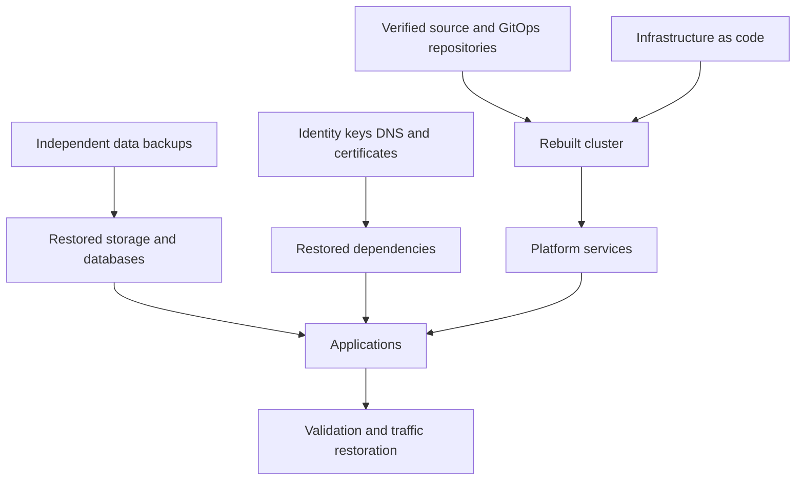

> **Document class:** Applications & Kubernetes implementation guide
> **Normative terms:** **MUST**, **MUST NOT**, **SHOULD**, **SHOULD NOT**, and **MAY** are requirements levels.
> **Applicability:** Kubernetes desired state, persistent data, cloud infrastructure, identities, keys, dependencies, restore sequencing, and disaster recovery.
> **Exception process:** Deviations require a documented risk assessment, compensating controls, named risk owner, and expiry date.

| Control field | Value |
|---|---|
| Document ID | `APP-15` |
| Owner | Cloud Center of Excellence |
| Review cycle | At least annually and after material cloud-service, Kubernetes, security, or operating-model changes |
| Evidence | Backup inventory, recovery objectives, restore runbook, dependency graph, restore tests, cyber-recovery controls, and validation evidence |

# Kubernetes Backup, Restore, and Disaster Recovery

> **Decision in brief:** Recover Kubernetes as a coordinated system of desired state, data, infrastructure, identity, keys, and dependencies, with tested objectives and evidence.

## Purpose

Kubernetes desired state, persistent application data, cloud infrastructure, identities, keys, and external dependencies recover through different mechanisms. This article defines a coordinated recovery design rather than assuming a cluster snapshot is a complete backup.

## Recovery layers

## Recovery objectives

Define RPO and RTO per business service, not only per cluster. Include data-loss tolerance, maximum service interruption, dependency recovery, minimum viable capacity, recovery region, decision authority, and communication requirements.

Measure achieved objectives during exercises. A configured hourly backup does not guarantee a one-hour RPO if copies fail or cannot be restored.

## What must be protected

- Application and platform desired state in protected repositories.
- Infrastructure code, module versions, state, and deployment parameters.
- Persistent volumes and application-consistent database backups.
- CRDs and custom resources in a dependency-aware form.
- External DNS, certificates, secret-manager metadata, and identity configuration.
- Encryption and signing keys through approved key-management recovery.
- Release manifests, artifact digests, images, and provenance.
- Operational runbooks, ownership, and recovery evidence.

Do not back up short-lived credentials or generated runtime objects unless a documented recovery need exists.

## Backup architecture

Keep backup storage outside the source cluster and its primary administrative failure domain. Use immutable retention or object lock where appropriate, separate backup and restore permissions, encryption, malware controls, deletion protection, and cross-region or cross-account copies based on risk.

For persistent applications, coordinate filesystem or volume snapshots with database flush, freeze, transaction log, or native backup mechanisms. Validate Container Storage Interface snapshot support and consistency behavior for the exact driver.

## Restore sequence

1. Declare the incident and select a verified recovery point.
2. Establish cloud account, networking, identity, DNS, registry, and key dependencies.
3. Rebuild the cluster from pinned infrastructure code.
4. Install CRDs, policy, storage, networking, secret, observability, and GitOps services.
5. Restore persistent data in application-defined order.
6. Reconcile application configuration and immutable artifacts.
7. Validate identity, data integrity, transactions, SLOs, and security controls.
8. Restore traffic gradually and monitor stabilization.

Do not restore all Kubernetes objects blindly. Node-bound pods, leases, tokens, endpoints, and controller-generated objects can be stale or unsafe.

## Multi-cloud strategy

| Capability | Azure | AWS | GCP | OCI |
|---|---|---|---|---|
| Kubernetes | AKS | EKS | GKE | OKE |
| Volume snapshot foundation | Azure Disk snapshots | EBS snapshots | Persistent Disk snapshots | Block Volume backups |
| Independent object storage | Blob Storage | S3 | Cloud Storage | Object Storage |

Provider backup services can accelerate recovery, but preserve portable desired state and application-native data procedures. Cross-cloud recovery requires tested equivalents for identity, load balancing, storage semantics, certificates, and managed databases.

## GitOps recovery

Protect configuration repositories with branch controls, verified commits, independent backups or mirrors, and limited deletion rights. Record the last known-good revision. Reconciliation should begin with platform dependencies and proceed in waves; uncontrolled pruning during partial restore can destroy recovered resources.

## Testing standard

Run table-top, component restore, clean-cluster restore, regional failover, and security-compromise recovery exercises. Test missing CRDs, unavailable registry, lost controller, corrupt backup, expired certificate, and unavailable primary identity provider.

Record recovery point, duration, manual steps, data validation, unmet dependencies, achieved capacity, defects, and accountable remediation dates.

## Backup policy matrix

Define a protection tier for each recoverable component:

| Component | Typical protection method | Validation requirement |
|---|---|---|
| Infrastructure and cluster configuration | Version-controlled IaC and pinned modules | Clean rebuild in an isolated environment |
| Kubernetes desired state | Protected GitOps repositories and release artifacts | Reconcile without destructive drift |
| Persistent volumes | CSI snapshot and independent backup where supported | Mount, filesystem, and application consistency |
| Managed databases | Native backup, log retention, replication | Point-in-time restore and transaction validation |
| CRDs and custom resources | Dependency-aware export or backup tool | Restore CRDs, versions, webhooks, then resources |
| Keys and certificates | Approved key backup or managed recovery process | Decrypt, sign, renew, and rotate after recovery |
| Images and packages | Replicated or independently retained registry artifacts | Pull by digest in recovery environment |

Backup frequency, retention, immutability, copy location, and restore test cadence should derive from the business service RPO and threat model.

## Recovery dependency graph

Recovery procedures should maintain a dependency graph rather than a flat list of objects. For example, applications may require network, DNS, identity, registry, storage classes, CSI drivers, secret providers, certificates, policy, and gateways before they can start safely.

Automate recovery waves and include readiness gates between them. GitOps reconciliation should be paused or scoped until required CRDs, secrets, volumes, and external services exist; otherwise controllers may prune, recreate, or repeatedly fail resources in an unsafe order.

## Cyber-recovery considerations

Disaster recovery must include destructive or malicious scenarios, not only regional outage. Protect backups from the identities that administer the source cluster. Use immutable retention or deletion protection where justified, separate restore authorization, and monitor backup-policy changes and mass deletion.

A cyber-recovery exercise should assume that source credentials, Git repositories, images, or configuration may be untrusted. Recovery may require a known-good artifact set, clean identities, rotated secrets and keys, and forensic preservation before service restoration.

## Restore validation standard

A restore is successful only when the business service is usable and secure. Validation should include:

- Data integrity and selected transaction reconciliation.
- Identity issuance, authorization, and tenant isolation.
- Secret and certificate retrieval and rotation.
- NetworkPolicy, gateway, DNS, and egress controls.
- Observability, audit, alerts, and backup resumption.
- Performance at minimum viable recovery capacity.
- Confirmation that temporary recovery permissions and exceptions are removed.

## Recovery runbook quality

Runbooks should identify decision authority, prerequisites, commands or automation references, expected outputs, pause criteria, escalation, communication, and rollback or forward-recovery options. Avoid instructions that depend on a specific individual's memory, local workstation, or unversioned script. Every manual step should be a candidate for later automation or explicit risk acceptance.

## Validation

- [ ] Business services have approved RPO and RTO.
- [ ] Backup scope covers data, desired state, infrastructure, identity, and keys.
- [ ] Copies are independent, encrypted, protected, and monitored.
- [ ] Application-consistent procedures exist for stateful services.
- [ ] Restore permissions are separate and tested.
- [ ] Cluster rebuild uses pinned, verified code and artifacts.
- [ ] Restore order and destructive-pruning safeguards are documented.
- [ ] Data and application health checks prove successful recovery.
- [ ] Full clean-environment recovery is exercised regularly.
- [ ] Exercise findings have owners and deadlines.

## Operational considerations

Monitor backup freshness, copy failures, restore-test age, storage growth, key availability, unsupported versions, and RPO exposure. Maintain break-glass access without bypassing audit. Review recovery design after architecture, provider, data, or tenancy changes.

## Related topics

- [Stateful Workloads and Persistent Storage on Kubernetes](app-stateful-workloads-and-persistent-storage-on-kubernetes.md)
- [Resilience, Scaling, and Deployment Strategies](app-resilience-scaling-and-deployment-strategies.md)
- [Application Configuration and Secret Management](app-application-configuration-and-secret-management.md)
- [AKS Platform Architecture](app-aks-platform-architecture.md)

## References

- [Kubernetes: Disaster recovery considerations](https://kubernetes.io/docs/tasks/administer-cluster/configure-upgrade-etcd/)
- [Kubernetes: Volume snapshots](https://kubernetes.io/docs/concepts/storage/volume-snapshots/)
- [Velero documentation](https://velero.io/docs/)
- [Microsoft: AKS backup](https://learn.microsoft.com/en-us/azure/backup/azure-kubernetes-service-backup-overview)
- [AWS: EKS best practices for reliability](https://docs.aws.amazon.com/eks/latest/best-practices/reliability.html)
