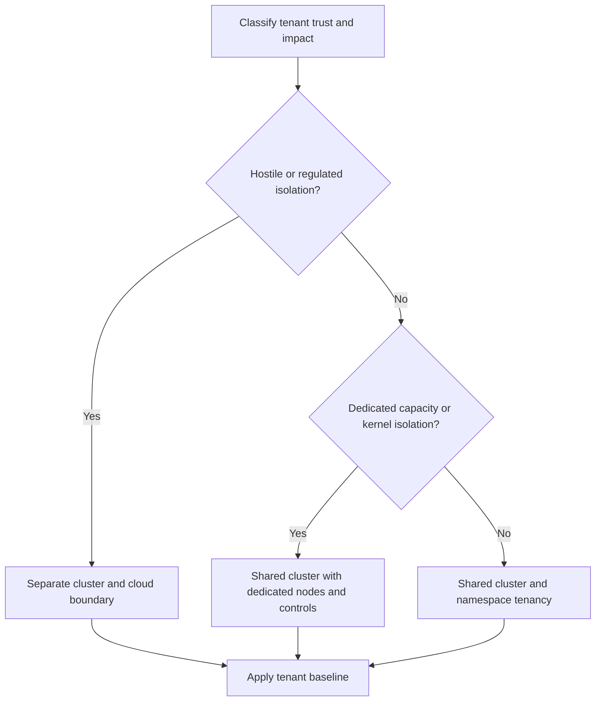

> **文档类型：** 应用与 Kubernetes 架构参考模型
> **规范性术语：** **MUST**、**MUST NOT**、**SHOULD**、**SHOULD NOT** 和 **MAY** 是要求级别。
> **适用范围：** Kubernetes 租户边界、命名空间、RBAC、网络和服务隔离、配额、扩展、加入和生命周期。
> **例外流程：** 偏离要求需要记录风险评估、补偿控制、指定风险负责人和到期日期。

|控制领域|价值|
|---|---|
|文件编号 | `APP-14` |
|负责人|云卓越中心 |
|审核周期|至少每年一次，并且在云服务、Kubernetes、安全性或运营模型发生重大变化之后 |
|证据|租户决策日志、命名空间基线、RBAC 和网络测试、配额控制、入驻证据和生命周期审查 |

# Kubernetes 多租户和命名空间架构

> **决策简述：** 将命名空间视为一层租户，并在风险需要时选择更强大的集群、账户、节点、网络、身份或操作隔离。

## 目的

多租户共享平台功能，同时保留所有权并限制干扰。命名空间是管理边界，而不是自动的安全边界。强隔离可能需要单独的集群、云账户、节点、网络、身份、密钥和运营团队。

## 租户决策模型

## 隔离模型

|模型|优势|使用案例|
|---|---|---|
|每个团队或应用的命名空间 |行政分离|值得信赖的内部团队 |
|共享集群中的专用节点 |容量和部分工作负载分离|专用硬件或更高影响力 |
|虚拟控制平面或沙箱|更强的 API 或运行时边界 |内部平台庞大，支持成熟|
|每个租户或信任域的集群 |最强常规边界 |受监管、敌对或高影响力的租户 |

不要仅仅因为配置了命名空间 RBAC，就将敌对租户置于共享内核环境中。

## 命名空间模型

使用与所有权和生命周期一致的可预测命名空间，例如应用加环境。当每个微服务创建过多的策略重复时，避免使用一个命名空间，并避免使用一个组织范围内的命名空间来消除有意义的边界。

每个租户命名空间需要：

- 负责任的所有者和支持联系人。
- 资源配额和限制范围。
- 默认拒绝网络策略。
- 强制 Pod 安全级别。
- 限定范围的服务账户和云工作负载身份。
- 批准的机密和证书访问。
- 成本、所有权、环境和数据分类所需的标签。
- 日志、指标、备份和保留策略。

## RBAC 和身份

绑定身份提供商群体而不是个人。单独的部署、查看、调试、机密读取和命名空间管理角色。避免通配符并保护 `roles`、`rolebindings`、服务账户、令牌请求、Webhook 配置、CRD 和集群范围的资源。

命名空间管理员必须无法通过特权 Pod、主机挂载、危险功能或不受控制的云身份进行逃脱。

## 网络和服务隔离

使用默认拒绝入口和出口。明确授权共享平台服务、DNS、遥测、网关和依赖项。限制跨命名空间路由附加和服务引用。为了获取更高的隔离性，请使用专用子网、节点池、出口路径或集群。

重叠的服务名称、共享 DNS 区域和全局服务导出需要多集群环境中的命名治理。

## 资源公平性

设置 CPU、内存、存储、对象计数、负载均衡器和持久卷的配额。谨慎使用优先级，这样一个租户就不会缺乏平台服务。监视实际资源与请求的资源并定义突发布为。

专用节点池需要污点、容忍、关联策略、自动扩缩容边界、补丁所有权和成本归因。

## 平台扩展控件

租户不应安装任意 CRD、操作员、准入 Webhook、存储类、入口控制器或集群角色。提供评估权限、可用性、升级、镜像来源、数据访问和卸载行为的接收流程。

## 多云映射

跨 AKS、EKS、GKE 和 OKE 一致地应用集群和命名空间控制。在需要时使用订阅、账户、项目和隔间作为更强的隔离边界。即使云 IAM 集成不同，也可以标准化所有权和策略标签。

## 租户入驻
1. 对信任、数据、可用性和合规性要求进行分类。
2. 选择隔离模型并记录决定。
3. 根据经过审核的模板创建命名空间或集群。
4. 应用身份、配额、策略、网络、机密和遥测基线。
5. 运行正面和负面授权测试。
6. 注册所有权、成本中心、支持和生命周期日期。

卸载必须停止工作负载、保留所需数据、撤销身份、删除路由和机密、释放容量，并验证终结器或保留卷不会留下非托管资源。

## 租户分类

在安置前对每个租户进行分类：

|尺寸|高风险值的示例 |
|---|---|
|信任|第三方代码、恶意用户、学生或客户提交的工作负载 |
|数据|受监管、客户隔离、出口管制、高度保密 |
|可用性 |是否会耗尽共享容量或需要独立维护 |
|特权|需要主机集成、自定义 CNI/CSI、特权容器、集群范围的 API |
|运营|单独的管理员、支持团队或更改窗口 |
|成本|专用成本分摊、预留容量或硬性预算边界 |

仅命名空间模型应用于工作负载可能受到策略限制的合作租户。它不足以满足敌意执行或需要独立管理控制的要求。

## 命名空间基线模板

命名空间应从版本化模板创建，其中包括：

- 所有权、环境、数据分类和成本标签。
- 资源配额和限制范围。
- Pod 安全强制标签。
- 具有批准的平台流的默认拒绝入口和出口策略。
- 私有服务账户和工作负载身份约定。
- 用于查看、部署、调试和管理的 RBAC 组。
- 日志、指标、跟踪、备份和保留设置。
- 批准的网关附件和证书模式。
- 使用时带有所有者和到期日的异常注释。

模板更新需要现有命名空间的迁移计划。创建新的合规命名空间，同时让旧命名空间不受管理，并不能建立租户标准。

## 共享服务架构

共享网关、DNS、机密提供程序、可观测性收集器、注册表、服务网格和数据服务可以创建跨租户依赖项。对于每个共享服务，定义租户身份验证、授权、配额、隔离、可用性、数据可见性和事件所有权。

防止租户控制的标签、路由、导出器或仪表板暴露其他租户的数据。共享收集器和网关应强制执行资源和基数限制，以便一个租户不能降低其他租户的服务质量。

## 行政授权

命名空间管理员可以管理应用资源，但不能创建权限提升路径。保护角色绑定、服务账户令牌请求、工作负载身份注释、准入资源、网络策略豁免以及共享网关的路由。
使用模拟和授权测试来证明每个委派角色可以做什么和不能做什么。角色名称本身并不能证明最低权限。

## 租户生命周期和陈旧资源控制

入驻应产生清单记录以及到期或审核日期。定期识别废弃的命名空间、未使用的负载均衡器、未附加的卷、过时的身份、休眠的机密和策略异常。

卸载需要在删除之前做出数据处置决定。根据策略保留或销毁备份、日志和审计证据；撤销访问权限；删除路由和 DNS；并验证操作员或控制器创建的外部资源。卡在 `Terminating` 中的命名空间是一个不完整的脱离事件，而不是一个无害的外观问题。

## 验证

- [ ] 租户信任和影响分类决定隔离。
- [ ] 命名空间具有所有者、配额、限制和所需标签。
- [ ] RBAC 可防止租户升级和集群范围内的突变。
- [ ] Pod 安全和准入策略强制执行工作负载基线。
- [ ] 测试默认拒绝网络和批准的跨租户流。
- [ ] 云工作负载身份是租户范围和环境范围的。
- [ ] 平台扩展需要集中审查。
- [ ] 测试嘈杂邻居、配额和节点故障行为。
- [ ] 成本和容量由租户承担。
- [ ] 入驻和离职是自动化且可审核的。

## 操作注意事项

监控授权拒绝、配额饱和、策略异常、跨命名空间流、成本异常、特权工作负载、废弃的命名空间和共享服务依赖项。每当租户信任、数据分类或影响发生变化时，请检查隔离决策。

## 相关主题

- [AKS 平台架构](app-aks-platform-architecture.md)
- [Kubernetes 应用安全和策略标准](app-kubernetes-application-security-and-policy-standards.md)
- [Kubernetes 应用网络和网关架构](app-kubernetes-application-networking-and-gateway-architecture.md)
- [应用身份、身份验证和 Easy Auth](app-application-identity-authentication-and-easy-auth.md)

## 参考文档

- [Kubernetes：多租户](https://kubernetes.io/docs/concepts/security/multi-tenancy/)
- [Kubernetes：命名空间](https://kubernetes.io/docs/concepts/overview/working-with-objects/namespaces/)
- [Kubernetes：资源配额](https://kubernetes.io/docs/concepts/policy/resource-quotas/)
- [Kubernetes：RBAC 良好实践](https://kubernetes.io/docs/concepts/security/rbac-good-practices/)
- [Kubernetes：Pod 安全标准](https://kubernetes.io/docs/concepts/security/pod-security-standards/)
