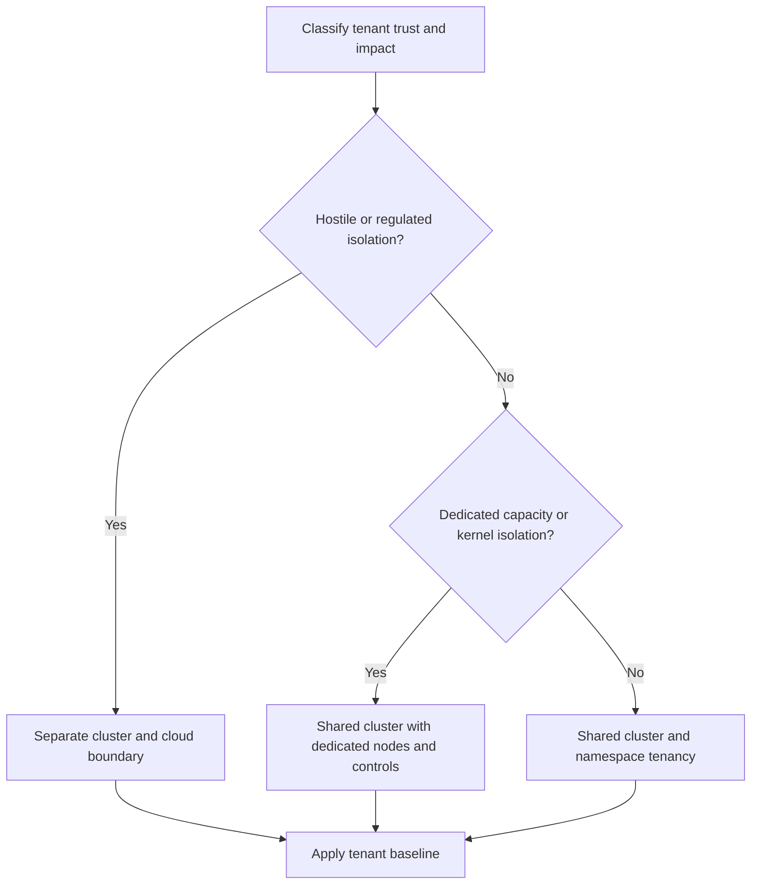

> **Document class:** Applications & Kubernetes architecture reference model
> **Normative terms:** **MUST**, **MUST NOT**, **SHOULD**, **SHOULD NOT**, and **MAY** are requirements levels.
> **Applicability:** Kubernetes tenant boundaries, namespaces, RBAC, network and service isolation, quotas, extensions, onboarding, and lifecycle.
> **Exception process:** Deviations require a documented risk assessment, compensating controls, named risk owner, and expiry date.

| Control field | Value |
|---|---|
| Document ID | `APP-14` |
| Owner | Cloud Center of Excellence |
| Review cycle | At least annually and after material cloud-service, Kubernetes, security, or operating-model changes |
| Evidence | Tenancy decision record, namespace baseline, RBAC and network tests, quota controls, onboarding evidence, and lifecycle reviews |

# Kubernetes Multi-Tenancy and Namespace Architecture

> **Decision in brief:** Treat namespaces as one layer of tenancy, and choose stronger cluster, account, node, network, identity, or operational isolation when risk requires it.

## Purpose

Multi-tenancy shares platform capabilities while preserving ownership and limiting interference. A namespace is an administrative boundary, not automatically a security boundary. Strong isolation may require separate clusters, cloud accounts, nodes, networks, identities, keys, and operations teams.

## Tenancy decision model

## Isolation models

| Model | Strength | Use case |
|---|---|---|
| Namespace per team or application | Administrative separation | Trusted internal teams |
| Dedicated nodes within shared cluster | Capacity and some workload separation | Specialized hardware or higher impact |
| Virtual control plane or sandbox | Stronger API or runtime boundary | Large internal platforms with mature support |
| Cluster per tenant or trust domain | Strongest conventional boundary | Regulated, hostile, or high-impact tenants |

Do not place hostile tenants in a shared kernel environment solely because namespace RBAC is configured.

## Namespace model

Use predictable namespaces aligned to ownership and lifecycle, such as application plus environment. Avoid one namespace per microservice when it creates excessive policy duplication, and avoid one organization-wide namespace that removes meaningful boundaries.

Each tenant namespace requires:

- Accountable owner and support contact.
- ResourceQuota and LimitRange.
- Default-deny network policies.
- Enforced Pod Security level.
- Scoped service accounts and cloud workload identities.
- Approved secret and certificate access.
- Required labels for cost, ownership, environment, and data classification.
- Log, metric, backup, and retention policy.

## RBAC and identity

Bind identity-provider groups rather than individuals. Separate deploy, view, debug, secret-read, and namespace-admin roles. Avoid wildcards and protect `roles`, `rolebindings`, service accounts, token requests, webhook configurations, CRDs, and cluster-scoped resources.

Namespace administrators must not be able to escape through privileged pods, host mounts, dangerous capabilities, or uncontrolled cloud identities.

## Network and service isolation

Use default-deny ingress and egress. Explicitly authorize shared platform services, DNS, telemetry, gateways, and dependencies. Restrict cross-namespace route attachment and service references. For higher isolation, use dedicated subnets, node pools, egress paths, or clusters.

Overlapping service names, shared DNS zones, and global service export require naming governance in multi-cluster environments.

## Resource fairness

Set quotas for CPU, memory, storage, object count, load balancers, and persistent volumes. Use priority classes carefully so one tenant cannot starve platform services. Monitor actual versus requested resources and define burst behavior.

Dedicated node pools require taints, tolerations, affinity policy, autoscaling boundaries, patch ownership, and cost attribution.

## Platform extension controls

Tenants should not install arbitrary CRDs, operators, admission webhooks, storage classes, ingress controllers, or cluster roles. Provide an intake process that evaluates permissions, availability, upgrades, image provenance, data access, and uninstall behavior.

## Multi-cloud mapping

Apply cluster and namespace controls consistently across AKS, EKS, GKE, and OKE. Use subscriptions, accounts, projects, and compartments as stronger isolation boundaries where required. Normalize ownership and policy labels even when cloud IAM integrations differ.

## Tenant onboarding

1. Classify trust, data, availability, and compliance requirements.
2. Select the isolation model and record the decision.
3. Create namespaces or clusters from a reviewed template.
4. Apply identity, quota, policy, network, secret, and telemetry baselines.
5. Run positive and negative authorization tests.
6. Register ownership, cost center, support, and lifecycle dates.

Offboarding must stop workloads, preserve required data, revoke identities, remove routes and secrets, release capacity, and verify that finalizers or retained volumes do not leave unmanaged resources.

## Tenant classification

Classify every tenant before placement:

| Dimension | Examples of higher-risk values |
|---|---|
| Trust | Third-party code, hostile users, student or customer-submitted workloads |
| Data | Regulated, customer-isolated, export-controlled, high confidentiality |
| Availability | Can exhaust shared capacity or requires independent maintenance |
| Privilege | Needs host integration, custom CNI/CSI, privileged containers, cluster-scoped APIs |
| Operations | Separate administrators, support teams, or change windows |
| Cost | Dedicated chargeback, reserved capacity, or hard budget boundary |

A namespace-only model is appropriate for cooperative tenants whose workloads can be constrained by policy. It is not adequate for hostile execution or requirements that demand independent administrative control.

## Namespace baseline template

Namespaces should be created from a versioned template that includes:

- Ownership, environment, data classification, and cost labels.
- ResourceQuota and LimitRange.
- Pod Security enforcement labels.
- Default-deny ingress and egress policy with approved platform flows.
- Dedicated service accounts and workload-identity conventions.
- RBAC groups for view, deploy, debug, and administration.
- Logging, metric, trace, backup, and retention settings.
- Approved gateway attachment and certificate pattern.
- Exception annotations with owner and expiry where used.

Template updates require a migration plan for existing namespaces. Creating new compliant namespaces while leaving old namespaces unmanaged does not establish a tenancy standard.

## Shared-service architecture

Shared gateways, DNS, secret providers, observability collectors, registries, service meshes, and data services can create cross-tenant dependencies. For each shared service, define tenant authentication, authorization, quotas, isolation, availability, data visibility, and incident ownership.

Prevent tenant-controlled labels, routes, exporters, or dashboards from exposing another tenant's data. Shared collectors and gateways should enforce resource and cardinality limits so one tenant cannot degrade the service for others.

## Administrative delegation

Namespace administrators may manage application resources but should not be able to create privilege-escalation paths. Protect role bindings, service-account token requests, workload identity annotations, admission resources, network-policy exemptions, and routes to shared gateways.

Use impersonation and authorization tests to prove what each delegated role can and cannot do. Role names alone are not evidence of least privilege.

## Tenant lifecycle and stale-resource control

Onboarding should produce an inventory record and an expiration or review date. Periodically identify abandoned namespaces, unused load balancers, unattached volumes, stale identities, dormant secrets, and policy exceptions.

Offboarding requires a data disposition decision before deletion. Retain or destroy backups, logs, and audit evidence according to policy; revoke access; remove routes and DNS; and verify external resources created by operators or controllers. A namespace stuck in `Terminating` is an incomplete offboarding event, not a harmless cosmetic issue.

## Validation

- [ ] Tenant trust and impact classification determines isolation.
- [ ] Namespaces have owners, quotas, limits, and required labels.
- [ ] RBAC prevents tenant escalation and cluster-wide mutation.
- [ ] Pod Security and admission policy enforce the workload baseline.
- [ ] Default-deny networking and approved cross-tenant flows are tested.
- [ ] Cloud workload identities are tenant- and environment-scoped.
- [ ] Platform extensions require central review.
- [ ] Noisy-neighbor, quota, and node-failure behavior is tested.
- [ ] Costs and capacity are attributable to tenants.
- [ ] Onboarding and offboarding are automated and auditable.

## Operational considerations

Monitor authorization denials, quota saturation, policy exceptions, cross-namespace flows, cost anomalies, privileged workloads, abandoned namespaces, and shared-service dependencies. Review the isolation decision whenever tenant trust, data classification, or impact changes.

## Related topics

- [AKS Platform Architecture](app-aks-platform-architecture.md)
- [Kubernetes Application Security and Policy Standards](app-kubernetes-application-security-and-policy-standards.md)
- [Kubernetes Application Networking and Gateway Architecture](app-kubernetes-application-networking-and-gateway-architecture.md)
- [Application Identity, Authentication, and Easy Auth](app-application-identity-authentication-and-easy-auth.md)

## References

- [Kubernetes: Multi-tenancy](https://kubernetes.io/docs/concepts/security/multi-tenancy/)
- [Kubernetes: Namespaces](https://kubernetes.io/docs/concepts/overview/working-with-objects/namespaces/)
- [Kubernetes: Resource Quotas](https://kubernetes.io/docs/concepts/policy/resource-quotas/)
- [Kubernetes: RBAC good practices](https://kubernetes.io/docs/concepts/security/rbac-good-practices/)
- [Kubernetes: Pod Security Standards](https://kubernetes.io/docs/concepts/security/pod-security-standards/)
