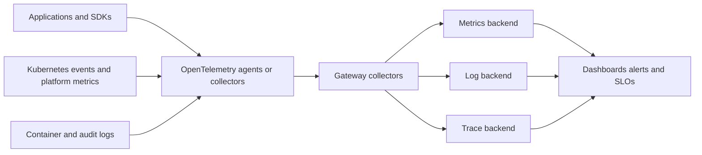

> **文档类型：**应用与 Kubernetes 强制工程标准
> **规范性术语：** **MUST**、**MUST NOT**、**SHOULD**、**SHOULD NOT** 和 **MAY** 是要求级别。
> **适用范围：** Kubernetes 指标、日志、跟踪、OpenTelemetry 收集器、资源属性、SLO、关联、治理和成本控制。
> **例外流程：** 偏离要求需要记录风险评估、补偿控制、指定风险负责人和到期日期。

|控制领域|价值|
|---|---|
|文件编号 | `APP-13` |
|负责人|云卓越中心 |
|审核周期|至少每年一次，并且在云服务、Kubernetes、可观测性、安全性或运营模型发生重大变化之后 |
|证据|遥测契约、收集器配置、资源属性检查、SLO 证据、相关性测试和数据治理审查 |

# Kubernetes 可观测性和 OpenTelemetry 标准

> **决策简述：** 通过一致的身份、资源属性、指标、日志、跟踪、SLO 和具有明确所有权的成本感知集合，使每个工作负载都可监控。

## 目的

可观测性必须允许团队确定发生了什么变化、正在运行哪个版本、请求在哪里失败、用户是否受到影响以及哪个组件负责响应。该标准定义了一个提供商中立的遥测契约，在可行的情况下使用 OpenTelemetry。

## 参考架构

## 遥测契约

每项生产服务必须提供：

- 请求或事务率、错误、持续时间和饱和度。
- 包含时间戳、严重性、服务、环境、版本和相关标识符的结构化日志。
- 关键跨服务路径的分布式跟踪。
- 运行状况、依赖性、队列和后台工作信号。
- 部署和配置更改标记。
- SLO 和告警与用户影响相关。

请勿将密码、令牌、个人数据或无限制的有效负载放入遥测中。

## 资源属性

标准化服务名称、命名空间、版本、部署环境、集群、云提供商、区域和责任团队。保持属性名称在 Azure、AWS、GCP 和 OCI 中稳定，以便仪表板和告警保持可移植性。

避免使用高基数维度，例如指标中的用户 ID、请求 ID、完整 URL、Pod UID 或异常消息。这些值可能属于受控保留的日志或跟踪。

## 收集器部署模型

### 节点代理

DaemonSet 收集容器日志和节点本地遥测数据。它最大限度地减少了应用配置，但需要对每个节点进行资源和安全控制。

### 网关收集器

集中式或区域部署执行采样、过滤、丰富和导出。使其具有区域弹性、自动扩展、排队并免受嘈杂租户的影响。

### 边车

仅当工作负载需要强大的本地隔离或协议处理时才使用。 Sidecar 增加了 Pod 资源和生命周期的复杂性。

大多数平台使用节点代理加网关收集器。

## 指标和 SLO

从用户旅程定义服务级别指标，而不仅仅是 Pod 运行状况。使用错误预算消耗速率告警来确定错误预算，并将紧急症状与诊断信号分开。重新启动的 Pod 是上下文；失败的客户交易受到影响。

控制抓取间隔、直方图桶、标签和保留。记录缺失数据行为，以便遥测中断不会显示为健康的零值。

## 日志记录标准

- 将结构化事件写入标准输出和错误，除非存在平台异常。
- 使用一致的严重性和事件名称。
- 包括关联和跟踪标识符。
- 在导出之前对机密和受监管的数据进行脱敏。
- 限制消息大小和速率。
- 单独保存审计日志，并进行更严格的访问和保留。
- 当结构化字段可用时，避免使用多行、自由格式的日志进行机器处理。

## 追踪和采样

跨同步调用和消息传递传播 W3C 跟踪上下文。当收集器可以支持时，使用头部采样来实现可预测的成本，使用尾部采样来获取重要错误或高延迟跟踪。记录哪些服务中断传播。

抽样不得消除强制性审计证据。控制属性采集和行李以防止敏感数据传播。

## Kubernetes 信号

收集工作负载状态、重新启动、调度延迟、挂起的 Pod、逐出、资源限制、OOM 事件、Autoscaler 决策、卷错误、网关运行状况、证书过期、GitOps 协调准入拒绝。 Kubernetes 事件是短暂的操作信号，如果需要进行调查，应将其导出。
## 多云集成

|云|本地目的地示例 |便携式集成 |
|---|---|---|
|Azure| Azure Monitor、Application Insights、托管 Prometheus | OTLP 和 OpenTelemetry Collector |
|AWS | CloudWatch、Managed Service for Prometheus、X-Ray | OTLP 和 OpenTelemetry Collector |
| GCP |Cloud Monitoring、Cloud Logging、Cloud Trace | OTLP 和 OpenTelemetry Collector |
|OCI |监控、日志、APM | OTLP 和 OpenTelemetry Collector |

在应用边界使用开放协议，并在受控收集层使用提供程序导出器。

## 可靠性和成本控制

遥测管道需要队列、内存限制、背压、重试边界、删除指标和容量告警。定义优先级，以便关键审计和 SLO 信号能够承受过载。按数据值、合规性需求和调查窗口应用保留和抽样。

## 遥测数据治理

遥测数据必须像其他数据一样进行分类和管理。设计应定义允许的属性、禁止的数据、保留、驻留、加密、访问角色、合法保留和删除。日志和跟踪经常包含从未用于中央分析平台的标识符和有效负载片段。

应用尽可能靠近源的过滤，但保留足够的元数据来调查故障。脱敏规则需要测试，因为字段名称、异常格式和第三方库会随着时间的推移而变化。

## 收集器管道设计

收集器配置应按遥测类别和关键性将接收器、处理器、导出器和路由分开。生产设计应包括：

- 内存限制和队列大小。
- 批量行为和最大有效负载大小。
- 重试范围和导出器超时。
- 网关收集器的负载均衡或分片。
- 在丢失容限需要的情况下持续排队。
- 丢弃和拒绝指标。
- 租户或命名空间隔离，其中一个来源可能会产生过多的容量。
- 受控的配置推出和回滚过程。

关键审计数据不应与大容量调试遥测共享无限的故障路径。在后端中断期间，收集器必须保护节点和应用的可用性，即使这需要删除较低价值的数据。

## SLO 实施标准

每个 SLO 应标识服务边界、用户旅程、SLI 查询、目标、测量窗口、排除的事件、数据源、所有者和告警策略。针对已知的良好和已知的不良事务验证查询。丢失遥测数据不得自动解释为成功。

使用多窗口错误预算消耗速率告警或等效方法来识别快速和持续的错误预算消耗。Pod 重新启动或高 CPU 等诊断告警可能支持调查，但不应独立寻呼，除非它们预测即将对用户造成影响。

## 异步工作的跟踪和日志关联
消息传递打破了简单的请求-响应跟踪模型。生产者应该在支持的消息属性中传播跟踪上下文，并创建链接到生产者上下文的新消费者范围。记录消息标识符、目的地、尝试、处理结果和死信转换，而无需将敏感负载放入遥测中。

长时间运行的作业应发出执行标识、分区或分片、检查点进度、重试计数和最终完成状态。相关性必须在 pod 重新启动和重新调度后仍然存在。

## 平台事件的最低诊断

该平台应允许响应者确定：

- 哪些集群、命名空间、工作负载、版本、镜像摘要和节点受到影响。
- 准入、调度、镜像拉取、机密挂载、DNS、网络、存储或身份是否失败。
- 问题是否在部署、策略、配置、证书或平台更改后开始。
- 影响是否与租户、区域、节点池、区域或依赖项隔离。
- 遥测本身是否不完整或延迟。

仪表板应该从用户影响视图链接到工作负载、Kubernetes、云和变更证据，而不需要手动标识符转换。

## 验证

- [ ] 服务发出标准化资源和相关属性。
- [ ] 指标、日志、跟踪、事件和部署标记相互关联。
- [ ] SLO 度量用户结果并测试告警。
- [ ] 机密和敏感负载在导出前被过滤。
- [ ] 基数、体积、保留和采样都有限制。
- [ ] 收集器是隔离的、有弹性的、受监控的和经过容量测试的。
- [ ] 遥测丢失和导出器故障是可见的。
- [ ] 多云仪表板使用标准化属性。
- [ ] 运行手册将告警链接到所有者和诊断视图。

## 操作注意事项

查看未使用的遥测、告警质量、存储增长、最高基数源、采样有效性和收集器版本差异。测试可观测性后端中断并确认应用在收集器限制资源使用时仍然可用。

## 相关主题

- [交付和操作 AKS 工作负载](app-delivering-and-operating-aks-workloads.md)
- [弹性、扩展和部署策略](app-resilience-scaling-and-deployment-strategies.md)
- [服务网格架构和采用指南](app-service-mesh-architecture-and-adoption-guidelines.md)
- [AKS 平台架构](app-aks-platform-architecture.md)

## 参考文档

- [OpenTelemetry 文档](https://opentelemetry.io/docs/)
- [OpenTelemetry：Kubernetes](https://opentelemetry.io/docs/platforms/kubernetes/)
- [Kubernetes：日志架构](https://kubernetes.io/docs/concepts/cluster-administration/logging/)
- [Kubernetes：资源指标管道](https://kubernetes.io/docs/tasks/debug/debug-cluster/resource-metrics-pipeline/)
- [Google SRE：服务级别目标](https://sre.google/workbook/implementing-slos/)
