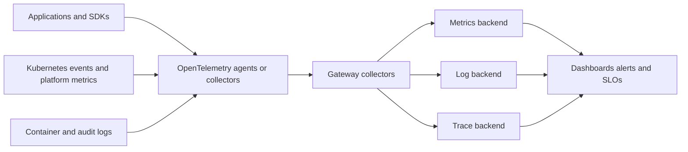

> **Document class:** Applications & Kubernetes mandatory engineering standard
> **Normative terms:** **MUST**, **MUST NOT**, **SHOULD**, **SHOULD NOT**, and **MAY** are requirements levels.
> **Applicability:** Kubernetes metrics, logs, traces, OpenTelemetry collectors, resource attributes, SLOs, correlation, governance, and cost controls.
> **Exception process:** Deviations require a documented risk assessment, compensating controls, named risk owner, and expiry date.

| Control field | Value |
|---|---|
| Document ID | `APP-13` |
| Owner | Cloud Center of Excellence |
| Review cycle | At least annually and after material cloud-service, Kubernetes, observability, security, or operating-model changes |
| Evidence | Telemetry contract, collector configuration, resource-attribute checks, SLO evidence, correlation tests, and data-governance review |

# Kubernetes Observability and OpenTelemetry Standards

> **Decision in brief:** Make every workload observable through consistent identity, resource attributes, metrics, logs, traces, SLOs, and cost-aware collection with clear ownership.

## Purpose

Observability must allow teams to determine what changed, which version is running, where a request failed, whether users are affected, and which component owns the response. This standard defines a vendor-neutral telemetry contract using OpenTelemetry where practical.

## Reference architecture

## Telemetry contract

Every production service must provide:

- Request or transaction rate, errors, duration, and saturation.
- Structured logs with timestamp, severity, service, environment, version, and correlation identifiers.
- Distributed traces for critical cross-service paths.
- Health, dependency, queue, and background-worker signals.
- Deployment and configuration-change markers.
- SLOs and alerting tied to user impact.

Do not place passwords, tokens, personal data, or unbounded payloads in telemetry.

## Resource attributes

Standardize service name, namespace, version, deployment environment, cluster, cloud provider, region, and accountable team. Keep attribute names stable across Azure, AWS, GCP, and OCI so dashboards and alerts remain portable.

Avoid high-cardinality dimensions such as user ID, request ID, full URL, pod UID, or exception message in metrics. These values may belong in logs or traces with controlled retention.

## Collector deployment models

### Node agent

A DaemonSet collects container logs and node-local telemetry. It minimizes application configuration but requires resource and security controls on every node.

### Gateway collector

A centralized or regional Deployment performs sampling, filtering, enrichment, and export. Make it zone-resilient, autoscaled, queued, and protected from noisy tenants.

### Sidecar

Use only when a workload needs strong local isolation or protocol handling. Sidecars increase pod resources and lifecycle complexity.

Most platforms use node agents plus gateway collectors.

## Metrics and SLOs

Define service-level indicators from the user journey, not only pod health. Use burn-rate alerts for error budgets and separate urgent symptoms from diagnostic signals. A restarted pod is context; failed customer transactions are impact.

Control scrape intervals, histogram buckets, labels, and retention. Record missing-data behavior so telemetry outages do not appear as healthy zero values.

## Logging standards

- Write structured events to standard output and error unless a platform exception exists.
- Use consistent severity and event names.
- Include correlation and trace identifiers.
- Redact secrets and regulated data before export.
- Bound message size and rate.
- Preserve audit logs separately with stricter access and retention.
- Avoid multiline, free-form logs for machine processing when structured fields are available.

## Tracing and sampling

Propagate W3C Trace Context across synchronous calls and messaging. Use head sampling for predictable cost and tail sampling for important errors or high-latency traces when the collector can support it. Document which services break propagation.

Sampling must not remove mandatory audit evidence. Control attribute capture and baggage to prevent sensitive-data propagation.

## Kubernetes signals

Collect workload status, restarts, scheduling latency, pending pods, evictions, resource throttling, OOM events, autoscaler decisions, volume errors, gateway health, certificate expiry, GitOps reconciliation, and admission denials. Kubernetes Events are short-lived operational signals and should be exported if needed for investigation.

## Multi-cloud integration

| Cloud | Native destination examples | Portable integration |
|---|---|---|
| Azure | Azure Monitor, Application Insights, Managed Prometheus | OTLP and OpenTelemetry Collector |
| AWS | CloudWatch, Managed Service for Prometheus, X-Ray | OTLP and OpenTelemetry Collector |
| GCP | Cloud Monitoring, Cloud Logging, Cloud Trace | OTLP and OpenTelemetry Collector |
| OCI | Monitoring, Logging, Application Performance Monitoring | OTLP and OpenTelemetry Collector |

Use open protocols at the application boundary and provider exporters at controlled collection layers.

## Reliability and cost controls

Telemetry pipelines need queues, memory limits, backpressure, retry bounds, drop metrics, and capacity alerts. Define priority so critical audit and SLO signals survive overload. Apply retention and sampling by data value, compliance need, and investigation window.

## Telemetry data governance

Telemetry must be classified and governed like other data. The design should define permitted attributes, prohibited data, retention, residency, encryption, access roles, legal hold, and deletion. Logs and traces frequently contain identifiers and payload fragments that were never intended for a central analytics platform.

Apply filtering as close to the source as practical, but retain enough metadata to investigate failures. Redaction rules require tests because field names, exception formats, and third-party libraries change over time.

## Collector pipeline design

Collector configurations should separate receivers, processors, exporters, and routing by telemetry class and criticality. A production design should include:

- Memory limits and queue sizing.
- Batch behavior and maximum payload size.
- Retry bounds and exporter timeout.
- Load balancing or sharding for gateway collectors.
- Persistent queueing where loss tolerance requires it.
- Drop and refusal metrics.
- Tenant or namespace isolation where one source could create excessive volume.
- A controlled configuration rollout and rollback process.

Critical audit data should not share an unbounded failure path with high-volume debug telemetry. During backend outage, collectors must protect node and application availability even if that requires dropping lower-value data.

## SLO implementation standard

Each SLO should identify the service boundary, user journey, SLI query, target, measurement window, excluded events, data source, owner, and alert policy. Validate the query against known good and known bad transactions. Missing telemetry must not be interpreted automatically as success.

Use multi-window burn-rate alerts or an equivalent method to identify both rapid and sustained error-budget consumption. Diagnostic alerts such as pod restart or high CPU may support investigation but should not page independently unless they predict imminent user impact.

## Trace and log correlation for asynchronous work

Messaging breaks the simple request-response trace model. Producers should propagate trace context in supported message attributes and create a new consumer span linked to the producer context. Record message identifier, destination, attempt, processing outcome, and dead-letter transition without placing sensitive payloads in telemetry.

Long-running jobs should emit execution identity, partition or shard, checkpoint progress, retry count, and final completion status. Correlation must survive pod restart and rescheduling.

## Diagnostic minimum for platform incidents

The platform should allow responders to determine:

- Which cluster, namespace, workload, version, image digest, and node are affected.
- Whether admission, scheduling, image pull, secret mount, DNS, network, storage, or identity failed.
- Whether the issue began after a deployment, policy, configuration, certificate, or platform change.
- Whether impact is isolated to a tenant, zone, node pool, region, or dependency.
- Whether telemetry itself is incomplete or delayed.

Dashboards should link from user-impact views to workload, Kubernetes, cloud, and change evidence without requiring manual identifier translation.

## Validation

- [ ] Services emit standardized resource and correlation attributes.
- [ ] Metrics, logs, traces, events, and deployment markers correlate.
- [ ] SLOs measure user outcomes and have tested alerts.
- [ ] Secrets and sensitive payloads are filtered before export.
- [ ] Cardinality, volume, retention, and sampling have limits.
- [ ] Collectors are isolated, resilient, monitored, and capacity-tested.
- [ ] Telemetry loss and exporter failure are visible.
- [ ] Multi-cloud dashboards use normalized attributes.
- [ ] Runbooks link alerts to owners and diagnostic views.

## Operational considerations

Review unused telemetry, alert quality, storage growth, top cardinality sources, sampling effectiveness, and collector version skew. Test an observability-backend outage and confirm that applications remain available while collectors bound resource use.

## Related topics

- [Delivering and Operating AKS Workloads](app-delivering-and-operating-aks-workloads.md)
- [Resilience, Scaling, and Deployment Strategies](app-resilience-scaling-and-deployment-strategies.md)
- [Service Mesh Architecture and Adoption Guidelines](app-service-mesh-architecture-and-adoption-guidelines.md)
- [AKS Platform Architecture](app-aks-platform-architecture.md)

## References

- [OpenTelemetry documentation](https://opentelemetry.io/docs/)
- [OpenTelemetry: Kubernetes](https://opentelemetry.io/docs/platforms/kubernetes/)
- [Kubernetes: Logging architecture](https://kubernetes.io/docs/concepts/cluster-administration/logging/)
- [Kubernetes: Resource metrics pipeline](https://kubernetes.io/docs/tasks/debug/debug-cluster/resource-metrics-pipeline/)
- [Google SRE: Service level objectives](https://sre.google/workbook/implementing-slos/)
