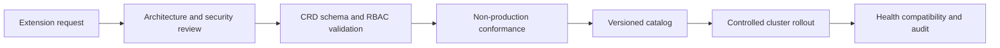

> **文档类型：** 应用和 Kubernetes 实施指南
> **规范性术语：** **MUST**、**MUST NOT**、**SHOULD**、**SHOULD NOT** 和 **MAY** 是要求级别。
> **适用范围：** Kubernetes Operator、CRD、控制器、准入 Webhook、外部副作用、升级、退役和供应链控制。
> **例外流程：** 偏离要求需要记录风险评估、补偿控制、指定风险负责人和到期日期。

|控制领域|价值|
|---|---|
|文件编号 | `APP-17` |
|负责人|云卓越中心 |
|审核周期|至少每年一次，并且在云服务、Kubernetes、安全性或运营模型发生重大变化之后 |
|证据|扩展风险评估、CRD 和 webhook 测试、控制器恢复、供应链来源、升级证据和退役练习 |

# Kubernetes Operator、CRD 和准入 Webhook 治理

> **决策简述：** 将 Kubernetes Operator、CRD 和 Webhook 视为具有显式 API 所有权、故障行为、升级路径和删除测试的控制平面依赖项。

## 目的

Operator 使用自定义 API 和协调逻辑来扩展 Kubernetes。准入 Webhooks 可以接受、拒绝或改变几乎每个 API 请求。这些组件是具有控制平面影响的平台依赖项，需要比普通应用部署进行更严格的审查。

## 治理架构

## 选择标准

在批准 Operator 或 Webhook 之前，请评估：

- 内置 API 或外部自动化无法更简单地解决的明显问题。
- 维护者声誉、发布节奏、支持模型和漏洞响应。
- 签名的制品、SBOM、来源证明和依赖状态。
- 请求的集群角色、机密访问、网络访问和主机权限。
- CRD 架构、状态条件、终结器、转换、备份和卸载行为。
- 高可用性、资源使用、规模限制和故障行为。
- Kubernetes 和云平台兼容性。

## CRD 标准

- 使用结构化 OpenAPI 模式并在兼容性允许的情况下拒绝未知字段。
- 将所需的 `spec` 与观测到的 `status` 分开。
- 精心定义条件、默认值、验证和打印机列。
- 保持向后兼容性或提供跨已提供服务的版本进行转换。
- 选择一个存储版本并测试迁移。
- 记录命名空间范围、所有权、删除、终结器和恢复。
- 避免在自定义资源中存储大量有效负载、机密或快速变化的遥测数据。

CRD 是集群范围的 API，即使它们的实例是命名空间的。变化会影响每个租户。

## 控制器标准

控制器必须进行幂等协调、处理重试和部分失败、绑定并发、公开运行状况和指标、使用领导者选举来实现高可用性，并记录可运维的状态。除非所有权明确，否则它们不得假定对外部资源的独占访问权。

在可行的情况下，对命名资源使用最小权限 RBAC。按职责分离 Operator 服务账户，并避免为了方便而生成通配符权限。

## 准入 webhook 标准

- 跨故障域运行多个副本。
- 设置较短的超时和严格限定的匹配规则。
- 根据风险定义 `failurePolicy`：针对关键保护的故障关闭，仅通过监控和补偿控制进行故障开放。
- 必要时排除 webhook 自己的恢复资源以防止死锁。
- 使用有效的轮换服务证书并监控过期情况。
- 避免请求路径中的外部网络调用。
- 测试 API 服务器和 Webhook 过载行为。

当减少操作依赖性时，首选内置准入策略进行直接验证。

## 升级和删除

按照支持的顺序升级 CRD、转换 Webhook、控制器和自定义资源。在全面推出之前备份资源、测试架构转换、对控制器进行金丝雀发布并监控协调情况。

卸载控制器不会安全地删除终结器或外部资源。文档暂停、终结器处理、数据导出、CRD 保留、依赖资源清理以及初次采用之前的回滚。

## 多云可移植性

跨 AKS、EKS、GKE 和 OKE 使用相同的扩展目录和策略，但独立验证提供程序集成、身份、存储驱动程序、负载均衡器和 API 版本。尽可能将特定于云的控制器与便携式应用 API 隔离。

## 扩展风险分类

按控制平面影响对扩展进行分类：
|风险等级 |示例|治理期望|
|---|---|---|
|低|具有狭窄资源的命名空间控制器|标准应用和 RBAC 审核|
|中等|集群范围的 CRD 和控制器 |平台目录、兼容性和恢复测试|
|高|准入 webhook、存储/网络控制器、广泛的机密访问 |架构和安全审批、HA 和故障测试 |
|关键|主机特权或控制平面相关的扩展 |专用所有权、隔离部署、正式风险接受 |

风险分类应考虑权限、API 拦截、外部副作用、数据访问、终结器以及不可用的影响。

## CRD 所有权和 API 语义

每个 CRD 都需要一个 API 所有者，负责架构、文档、版本控制、转换、兼容性、支持和停用。定义字段是否不可变、可合并、默认、可为空、敏感或仅状态。状态条件应使用稳定的类型和原因，以便自动化和 Operator 可以解释它们。

即使架构版本未更改，对默认设置或验证的更改也会影响现有对象。将 CRD 演变视为公共 API 管理并测试先前版本中存储的对象。

## 协调外部副作用

创建云、DNS、身份或数据资源的控制器必须记录所有权并安全地处理部分故障。协调应该是幂等的，并且必须区分可重试错误和终端配置错误。退避和并发必须保护外部 API。

删除行为需要特别审查。终结器应该具有超时、可观测性、支持所有权和记录在案的紧急删除程序。手动删除终结器可能会泄漏外部资源或数据。

## Webhook 弹性工程

应根据 API 服务器请求率、部署突发和中断后的恢复来测试 Webhook 容量。定义副本分发、中断预算、资源预留、自动扩展、TLS 续订、超时、匹配条件和故障策略。

当基于 CEL 的验证无需外部网络依赖即可满足要求时，请使用进程内声明性准入策略。当需要外部验证或复杂逻辑时使用 webhooks，并保持请求路径的确定性和快速性。

## 供应链和发布控制

按摘要固定扩展镜像、保留 SBOM 和来源证明、连续扫描并限制注册表。查看 Helm Chart和生成的 RBAC，而不是盲目接受提供商默认值。安装应该是声明性的，并生成渲染清单以供审查。

批准的目录应记录上游发布位置、支持渠道、许可、维护者状态、漏洞历史和支持结束日期。

## 退役练习

在生产采用之前，在非生产中测试暂停和移除。确认自定义资源导出、终结器处理、转换 Webhook 依赖项、外部资源清理、CRD 保留、回滚和恢复（如果控制器不存在）。无法预测地被移除的 Operator 会造成长期的平台锁定。
## 验证

- [ ] 该扩展以合理的复杂性解决了已记录在案的问题。
- [ ] 镜像和发布具有可信的供应链证据。
- [ ] RBAC、机密、网络和主机权限是最小权限。
- [ ] CRD 模式、版本、转换和删除行为经过测试。
- [ ] 控制器根据需要具有幂等性、可观测性和高可用性。
- [ ] Webhook 超时、失败策略、证书和过载已测试。
- [ ] 存在备份、恢复、升级、降级和卸载过程。
- [ ] 平台和租户所有权明确。
- [ ] 在 Kubernetes 升级之前验证兼容性。
- [ ] 未使用的扩展和 CRD 会安全退役。

## 操作注意事项

维护经过批准的扩展目录，其中包含所有者、版本、权限、支持的 Kubernetes 版本、依赖集群、风险分类和支持结束日期。有关协调错误、陈旧终结器、Webhook 延迟、证书过期、不可用副本和版本差异的告警。

## 相关主题

- [Kubernetes 应用安全和策略标准](app-kubernetes-application-security-and-policy-standards.md)
- [Kubernetes 升级和 API 生命周期管理](app-kubernetes-upgrade-and-api-lifecycle-management.md)
- [Kubernetes 上的有状态工作负载和持久存储](app-stateful-workloads-and-persistent-storage-on-kubernetes.md)
- [Kubernetes 多租户和命名空间架构](app-kubernetes-multi-tenancy-and-namespace-architecture.md)

## 参考文档

- [Kubernetes：Operator 模式](https://kubernetes.io/docs/concepts/extend-kubernetes/operator/)
- [Kubernetes：自定义资源](https://kubernetes.io/docs/concepts/extend-kubernetes/api-extension/custom-resources/)
- [Kubernetes：准入 webhooks 良好实践](https://kubernetes.io/docs/concepts/cluster-administration/admission-webhooks-good-practices/)
- [Kubernetes：CustomResourceDefinition 版本控制](https://kubernetes.io/docs/tasks/extend-kubernetes/custom-resources/custom-resource-definition-versioning/)
- [Kubernetes：控制器](https://kubernetes.io/docs/concepts/architecture/controller/)
