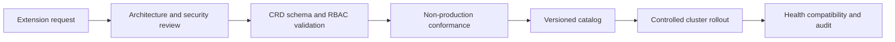

> **Document class:** Applications & Kubernetes implementation guide
> **Normative terms:** **MUST**, **MUST NOT**, **SHOULD**, **SHOULD NOT**, and **MAY** are requirements levels.
> **Applicability:** Kubernetes operators, CRDs, controllers, admission webhooks, external side effects, upgrades, decommissioning, and supply-chain controls.
> **Exception process:** Deviations require a documented risk assessment, compensating controls, named risk owner, and expiry date.

| Control field | Value |
|---|---|
| Document ID | `APP-17` |
| Owner | Cloud Center of Excellence |
| Review cycle | At least annually and after material cloud-service, Kubernetes, security, or operating-model changes |
| Evidence | Extension risk assessment, CRD and webhook tests, controller recovery, supply-chain provenance, upgrade evidence, and decommissioning exercise |

# Kubernetes Operators, CRDs, and Admission Webhook Governance

> **Decision in brief:** Treat operators, CRDs, and webhooks as control-plane dependencies with explicit API ownership, failure behavior, upgrade paths, and removal tests.

## Purpose

Operators extend Kubernetes with custom APIs and reconciliation logic. Admission webhooks can accept, reject, or mutate nearly every API request. These components are platform dependencies with control-plane impact and require stronger review than an ordinary application deployment.

## Governance architecture

## Selection criteria

Before approving an operator or webhook, evaluate:

- Clear problem that built-in APIs or external automation cannot solve more simply.
- Maintainer reputation, release cadence, support model, and vulnerability response.
- Signed artifacts, SBOM, provenance, and dependency posture.
- Requested cluster roles, secret access, network access, and host privileges.
- CRD schemas, status conditions, finalizers, conversion, backup, and uninstall behavior.
- High availability, resource use, scale limits, and failure behavior.
- Kubernetes and cloud-platform compatibility.

## CRD standards

- Use structural OpenAPI schemas and reject unknown fields where compatibility permits.
- Separate desired `spec` from observed `status`.
- Define conditions, defaults, validation, and printer columns deliberately.
- Preserve backward compatibility or provide conversion across served versions.
- Select one storage version and test migration.
- Document namespace scope, ownership, deletion, finalizers, and recovery.
- Avoid storing large payloads, secrets, or rapidly changing telemetry in custom resources.

CRDs are cluster-wide APIs even when their instances are namespaced. Changes can affect every tenant.

## Controller standards

Controllers must reconcile idempotently, handle retries and partial failure, bound concurrency, expose health and metrics, use leader election for high availability, and record actionable status. They must not assume exclusive access to external resources unless ownership is explicit.

Use least-privilege RBAC with named resources where practical. Separate operator service accounts by responsibility and avoid wildcard permissions generated for convenience.

## Admission webhook standards

- Run multiple replicas across failure domains.
- Set short timeouts and narrow match rules.
- Define `failurePolicy` from risk: fail closed for critical protection, fail open only with monitoring and compensating controls.
- Exclude the webhook's own recovery resources where necessary to prevent deadlock.
- Use valid, rotated serving certificates and monitor expiry.
- Avoid external network calls in the request path.
- Test API-server and webhook overload behavior.

Prefer built-in admission policy for straightforward validation when it reduces operational dependencies.

## Upgrade and removal

Upgrade CRDs, conversion webhooks, controllers, and custom resources in a supported order. Back up resources, test schema conversion, canary the controller, and observe reconciliation before fleet rollout.

Uninstalling a controller does not remove finalizers or external resources safely. Document suspension, finalizer handling, data export, CRD retention, dependent-resource cleanup, and rollback before initial adoption.

## Multi-cloud portability

Use the same extension catalog and policy across AKS, EKS, GKE, and OKE, but validate provider integrations, identities, storage drivers, load balancers, and API versions independently. Keep cloud-specific controllers isolated from portable application APIs where possible.

## Extension risk classification

Classify extensions by control-plane impact:

| Risk class | Example | Governance expectation |
|---|---|---|
| Low | Namespaced controller with narrow resources | Standard application and RBAC review |
| Moderate | Cluster-scoped CRD and controller | Platform catalog, compatibility and recovery testing |
| High | Admission webhook, storage/network controller, broad secret access | Architecture and security approval, HA and failure tests |
| Critical | Host-privileged or control-plane-dependent extension | Dedicated ownership, isolated rollout, formal risk acceptance |

Risk classification should consider permissions, API interception, external side effects, data access, finalizers, and the effect of unavailability.

## CRD ownership and API semantics

Every CRD needs an API owner who is accountable for schema, documentation, versioning, conversion, compatibility, support, and retirement. Define whether fields are immutable, mergeable, defaulted, nullable, sensitive, or status-only. Status conditions should use stable types and reasons so automation and operators can interpret them.

Changes to defaulting or validation can affect existing objects even when the schema version does not change. Treat CRD evolution as public API management and test stored objects from prior versions.

## Reconciliation and external side effects

Controllers that create cloud, DNS, identity, or data resources must record ownership and handle partial failure safely. Reconciliation should be idempotent and must distinguish retryable errors from terminal configuration errors. Backoff and concurrency must protect external APIs.

Deletion behavior requires special scrutiny. Finalizers should have timeout, observability, support ownership, and a documented emergency-removal procedure. Removing a finalizer manually can leak external resources or data.

## Webhook resilience engineering

Webhook capacity should be tested against API-server request rates, deployment bursts, and recovery after outage. Define replica distribution, disruption budget, resource reservation, autoscaling, TLS renewal, timeout, match conditions, and failure policy.

Use in-process declarative admission policy when a CEL-based validation can satisfy the requirement without an external network dependency. Use webhooks when external verification or complex logic is required, and keep the request path deterministic and fast.

## Supply-chain and release controls

Pin extension images by digest, retain SBOM and provenance, scan continuously, and restrict registries. Review Helm charts and generated RBAC rather than accepting vendor defaults blindly. Installation should be declarative and produce a rendered manifest for review.

The approved catalog should record upstream release location, support channel, licensing, maintainer status, vulnerability history, and end-of-support date.

## Decommissioning exercise

Before production adoption, test suspension and removal in non-production. Confirm custom-resource export, finalizer handling, conversion-webhook dependency, external-resource cleanup, CRD retention, rollback, and recovery if the controller is absent. An operator that cannot be removed predictably creates long-term platform lock-in.

## Validation

- [ ] The extension solves a documented problem with justified complexity.
- [ ] Images and releases have trusted supply-chain evidence.
- [ ] RBAC, secrets, network, and host privileges are least privilege.
- [ ] CRD schemas, versions, conversion, and deletion behavior are tested.
- [ ] Controllers are idempotent, observable, and highly available as required.
- [ ] Webhook timeout, failure policy, certificates, and overload are tested.
- [ ] Backup, restore, upgrade, downgrade, and uninstall procedures exist.
- [ ] Platform and tenant ownership is explicit.
- [ ] Compatibility is validated before Kubernetes upgrades.
- [ ] Unused extensions and CRDs are retired safely.

## Operational considerations

Maintain an approved extension catalog with owner, version, permissions, supported Kubernetes versions, dependent clusters, risk classification, and end-of-support date. Alert on reconcile errors, stale finalizers, webhook latency, certificate expiry, unavailable replicas, and version skew.

## Related topics

- [Kubernetes Application Security and Policy Standards](app-kubernetes-application-security-and-policy-standards.md)
- [Kubernetes Upgrade and API Lifecycle Management](app-kubernetes-upgrade-and-api-lifecycle-management.md)
- [Stateful Workloads and Persistent Storage on Kubernetes](app-stateful-workloads-and-persistent-storage-on-kubernetes.md)
- [Kubernetes Multi-Tenancy and Namespace Architecture](app-kubernetes-multi-tenancy-and-namespace-architecture.md)

## References

- [Kubernetes: Operator pattern](https://kubernetes.io/docs/concepts/extend-kubernetes/operator/)
- [Kubernetes: Custom resources](https://kubernetes.io/docs/concepts/extend-kubernetes/api-extension/custom-resources/)
- [Kubernetes: Admission webhooks good practices](https://kubernetes.io/docs/concepts/cluster-administration/admission-webhooks-good-practices/)
- [Kubernetes: CustomResourceDefinition versioning](https://kubernetes.io/docs/tasks/extend-kubernetes/custom-resources/custom-resource-definition-versioning/)
- [Kubernetes: Controllers](https://kubernetes.io/docs/concepts/architecture/controller/)
