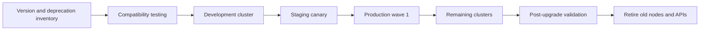

> **文档类型：** 应用和 Kubernetes 实施指南
> **规范性术语：** **MUST**、**MUST NOT**、**SHOULD**、**SHOULD NOT** 和 **MAY** 是要求级别。
> **适用范围：** Kubernetes、节点镜像、操作系统、API、附加组件、准入 Webhooks、控制器、工作负载和队列升级生命周期。
> **例外流程：** 偏离要求需要记录风险评估、补偿控制、指定风险负责人和到期日期。

|控制领域|价值|
|---|---|
|文件编号 | `APP-16` |
|负责人|云卓越中心 |
|审核周期|至少每年一次，并且在云服务、Kubernetes、安全性或运营模型发生重大变化之后 |
|证据|版本和弃用清单、兼容性矩阵、部署日志、工作负载准备情况、升级后测试以及回滚或恢复证据 |

# Kubernetes 升级和 API 生命周期管理

> **简要决定：** 通过受支持且经过测试的序列升级 Kubernetes，该序列涵盖 API、节点、附加组件、Webhooks、工作负载、回滚限制和队列计时。

## 目的

Kubernetes 升级会影响控制平面、节点、附加组件、API、准入 Webhook、控制器和工作负载。托管 Kubernetes 减少了基础设施工作，但不验证应用兼容性或提供通用降级。本文定义了一个可重复的生命周期过程。

## 生命周期流程

## 版本策略

- 维护 Kubernetes、节点镜像、操作系统、容器运行时、CNI、CSI、DNS、入口/网关、策略、可观测性、GitOps 和操作员的支持版本矩阵。
- 跟踪提供商支持和强制升级日期。
- 限制环境之间的版本差异，以便暂存保持代表性。
- 为每个已弃用的 API 和不受支持的附加组件分配所有者和目标日期。
- 更喜欢定期的小升级而不是紧急的多版本跳跃。

## API 弃用管理

扫描源、渲染清单、Helm Chart、GitOps 输出、实时对象、审计日志和 CRD，以查找已删除或弃用的 API。在集群升级之前更新架构和客户端。确认存储的自定义资源版本和转换 Webhook 仍然可用。

当新的部署或更新失败时，当前存在的对象可能会继续运行。测试创建、更新、删除、回滚和恢复操作，而不仅仅是当前 Pod 的运行状况。

## 升级前控制

1. 确认支持的源版本和目标版本以及升级路径。
2. 查看提供商和 Kubernetes 发布说明。
3. 验证 API、Webhook、Operator、驱动程序和工作负载依赖项。
4. 检查配额、中断预算、容量余量和区域可用性。
5. 验证备份、恢复点、透明访问和支持升级。
6. 在升级窗口期间冻结不相关的平台更改。
7. 定义成功、暂停、中止和前向恢复标准。

## 升级顺序

首先升级非生产，然后是代表性生产金丝雀，然后是控制波。对于每个集群：

1. 验证控制平面和附加组件的兼容性。
2. 根据提供商要求升级控制平面。
3. 使用目标镜像添加或轮换 Canary 节点池。
4. 释放工作负载，同时尊重中断和有状态服务规则。
5. 验证调度、网络、存储、DNS、身份、策略和遥测。
6. 仅在稳定后才扩展新池并淘汰旧节点。

不要依赖控制平面版本的回滚。准备正向恢复、节点池替换、配置恢复、工作负载回滚和集群重建选项。

## 运营就绪

应用必须容忍 Pod 驱逐、节点替换、受支持的偏差内的混合节点版本、连接耗尽、DNS 更改和临时容量损失。中断预算必须在不妨碍必要维护的情况下保护可用性。

测试目标版本上的准入和突变、服务账户令牌、预计卷、探测、自动扩缩容、持久卷、拓扑和安全上下文。

## 多云映射

|平台|生命周期注意事项|
|---|---|
| AKS | Kubernetes 支持策略、节点镜像升级、维护配置、工作负载身份和网络附加组件 |
| EKS |版本支持层、托管附加组件、AMI 或节点组生命周期、CNI 兼容性 |
| GKE |发布渠道、维护排除、节点自动升级、功能可用性 |
|无完全等效项|支持的版本、节点池镜像、CNI 和附加兼容性 |

标准化门和证据，同时允许特定于提供商的编排。
## 集群舰队生命周期日历

维护滚动日历，其中包括提供商支持截止日期、目标控制平面版本、节点镜像刷新、附加版本、操作系统停用、证书轮换和应用修复里程碑。日历应在提供商截止日期之前预留发现、非生产测试、金丝雀部署、稳定和缺陷纠正的时间。

无法满足标准节奏的集群需要获取批准的例外情况，其中包括业务所有者、技术所有者、补偿控制和退役日期。扩展支持（如果有）是一种临时的风险处理，而不是永久的生命周期策略。

## 兼容性契约

每个平台插件和应用所有者都应该发布他们支持的版本和使用的证据。契约应涵盖：

- 清单和客户端使用的 Kubernetes API 版本。
- 最低和最高 Kubernetes 版本。
- CNI、CSI、入口或网关、服务网格、策略、GitOps、备份和可观测性兼容性。
- 容器运行时和操作系统假设。
- Webhook 和 CRD 转换要求。
- 存储和数据库版本依赖性。

“在 Kubernetes 上运行”不是兼容性声明。

## 升级测试矩阵

测试计划应包括创建、更新、扩缩容、重新启动、耗尽、故障转移、回滚、备份和恢复操作。至少验证：

- 准入和策略决定。
- 工作负载身份和预计的令牌行为。
- DNS、服务路由、网络策略、入口和出口。
- 卷附加、安装、快照、扩展和重新安排。
- 自动扩缩容和指标 API。
- GitOps 协调 Helm 或 Kustomize 渲染。
- Operator 协调、终结器和 CRD 转换。
- 日志、指标、跟踪和审核导出。
- 节点实际资源压力下的 PodDisruptionBudget 行为。

健康的现有 pod 是弱证据，因为删除的 API 和不兼容的准入行为可能仅在下一次更改时出现。

## 节点镜像和操作系统生命周期

Kubernetes 版本和节点镜像是独立的生命周期维度。即使控制平面版本没有更改，也要建立安全镜像刷新的节奏。使用金丝雀节点池、节点隔离和排空，以及经过测量的工作负载重新分配。在广泛部署之前，确认新镜像上的守护程序集、设备插件、安全代理和存储驱动程序。

跟踪操作系统支持终止和容器运行时更改。支持的 Kubernetes 控制平面仍然可以运行不受支持的节点或附加组件。

## 紧急升级流程

当强制截止日期或严重漏洞压缩正常流程时，保留最低限度的控制：备份验证、已弃用的 API 扫描、代表性非生产测试、金丝雀生产集群、暂停标准、支持升级和更改后验证。记录跳过的测试并创建过时的修复措施。紧迫性并不是对整个机队进行无限制变革的理由。

## 验证

- [ ] 跨控制平面、节点、附加组件和应用支持目标版本。
- [ ] 源资源、渲染资源和实时资源中不存在已弃用的 API。
- [ ] CRD 和转换 webhook 支持目标版本。
- [ ] 容量和中断预算允许安全的节点轮换。
- [ ] 备份和恢复过程是最新的。
- [ ] 非生产和金丝雀生产升级通过定义的测试。
- [ ] 网络、存储、身份、策略、DNS 和遥测已验证。
- [ ] 提供商事件和工作负载 SLO 在稳定期间保持健康。
- [ ] 旧节点、镜像、API 版本和临时异常已停用。
- [ ] 为下一波日志记录证据和教训。

## 操作注意事项

维护版本、支持截止日期、已弃用的 API、节点镜像年龄、附加组件版本差异、节点排空失败和阻塞的中断预算的集群舰队仪表板。安排定期的兼容性测试，并在强制提供程序升级之前通知应用所有者。

## 相关主题

- [AKS 平台架构](app-aks-platform-architecture.md)
- [交付和操作 AKS 工作负载](app-delivering-and-operating-aks-workloads.md)
- [Kubernetes Operator、CRD 和准入 Webhook 治理](app-kubernetes-operators-crds-and-webhook-governance.md)
- [Kubernetes 备份、恢复和灾难恢复](app-kubernetes-backup-restore-and-disaster-recovery.md)

## 参考文档

- [Kubernetes：版本倾斜策略](https://kubernetes.io/releases/version-skew-policy/)
- [Kubernetes：已弃用的 API 迁移指南](https://kubernetes.io/docs/reference/using-api/deprecation-guide/)
- [Kubernetes：Pod 中断](https://kubernetes.io/docs/concepts/workloads/pods/disruptions/)
- [Microsoft：升级 AKS 集群](https://learn.microsoft.com/en-us/azure/aks/upgrade-cluster)
- [AWS：更新 EKS 集群](https://docs.aws.amazon.com/eks/latest/userguide/update-cluster.html)
- [GCP：GKE 版本控制和支持](https://cloud.google.com/kubernetes-engine/versioning)
