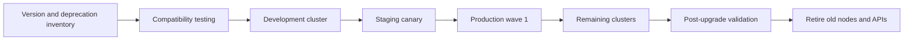

> **Document class:** Applications & Kubernetes implementation guide
> **Normative terms:** **MUST**, **MUST NOT**, **SHOULD**, **SHOULD NOT**, and **MAY** are requirements levels.
> **Applicability:** Kubernetes, node images, operating systems, APIs, add-ons, admission webhooks, controllers, workloads, and fleet upgrade lifecycle.
> **Exception process:** Deviations require a documented risk assessment, compensating controls, named risk owner, and expiry date.

| Control field | Value |
|---|---|
| Document ID | `APP-16` |
| Owner | Cloud Center of Excellence |
| Review cycle | At least annually and after material cloud-service, Kubernetes, security, or operating-model changes |
| Evidence | Version and deprecation inventory, compatibility matrix, rollout records, workload readiness, post-upgrade tests, and rollback or recovery evidence |

# Kubernetes Upgrade and API Lifecycle Management

> **Decision in brief:** Upgrade Kubernetes through a supported, tested sequence that covers APIs, nodes, add-ons, webhooks, workloads, rollback limits, and fleet timing.

## Purpose

Kubernetes upgrades affect the control plane, nodes, add-ons, APIs, admission webhooks, controllers, and workloads. Managed Kubernetes reduces infrastructure work but does not validate application compatibility or provide a universal downgrade. This article defines a repeatable lifecycle process.

## Lifecycle flow

## Version policy

- Maintain a supported-version matrix for Kubernetes, node images, operating systems, container runtimes, CNI, CSI, DNS, ingress/gateway, policy, observability, GitOps, and operators.
- Track provider support and forced-upgrade dates.
- Limit version skew between environments so staging remains representative.
- Assign owners and target dates for every deprecated API and unsupported add-on.
- Prefer regular small upgrades over emergency multi-version jumps.

## API deprecation management

Scan source, rendered manifests, Helm charts, GitOps output, live objects, audit logs, and CRDs for removed or deprecated APIs. Update schemas and clients before the cluster upgrade. Confirm stored custom-resource versions and conversion webhooks remain available.

An object that currently exists may continue running while a new deployment or update fails. Test create, update, delete, rollback, and restore operations—not only current pod health.

## Pre-upgrade controls

1. Confirm supported source and target versions and upgrade path.
2. Review provider and Kubernetes release notes.
3. Validate APIs, webhooks, operators, drivers, and workload dependencies.
4. Check quotas, disruption budgets, capacity headroom, and zone availability.
5. Verify backups, recovery points, break-glass access, and support escalation.
6. Freeze unrelated platform changes during the upgrade window.
7. Define success, pause, abort, and forward-recovery criteria.

## Upgrade sequence

Upgrade non-production first, then a representative production canary, then controlled waves. For each cluster:

1. Validate control-plane and add-on compatibility.
2. Upgrade the control plane according to provider requirements.
3. Add or rotate a canary node pool with the target image.
4. Drain workloads while respecting disruption and stateful-service rules.
5. Validate scheduling, networking, storage, DNS, identity, policy, and telemetry.
6. Expand the new pool and retire old nodes only after stabilization.

Do not rely on rollback of the control-plane version. Prepare forward recovery, node-pool replacement, configuration revert, workload rollback, and cluster rebuild options.

## Application readiness

Applications must tolerate pod eviction, node replacement, mixed node versions within supported skew, connection draining, DNS changes, and temporary capacity loss. Disruption budgets must protect availability without blocking necessary maintenance.

Test admission and mutation, service-account tokens, projected volumes, probes, autoscaling, persistent volumes, topology, and security contexts on the target version.

## Multi-cloud mapping

| Platform | Lifecycle considerations |
|---|---|
| AKS | Kubernetes support policy, node image upgrades, maintenance configuration, workload identity and networking add-ons |
| EKS | Version support tiers, managed add-ons, AMI or node-group lifecycle, CNI compatibility |
| GKE | Release channels, maintenance exclusions, node auto-upgrade, feature availability |
| OKE | Supported versions, node-pool images, CNI and add-on compatibility |

Standardize gates and evidence while allowing provider-specific orchestration.

## Fleet lifecycle calendar

Maintain a rolling calendar that includes provider support deadlines, target control-plane versions, node-image refresh, add-on releases, operating-system retirement, certificate rotation, and application remediation milestones. The calendar should reserve time for discovery, non-production testing, canary rollout, stabilization, and defect correction before the provider deadline.

Clusters that cannot meet the standard cadence require an approved exception with business owner, technical owner, compensating controls, and retirement date. Extended support, where available, is a temporary risk treatment rather than a permanent lifecycle strategy.

## Compatibility contract

Every platform add-on and application owner should publish the versions they support and the evidence used. The contract should cover:

- Kubernetes API versions used by manifests and clients.
- Minimum and maximum Kubernetes versions.
- CNI, CSI, ingress or Gateway, service mesh, policy, GitOps, backup, and observability compatibility.
- Container runtime and operating-system assumptions.
- Webhook and CRD conversion requirements.
- Storage and database version dependencies.

“Runs on Kubernetes” is not a compatibility statement.

## Upgrade test matrix

The test plan should include create, update, scale, restart, drain, failover, rollback, backup, and restore operations. Validate at least:

- Admission and policy decisions.
- Workload identity and projected token behavior.
- DNS, service routing, NetworkPolicy, ingress, and egress.
- Volume attach, mount, snapshot, expansion, and rescheduling.
- Autoscaling and metrics APIs.
- GitOps reconciliation and Helm or Kustomize rendering.
- Operator reconciliation, finalizers, and CRD conversion.
- Logging, metrics, traces, and audit export.
- PodDisruptionBudget behavior under actual node drain.

A healthy existing pod is weak evidence because removed APIs and incompatible admission behavior may appear only on the next change.

## Node-image and operating-system lifecycle

Kubernetes version and node image are separate lifecycle dimensions. Establish a cadence for security image refresh even when the control-plane version does not change. Use canary node pools, cordon and drain, and measured workload redistribution. Confirm daemon sets, device plugins, security agents, and storage drivers on the new image before broad rollout.

Track operating-system end of support and container-runtime changes. A supported Kubernetes control plane can still run unsupported nodes or add-ons.

## Emergency upgrade procedure

When a forced deadline or critical vulnerability compresses the normal process, retain minimum gates: backup verification, deprecated-API scan, representative non-production test, canary production cluster, pause criteria, support escalation, and post-change validation. Document skipped tests and create dated remediation actions. Urgency is not justification for an unbounded fleet-wide change.

## Validation

- [ ] Target versions are supported across control plane, nodes, add-ons, and applications.
- [ ] Deprecated APIs are absent from source, rendered, and live resources.
- [ ] CRDs and conversion webhooks support the target version.
- [ ] Capacity and disruption budgets allow safe node rotation.
- [ ] Backups and recovery procedures are current.
- [ ] Non-production and canary production upgrades pass defined tests.
- [ ] Network, storage, identity, policy, DNS, and telemetry are verified.
- [ ] Provider events and workload SLOs remain healthy during stabilization.
- [ ] Old nodes, images, API versions, and temporary exceptions are retired.
- [ ] Evidence and lessons are recorded for the next wave.

## Operational considerations

Maintain a fleet dashboard for versions, support deadlines, deprecated APIs, node-image age, add-on skew, failed drains, and blocked disruption budgets. Schedule recurring compatibility tests and notify application owners well before mandatory provider upgrades.

## Related topics

- [AKS Platform Architecture](app-aks-platform-architecture.md)
- [Delivering and Operating AKS Workloads](app-delivering-and-operating-aks-workloads.md)
- [Kubernetes Operators, CRDs, and Admission Webhook Governance](app-kubernetes-operators-crds-and-webhook-governance.md)
- [Kubernetes Backup, Restore, and Disaster Recovery](app-kubernetes-backup-restore-and-disaster-recovery.md)

## References

- [Kubernetes: Version skew policy](https://kubernetes.io/releases/version-skew-policy/)
- [Kubernetes: Deprecated API migration guide](https://kubernetes.io/docs/reference/using-api/deprecation-guide/)
- [Kubernetes: Pod disruptions](https://kubernetes.io/docs/concepts/workloads/pods/disruptions/)
- [Microsoft: Upgrade an AKS cluster](https://learn.microsoft.com/en-us/azure/aks/upgrade-cluster)
- [AWS: Update an EKS cluster](https://docs.aws.amazon.com/eks/latest/userguide/update-cluster.html)
- [GCP: GKE versioning and support](https://cloud.google.com/kubernetes-engine/versioning)
