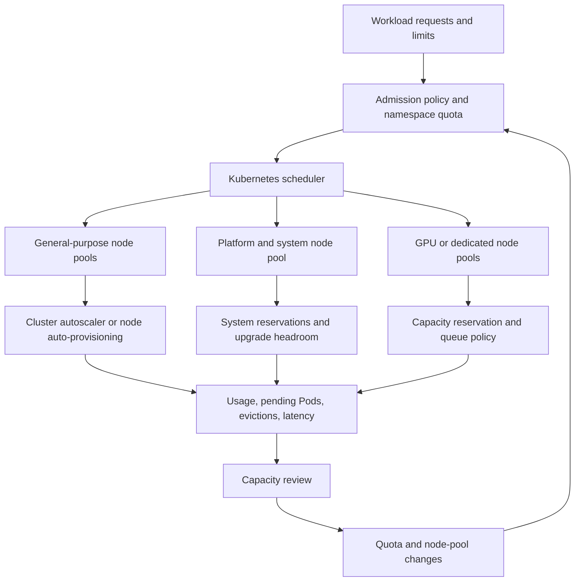

> **文档类型：** 应用与 Kubernetes 架构参考模型
> **规范性术语：** **MUST**、**MUST NOT**、**SHOULD**、**SHOULD NOT** 和 **MAY** 是要求级别。
> **适用范围：** Kubernetes 调度、资源请求和限制、配额、放置、中断、自动扩缩容、节点池容量和成本所有权。
> **例外流程：** 偏离要求需要记录风险评估、补偿控制、指定风险负责人和到期日期。

|控制领域|价值|
|---|---|
|文件编号 | `APP-19` |
|负责人|云卓越中心 |
|审核周期|至少每年一次，并且在云服务、Kubernetes、安全性或运营模型发生重大变化之后 |
|证据|容量模型、资源和配额报告、布局和中断测试、自动扩展行为、SLO 空间和成本审查 |

# Kubernetes 工作负载调度、配额和容量规划

> **决策简述：** 通过连接声明的资源、配额、拓扑、中断、自动扩展、容量余量和成本所有权，使工作负载放置可预测。

## 目的

本文定义了企业 Kubernetes 平台如何在集群受到限制之前放置工作负载、控制命名空间使用量以及规划计算容量。它应用于为多个应用团队运行 AKS 或其他一致的 Kubernetes 发布版的架构师和平台团队。

调度不仅仅是调度器配置问题。当工作负载声明的资源形状、放置约束、中断行为、命名空间预算、节点池容量和平台策略都可以同时得到满足时，该工作负载就是可调度的。因此，操作模型将应用请求和限制与节点池、配额、自动扩展、可用性目标和成本所有权联系起来。

在创建新集群、加入团队、引入 GPU 或其他扩展资源、更改节点池拓扑或调查待处理 Pod 和意外驱逐时，请使用本指南。

## 设计成果

平台应提供：

- 系统、平台、批次和应用工作负载的可预测放置；
- 显式的 CPU、内存、临时存储和扩展资源请求；
- 命名空间预算可防止一个团队耗尽共享容量；
- 足够的空间用于滚动升级、故障域和突发需求；
- 可观测到的调度失败以及可采取行动的原因；
- 污点、容忍度、亲和力、拓扑传播和优先级的受控使用；
- 配额、节点池容量、自动扩展和服务级别目标之间的日志记录关系；和
- 基于测量的需求而不是仅基于节点计数的可重复容量审查。

## 调度模型

Kubernetes 通过过滤不能满足硬约束的节点来调度 Pod，然后对剩余节点进行评分。请求（而非限制）是装箱和准入检查的主要输入。请求 `2` CPU 的 Pod 会占用 `2` CPU 的调度能力，即使其进程通常使用 `200m`。

平台必须区分四种约束：

|约束|示例 |设计处理|
|---|---|---|
|资源契合| CPU、内存、临时存储、GPU |提出切合实际的要求；度量实际使用情况；储备系统容量。 |
|安置|区域、节点池、架构、操作系统、硬件 |使用带有记录后备的标签和拓扑规则。 |
|策略 |命名空间配额、限制范围、准入规则 |尽早失败并提供明确的信息和所有者。 |
|可用性 |副本、中断预算、传播、优先级 |对故障域和升级行为进行建模。 |

调度程序应该仍然是一个通用的布局引擎。应用团队应通过支持的抽象和配置文件来表达工作负载意图，而不是嵌入单个节点名称或 VM Scale Set 实例的知识。

## 资源请求和限制

每个生产容器 MUST 声明 CPU 和内存请求。关键工作负载 SHOULD 声明限制，但团队必须了解后果：内存限制可能会导致内存不足终止，而 CPU 限制可能会在突发期间限制进程。平台不应在每项服务中复制一个比例；它应该建立一个基于测量的起点，并在负载测试后对其进行审查。

使用以下工作流程来调整资源大小：

1. 测量正常、高峰和恢复流量下的代表性工作负载。
2. 将请求设置为接近 SLO 所需的持续资源需求。
3. 仅当有界故障优于无界节点争用时才设置限制。
4. 监控限制、内存压力、重新启动计数、延迟和队列深度。
5. 在发布、流量形状更改或运行时升级后重新访问值。

工作负载契约示例：
```yaml
apiVersion: apps/v1
kind: Deployment
metadata:
  name: orders-api
  namespace: orders-prod
spec:
  replicas: 3
  selector:
    matchLabels:
      app: orders-api
  template:
    metadata:
      labels:
        app: orders-api
    spec:
      containers:
        - name: api
          image: registry.example.com/orders-api@sha256:REPLACE_ME
          resources:
            requests:
              cpu: "500m"
              memory: "768Mi"
              ephemeral-storage: "1Gi"
            limits:
              memory: "1Gi"
              ephemeral-storage: "2Gi"
          readinessProbe:
            httpGet:
              path: /ready
              port: 8080
          startupProbe:
            httpGet:
              path: /startup
              port: 8080
            failureThreshold: 30
            periodSeconds: 10
```
不要使用限制来替代容量规划。一个 limit 控制一个容器；它不会创建节点容量，也不保证 Pod 可以被调度。

## 命名空间配额和限制范围

ResourceQuota 是命名空间级别的预算。 LimitRange 为各个 Pod 或容器提供默认值和边界。两者都是准入控制，因此只有当它们应用于每个工作负载命名空间时才能保护集群。

生产命名空间通常应具有：

- 硬 CPU 和内存请求预算；
- 当策略需要限制时，硬 CPU 和内存限制预算；
- Pod 数量限制；
- 服务、作业、ConfigMap 和 Secret 的对象计数限制，其中可能存在滥用或意外扇出的情况；
- 需要考虑节点磁盘压力的临时存储预算；和
- 具有开发人员可见的安全默认值的 LimitRange。

命名空间控件示例：
```yaml
apiVersion: v1
kind: ResourceQuota
metadata:
  name: orders-prod-budget
  namespace: orders-prod
spec:
  hard:
    requests.cpu: "12"
    requests.memory: 24Gi
    limits.memory: 32Gi
    requests.ephemeral-storage: 40Gi
    pods: "60"
    services: "20"
    persistentvolumeclaims: "20"
---
apiVersion: v1
kind: LimitRange
metadata:
  name: orders-prod-defaults
  namespace: orders-prod
spec:
  limits:
    - type: Container
      defaultRequest:
        cpu: 100m
        memory: 128Mi
      default:
        memory: 512Mi
      max:
        memory: 8Gi
```
配额必须来自批准的服务预算，而不仅仅是为了部署通过而选择。配额过小会造成容量错误事件；配额太大会消除安全边界。

## 布局和拓扑

使用标签来描述稳定的平台属性，例如`workload-class`、`node-pool`、`kubernetes.io/arch`、`kubernetes.io/os`和拓扑区域。除非组织明确接受由此产生的碎片化和运营所有权，否则请勿使用团队名称来标记节点。

按强度递增顺序使用放置控件：

1.**首选亲和力**针对性能或位置偏好。
2. **拓扑分布**，实现跨区域或节点的平衡副本。
3. **硬兼容性约束所需的关联性**。
4. **专用或受保护容量的污点和容忍**。

硬约束必须进行容量和故障域审查。在一个区域中需要专用 GPU 池的工作负载与可在任何通用节点上运行的工作负载具有不同的可用性配置文件。

价差和专用池契约示例：
```yaml
spec:
  template:
    spec:
      tolerations:
        - key: workload-class
          operator: Equal
          value: latency-sensitive
          effect: NoSchedule
      affinity:
        nodeAffinity:
          requiredDuringSchedulingIgnoredDuringExecution:
            nodeSelectorTerms:
              - matchExpressions:
                  - key: workload-class
                    operator: In
                    values: [latency-sensitive]
      topologySpreadConstraints:
        - maxSkew: 1
          topologyKey: topology.kubernetes.io/zone
          whenUnsatisfiable: DoNotSchedule
          labelSelector:
            matchLabels:
              app: orders-api
```
当区域分配是硬性要求并且团队在容量损失期间接受临时 Pending Pod 时，`DoNotSchedule` 是合适的。当通过在不太平衡的位置运行可以更好地提供可用性时，请使用 `ScheduleAnyway`。

## 优先级、抢占和中断

优先级类别表示哪些工作负载可以首先获取稀缺容量。它们不能替代配额或 SLO。定义一个小的、集中管理的集合，例如平台关键型、生产关键型、标准和批次。不要让每个团队创建任意的优先级类别。

抢占可以通过驱逐低优先级的 Pod 来调度高优先级的工作负载。在启用之前，请验证被逐出的工作负载是否具有恢复路径、其中断预算是否有意义以及所产生的级联是否可接受。批处理作业的优先级通常应低于交互式生产服务，但它们仍然需要公平的配额和最大运行时间。

PodDisruptionBudget 可保护节点升级等自愿中断。它不能防止节点压力驱逐或硬配额失败。具有 `minAvailable: 100%` 的 PDB 可以无限期地阻止维护，因此必须通过节点池升级过程对其进行审查。

## 参考容量架构

当系统代理、入口、存储、安全性或可观测性工作负载具有不同的生命周期和扩展要求时，集群应将平台容量与应用容量分开。确切的节点池数量取决于规模和提供商限制；架构规则是明确保留和故障域。

## 容量规划方法

容量规划是一个滚动过程，而不是一次性的节点大小选择。

### 建立需求模型

按命名空间和工作负载类采集：

- 请求和监控的 CPU 和内存；
- 按小时和按版本划分的峰值和百分位使用率；
- Pod 计数、重启率、待处理持续时间和驱逐计数；
- 相关的存储和网络吞吐量；
- GPU 或其他扩展资源利用率；
- 系统预留后节点可分配容量；
- 区域和池分布；和
- 工作负载增长假设、批处理窗口和故障转移需求。

请求描述预留容量；用法描述了消费。跟踪两者。集群可能具有较低的 CPU 利用率，但仍然无法调度 Pod，因为请求是碎片化的或所需的拓扑不可用。

### 计算可用容量

对于每个节点池，计算：
```text
usable_capacity = allocatable_capacity
                  - system_reservation
                  - daemonset_reservation
                  - failure_headroom
```
对于多区域生产池，故障余量应涵盖最大预期故障域的损失加上滚动升级所需的容量。对于单区域开发池，相同的公式可以使用较小的可用性储备，但必须明确说明较低的弹性。

### 设置规划阈值

使用阈值作为触发器，而不是作为普遍保证。平台团队可以在以下情况下开始采购或节点池扩展：

- 请求的容量超过可用稳态容量的 70-80%；
- 任何区域都无法吸收计划的节点或区域故障；
- 待处理的 Pod 持续存在超出调度 SLO；
- 经常达到Autoscaler 的最大大小；
- 内存压力、磁盘压力或驱逐率增加；
- 配额使用超出批准的服务预算；或
- 新工作负载需要集群中未表示的资源类。

审查必须包括对成本、升级持续时间、IP 地址空间、存储容量、负载均衡器和支持限制的影响。如果子网、配额或控制平面限制成为下一个瓶颈，仅添加节点是不够的。

## 自动扩缩容和突发容量

Horizontal Pod Autoscaler 改变副本需求；集群 Autoscaler 或节点自动预配器会更改节点容量。它们必须作为一个系统进行配置。HPA 创建 Pending Pod 的速度可能快于节点池扩展，而过于激进的Autoscaler 可能造成成本和启动不稳定。

定义：

- 每个工作负载的最小和最大副本；
- 放大和缩小稳定窗口；
- 节点池的最小和最大大小；
- 启动时间和镜像拉取时间假设；
- 突发队列或批量背压行为；
- 可接受的最长等待时间；和
- 当提供商配额阻止横向扩展时的响应。

对于昂贵或稀缺的资源，排队通常比抢占交互服务更安全。 GPU 工作负载应将队列深度、分配等待时间、利用率和失败的放置作为一等信号公开。

## 高层设计决策

|决定|默认 |需要审查的异常 |
|---|---|---|
|一般工作负载 |共享通用池 |严格的隔离、许可、硬件或合规性要求 |
|系统工作负载|预留平台池或预留容量 |具有日志记录权衡的小型非生产集群 |
|区域放置 |跨区域传播关键副本 |具有明确恢复计划的有状态服务或提供商限制 |
|配额 |每个团队、每个环境的命名空间预算 |具有指定服务所有者和成本分摊模型的共享命名空间 |
|优先|集中管理的小型班级集 |专门的批量或控制平面要求|
|自动扩缩容| HPA plus 集群 Autoscaler |延迟、许可或确定性批量工作负载的固定容量 |
|限制 |基于证据，尤其是记忆 |运行时或平台需要硬边界 |

## 操作手册

### 待处理的 Pod

1. 检查 Pod 事件和调度程序消息。
2. 对故障进行分类：资源不足、配额、污点、亲和性、拓扑、PVC、镜像或准入。
3. 将请求的容量与符合条件的节点中的可分配容量进行比较。
4. 检查自动扩展是否受到最大值、提供商配额、子网容量或未满足的硬约束的阻止。
5. 修正所属契约、节点池容量或策略；不要删除随机工作负载以使症状消失。
6. 记录根本原因，如果情况不是预期的，则更新容量模型。

### 内存压力和驱逐

1. 确定节点状况和已驱逐的工作负载。
2. 检查实际使用情况、请求、限制、emptyDir、镜像文件系统和日志增长。
3. 通过正确的优先级和预留来保护平台代理和关键服务。
4. 减少或重新安排非关键需求，然后扩大或重新平衡容量。
5. 服务恢复后检查请求和应用内存行为。

### 配额耗尽

配额增加需要所有者批准和容量检查。临时增加应该有到期票或后续票。如果请求的预算有效，但集群无法满足，请扩展容量或更改放置模型，而不是默默地删除配额。

## 验证

- [ ] 每个生产容器都测量了 CPU 和内存请求。
- [ ] 每个工作负载命名空间都存在命名空间配额和限制范围。
- [ ] 关键副本分布在预期的故障域中。
- [ ] 专用池有污点、容忍度、容量限制和所有者。
- [ ] 优先级和抢占行为已经过实际中断测试。
- [ ] 自动扩缩容达到安全最大值并失败并出现可操作信号。
- [ ] 已执行区域、节点和提供程序容量故障。
- [ ] 待处理的 Pod、驱逐、配额失败和节点压力会收到告警。
- [ ] 容量审查包括请求、使用情况、净空、成本和增长。

## 操作注意事项

平台团队负责调度程序配置、节点池、配额即代码、准入控制和集群级容量。工作负载团队负责资源契约、副本和中断设置、应用性能和服务级别需求预测。

对节点标签、污点、优先级、配额默认值或Autoscaler 限制的更改属于平台更改，需要分阶段推出。请求、限制或拓扑约束的更改属于工作负载更改，但可能会影响共享容量，因此应包含在容量审查中。

## 相关主题

- [AKS 平台架构](app-aks-platform-architecture.md)
- [交付和操作 AKS 工作负载](app-delivering-and-operating-aks-workloads.md)
- [Kubernetes 可观测性和 OpenTelemetry 标准](app-kubernetes-observability-and-opentelemetry-standards.md)
- [如何部署和升级 AKS 工作负载](../how-to-guides/how-to-deploy-and-upgrade-an-aks-workload.md)
- [Kubernetes 应用安全和策略标准](app-kubernetes-application-security-and-policy-standards.md)

## 参考文档

- [Kubernetes 调度、抢占和驱逐](https://kubernetes.io/docs/concepts/scheduling-eviction/)
- [Kubernetes 资源配额](https://kubernetes.io/docs/concepts/policy/resource-quotas/)
- [Kubernetes 限制范围](https://kubernetes.io/docs/concepts/policy/limit-range/)
- [Kubernetes 节点压力驱逐](https://kubernetes.io/docs/concepts/scheduling-eviction/node-pressure-eviction/)
- [Kubernetes 调度框架](https://kubernetes.io/docs/concepts/scheduling-eviction/scheduling-framework/)
