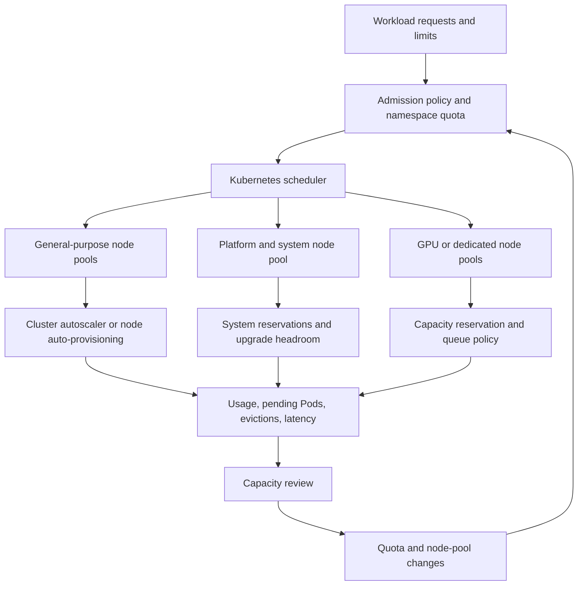

> **Document class:** Applications & Kubernetes architecture reference model
> **Normative terms:** **MUST**, **MUST NOT**, **SHOULD**, **SHOULD NOT**, and **MAY** are requirements levels.
> **Applicability:** Kubernetes scheduling, resource requests and limits, quotas, placement, disruption, autoscaling, node-pool capacity, and cost ownership.
> **Exception process:** Deviations require a documented risk assessment, compensating controls, named risk owner, and expiry date.

| Control field | Value |
|---|---|
| Document ID | `APP-19` |
| Owner | Cloud Center of Excellence |
| Review cycle | At least annually and after material cloud-service, Kubernetes, security, or operating-model changes |
| Evidence | Capacity model, resource and quota reports, placement and disruption tests, autoscaling behavior, SLO headroom, and cost review |

# Kubernetes Workload Scheduling, Quotas, and Capacity Planning

> **Decision in brief:** Make workload placement predictable by connecting declared resources, quotas, topology, disruption, autoscaling, capacity headroom, and cost ownership.

## Purpose

This article defines how an enterprise Kubernetes platform places workloads, controls namespace consumption, and plans compute capacity before a cluster becomes constrained. It is intended for architects and platform teams that operate AKS or another conformant Kubernetes distribution for multiple application teams.

Scheduling is not only a scheduler configuration problem. A workload is schedulable when its declared resource shape, placement constraints, disruption behavior, namespace budget, node-pool capacity, and platform policies can all be satisfied at the same time. The operating model therefore connects application requests and limits to node pools, quotas, autoscaling, availability objectives, and cost ownership.

Use this guidance when creating a new cluster, onboarding a team, introducing GPUs or other extended resources, changing node-pool topology, or investigating pending Pods and unexpected evictions.

## Design outcomes

The platform should provide:

- predictable placement for system, platform, batch, and application workloads;
- explicit CPU, memory, ephemeral-storage, and extended-resource requests;
- namespace budgets that prevent one team from exhausting shared capacity;
- enough headroom for rolling upgrades, failure domains, and burst demand;
- observable scheduling failures with actionable reasons;
- controlled use of taints, tolerations, affinity, topology spread, and priority;
- a documented relationship between quota, node-pool capacity, autoscaling, and service-level objectives; and
- a repeatable capacity review based on measured demand rather than node count alone.

## Scheduling model

Kubernetes schedules a Pod by filtering nodes that cannot satisfy hard constraints and then scoring the remaining nodes. Requests, not limits, are the primary input for bin packing and admission checks. A Pod that requests `2` CPUs consumes scheduling capacity for `2` CPUs even if its process normally uses `200m`.

The platform must distinguish four kinds of constraints:

| Constraint | Examples | Design treatment |
|---|---|---|
| Resource fit | CPU, memory, ephemeral storage, GPU | Declare realistic requests; measure actual usage; reserve system capacity. |
| Placement | Zone, node pool, architecture, OS, hardware | Use labels and topology rules with a documented fallback. |
| Policy | Namespace quota, limit range, admission rule | Fail early with a clear message and an owner. |
| Availability | Replicas, disruption budget, spread, priority | Model failure domains and upgrade behavior together. |

The scheduler should remain a general-purpose placement engine. Application teams should express workload intent through supported abstractions and profiles rather than embedding knowledge of individual node names or VM scale-set instances.

## Resource requests and limits

Every production container MUST declare CPU and memory requests. Critical workloads SHOULD declare limits, but teams must understand the consequence: a memory limit can cause an out-of-memory kill, while a CPU limit can throttle a process during a burst. The platform should not copy one ratio across every service; it should establish a measurement-based starting point and review it after load testing.

Use the following workflow for resource sizing:

1. Measure a representative workload under normal, peak, and recovery traffic.
2. Set requests near the sustained resource requirement needed for the SLO.
3. Set limits only where a bounded failure is preferable to unbounded node contention.
4. Observe throttling, memory pressure, restart count, latency, and queue depth.
5. Revisit values after a release, traffic-shape change, or runtime upgrade.

Example workload contract:

```yaml
apiVersion: apps/v1
kind: Deployment
metadata:
  name: orders-api
  namespace: orders-prod
spec:
  replicas: 3
  selector:
    matchLabels:
      app: orders-api
  template:
    metadata:
      labels:
        app: orders-api
    spec:
      containers:
        - name: api
          image: registry.example.com/orders-api@sha256:REPLACE_ME
          resources:
            requests:
              cpu: "500m"
              memory: "768Mi"
              ephemeral-storage: "1Gi"
            limits:
              memory: "1Gi"
              ephemeral-storage: "2Gi"
          readinessProbe:
            httpGet:
              path: /ready
              port: 8080
          startupProbe:
            httpGet:
              path: /startup
              port: 8080
            failureThreshold: 30
            periodSeconds: 10
```

Do not use a limit as a substitute for capacity planning. A limit controls a container; it does not create node capacity and does not guarantee that a Pod can be scheduled.

## Namespace quotas and limit ranges

ResourceQuota is the namespace-level budget. LimitRange supplies defaults and bounds for individual Pods or containers. Both are admission controls and therefore protect the cluster only when they are applied to every workload namespace.

A production namespace should normally have:

- a hard CPU and memory request budget;
- a hard CPU and memory limit budget when limits are required by policy;
- a Pod count limit;
- an object count limit for Services, Jobs, ConfigMaps, and Secrets where abuse or accidental fan-out is possible;
- an ephemeral-storage budget where node disk pressure is a concern; and
- a LimitRange with safe defaults that are visible to developers.

Example namespace controls:

```yaml
apiVersion: v1
kind: ResourceQuota
metadata:
  name: orders-prod-budget
  namespace: orders-prod
spec:
  hard:
    requests.cpu: "12"
    requests.memory: 24Gi
    limits.memory: 32Gi
    requests.ephemeral-storage: 40Gi
    pods: "60"
    services: "20"
    persistentvolumeclaims: "20"
---
apiVersion: v1
kind: LimitRange
metadata:
  name: orders-prod-defaults
  namespace: orders-prod
spec:
  limits:
    - type: Container
      defaultRequest:
        cpu: 100m
        memory: 128Mi
      default:
        memory: 512Mi
      max:
        memory: 8Gi
```

Quotas must be derived from an approved service budget, not chosen only to make a deployment pass. A quota that is too small creates false capacity incidents; a quota that is too large removes the safety boundary.

## Placement and topology

Use labels to describe stable platform attributes such as `workload-class`, `node-pool`, `kubernetes.io/arch`, `kubernetes.io/os`, and topology zones. Do not label nodes with a team name unless the organization has explicitly accepted the resulting fragmentation and operational ownership.

Use placement controls in increasing order of strength:

1. **Preferred affinity** for a performance or locality preference.
2. **Topology spread** for balanced replicas across zones or nodes.
3. **Required affinity** for a hard compatibility constraint.
4. **Taints and tolerations** for dedicated or protected capacity.

Hard constraints must have a capacity and failure-domain review. A workload that requires a dedicated GPU pool in one zone has a different availability profile from a workload that can run on any general-purpose node.

Example spread and dedicated-pool contract:

```yaml
spec:
  template:
    spec:
      tolerations:
        - key: workload-class
          operator: Equal
          value: latency-sensitive
          effect: NoSchedule
      affinity:
        nodeAffinity:
          requiredDuringSchedulingIgnoredDuringExecution:
            nodeSelectorTerms:
              - matchExpressions:
                  - key: workload-class
                    operator: In
                    values: [latency-sensitive]
      topologySpreadConstraints:
        - maxSkew: 1
          topologyKey: topology.kubernetes.io/zone
          whenUnsatisfiable: DoNotSchedule
          labelSelector:
            matchLabels:
              app: orders-api
```

`DoNotSchedule` is appropriate when zone distribution is a hard requirement and the team accepts temporary Pending Pods during capacity loss. Use `ScheduleAnyway` when availability is better served by running in a less balanced placement.

## Priority, preemption, and disruption

Priority classes express which workloads may receive scarce capacity first. They are not a substitute for quotas or SLOs. Define a small, centrally governed set such as platform-critical, production-critical, standard, and batch. Do not let every team create arbitrary priority classes.

Preemption can make a high-priority workload schedulable by evicting lower-priority Pods. Before enabling it, verify that the evicted workloads have a recovery path, their disruption budgets are meaningful, and the resulting cascade is acceptable. Batch jobs should normally have lower priority than interactive production services, but they still require a fair quota and a maximum runtime.

PodDisruptionBudget protects voluntary disruption such as node upgrades. It does not prevent node-pressure eviction or a hard quota failure. A PDB with `minAvailable: 100%` can block maintenance indefinitely, so it must be reviewed with the node-pool upgrade procedure.

## Reference capacity architecture



A cluster should separate platform capacity from application capacity when system agents, ingress, storage, security, or observability workloads have different lifecycle and scaling requirements. The exact node-pool count depends on scale and provider limits; the architectural rule is to make reservations and failure domains explicit.

## Capacity planning method

Capacity planning is a rolling process rather than a one-time node-size selection.

### Establish the demand model

Capture, by namespace and workload class:

- requested and observed CPU and memory;
- peak and percentile usage by hour and by release;
- Pod count, restart rate, pending duration, and eviction count;
- storage and network throughput where relevant;
- GPU or other extended-resource utilization;
- node allocatable capacity after system reservations;
- zone and pool distribution; and
- workload growth assumptions, batch windows, and failover demand.

Requests describe reserved capacity; usage describes consumption. Track both. A cluster can have low CPU utilization and still be unable to schedule a Pod because requests are fragmented or a required topology is unavailable.

### Calculate usable capacity

For each node pool, calculate:

```text
usable_capacity = allocatable_capacity
                  - system_reservation
                  - daemonset_reservation
                  - failure_headroom
```

For a multi-zone production pool, failure headroom should cover the loss of the largest expected failure domain plus the capacity required for a rolling upgrade. For a single-zone development pool, the same formula can use a smaller availability reserve but must state that lower resilience explicitly.

### Set planning thresholds

Use thresholds as triggers, not as universal guarantees. A platform team may begin procurement or node-pool expansion when:

- requested capacity exceeds 70–80% of usable steady-state capacity;
- any zone cannot absorb a planned node or zone failure;
- Pending Pods persist beyond the scheduling SLO;
- autoscaler maximum size is frequently reached;
- memory pressure, disk pressure, or eviction rates increase;
- quota utilization exceeds the approved service budget; or
- a new workload requires a resource class that is not represented in the cluster.

The review must include the effect on cost, upgrade duration, IP address space, storage capacity, load balancers, and support limits. Adding nodes is not sufficient if the subnet, quota, or control-plane limit becomes the next bottleneck.

## Autoscaling and burst capacity

Horizontal Pod Autoscaler changes replica demand; the cluster autoscaler or node auto-provisioner changes node capacity. They must be configured as one system. HPA can create Pending Pods faster than a node pool can scale, while an overly aggressive autoscaler can create cost and startup instability.

Define:

- minimum and maximum replicas for each workload;
- scale-up and scale-down stabilization windows;
- node-pool minimum and maximum sizes;
- startup time and image-pull time assumptions;
- burst queues or batch backpressure behavior;
- maximum acceptable Pending duration; and
- a response when a provider quota prevents scale-out.

For expensive or scarce resources, queueing is often safer than preempting interactive services. GPU workloads should expose queue depth, allocation wait time, utilization, and failed placement as first-class signals.

## High-level design decisions

| Decision | Default | Exception requiring review |
|---|---|---|
| General workloads | Shared general-purpose pool | Strict isolation, licensing, hardware, or compliance requirement |
| System workloads | Reserved platform pool or reserved capacity | Small non-production cluster with documented tradeoff |
| Zone placement | Spread critical replicas across zones | Stateful service or provider limitation with explicit recovery plan |
| Quota | Per-team, per-environment namespace budget | Shared namespace with a named service owner and chargeback model |
| Priority | Small centrally managed class set | Specialized batch or control-plane requirement |
| Autoscaling | HPA plus cluster autoscaler | Fixed capacity for latency, licensing, or deterministic batch workload |
| Limits | Evidence-based, especially memory | Runtime or platform requires hard bounds |

## Operational runbooks

### Pending Pods

1. Inspect the Pod events and scheduler message.
2. Classify the failure: insufficient resource, quota, taint, affinity, topology, PVC, image, or admission.
3. Compare requested capacity with allocatable capacity in eligible nodes.
4. Check whether autoscaling is blocked by a maximum, provider quota, subnet capacity, or unsatisfied hard constraint.
5. Correct the owning contract, node-pool capacity, or policy; do not delete random workloads to make the symptom disappear.
6. Record the root cause and update the capacity model if the condition was not expected.

### Memory pressure and eviction

1. Identify the node condition and evicted workloads.
2. Check actual usage, requests, limits, emptyDir, image filesystem, and log growth.
3. Preserve platform agents and critical services through correct priority and reservations.
4. Reduce or reschedule noncritical demand, then expand or rebalance capacity.
5. Review requests and application memory behavior after service recovery.

### Quota exhaustion

Quota increases require owner approval and a capacity check. A temporary increase should have an expiry or follow-up ticket. If the requested budget is valid but the cluster cannot satisfy it, expand capacity or change the placement model rather than silently removing the quota.

## Validation

- [ ] Every production container has measured CPU and memory requests.
- [ ] Namespace quotas and limit ranges exist for every workload namespace.
- [ ] Critical replicas spread across the intended failure domains.
- [ ] Dedicated pools have taints, tolerations, capacity limits, and owners.
- [ ] Priority and preemption behavior has been tested with realistic disruption.
- [ ] Autoscaling reaches a safe maximum and fails with an actionable signal.
- [ ] A zone, node, and provider-capacity failure have been exercised.
- [ ] Pending Pods, evictions, quota failures, and node pressure are alerted.
- [ ] Capacity reviews include requests, usage, headroom, cost, and growth.

## Operational considerations

The platform team owns scheduler configuration, node pools, quotas-as-code, admission controls, and cluster-level capacity. Workload teams own resource contracts, replica and disruption settings, application performance, and service-level demand forecasts.

Changes to node labels, taints, priority classes, quota defaults, or autoscaler limits are platform changes and require staged rollout. Changes to requests, limits, or topology constraints are workload changes but can affect shared capacity and should be included in capacity review.

## Related topics

- [AKS Platform Architecture](app-aks-platform-architecture.md)
- [Delivering and Operating AKS Workloads](app-delivering-and-operating-aks-workloads.md)
- [Kubernetes Observability and OpenTelemetry Standards](app-kubernetes-observability-and-opentelemetry-standards.md)
- [How to Deploy and Upgrade an AKS Workload](../how-to-guides/how-to-deploy-and-upgrade-an-aks-workload.md)
- [Kubernetes Application Security and Policy Standards](app-kubernetes-application-security-and-policy-standards.md)

## References

- [Kubernetes scheduling, preemption, and eviction](https://kubernetes.io/docs/concepts/scheduling-eviction/)
- [Kubernetes resource quotas](https://kubernetes.io/docs/concepts/policy/resource-quotas/)
- [Kubernetes limit ranges](https://kubernetes.io/docs/concepts/policy/limit-range/)
- [Kubernetes node-pressure eviction](https://kubernetes.io/docs/concepts/scheduling-eviction/node-pressure-eviction/)
- [Kubernetes scheduling framework](https://kubernetes.io/docs/concepts/scheduling-eviction/scheduling-framework/)
