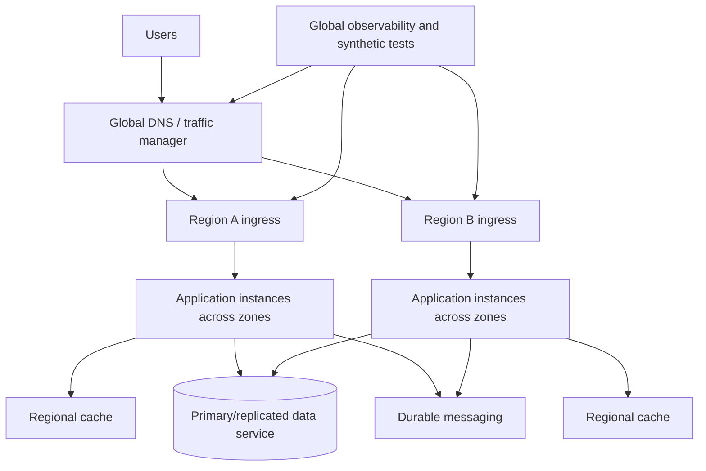
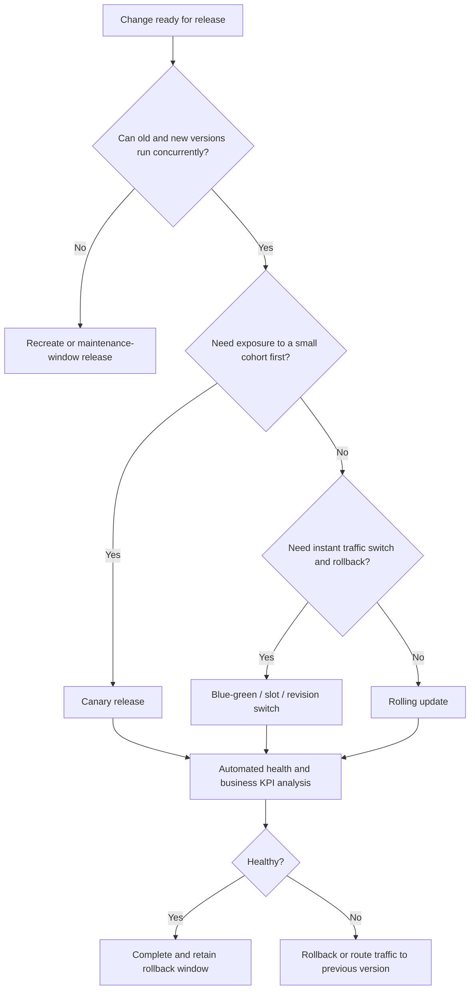

> **文档类型：** 应用和 Kubernetes 实施指南
> **规范性术语：** **MUST**、**MUST NOT**、**SHOULD**、**SHOULD NOT** 和 **MAY** 是要求级别。
> **适用范围：** 应用可用性、性能、扩展、恢复、部署策略、故障测试、故障转移和发布验证。
> **例外流程：** 偏离要求需要记录风险评估、补偿控制、指定风险负责人和到期日期。

|控制领域|价值|
|---|---|
|文件编号 | `APP-08` |
|负责人|云卓越中心 |
|审核周期|至少每年一次，并且在云服务、Kubernetes、安全性或运营模型发生重大变化之后 |
|证据| SLO 和恢复目标、故障模式分析、负载和混沌测试、部署证据、故障转移编排和恢复验证 |

# 弹性、扩展和部署策略

> **决策简述：** 跨计算、身份、数据、DNS、消息传递、依赖项和版本设计端到端的可用性，然后通过可度量的测试证明结果。

## 目的

该标准定义了云应用如何满足可用性、性能、弹性、恢复和安全更改要求。它应用于托管 Web 平台、无服务器容器、函数、AKS 和其他托管 Kubernetes 服务以及 VM 托管应用。

可用性是一种端到端的属性。当身份、DNS、数据、消息传递、证书、配置或第三方依赖项仍然存在单点故障时，高度可用的计算平台不会使应用具有弹性。

## 所需的服务目标

每个生产工作负载 **MUST** 定义：

- 关键用户旅程。
- 服务级别指标和目标。
- 错误的预算策略。
- 最大可容忍中断。
- 恢复时间目标（RTO）。
- 恢复点目标 (RPO)。
- 峰值和持续负载假设。
- 延迟和吞吐量目标。
- 数据一致性要求。
- 降级模式行为。

诸如“高可用性”之类的目标是无效的，因为它是不可度量的。

## 弹性模型

该图是概念性的。必须根据数据一致性、恢复目标、成本和操作能力来选择主动-主动、主动-被动或 Pilot light 拓扑。

## 强制弹性控制

1. 当可用性目标需要冗余时，生产服务 **MUST** 会删除单实例依赖项。
2. 所有远程调用都存在超时**MUST**。
3. 重试 **MUST** 有界，使用退避和抖动，并仅限于安全/幂等操作。
4. 应用**MUST** 实现正常关闭和就绪控制。
5. 关键异步处理 **MUST** 使用具有重试和死信处理的持久消息传递。
6. 自动扩缩容 **MUST** 包括最小和最大边界以及依赖性容量分析。
7. 部署**MUST** 支持变更目标内的回滚或前向修复。
8. 数据库更改 **MUST** 与所选部署策略兼容。
9.恢复程序**MUST**进行测试；没有执行证据的文件是不够的。
10. 多区域设计**MUST**包括数据、身份、机密、证书、DNS、网络、配置、镜像和操作激活。

## 故障模式分析

至少分析：

- 进程崩溃和内存泄漏。
- 实例、节点或 Pod 故障。
- 可用区故障。
- 区域服务故障。
- DNS 故障或日志记录过时。
- 证书过期或信任链故障。
- 身份提供商或令牌服务降级。
- 机密/配置提供商失败。
- 数据库连接耗尽、故障转移或延迟峰值。
- 队列积压和毒消息。
- 依赖性限制或部分响应。
- 部署不当或架构不兼容。
- 网络分区和非对称路由。
- 操作员错误和凭证泄露。

每种故障模式都需要检测、遏制、恢复和测试证据。

## 扩展架构

扩缩容有四个不同的层：

|层 |示例 |主要风险|
|---|---|---|
|请求处理 |并发、工作线程、连接池 |一个实例内的饱和度 |
|应用副本 |App Service 实例、Container Apps 副本、Kubernetes pod |依赖项过载 |
|计算能力|App Service 计划、Kubernetes 节点、无服务器分配 |容量扩张缓慢或受限|
|数据/依赖容量|数据库、缓存、队列分区、下游 API |瓶颈向下游迁移|

在保持数据库固定的情况下自动扩展应用并不是完整的扩展设计。

### 扩缩容信号

使用与工作一致的信号：

- 同步服务的 HTTP 并发性、请求队列、延迟或饱和度。
- 工作进程的队列深度和最旧消息年龄。
- 专业服务的定制业务吞吐量。
- 仅当 CPU 被证明是受限资源时才使用 CPU。

### 比例范围

最小容量可保护延迟和可用性。最大容量可以保护预算和依赖性。两者都必须明确。扩展策略需要冷却/稳定以防止振荡。

## 部署策略决策

## 部署模式

### 滚动更新

无状态、向后兼容应用的默认值。定义激增、不可用容量、就绪、终止和回滚。当新旧版本不能共享相同的架构或协议时，这是不安全的。

### 蓝绿色

维护两个完整的环境或修订版并切换流量。它提供快速回滚，但增加了容量，并且需要仔细的状态、缓存、会话和模式处理。 Azure App Service 插槽和无服务器容器修订版可以实现此模式的变体。

### 金丝雀

根据测量的技术和业务信号将有限的流量路由到新版本并增加曝光度。该队列必须有意义；随机的 1% 流量可能不会使用关键租户或交易路径。

### 功能开关

将部署与功能激活分开。标志需要所有权、审核、安全默认值、终止开关测试和删除。它们不能替代版本化部署或授权。

### 影子流量

将生产请求复制到非权威版本以进行比较。必须控制敏感数据处理、副作用、成本和响应隔离。

## 数据库和状态兼容性

使用扩展迁移契约：

1. 通过向后兼容的添加来扩展架构。
2. 部署支持新旧表示的代码。
3. 迁移或回填数据。
4. 验证所有消费者均已移动。
5. 在后续版本中删除旧架构。

避免在应用切换的同一步骤中发生不可逆的架构更改。会话状态应该是外部化的或跨版本兼容的。缓存键和序列化消息格式必须有意进行版本控制。

## 依赖弹性模式

- **超时：**在调用者自己的截止时间耗尽之前停止等待。
- **重试：** 仅在安全时重复暂时性故障。
- **断路器：**防止连续调用不健康的依赖项。
- **Bulkhead：** 隔离资源，以便一个依赖项或租户无法耗尽整个服务。
- **减载：** 在完全崩溃之前拒绝优先级较低的工作。
- **队列：** 解耦生产者和消费者并吸收突发。
- **幂等性密钥：** 使重试操作安全。
- **缓存：**减少依赖负载，同时定义陈旧和失效。
- **后备：** 仅在正确且透明的情况下提供降级行为。

多层重试可以成倍地放大负载。每个调用路径定义一个主要重试所有者。

## 多可用区、多区域策略

### 多区域

当平台和数据服务支持并且 SLO 需要承受区域故障时使用。工作负载副本、节点池、负载均衡器和存储实际上必须跨区域分布。具有区域数据库的区域冗余前端在区域上仍然脆弱。

### 多区域

选择：

- **备份和恢复：** 成本最低，RTO/RPO 最高。
- **Pilot light：** 核心数据/服务已准备好，在恢复期间扩展了容量。
- **热备用：** 降低容量的辅助环境保持最新状态。
- **主动-被动：** 具有受控故障转移的完全待机。
- **主动-主动：** 两个区域都提供流量；最高的复杂性，尤其是数据一致性。

故障转移和故障恢复是单独的过程，并且都必须进行测试。

## 特定于平台的实现映射

|能力|Azure|AWS | GCP |OCI |
|---|---|---|---|---|
|托管网络分阶段发布 |App Service 部署槽 | Elastic Beanstalk 环境/App Runner 部署模式 | App Engine 版本或 Cloud Run revisions | DevOps 流水线和负载均衡器/版本模式 |
|无服务器容器流量分流 |Container Apps revisions | App Runner/ECS 部署控制器模式 |Cloud Run revisions |没有完全等同的；实施负载均衡和版本化部署 |
| Kubernetes 推出 | AKS 部署/网关/服务网格模式 | EKS | GKE |无完全等效项|
|全球流量|Front Door/Traffic Manager| Route 53 / Global Accelerator / CloudFront（视情况而定）|Cloud Load Balancing/Cloud DNS |Traffic Management Steering Policies/DNS |
|自动扩缩容|App Service 自动扩缩容、Container Apps 扩缩容、HPA/KEDA |应用自动扩缩容、Fargate/EKS 自动扩缩容 | Cloud Run 自动扩展、GKE HPA/集群自动扩展 |特定于服务的自动扩缩容和 OKE 自动扩缩容 |

功能名称不保证相同的故障转移、运行状况探测、会话、流量分割或一致性行为。通过故障测试验证每个实现。

## 可观测性和发布验证

必须使用以下方式评估版本：

- 按版本划分的错误率和延迟。
- 饱和度和资源压力。
- 依赖关系健康和限制。
- 商业交易成功。
- 队列年龄和积压。
- 认证/授权失败率。
- 区域和分区分布。
- 来自相关网络和地区的综合测试。

回滚标准必须在发布之前定义。 “观看仪表板并做出决定”不是受控部署策略。

## 混沌和恢复测试

逐步测试：

1. 进程终止和 Pod/实例替换。
2.非生产中的依赖延迟和错误注入。
3. 节点排空和区域疏散。
4. 注册表、DNS、身份、机密和证书故障场景。
5. 备份恢复到隔离环境。
6. 区域故障转移和故障回切。
7. 运营沟通和决策权。

测试必须保护客户数据并遵守变更控制。目的是证据，而不是奇观。

## 弹性等级和最低模式

组织应将业务关键性映射到少数弹性层。层应定义最低可用性目标、RTO、RPO、区域要求、区域恢复模式、备份频率、测试节奏、可观测性保留和支持覆盖范围。这可以防止每个团队对“关键”或“高可用性”等术语进行不同的解释。

较低层可以使用备份和恢复以及记录在案的手动激活。较高层可能需要区域冗余容量、热区域备用、基于运行状况的自动化路由以及频繁的故障转移练习。所选层必须应用于依赖项和计算。

## 容量测试方法
容量测试应建立测量的操作范围，而不是单个峰值数。测试：

- 具有最小实例数的基准容量。
- 从最小到预期峰值的横向扩展延迟。
- 自动扩缩容稳定后的持续负载。
- 依赖性饱和和连接池行为。
- 在一个实例、节点或区域不可用期间加载。
- 突发结束后的恢复，包括缩减和连接耗尽。
- 测试期间的成本和遥测量。

记录吞吐量、延迟百分位数、错误率、饱和度、实例计数、队列年龄、依赖性指标和第一个限制资源。批准的最大规模必须保持在依赖关系变得不稳定的点以下。

## 区域故障转移编排

区域恢复计划需要有序的依赖序列。典型的顺序是：

1. 声明事件并冻结冲突的更改。
2. 确认所选的数据恢复点和复制状态。
3. 验证目标区域身份、密钥、机密、证书、网络、DNS 和注册表访问。
4. 启动或扩展应用和平台容量。
5. 在没有公共流量的情况下运行综合测试和数据完整性测试。
6. 迁移受控的流量百分比。
7. 验证技术和业务指标。
八、完成流量迁移，继续加强监控。

故障恢复必须考虑数据分歧、排队工作、DNS 缓存、会话行为以及主要区域不可用时所做的更改。将故障恢复视为具有自己的验证和回滚标准的单独更改。

## 弹性证据登记册

对于每项关键服务，保留：

- 当前架构和依赖关系图。
- 批准的 SLO、RTO 和 RPO。
- 容量测试结果和日期。
- 备份和恢复证据。
- 区域故障和区域恢复演习证据。
- 已知的单点故障和批准的例外情况。
- 上次成功的证书、机密和身份恢复测试。
- 打开修复项目并注明所有者和截止日期。

随着系统的变化，恢复信心会下降。早于主要架构、数据、身份或提供商更改的证据不应被视为当前证据。

## 依赖预算

端到端超时和重试预算应从调用者的截止日期开始分配。每跳必须留出足够的时间用于上游处理和安全取消。重试必须占用截止时间的有限部分，并且当剩余时间无法支持另一次有用的尝试时应该停止。

定义依赖项的并发和速率预算。隔板可能由租户、操作或依赖项分隔开，因此一条慢速路径无法占用所有工作线程、线程或连接。减载应该通过受控响应尽早拒绝工作，而不是允许全局队列增长和超时级联。

## 常见的反模式

- 宣布多区域准备就绪，因为基础设施存在于两个区域。
- 在没有幂等性或预算的情况下重试每次失败。
- 针对队列限制的工作负载在 CPU 上自动扩缩容。
- 不设置最大副本限制。
- 具有不兼容数据库架构的蓝绿部署。
- 准备情况检查，在共享依赖项中断期间删除每个实例。
- 从未恢复过的备份。
- 手动 DNS 故障转移，没有经过测试的决策过程。
- 成为永久架构的功能开关。
- 监控基础设施的健康状况，但不监控业务交易的成功。

## 验证

- [ ] 关键旅程、SLO、错误预算、RTO、RPO、容量和降级模式是可度量的。
- [ ] 故障模式分析涵盖计算、区域、可用区、DNS、身份、机密、数据、消息传递、网络和更改故障。
- [ ] 超时、重试、幂等、熔断和减载策略是明确的。
- [ ] 扩缩容信号与工作负载相匹配，最大扩缩容可保护依赖性和预算。
- [ ] 部署策略与会话、消息、缓存和数据库架构兼容。
- [ ] 回滚标准和自动验证在发布前定义。
- [ ] 端到端依赖设计支持多区域和多区域声明。
- [ ] 备份恢复、故障转移和故障回切经过证据测试。
- [ ] 仪表板包括按版本和区域划分的技术和业务结果信号。

## 相关主题

- [Azure App Service 架构和部署](app-azure-app-service-architecture-and-deployment.md)
- [Container Apps 和无服务器容器](app-container-apps-and-serverless-containers.md)
- [交付和操作 AKS 工作负载](app-delivering-and-operating-aks-workloads.md)
- [Kubernetes 备份、恢复和灾难恢复](app-kubernetes-backup-restore-and-disaster-recovery.md)

## 参考文档

使用提供商文档作为服务限制、区域可用性、支持的版本和功能行为的真实来源。
- [Azure App Service 部署槽](https://learn.microsoft.com/en-us/azure/app-service/deploy-staging-slots)
- [Azure Container Apps revisions](https://learn.microsoft.com/en-us/azure/container-apps/revisions)
- [Azure Container Apps 扩展](https://learn.microsoft.com/en-us/azure/container-apps/scale-app)
- [AKS 多区域基线架构](https://learn.microsoft.com/en-us/azure/architecture/reference-architectures/containers/aks-multi-region/aks-multi-cluster)
- [Kubernetes 探针](https://kubernetes.io/docs/tasks/configure-pod-container/configure-liveness-readiness-startup-probes/)
- [Kubernetes 自动扩缩容工作负载](https://kubernetes.io/docs/concepts/workloads/autoscaling/)
- [AWS Fargate 还是 Lambda 决策指南](https://docs.aws.amazon.com/decision-guides/latest/fargate-or-lambda/fargate-or-lambda.html)
- [GCP：GKE 和 Cloud Run](https://docs.cloud.google.com/kubernetes-engine/docs/concepts/gke-and-cloud-run)
- [OCI OKE 容灾准备](https://docs.oracle.com/en/cloud/iaas/disaster-recovery/cssgm/prepare-oke-disaster-recovery.html)
