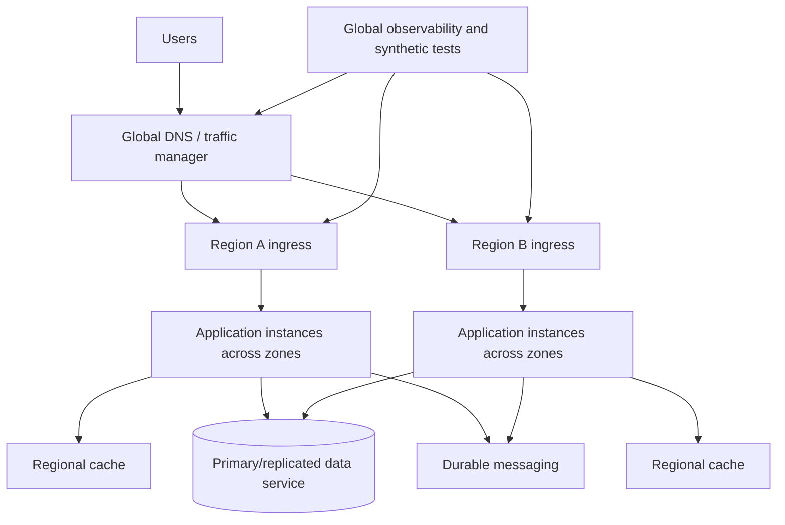
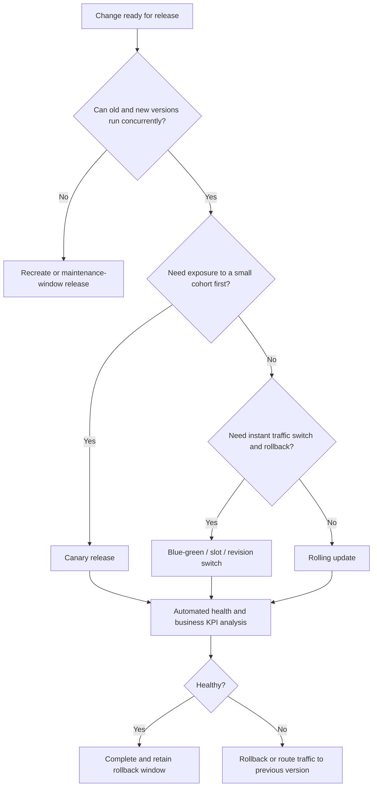

> **Document class:** Applications & Kubernetes implementation guide
> **Normative terms:** **MUST**, **MUST NOT**, **SHOULD**, **SHOULD NOT**, and **MAY** are requirements levels.
> **Applicability:** Application availability, performance, scaling, recovery, deployment strategies, failure testing, failover, and release verification.
> **Exception process:** Deviations require a documented risk assessment, compensating controls, named risk owner, and expiry date.

| Control field | Value |
|---|---|
| Document ID | `APP-08` |
| Owner | Cloud Center of Excellence |
| Review cycle | At least annually and after material cloud-service, Kubernetes, security, or operating-model changes |
| Evidence | SLO and recovery objectives, failure-mode analysis, load and chaos tests, deployment evidence, failover orchestration, and recovery verification |

# Resilience, Scaling, and Deployment Strategies

> **Decision in brief:** Design availability end to end across compute, identity, data, DNS, messaging, dependencies, and releases, then prove the result with measurable tests.

## Purpose

This standard defines how cloud applications meet availability, performance, elasticity, recovery, and safe-change requirements. It applies to managed web platforms, serverless containers, functions, AKS and other managed Kubernetes services, and VM-hosted applications.

Availability is an end-to-end property. A highly available compute platform does not make an application resilient when identity, DNS, data, messaging, certificates, configuration, or third-party dependencies remain single points of failure.

## Required service objectives

Every production workload **MUST** define:

- Critical user journeys.
- Service-level indicators and objectives.
- Error-budget policy.
- Maximum tolerable outage.
- Recovery Time Objective (RTO).
- Recovery Point Objective (RPO).
- Peak and sustained load assumptions.
- Latency and throughput targets.
- Data consistency requirements.
- Degraded-mode behavior.

A target such as “highly available” is invalid because it is not measurable.

## Resilience model

The diagram is conceptual. Active-active, active-passive, or pilot-light topology must be selected based on data consistency, recovery targets, cost, and operational capability.

## Mandatory resilience controls

1. Production services **MUST** remove single-instance dependencies when availability targets require redundancy.
2. Timeouts **MUST** exist on all remote calls.
3. Retries **MUST** be bounded, use backoff and jitter, and be limited to safe/idempotent operations.
4. Applications **MUST** implement graceful shutdown and readiness control.
5. Critical asynchronous processing **MUST** use durable messaging with retry and dead-letter handling.
6. Autoscaling **MUST** include minimum and maximum bounds and dependency-capacity analysis.
7. Deployments **MUST** support rollback or forward-fix within the change objective.
8. Database changes **MUST** be compatible with the selected deployment strategy.
9. Recovery procedures **MUST** be tested; documentation without execution evidence is insufficient.
10. Multi-region designs **MUST** include data, identity, secrets, certificates, DNS, network, configuration, images, and operating activation.

## Failure-mode analysis

At minimum, analyze:

- Process crash and memory leak.
- Instance, node, or pod failure.
- Availability-zone failure.
- Regional service failure.
- DNS failure or stale record.
- Certificate expiry or trust-chain failure.
- Identity-provider or token-service degradation.
- Secret/configuration provider failure.
- Database connection exhaustion, failover, or latency spike.
- Queue backlog and poison message.
- Dependency throttling or partial response.
- Bad deployment or incompatible schema.
- Network partition and asymmetric routing.
- Operator error and compromised credential.

Each failure mode requires detection, containment, recovery, and test evidence.

## Scaling architecture

Scaling has four distinct layers:

| Layer | Examples | Key risk |
|---|---|---|
| Request handling | Concurrency, worker threads, connection pools | Saturation inside one instance |
| Application replicas | App Service instances, Container Apps replicas, Kubernetes pods | Overloading dependencies |
| Compute capacity | App Service plan, Kubernetes nodes, serverless allocation | Slow or constrained capacity expansion |
| Data/dependency capacity | Database, cache, queue partitions, downstream APIs | Bottleneck moves downstream |

Autoscaling the application while leaving the database fixed is not a complete scaling design.

### Scaling signals

Use signals aligned with work:

- HTTP concurrency, request queue, latency, or saturation for synchronous services.
- Queue depth and oldest-message age for workers.
- Custom business throughput for specialized services.
- CPU only when CPU is proven to be the constrained resource.

### Scale bounds

Minimum capacity protects latency and availability. Maximum capacity protects budget and dependencies. Both must be explicit. Scaling policies need cooldown/stabilization to prevent oscillation.

## Deployment strategy decision

## Deployment patterns

### Rolling update

Default for stateless, backward-compatible applications. Define surge, unavailable capacity, readiness, termination, and rollback. It is unsafe when the old and new versions cannot share the same schema or protocol.

### Blue-green

Maintains two complete environments or revisions and switches traffic. It provides fast rollback but increases capacity and requires careful state, cache, session, and schema handling. Azure App Service slots and serverless-container revisions can implement variants of this pattern.

### Canary

Routes limited traffic to the new version and increases exposure based on measured technical and business signals. The cohort must be meaningful; random 1% traffic may not exercise critical tenant or transaction paths.

### Feature flags

Separate deployment from feature activation. Flags require ownership, audit, safe defaults, kill-switch testing, and removal. They are not a replacement for versioned deployment or authorization.

### Shadow traffic

Copies production requests to a non-authoritative version for comparison. Sensitive data handling, side effects, cost, and response isolation must be controlled.

## Database and state compatibility

Use expand-migrate-contract:

1. Expand schema with backward-compatible additions.
2. Deploy code that supports old and new representations.
3. Migrate or backfill data.
4. Verify all consumers have moved.
5. Remove old schema in a later release.

Avoid irreversible schema changes in the same step as application cutover. Session state should be externalized or compatible across versions. Cache keys and serialized message formats must be versioned deliberately.

## Dependency resilience patterns

- **Timeout:** Stop waiting before the caller's own deadline is consumed.
- **Retry:** Repeat transient failures only when safe.
- **Circuit breaker:** Prevent continuous calls to an unhealthy dependency.
- **Bulkhead:** Isolate resources so one dependency or tenant cannot exhaust the entire service.
- **Load shedding:** Reject lower-priority work before total collapse.
- **Queue:** Decouple producers and consumers and absorb bursts.
- **Idempotency key:** Make retried operations safe.
- **Cache:** Reduce dependency load while defining staleness and invalidation.
- **Fallback:** Provide degraded behavior only when it is correct and transparent.

Retries at multiple layers can amplify load exponentially. Define one primary retry owner per call path.

## Multi-zone and multi-region strategy

### Multi-zone

Use when the platform and data service support it and the SLO requires survival of a zonal failure. Workload replicas, node pools, load balancers, and storage must actually distribute across zones. A zone-redundant frontend with a zonal database remains zonally fragile.

### Multi-region

Choose among:

- **Backup and restore:** Lowest cost, highest RTO/RPO.
- **Pilot light:** Core data/services prepared, capacity scaled during recovery.
- **Warm standby:** Reduced-capacity secondary environment kept current.
- **Active-passive:** Full standby with controlled failover.
- **Active-active:** Both regions serve traffic; highest complexity, especially for data consistency.

Failover and failback are separate procedures and both must be tested.

## Platform-specific implementation mapping

| Capability | Azure | AWS | GCP | OCI |
|---|---|---|---|---|
| Managed web staged release | App Service deployment slots | Elastic Beanstalk environments / App Runner deployment patterns | App Engine versions or Cloud Run revisions | DevOps pipeline and load-balancer/version pattern |
| Serverless container traffic split | Container Apps revisions | App Runner/ECS deployment controller patterns | Cloud Run revisions | No exact equivalent; implement with load balancing and versioned deployments |
| Kubernetes rollout | AKS Deployment/Gateway/service-mesh patterns | EKS | GKE | OKE |
| Global traffic | Front Door / Traffic Manager | Route 53 / Global Accelerator / CloudFront as appropriate | Cloud Load Balancing / Cloud DNS | Traffic Management Steering Policies / DNS |
| Autoscaling | App Service autoscale, Container Apps scaling, HPA/KEDA | Application Auto Scaling, Fargate/EKS autoscaling | Cloud Run autoscaling, GKE HPA/cluster autoscaling | Service-specific autoscaling and OKE autoscaling |

Feature names do not guarantee identical failover, health-probe, session, traffic-split, or consistency behavior. Validate each implementation with fault tests.

## Observability and release verification

A release must be evaluated using:

- Error rate and latency by version.
- Saturation and resource pressure.
- Dependency health and throttling.
- Business transaction success.
- Queue age and backlog.
- Authentication/authorization failure rate.
- Regional and zonal distribution.
- Synthetic tests from relevant networks and geographies.

Rollback criteria must be defined before the release. “Watch the dashboard and decide” is not a controlled deployment strategy.

## Chaos and recovery testing

Test progressively:

1. Process termination and pod/instance replacement.
2. Dependency latency and error injection in non-production.
3. Node drain and zone evacuation.
4. Registry, DNS, identity, secret, and certificate failure scenarios.
5. Backup restoration to an isolated environment.
6. Regional failover and failback.
7. Operational communication and decision authority.

Tests must protect customer data and comply with change controls. The objective is evidence, not spectacle.

## Resilience tiers and minimum patterns

Organizations should map business criticality to a small number of resilience tiers. A tier should define minimum availability target, RTO, RPO, zone requirement, regional recovery pattern, backup frequency, test cadence, observability retention, and support coverage. This prevents each team from interpreting terms such as “critical” or “high availability” differently.

A lower tier may use backup and restore with documented manual activation. A higher tier may require zone-redundant capacity, warm regional standby, automated health-based routing, and frequent failover exercises. The selected tier must apply to dependencies as well as compute.

## Capacity-test methodology

Capacity tests should establish a measured operating envelope, not a single peak number. Test:

- Baseline capacity with the minimum instance count.
- Scale-out delay from minimum to expected peak.
- Sustained load after autoscaling stabilizes.
- Dependency saturation and connection-pool behavior.
- Load during one instance, node, or zone unavailable.
- Recovery after a burst ends, including scale-in and connection draining.
- Cost and telemetry volume during the test.

Record throughput, latency percentiles, error rate, saturation, instance count, queue age, dependency metrics, and the first limiting resource. The maximum approved scale must stay below the point at which dependencies become unstable.

## Regional failover orchestration

A regional recovery plan needs an ordered dependency sequence. A typical sequence is:

1. Declare the incident and freeze conflicting changes.
2. Confirm the selected data recovery point and replication state.
3. Validate target-region identity, keys, secrets, certificates, network, DNS, and registry access.
4. Start or scale application and platform capacity.
5. Run synthetic and data-integrity tests without public traffic.
6. Shift a controlled percentage of traffic.
7. Validate technical and business indicators.
8. Complete traffic shift and continue heightened monitoring.

Failback must account for data divergence, queued work, DNS caching, session behavior, and changes made while the primary region was unavailable. Treat failback as a separate change with its own validation and rollback criteria.

## Resilience evidence register

For each critical service, retain:

- Current architecture and dependency map.
- Approved SLO, RTO, and RPO.
- Capacity-test results and date.
- Backup and restore evidence.
- Zone-failure and regional-recovery exercise evidence.
- Known single points of failure and approved exceptions.
- Last successful certificate, secret, and identity recovery test.
- Open remediation items with owner and due date.

Recovery confidence decays as the system changes. Evidence older than major architecture, data, identity, or provider changes should not be treated as current.

## Dependency budgets

End-to-end timeout and retry budgets should be allocated from the caller's deadline. Each hop must leave enough time for upstream handling and safe cancellation. Retries must consume a bounded portion of the deadline and should stop when the remaining time cannot support another useful attempt.

Define concurrency and rate budgets for dependencies. Bulkheads may be separated by tenant, operation, or dependency so one slow path cannot consume every worker, thread, or connection. Load shedding should reject work early with a controlled response rather than allowing global queue growth and timeout cascades.

## Common anti-patterns

- Declaring multi-region readiness because infrastructure exists in two regions.
- Retrying every failure without idempotency or budgets.
- Autoscaling on CPU for a queue-bound workload.
- Setting no maximum replica limit.
- Blue-green deployment with incompatible database schema.
- Readiness checks that remove every instance during a shared dependency outage.
- Backups that have never been restored.
- Manual DNS failover with no tested decision process.
- Feature flags that become permanent architecture.
- Monitoring infrastructure health but not business transaction success.

## Validation

- [ ] Critical journeys, SLOs, error budget, RTO, RPO, capacity, and degraded mode are measurable.
- [ ] Failure-mode analysis covers compute, zone, region, DNS, identity, secrets, data, messaging, network, and change failures.
- [ ] Timeout, retry, idempotency, circuit-breaking, and load-shedding policies are explicit.
- [ ] Scaling signals match the workload and max scale protects dependencies and budget.
- [ ] Deployment strategy is compatible with sessions, messages, caches, and database schema.
- [ ] Rollback criteria and automated verification are defined before release.
- [ ] Multi-zone and multi-region claims are supported by end-to-end dependency design.
- [ ] Backup restore, failover, and failback are tested with evidence.
- [ ] Dashboards include technical and business outcome signals by version and region.

## Related topics

- [Azure App Service Architecture and Deployment](app-azure-app-service-architecture-and-deployment.md)
- [Container Apps and Serverless Containers](app-container-apps-and-serverless-containers.md)
- [Delivering and Operating AKS Workloads](app-delivering-and-operating-aks-workloads.md)
- [Kubernetes Backup, Restore, and Disaster Recovery](app-kubernetes-backup-restore-and-disaster-recovery.md)

## References

Use provider documentation as the source of truth for service limits, regional availability, supported versions, and feature behavior.
- [Azure App Service deployment slots](https://learn.microsoft.com/en-us/azure/app-service/deploy-staging-slots)
- [Azure Container Apps revisions](https://learn.microsoft.com/en-us/azure/container-apps/revisions)
- [Azure Container Apps scaling](https://learn.microsoft.com/en-us/azure/container-apps/scale-app)
- [AKS multi-region baseline architecture](https://learn.microsoft.com/en-us/azure/architecture/reference-architectures/containers/aks-multi-region/aks-multi-cluster)
- [Kubernetes probes](https://kubernetes.io/docs/tasks/configure-pod-container/configure-liveness-readiness-startup-probes/)
- [Kubernetes autoscaling workloads](https://kubernetes.io/docs/concepts/workloads/autoscaling/)
- [AWS Fargate or Lambda decision guide](https://docs.aws.amazon.com/decision-guides/latest/fargate-or-lambda/fargate-or-lambda.html)
- [GCP: GKE and Cloud Run](https://docs.cloud.google.com/kubernetes-engine/docs/concepts/gke-and-cloud-run)
- [OCI OKE disaster recovery preparation](https://docs.oracle.com/en/cloud/iaas/disaster-recovery/cssgm/prepare-oke-disaster-recovery.html)
