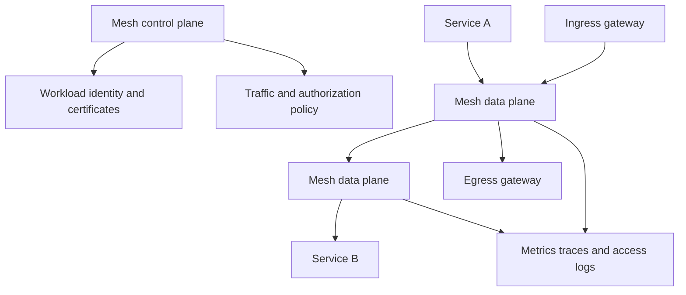

> **文档类型：**应用与 Kubernetes 强制工程标准
> **规范性术语：** **MUST**、**MUST NOT**、**SHOULD**、**SHOULD NOT** 和 **MAY** 是要求级别。
> **适用范围：** 服务网格选择、工作负载身份、双向 TLS、流量管理、多集群设计、可观测性、成本、采用和退出。
> **例外流程：** 偏离要求需要记录风险评估、补偿控制、指定风险负责人和到期日期。

|控制领域|价值|
|---|---|
|文件编号 | `APP-11` |
|负责人|云卓越中心 |
|审核周期|至少每年一次，并且在云服务、Kubernetes、安全性或运营模型发生重大变化之后 |
|证据|网格决策日志、mTLS 和授权测试、流量和延迟测量、故障模式分析、采用门和回滚证据 |

# 服务网格架构和采用指南

> **决策简述：** 仅当身份、加密、流量策略或遥测优势证明增加的控制平面、数据平面、可靠性和成本复杂性合理时，才采用服务网格。

## 目的

服务网格可以标准化工作负载身份、双向 TLS、流量策略和遥测，但它添加了分布式数据平面和关键控制平面。仅当其优势超过操作和应用复杂性时才采用。

## 决策标准

当存在以下几个要求时，请使用网格：

- 跨许多服务的一致的工作负载到工作负载相互 TLS。
- 独立于网络位置的基于身份的服务授权。
- 细粒度的流量迁移、故障注入或位置策略。
- 异构应用运行时的标准遥测。
- 具有共同策略的多集群服务通信。

不要仅仅为了获取基本入口、简单指标或少量 TLS 连接而采用网格。应用库、网关 API、云原生网络和 OpenTelemetry 可能更简单。

## 参考架构

## 架构选择

### Sidecar 数据平面

每个工作负载旁边运行一个代理。它提供成熟的流量拦截和每个工作负载策略，但会占用资源、改变 Pod 生命周期并增加升级面。

### 节点或环境数据平面

共享节点级组件减少了 sidecar 和应用 Pod 开销。评估功能成熟度、隔离、流量可见性、升级行为以及高级七层策略是否仍需要其他组件。

### 仅网关模型

中央网关管理南北向或选定的东西向流量，而无需拦截每个工作负载。当未建立全网格要求时，这通常是最好的初始步骤。

## 身份和加密

- 根据命名空间和服务账户为每个工作负载提供稳定的身份。
- 自动执行短期证书颁发和轮换。
- 明确定义信任域和联合边界。
- 兼容性验证后使用严格的双向 TLS。
- 授权服务身份和操作，而不仅仅是 IP 地址。
- 保护证书颁发机构密钥并测试信任锚轮换。

绿色的双向 TLS 仪表板并不证明授权。明确否认意外身份并验证负面案例。

## 流量管理标准

保持重试、超时、断路和异常值检测与应用语义一致。重试非幂等操作可能会重复事务。多个重试层可能会造成流量风暴。

对于金丝雀版本，将流量策略绑定到不可变的工作负载版本和客观的运行状况信号。保持直接回滚路径并避免不再与活动版本匹配的长期路由规则。

## 多集群、多云设计

在独立网格、联合信任域或跨集群的一个逻辑网格之间进行选择。考虑延迟、名称唯一性、重叠网络、证书颁发机构所有权、故障隔离、数据驻留和控制平面可达性。

在有用的情况下，使用 Azure、AWS、GCP 和 OCI 服务实现负载均衡、私有连接、DNS、证书和遥测，同时保持服务身份和授权策略的可移植性。除非接受风险，否则不需要远程控制平面来实现本地流量连续性。

## 安全和租户

- 限制谁可以更改网格范围内的策略、网关、信任和导出规则。
- 防止租户命名空间附加任意过滤器或全局导出服务。
- 在网格下应用网络策略作为纵深防御。
- 验证旁路路径、主机网络、排除的端口和未网格化的工作负载。
- 将代理管理端点和遥测视为敏感信息。

## 可观测性

收集请求率、错误率、延迟、连接状态、证书到期、策略拒绝、控制平面运行状况和代理资源使用情况。使用抽样和基数限制。网格指标不会取代应用业务指标或端到端跟踪。

## 采用顺序

1. 日志记录可度量的用例和成功标准。
2. 测试一个非关键服务组。
3. 建立身份、证书和策略所有权。
4. 验证故障、绕过、升级和回滚行为。
5.在受控波中添加生产服务。
6. 仅在证明等效性后才删除冗余应用或网关策略。

## Service Mesh 产品运营模型

网格必须被视为具有明确服务边界的平台产品。产品定义应包括支持的工作负载类型、命名空间、协议、功能、版本、升级节奏、证书颁发机构、信任域、遥测目标、服务目标、支持时间和事件所有权。

应用团队需要一份书面契约，描述注入或注册、排除拦截的端口、身份命名、默认授权、重试和超时所有权、网关使用、资源开销以及在事件期间选择退出或恢复的受支持方法。

## 容量和成本模型

网格成本不仅仅包括代理 CPU。测量：

- 每个工作负载的内存和 CPU 开销。
- 额外的 Pod 启动和终止时间。
- 控制平面和证书颁发能力。
- 遥测基数、访问日志量、跟踪量和保留。
- 地域策略引入的跨可用区或跨区域流量。
- 额外的网关容量和高可用性储备。
- 升级、策略和事件诊断的工程工作。

容量测试应包括峰值连接计数、证书轮换、配置扇出、控制平面重新启动和遥测后端中断。在平均流量下稳定的网格可能会在大规模部署或重新连接事件期间发生故障。

## 网格失效模式分析

至少测试以下故障：

- Sidecar 或节点数据平面进程不可用。
- 控制平面不可用或已分区。
- 工作负载证书过期或颁发者不可用。
- 分配给部分机队的无效策略。
- 升级期间代理版本出现偏差。
- DNS 或服务发现不一致。
- 网关耗尽或不可用区域。
- 遥测导出器背压。
- 通过主机网络、排除的端口或未网格化的工作负载进行拦截绕过。

定义哪些流量继续使用缓存配置以及哪些更改在控制平面中断期间无法应用。本地服务流量不应不必要地依赖于远程控制平面。

## 授权策略生命周期

对于受保护的服务组，网格授权应默认拒绝，并且应使用稳定的工作负载身份。策略需要正面和负面测试、所有者、审核日期和更改历史记录。避免仅基于可变标签或可用加密身份的源 IP 的策略。

信任域联合需要显式的捆绑分发、命名空间和身份映射、撤销行为和入侵边界。联合不应使一个集群中的每个工作负载自动受到另一个集群中每个工作负载的信任。

## 退出和回滚策略
采用必须包括删除工作负载或整个网格的路径。在没有网格的情况下保留需要的应用级超时、身份验证、授权和遥测。记录如何禁用注入、耗尽代理、删除终结器、在转换期间保留证书或信任以及清理特定于网格的路由和策略。

如果没有一小群专家就无法诊断或安全操作应用，那么网格就不能成功采用。

## 验证

- [ ] 网格的采用与记录在案的要求相关。
- [ ] 工作负载身份和信任域边界是明确的。
- [ ] 相互 TLS 和授权否定测试通过。
- [ ] 重试和超时策略不能放大失败。
- [ ] 控制和数据平面经过容量测试且具有区域弹性。
- [ ] 了解未网格化、旁路和故障路径。
- [ ] 测试分区期间的多集群行为。
- [ ] 测量代理开销和遥测成本。
- [ ] 演练升级和回滚过程。
- [ ] 应用团队可以诊断与网格相关的故障。

## 操作注意事项

将网格作为具有受支持版本、兼容性矩阵、更改窗口、SLO 和事件所有权的平台产品进行操作。监控代理版本差异和证书轮换。提供记录在案的方法以在事件期间安全地禁用注入或删除服务。

## 相关主题

- [Kubernetes 应用网络和网关架构](app-kubernetes-application-networking-and-gateway-architecture.md)
- [Kubernetes 应用安全和策略标准](app-kubernetes-application-security-and-policy-standards.md)
- [弹性、扩展和部署策略](app-resilience-scaling-and-deployment-strategies.md)
- [Kubernetes 可观测性和 OpenTelemetry 标准](app-kubernetes-observability-and-opentelemetry-standards.md)

## 参考文档

- [Istio 文档](https://istio.io/latest/docs/)
- [Linkerd 文档](https://linkerd.io/2/overview/)
- [CNCF：服务网格接口规范](https://github.com/servicemeshinterface/smi-spec)
- [Kubernetes 网关 API](https://gateway-api.sigs.k8s.io/)
- [SPIFFE 规范](https://spiffe.io/docs/latest/spiffe-about/spiffe-concepts/)
