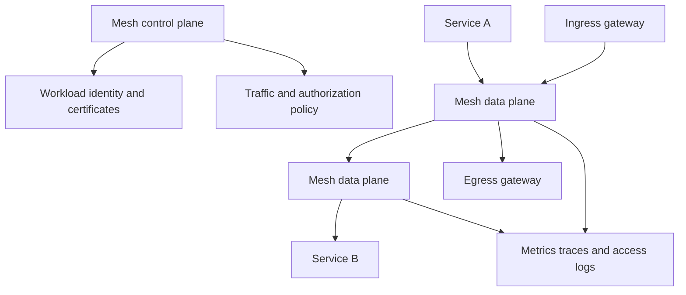

> **Document class:** Applications & Kubernetes mandatory engineering standard
> **Normative terms:** **MUST**, **MUST NOT**, **SHOULD**, **SHOULD NOT**, and **MAY** are requirements levels.
> **Applicability:** Service-mesh selection, workload identity, mutual TLS, traffic management, multi-cluster design, observability, cost, adoption, and exit.
> **Exception process:** Deviations require a documented risk assessment, compensating controls, named risk owner, and expiry date.

| Control field | Value |
|---|---|
| Document ID | `APP-11` |
| Owner | Cloud Center of Excellence |
| Review cycle | At least annually and after material cloud-service, Kubernetes, security, or operating-model changes |
| Evidence | Mesh decision record, mTLS and authorization tests, traffic and latency measurements, failure-mode analysis, adoption gates, and rollback evidence |

# Service Mesh Architecture and Adoption Guidelines

> **Decision in brief:** Adopt a service mesh only when identity, encryption, traffic policy, or telemetry benefits justify the added control-plane, data-plane, reliability, and cost complexity.

## Purpose

A service mesh can standardize workload identity, mutual TLS, traffic policy, and telemetry, but it adds a distributed data plane and a critical control plane. Adopt one only when its benefits exceed the operational and application complexity.

## Decision criteria

Use a mesh when several of these requirements exist:

- Consistent workload-to-workload mutual TLS across many services.
- Identity-based service authorization independent of network location.
- Fine-grained traffic shifting, fault injection, or locality policy.
- Standard telemetry for heterogeneous application runtimes.
- Multi-cluster service communication with common policy.

Do not adopt a mesh merely to obtain basic ingress, simple metrics, or a small number of TLS connections. Application libraries, Gateway API, cloud-native networking, and OpenTelemetry may be simpler.

## Reference architecture

## Architecture choices

### Sidecar data plane

A proxy runs beside each workload. It provides mature traffic interception and per-workload policy but consumes resources, changes pod lifecycle, and increases upgrade surface.

### Node or ambient data plane

Shared node-level components reduce sidecars and application-pod overhead. Evaluate feature maturity, isolation, traffic visibility, upgrade behavior, and whether advanced layer-seven policy still needs additional components.

### Gateway-only model

Central gateways manage north-south or selected east-west traffic without intercepting every workload. This is often the best initial step when full mesh requirements are not established.

## Identity and encryption

- Give each workload a stable identity based on namespace and service account.
- Automate short-lived certificate issuance and rotation.
- Define trust domains and federation boundaries explicitly.
- Use strict mutual TLS after compatibility validation.
- Authorize service identities and operations, not only IP addresses.
- Protect certificate-authority keys and test trust-anchor rotation.

A green mutual-TLS dashboard does not prove authorization. Explicitly deny unexpected identities and validate negative cases.

## Traffic management standards

Keep retries, timeouts, circuit breaking, and outlier detection consistent with application semantics. Retrying non-idempotent operations can duplicate transactions. Multiple retry layers can create a traffic storm.

For canary releases, bind traffic policy to immutable workload versions and objective health signals. Keep a direct rollback path and avoid long-lived routing rules that no longer match active releases.

## Multi-cluster and multi-cloud design

Choose among independent meshes, federated trust domains, or one logical mesh spanning clusters. Consider latency, name uniqueness, overlapping networks, certificate authority ownership, failure isolation, data residency, and control-plane reachability.

Use Azure, AWS, GCP, and OCI services for load balancing, private connectivity, DNS, certificates, and telemetry where helpful, while keeping service identity and authorization policy portable. Do not require a remote control plane for local traffic continuity unless the risk is accepted.

## Security and tenancy

- Restrict who can change mesh-wide policy, gateways, trust, and export rules.
- Prevent tenant namespaces from attaching arbitrary filters or exporting services globally.
- Apply network policy beneath the mesh as defense in depth.
- Validate bypass paths, host networking, excluded ports, and unmeshed workloads.
- Treat proxy admin endpoints and telemetry as sensitive.

## Observability

Collect request rate, error rate, latency, connection state, certificate expiry, policy denial, control-plane health, and proxy resource usage. Use sampling and cardinality limits. Mesh metrics do not replace application business metrics or end-to-end traces.

## Adoption sequence

1. Document measurable use cases and success criteria.
2. Test one non-critical service group.
3. Establish identity, certificate, and policy ownership.
4. Validate failure, bypass, upgrade, and rollback behavior.
5. Add production services in controlled waves.
6. Remove redundant application or gateway policy only after equivalence is proven.

## Service-mesh product operating model

A mesh must be treated as a platform product with an explicit service boundary. The product definition should include supported workload types, namespaces, protocols, features, versions, upgrade cadence, certificate authority, trust domains, telemetry destinations, service objectives, support hours, and incident ownership.

Application teams need a documented contract describing injection or enrollment, ports excluded from interception, identity naming, default authorization, retry and timeout ownership, gateway usage, resource overhead, and a supported method to opt out or recover during an incident.

## Capacity and cost model

Mesh cost includes more than proxy CPU. Measure:

- Per-workload memory and CPU overhead.
- Additional pod startup and termination time.
- Control-plane and certificate-issuance capacity.
- Telemetry cardinality, access-log volume, trace volume, and retention.
- Cross-zone or cross-region traffic introduced by locality policy.
- Additional gateway capacity and high-availability reserve.
- Engineering effort for upgrades, policy, and incident diagnosis.

Capacity tests should include peak connection count, certificate rotation, configuration fan-out, control-plane restart, and telemetry-backend outage. A mesh that is stable at average traffic may fail during mass rollout or reconnect events.

## Mesh failure-mode analysis

Test at least the following failures:

- Sidecar or node data-plane process unavailable.
- Control plane unavailable or partitioned.
- Expired workload certificate or unavailable issuer.
- Invalid policy distributed to part of the fleet.
- Proxy version skew during upgrade.
- DNS or service-discovery inconsistency.
- Gateway exhaustion or unavailable zone.
- Telemetry exporter backpressure.
- Interception bypass through host networking, excluded ports, or unmeshed workloads.

Define which traffic continues using cached configuration and which changes cannot be applied during control-plane outage. Local service traffic should not depend unnecessarily on a remote control plane.

## Authorization policy lifecycle

Mesh authorization should be deny-by-default for protected service groups and should use stable workload identities. Policies need positive and negative tests, owner, review date, and change history. Avoid policies based only on mutable labels or source IP where cryptographic identity is available.

Trust-domain federation requires explicit bundle distribution, namespace and identity mapping, revocation behavior, and compromise boundaries. Federation should not make every workload in one cluster automatically trusted by every workload in another.

## Exit and rollback strategy

Adoption must include a path to remove a workload or the entire mesh. Preserve application-level timeouts, authentication, authorization, and telemetry where they remain required without the mesh. Document how to disable injection, drain proxies, remove finalizers, retain certificates or trust during transition, and clean up mesh-specific routing and policy.

A mesh is not successfully adopted if applications cannot be diagnosed or safely operated without a small group of specialists.

## Validation

- [ ] Mesh adoption is tied to documented requirements.
- [ ] Workload identity and trust-domain boundaries are explicit.
- [ ] Mutual TLS and authorization negative tests pass.
- [ ] Retry and timeout policies cannot amplify failures.
- [ ] Control and data planes are capacity-tested and zone-resilient.
- [ ] Unmeshed, bypass, and failure paths are understood.
- [ ] Multi-cluster behavior during partition is tested.
- [ ] Proxy overhead and telemetry cost are measured.
- [ ] Upgrade and rollback procedures are rehearsed.
- [ ] Application teams can diagnose mesh-related failures.

## Operational considerations

Operate the mesh as a platform product with supported versions, compatibility matrices, change windows, SLOs, and incident ownership. Monitor proxy version skew and certificate rotation. Provide a documented method to disable injection or remove a service safely during an incident.

## Related topics

- [Kubernetes Application Networking and Gateway Architecture](app-kubernetes-application-networking-and-gateway-architecture.md)
- [Kubernetes Application Security and Policy Standards](app-kubernetes-application-security-and-policy-standards.md)
- [Resilience, Scaling, and Deployment Strategies](app-resilience-scaling-and-deployment-strategies.md)
- [Kubernetes Observability and OpenTelemetry Standards](app-kubernetes-observability-and-opentelemetry-standards.md)

## References

- [Istio documentation](https://istio.io/latest/docs/)
- [Linkerd documentation](https://linkerd.io/2/overview/)
- [CNCF: Service Mesh Interface specification](https://github.com/servicemeshinterface/smi-spec)
- [Kubernetes Gateway API](https://gateway-api.sigs.k8s.io/)
- [SPIFFE specifications](https://spiffe.io/docs/latest/spiffe-about/spiffe-concepts/)
