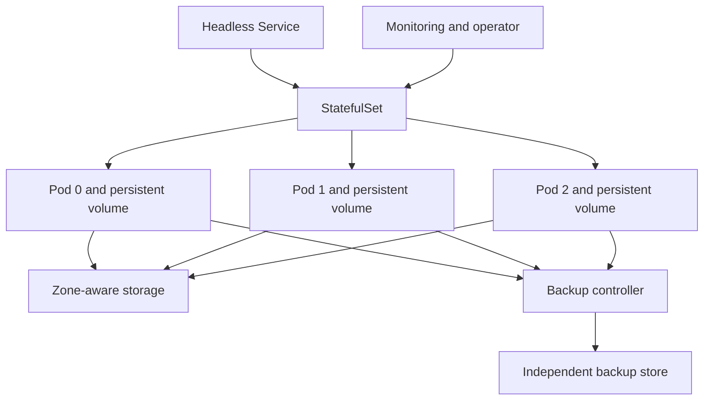

> **文档类型：** 应用和 Kubernetes 实施指南
> **规范性术语：** **MUST**、**MUST NOT**、**SHOULD**、**SHOULD NOT** 和 **MAY** 是要求级别。
> **适用范围：** 有状态 Kubernetes 工作负载、持久卷、存储类、一致性、复制、备份、恢复、升级和数据生命周期。
> **例外流程：** 偏离要求需要记录风险评估、补偿控制、指定风险负责人和到期日期。

|控制领域|价值|
|---|---|
|文件编号 | `APP-12` |
|负责人|云卓越中心 |
|审核周期|至少每年一次，并且在云服务、Kubernetes、数据、安全性或运营模型发生重大变化之后 |
|证据|布局决策、存储和一致性设计、备份和恢复测试、性能证据、卷生命周期日志记录和恢复验证 |

# Kubernetes 上的有状态工作负载和持久存储

> **简要决定：** 当满足要求时更喜欢托管数据服务；否则，明确 Kubernetes 的存储、一致性、备份、性能、升级和恢复职责。

## 目的

本文定义了何时以及如何在 Kubernetes 上运行有状态应用。 Kubernetes 可以编排稳定的身份和卷，但它不会自动提供数据库一致性、复制、备份或恢复。当托管数据服务满足延迟、可移植性、主权和操作要求时，首选该服务。

## 安置决定

|选项 |更喜欢什么时候 |主要权衡 |
|---|---|---|
|托管云数据服务|标准引擎、强大的托管可用性和备份 |提供商耦合和网络依赖|
|Operator 管理的服务 | Kubernetes 原生生命周期经过验证，团队负责专业知识 |操作员和存储复杂性|
|无 Operator 的 StatefulSet |应用负责集群和恢复|更多手动生命周期控制 |
|外部或自我管理的虚拟机服务 |专门的存储或操作系统需求|独立的自动化和运营模型|

记录决策、故障模式、支持所有者、RPO、RTO 和退出计划。

## 参考架构

## StatefulSet 标准

- 仅当需要稳定的身份、有序的行为或稳定的存储时才使用 StatefulSet。
- 当对等发现需要稳定的 DNS 时，定义无头服务。
- 设置跨节点和区域的反关联性或拓扑分布。
- 使用中断预算来保留法定人数而不阻止所有维护。
- 明确定义更新策略和分区行为。
- 不要假设 Pod 顺序等于运营就绪情况。
- 保护卷声明并了解删除或缩减期间的保留行为。

## 存储级设计

存储类别必须记录性能层、访问模式、回收策略、拓扑、加密、扩展、快照功能、备份集成和成本。当存储拓扑必须遵循 Pod 调度时，请使用 `WaitForFirstConsumer` 绑定。

从测量的工作负载行为中选择容量和 IOPS。监视延迟、队列深度、吞吐量、错误、饱和度和文件系统使用情况。大容量并不能保证每个提供商都有足够的吞吐量。

## 数据一致性和复制

应用级复制和存储级复制解决不同的故障。确认仲裁规则、裂脑预防、副本放置、故障转移时间、写入持久性以及网络分区后的恢复。

除非数据库控制器或记录在案的过程安全地添加成员，否则不要通过更改 StatefulSet 副本来扩展数据库。

## 备份与恢复

- 定义应用一致的备份程序；崩溃一致的快照可能还不够。
- 将备份存储在集群之外，最好是在其故障域之外。
- 加密备份并限制恢复权限与备份创建分开。
- 记录数据库版本、架构、加密密钥、卷数据和 Kubernetes 配置。
- 定期测试完整恢复和时间点恢复。
- 度量实现的 RPO 和 RTO，而不是依赖配置的计划。

## 升级和架构更改

使用提供商支持的版本路径。更改前进行备份、验证兼容性、按安全顺序升级副本、监控复制运行状况并保留回滚或前向恢复计划。协调应用架构更改与扩展和收缩版本。

## 多云存储映射

|能力|Azure|AWS | GCP |OCI |
|---|---|---|---|---|
|块存储 |Azure 磁盘 |EBS |持久磁盘/超级磁盘|块卷 |
|共享文件 | Azure Files | EFS / FSx |文件存储|文件存储 |
|托管 Kubernetes | AKS | EKS | GKE |无完全等效项|
|托管数据库示例 | Azure SQL / Cosmos DB | RDS / DynamoDB | Cloud SQL / Spanner |Autonomous Database/NoSQL |

CSI 行为、快照 API、性能层和区域语义有所不同。验证确切的驱动程序和版本，而不是仅从 Kubernetes 资源名称假设可移植性。

## 故障测试

测试 Pod 重新启动、节点丢失、区域丢失、卷分离延迟、存储限制、完整文件系统、损坏的副本、过期的证书、操作员中断、备份失败以及恢复到干净的环境。确认谁声明故障转移以及客户端如何重新连接。

## 数据放置和生命周期分类
有状态工作负载应按持久性、一致性、延迟、机密性、保留和恢复需求对数据进行分类。将权威数据与缓存、索引、副本、检查点和可重建制品区分开来。每个类别可能需要不同的存储、备份和加密策略。

本地临时存储仅应用于一次性数据。 PersistentVolume 提供超出 Pod 的持久性，但其本身并不提供应用一致性、区域持久性或防止删除和凭证泄露的保护。

## 持久卷生命周期控制

对于每个 PersistentVolumeClaim，日志记录：

- 存储类别和 CSI 驱动程序版本。
- 访问模式和文件系统或块模式。
- 回收和保留行为。
- 加密密钥所有权。
- 区域和节点拓扑约束。
- 快照和备份方法。
- 扩展和性能修改程序。
- 最大连接、安装、吞吐量和 IOPS 假设。
- 数据所有者和删除批准。

删除保护必须通过实际应用和 GitOps 工作流程进行测试。没有所有者的保留卷可能会导致成本泄漏和数据治理失败。

## 性能变化和体积扩展

容量扩展和性能层更改是操作更改，需要预留空间、兼容性检查以及回滚或前向恢复规划。验证 CSI 驱动程序是否支持在线扩展、文件系统调整大小、卷属性更改以及修改期间的应用行为。

监控容量百分比和增长率，以及延迟、队列深度、限制、吞吐量和突发信用行为（如果适用）。卷在填满之前很久就可能在操作上饱和。

## Operator 管理的数据服务验收

Operator 管理的数据库或数据系统只有在经过测试后才应获取批准：

- 引导和集群形成。
- 节点和区域丢失期间的仲裁行为。
- 备份、时间点恢复和干净环境恢复。
- 证书和凭证轮换。
- 版本升级、回滚、升级失败恢复。
- 存储扩展和副本替换。
- 操作员不可用和领导者选举。
- 终结器、删除和外部资源清理行为。
- 跨受支持的生命周期的 Kubernetes 和 CSI 兼容性。

提供商支持边界必须明确。平台团队不应该仅仅因为数据库运行在 Kubernetes 上就成为默认的数据库支持团队。

## 数据恢复验证

恢复测试必须验证应用级的正确性，而不仅仅是成功的卷附加。验证事务一致性、架构版本、索引、加密密钥、复制状态、用户权限和客户端重新连接。记录恢复的时间点和实际持续时间。如果需要跨区域恢复，请在声明可实现 RTO 之前验证存储类等效性和数据传输时间。

## 验证

- [ ] 记录了托管服务与 Kubernetes 放置。
- [ ] RPO、RTO、一致性和耐久性要求是可度量的。
- [ ] 副本和卷分布在适当的故障域中。
- [ ] 了解存储类、回收、扩展和快照行为。
- [ ] 仲裁和中断预算允许维护和保持可用性。
- [ ] 备份是独立的、加密的、受监控的且可恢复的。
- [ ] 扩展和升级过程是应用感知的。
- [ ] 容量和存储性能有告警和预测。
- [ ] 演练灾难情景并记录结果。

## 操作注意事项

有状态服务需要联合应用、平台、存储和数据所有权。维护仲裁丢失、卷卡住、附件失败、数据修复、恢复、证书轮换和操作员故障的运行手册。保留快照、跨区域副本、预置性能和恢复测试的预算。

## 相关主题

- [AKS 平台架构](app-aks-platform-architecture.md)
- [弹性、扩展和部署策略](app-resilience-scaling-and-deployment-strategies.md)
- [Kubernetes 备份、恢复和灾难恢复](app-kubernetes-backup-restore-and-disaster-recovery.md)
- [Kubernetes Operator、CRD 和准入 Webhook 治理](app-kubernetes-operators-crds-and-webhook-governance.md)

## 参考文档

- [Kubernetes：StatefulSets](https://kubernetes.io/docs/concepts/workloads/controllers/statefulset/)
- [Kubernetes：持久卷](https://kubernetes.io/docs/concepts/storage/persistent-volumes/)
- [Kubernetes：存储类](https://kubernetes.io/docs/concepts/storage/storage-classes/)
- [Kubernetes：卷快照](https://kubernetes.io/docs/concepts/storage/volume-snapshots/)
- [Kubernetes：Pod 中断](https://kubernetes.io/docs/concepts/workloads/pods/disruptions/)
