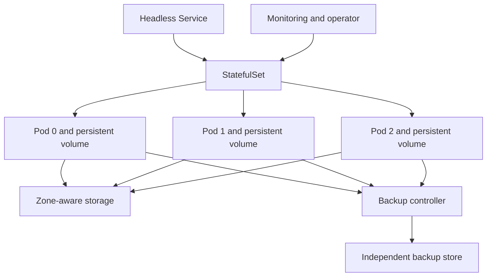

> **Document class:** Applications & Kubernetes implementation guide
> **Normative terms:** **MUST**, **MUST NOT**, **SHOULD**, **SHOULD NOT**, and **MAY** are requirements levels.
> **Applicability:** Stateful Kubernetes workloads, persistent volumes, storage classes, consistency, replication, backup, restore, upgrades, and data lifecycle.
> **Exception process:** Deviations require a documented risk assessment, compensating controls, named risk owner, and expiry date.

| Control field | Value |
|---|---|
| Document ID | `APP-12` |
| Owner | Cloud Center of Excellence |
| Review cycle | At least annually and after material cloud-service, Kubernetes, data, security, or operating-model changes |
| Evidence | Placement decision, storage and consistency design, backup and restore tests, performance evidence, volume lifecycle records, and recovery verification |

# Stateful Workloads and Persistent Storage on Kubernetes

> **Decision in brief:** Prefer managed data services when they meet requirements; otherwise make Kubernetes storage, consistency, backup, performance, upgrade, and recovery responsibilities explicit.

## Purpose

This article defines when and how to run stateful applications on Kubernetes. Kubernetes can orchestrate stable identities and volumes, but it does not automatically provide database consistency, replication, backup, or recovery. Prefer a managed data service when it meets latency, portability, sovereignty, and operational requirements.

## Placement decision

| Option | Prefer when | Main tradeoff |
|---|---|---|
| Managed cloud data service | Standard engine, strong managed availability and backup | Provider coupling and network dependency |
| Operator-managed service | Kubernetes-native lifecycle is proven and team has expertise | Operator and storage complexity |
| StatefulSet without operator | Application owns clustering and recovery | More manual lifecycle control |
| External or self-managed VM service | Specialized storage or operating-system needs | Separate automation and operations model |

Record the decision, failure modes, support owner, RPO, RTO, and exit plan.

## Reference architecture

## StatefulSet standards

- Use StatefulSet only when stable identity, ordered behavior, or stable storage is required.
- Define a headless Service when peer discovery needs stable DNS.
- Set anti-affinity or topology spread across nodes and zones.
- Use disruption budgets that preserve quorum without blocking all maintenance.
- Define update strategy and partition behavior explicitly.
- Do not assume pod order equals application readiness.
- Protect volume claims and understand retention behavior during deletion or scale-down.

## Storage-class design

Storage classes must document performance tier, access mode, reclaim policy, topology, encryption, expansion, snapshot capability, backup integration, and cost. Use `WaitForFirstConsumer` binding when storage topology must follow pod scheduling.

Select capacity and IOPS from measured workload behavior. Monitor latency, queue depth, throughput, errors, saturation, and filesystem usage. A large volume does not guarantee sufficient throughput on every provider.

## Data consistency and replication

Application-level replication and storage-level replication solve different failures. Confirm quorum rules, split-brain prevention, replica placement, failover time, write durability, and recovery after network partition.

Do not scale a database by changing StatefulSet replicas unless the database controller or documented procedure safely adds members.

## Backup and restore

- Define application-consistent backup procedures; crash-consistent snapshots may be insufficient.
- Store backups outside the cluster and preferably outside its failure domain.
- Encrypt backups and restrict restore permission separately from backup creation.
- Record database version, schema, encryption keys, volume data, and Kubernetes configuration.
- Test full and point-in-time restoration regularly.
- Measure achieved RPO and RTO rather than relying on configured schedules.

## Upgrade and schema changes

Use vendor-supported version paths. Back up before change, validate compatibility, upgrade replicas in a safe order, observe replication health, and retain a rollback or forward-recovery plan. Coordinate application schema changes with expand-and-contract releases.

## Multi-cloud storage mapping

| Capability | Azure | AWS | GCP | OCI |
|---|---|---|---|---|
| Block storage | Azure Disk | EBS | Persistent Disk / Hyperdisk | Block Volume |
| Shared file | Azure Files | EFS / FSx | Filestore | File Storage |
| Managed Kubernetes | AKS | EKS | GKE | OKE |
| Managed database examples | Azure SQL / Cosmos DB | RDS / DynamoDB | Cloud SQL / Spanner | Autonomous Database / NoSQL |

CSI behavior, snapshot APIs, performance tiers, and zone semantics differ. Validate the exact driver and version rather than assuming portability from Kubernetes resource names alone.

## Failure testing

Test pod restart, node loss, zone loss, volume detach delay, storage throttling, full filesystem, corrupt replica, expired certificate, operator outage, failed backup, and restore into a clean environment. Confirm who declares failover and how clients reconnect.

## Data placement and lifecycle classification

Stateful workloads should classify data by durability, consistency, latency, confidentiality, retention, and recovery needs. Distinguish authoritative data from caches, indexes, replicas, checkpoints, and rebuildable artifacts. Each class may require a different storage, backup, and encryption policy.

Local ephemeral storage is suitable only for disposable data. A PersistentVolume provides persistence beyond a pod but does not by itself provide application consistency, regional durability, or protection from deletion and credential compromise.

## Persistent-volume lifecycle controls

For every PersistentVolumeClaim, document:

- Storage class and CSI driver version.
- Access mode and filesystem or block mode.
- Reclaim and retention behavior.
- Encryption key ownership.
- Zone and node topology constraints.
- Snapshot and backup method.
- Expansion and performance-modification procedure.
- Maximum attachment, mount, throughput, and IOPS assumptions.
- Data owner and deletion approval.

Deletion protection must be tested through the actual application and GitOps workflow. A retained volume with no owner can become both a cost leak and a data-governance failure.

## Performance changes and volume expansion

Capacity expansion and performance-tier changes are operational changes that require headroom, compatibility checks, and rollback or forward-recovery planning. Verify whether the CSI driver supports online expansion, filesystem resize, volume attribute changes, and application behavior during modification.

Monitor capacity percentage and growth rate, but also latency, queue depth, throttling, throughput, and burst-credit behavior where applicable. A volume can be operationally saturated long before it is full.

## Operator-managed data service acceptance

An operator-managed database or data system should be approved only after testing:

- Bootstrap and cluster formation.
- Quorum behavior during node and zone loss.
- Backup, point-in-time restore, and clean-environment recovery.
- Certificate and credential rotation.
- Version upgrade, rollback, and failed upgrade recovery.
- Storage expansion and replica replacement.
- Operator unavailability and leader election.
- Finalizer, deletion, and external-resource cleanup behavior.
- Kubernetes and CSI compatibility across the supported lifecycle.

Vendor support boundaries must be explicit. The platform team should not become the default database support team merely because the database runs on Kubernetes.

## Data recovery verification

Restore tests must validate application-level correctness, not only successful volume attachment. Verify transaction consistency, schema version, indexes, encryption keys, replication state, user permissions, and client reconnection. Record the restored point in time and actual duration. Where cross-region recovery is required, validate storage-class equivalence and data transfer time before declaring the RTO achievable.

## Validation

- [ ] Managed-service versus Kubernetes placement is documented.
- [ ] RPO, RTO, consistency, and durability requirements are measurable.
- [ ] Replicas and volumes are distributed across appropriate failure domains.
- [ ] Storage class, reclaim, expansion, and snapshot behavior are understood.
- [ ] Quorum and disruption budgets allow maintenance and preserve availability.
- [ ] Backups are independent, encrypted, monitored, and restorable.
- [ ] Scaling and upgrade procedures are application-aware.
- [ ] Capacity and storage performance have alerts and forecasts.
- [ ] Disaster scenarios are exercised with recorded results.

## Operational considerations

Stateful services require joint application, platform, storage, and data ownership. Maintain runbooks for quorum loss, stuck volumes, failed attachment, data repair, restore, certificate rotation, and operator failure. Budget for retained snapshots, cross-region copies, provisioned performance, and recovery testing.

## Related topics

- [AKS Platform Architecture](app-aks-platform-architecture.md)
- [Resilience, Scaling, and Deployment Strategies](app-resilience-scaling-and-deployment-strategies.md)
- [Kubernetes Backup, Restore, and Disaster Recovery](app-kubernetes-backup-restore-and-disaster-recovery.md)
- [Kubernetes Operators, CRDs, and Admission Webhook Governance](app-kubernetes-operators-crds-and-webhook-governance.md)

## References

- [Kubernetes: StatefulSets](https://kubernetes.io/docs/concepts/workloads/controllers/statefulset/)
- [Kubernetes: Persistent Volumes](https://kubernetes.io/docs/concepts/storage/persistent-volumes/)
- [Kubernetes: Storage Classes](https://kubernetes.io/docs/concepts/storage/storage-classes/)
- [Kubernetes: Volume Snapshots](https://kubernetes.io/docs/concepts/storage/volume-snapshots/)
- [Kubernetes: Pod disruptions](https://kubernetes.io/docs/concepts/workloads/pods/disruptions/)
