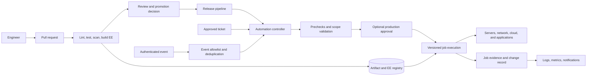
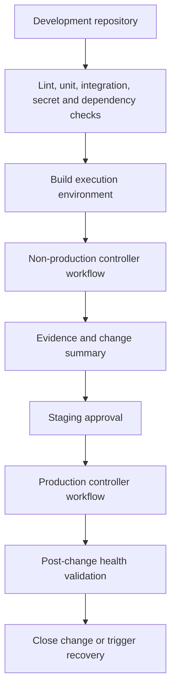

> **文档类型：** CI/CD & 自动化架构参考模型
> **规范性术语：** **MUST**、**MUST NOT**、**SHOULD**、**SHOULD NOT** 和 **MAY** 是要求级别。
> **适用范围：** 通过 CI/CD、自动化控制器、执行环境、计划操作、事件和服务管理工作流程进行 Ansible 交付。
> **例外流程：** 偏离要求需要记录风险评估、补偿控制、指定风险负责人和到期日期。

|控制领域|价值|
|---|---|
|文件编号 | `CICD-15` |
|负责人|云卓越中心 |
|审核周期|至少每年一次，并且在重大平台、提供商、安全性或运营模式发生变化之后 |
|证据|内容测试、执行环境来源、控制器 RBAC、清单和凭证分配、批准、时间表和工作证据 |

# CI/CD 和运维的 Ansible 交付模式

> **简要决定：** 让 CI 验证和晋级 Ansible 内容，同时受控自动化控制器负责目标感知执行、凭证、调度、批准和持久证据。

## 目的

本文定义了何时以及如何通过 CI/CD 流水线、Ansible 自动化平台或 AWX、计划操作、事件驱动的自动化和服务管理工作流程交付 Ansible 自动化。它将 Ansible 内容视为生产软件，并将创作、验证、执行、批准和证据分开。

中心设计决策不是使用流水线还是控制器。这是哪个系统负责每个责任。 CI 应该证明内容可以安全发布。控制器或批准的执行服务应提供目标感知授权、清单、凭证、工作流程、调度和持久的工作证据。一些低风险的本地或临时检查可以在 CI 中运行；生产变更应该使用受控的执行边界。

## 交付决策模型

|模式|最适合|生产变更|主控制平面|
|---|---|---:|---|
| CI 调用控制器 |发布耦合配置或部署|是的，升职后| CI 批准加上控制器 RBAC |
|控制器拉取 Git |预定的基线和操作|是的 |控制器项目修订和工作流程|
| CI 运行执行环境 |验证、单元测试、镜像或制品构建 |通常没有 | CI 身份和受保护的环境 |
| GitOps 配置 |期望状态平台和声明性目标|和解| Git 加目标控制器 |
|事件驱动的自动化 |对告警或事件的有限响应 |是的，已列入许可名单 |事件认证和控制器策略|
|工单触发的工作流程 |可审核的服务请求和维护|是的，已批准 | ITSM 请求加控制器工作流程 |

根据可变性、目标范围、批准要求、事件量、恢复行为和证据需求选择模式。不要引入控制器仅用于从流水线执行未经审查的 shell 命令，也不要强制应用部署流水线负责广泛的服务器操作。

## 参考交付架构

执行环境注册表必须包含生产作业使用的确切运行时。作业日志记录应包括源修订、执行环境摘要、清单修订或源、目标限制、凭证身份、输入、批准、结果和更改后验证。

## 模式 1：CI 调用控制器

这是发布耦合更改的默认模式。 CI 验证仓库、构建或选择执行环境，并通过范围狭窄的服务身份调用控制器工作流。控制器选择批准的项目修订、清单、凭证和作业模板。

将其用于：

- 与应用发布相关的操作系统或中间件更改；
- Terraform 或 Bicep 之后的配置后配置；
- 需要目标清单和串行波的部署工作流程；
- 跨测试、登台和生产的晋级；和
- 需要持久控制器作业 URL 作为证据的流水线。

流水线不得传递任意 Playbook 路径、凭证 ID、清单名称或无限制的额外变量。将发布输入映射到列入许可名单的控制器工作流程和类型化参数架构。

## 模式 2：控制器拉取 Git

在此模式中，控制器负责计划或手动批准的操作。项目跟踪分支、标签或提交策略，作业模板调用已知的 Playbook。控制器可以使用工作流进行预检查、金丝雀执行、批准、广泛执行和后检查。

将其用于：

- 合规基线；
- 补丁和维护窗口；
- 循环证书或账户轮换；
- 清单核对；和
- 由授权团队发起的操作手册。

控制器不得默默地跟踪未受保护的移动生产分支。固定修订版或使用受保护的发布分支以及记录在案的同步和回滚过程。

## 模式3：CI 运行执行环境

CI 可以在用于生产的同一执行环境中运行 `ansible-lint`、语法检查、分子测试、集成测试、安全扫描器和非变异检查模式作业。这减少了“在 CI 中工作但在控制器中不起作用”的故障。

CI 突变仅应用于所有权、凭证、清理和爆炸半径明确的孤立的临时环境。自托管运行器不能仅仅因为可以运行 Ansible 就获取广泛的生产凭证。使用联合、短期凭证、受保护的环境和运行器隔离。

## 模式 4：GitOps 和协调

当目标平台具有原生协调器并且所需的状态是声明性的时，GitOps 是合适的。 Ansible 可以准备目标、发布配置或执行协调操作，但它不应该与协调器竞争相同的字段。

定义每个资源或设置的权威所有者：

|领域 |典型权威| Ansible 的作用 |
|---|---|---|
|云拓扑| Terraform、Bicep 或同等产品 |后期配置和运营编排|
| Kubernetes 期望状态 | GitOps 控制器 |集群引导和平台工作流程 |
|服务器包和配置基线|Ansible |协调与修复|
|应用制品|应用交付系统|发布编排和健康验证|
|紧急变更|批准的事件工作流程 |暂时的突变之后的和解|

## 模式 5：事件驱动和工单触发操作

活动和门票是输入，而不是本身授权。接收方必须对发送方进行身份验证、验证架构、删除重复事件或关联事件、强制执行操作白名单、选择有界目标范围并记录结果作业。

事件驱动的作业应该回答：

- 接受什么类型的事件；
- 哪些属性是可信的；
- 哪个自动化操作映射到事件；
- 当事件重复或无序到达时会发生什么；
- 可以同时运行多少个作业；
- 当健康状况恶化时，行动如何停止；和
- 人们如何收到通知并可以取消或批准它。

切勿将事件负载直接用作 shell 命令、清单选择器、凭据选择器或任意文件路径。

## 晋级架构

升级应该移动不可变的内容和声明的配置集，而不是在每个环境中单独重建或重新解释相同的自动化。

生产工作流程应引用发布标签或不可变的提交和不可变的执行环境摘要。只有在批准范围之后才应使用生产清单和凭证。晋级证据应表明相同的内容经过测试和批准，而特定环境的输入仍单独控制。

## 仓库和执行环境契约

自动化仓库应声明：

- 支持 Ansible 和 Python 版本；
- 集合和系统依赖性；
- 执行环境定义和镜像来源；
- playbook 界面、所需权限和支持的平台；
- 清单契约和目标排除；
- lint、单元、集成和安全命令；
- 变更风险分类和所需的审核人员；
- 回滚或前向恢复行为；和
- 运营所有者和升级路径。

执行环境应根据经过审查的定义构建，在支持的情况下进行扫描、签名或证明，发布到受控注册表，并在生产中由摘要引用。依赖关系必须固定到兼容性集，而不是在生产运行期间从网络解析。

## 身份和边界设计

分离以下身份：

1. 批准变更的人员或服务。
2. 验证和发布内容的 CI 身份。
3. 启动作业的控制器身份。
4. Ansible 使用的目标连接身份。
5. 委托给控制器的模块使用的云 API 身份。

在平台支持的情况下使用工作负载身份联合或托管身份。控制器凭据的范围应限于目标和操作，而不是授予租户范围的管理。云操作应尽可能使用与服务器配置不同的凭据，以便受感染的 playbook 无法自动获取不相关的控制平面访问权限。

## 并发和恢复

控制器工作流程应设置串行或批量限制、失败阈值、超时、重试和取消行为。流水线不得针对同一服务启动重叠操作，除非工作流证明重叠操作是安全的。

对于高风险变更：

- 运行预检查并获取基线健康状况；
- 使用金丝雀目标或第一波；
- 暂停以进行自动和人工验证；
- 仅当健康门通过时才继续；
- 保留之前的内容和配置修改；
- 定义回滚和前向修复行为；和
- 仅在事后检查和证据完成后才关闭变更。

回滚并不总是一个反向 Playbook。包、模式、证书和数据迁移可能需要正向恢复路径。工作流必须在执行之前声明这一点。

## 验证

- [ ] 每个生产变更都使用经过批准的控制器工作流程或等效边界。
- [ ] CI 在代表性执行环境中验证语法、lint、依赖项、机密、安全性和测试。
- [ ] 生产作业使用固定内容和不可变的执行环境版本。
- [ ] 流水线输入已键入并列入白名单。
- [ ] 环境晋级不会重建未经审核的内容。
- [ ] 控制器 RBAC 将作者、审批者、操作员和凭证管理员分开。
- [ ] 事件和票证触发器进行身份验证、重复数据删除、速率限制和日志记录证据。
- [ ] 测试并发、取消、金丝雀、故障阈值和恢复行为。
- [ ] 工作证据与提交、发布、票证和目标范围相关。

## 操作注意事项

CI 平台负责仓库检查、制品发布和升级状态。自动化平台负责目标感知执行、作业证据、调度、清单和凭证。服务所有者负责 Playbook 契约和变更后的运行状况。云卓越中心负责标准模式、共享执行环境和异常。

当 Playbook 获取新的目标类型、权限、事件触发器或生产范围时，检查交付模式。对于单个服务安全的模式在复制到企业范围的清单时可能会变得不安全。

## 相关主题

- [Ansible 自动化架构参考模型](../infra-architecture/ansible-automation-architecture-reference-model.md)
- [Ansible 自动化工程标准](../standards-best-practices/ansible-automation-engineering-standard.md)
- [环境晋级、审批、发布控制](environment-promotion-approval-and-release-controls.md)
- [流水线即代码标准和可复用模板](pipeline-as-code-standards-and-reusable-templates.md)
- [如何在发布前验证基础设施](../how-to-guides/how-to-validate-infrastructure-before-release.md)

## 参考文档

- [Ansible 执行环境](https://docs.ansible.com/projects/ansible/latest/collections/community/general/docsite/guide_ee.html)
- [Ansible 生成器](https://docs.ansible.com/projects/builder/en/latest/)
- [Red Hat Ansible 自动化平台文档](https://docs.ansible.com/platform.html)
- [Ansible 最佳实践](https://docs.ansible.com/projects/ansible/latest/tips_tricks/ansible_tips_tricks.html)