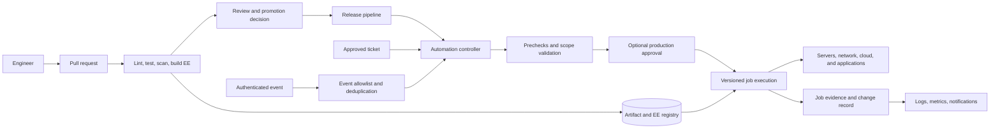
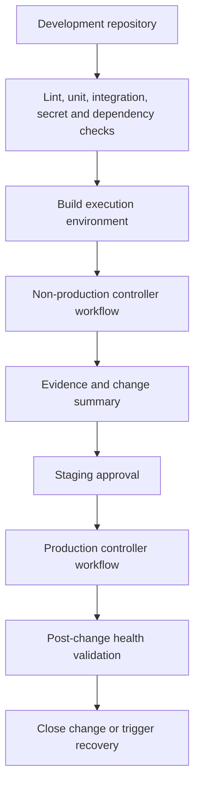

> **Document class:** CI/CD & Automation architecture reference model
> **Normative terms:** **MUST**, **MUST NOT**, **SHOULD**, **SHOULD NOT**, and **MAY** are requirements levels.
> **Applicability:** Ansible delivery through CI/CD, automation controllers, execution environments, scheduled operations, events, and service-management workflows.
> **Exception process:** Deviations require a documented risk assessment, compensating controls, named risk owner, and expiry date.

| Control field | Value |
|---|---|
| Document ID | `CICD-15` |
| Owner | Cloud Center of Excellence |
| Review cycle | At least annually and after material platform, provider, security, or operating-model changes |
| Evidence | Content tests, execution-environment provenance, controller RBAC, inventory and credential assignments, approvals, schedules, and job evidence |

# Ansible Delivery Patterns for CI/CD and Operations

> **Decision in brief:** Let CI validate and promote Ansible content while a controlled automation controller owns target-aware execution, credentials, scheduling, approvals, and durable evidence.

## Purpose

This article defines when and how Ansible automation should be delivered through CI/CD pipelines, Ansible Automation Platform or AWX, scheduled operations, event-driven automation, and service-management workflows. It treats Ansible content as production software and separates authoring, validation, execution, approval, and evidence.

The central design decision is not whether to use a pipeline or a controller. It is which system owns each responsibility. CI should prove that content is safe to publish. A controller or approved execution service should provide target-aware authorization, inventory, credentials, workflows, scheduling, and durable job evidence. Some low-risk local or ephemeral checks can run in CI; production mutation should use a controlled execution boundary.

## Delivery decision model

| Pattern | Best fit | Production mutation | Primary control plane |
|---|---|---:|---|
| CI invokes controller | Release-coupled configuration or deployment | Yes, after promotion | CI approval plus controller RBAC |
| Controller pulls Git | Scheduled baseline and operations | Yes | Controller project revision and workflow |
| CI runs execution environment | Validation, unit tests, image or artifact build | Normally no | CI identity and protected environment |
| GitOps configuration | Desired-state platforms and declarative targets | Reconciliation | Git plus target controller |
| Event-driven automation | Bounded response to an alert or event | Yes, allowlisted | Event authentication and controller policy |
| Ticket-triggered workflow | Auditable service requests and maintenance | Yes, approved | ITSM request plus controller workflow |

Select a pattern based on mutability, target scope, approval requirements, event volume, recovery behavior, and evidence needs. Do not introduce a controller only to execute an unreviewed shell command from a pipeline, and do not force an application deployment pipeline to own broad server operations.

## Reference delivery architecture

The execution environment registry must contain the exact runtime used by production jobs. The job record should include the source revision, execution-environment digest, inventory revision or source, target limit, credential identity, inputs, approval, result, and post-change validation.

## Pattern 1: CI invokes a controller

This is the default pattern for release-coupled changes. CI validates the repository, builds or selects an execution environment, and calls a controller workflow through a narrowly scoped service identity. The controller selects the approved project revision, inventory, credentials, and job template.

Use it for:

- operating-system or middleware changes coupled to an application release;
- post-provisioning configuration after Terraform or Bicep;
- deployment workflows that require target inventory and serial waves;
- promotion across test, staging, and production; and
- a pipeline that needs a durable controller job URL in its evidence.

The pipeline must not pass arbitrary playbook paths, credential IDs, inventory names, or unbounded extra variables. Map the release inputs to an allowlisted controller workflow and a typed parameter schema.

## Pattern 2: Controller pulls Git

In this pattern, the controller is responsible for scheduled or manually approved operations. A project tracks a branch, tag, or commit policy and the job template invokes a known playbook. The controller can use a workflow for prechecks, canary execution, approval, broad execution, and postchecks.

Use it for:

- compliance baselines;
- patch and maintenance windows;
- recurring certificate or account rotation;
- inventory reconciliation; and
- operational runbooks initiated by authorized teams.

The controller must not silently track an unprotected moving branch for production. Either pin the revision or use a protected release branch with a documented synchronization and rollback process.

## Pattern 3: CI runs the execution environment

CI may run `ansible-lint`, syntax checks, molecule tests, integration tests, security scanners, and non-mutating check-mode jobs inside the same execution environment used for production. This reduces “works in CI but not in the controller” failures.

CI mutation is acceptable only for isolated ephemeral environments whose ownership, credentials, cleanup, and blast radius are explicit. A self-hosted runner must not receive broad production credentials merely because it can run Ansible. Use federation, short-lived credentials, protected environments, and runner isolation.

## Pattern 4: GitOps and reconciliation

GitOps is appropriate when the target platform has a native reconciler and the desired state is declarative. Ansible can prepare the target, publish configuration, or perform operations around reconciliation, but it should not compete with the reconciler for the same fields.

Define the authoritative owner for each resource or setting:

| Domain | Typical authority | Ansible role |
|---|---|---|
| Cloud topology | Terraform, Bicep, or equivalent | Post-provisioning and operational orchestration |
| Kubernetes desired state | GitOps controller | Cluster bootstrap and platform workflows |
| Server package and configuration baseline | Ansible | Convergence and remediation |
| Application artifact | Application delivery system | Release orchestration and health validation |
| Emergency change | Approved incident workflow | Temporary mutation followed by reconciliation |

## Pattern 5: Event-driven and ticket-triggered operations

Events and tickets are inputs, not authorization by themselves. The receiver must authenticate the sender, validate the schema, deduplicate or correlate the event, enforce an action allowlist, select a bounded target scope, and record the resulting job.

An event-driven job should answer:

- what event type is accepted;
- which attributes are trusted;
- which automation action is mapped to the event;
- what happens when the event repeats or arrives out of order;
- how many jobs may run concurrently;
- how the action stops when health deteriorates; and
- how a human is notified and can cancel or approve it.

Never use an event payload directly as a shell command, inventory selector, credential selector, or arbitrary file path.

## Promotion architecture

Promotion should move immutable content and a declared configuration set, not rebuild or reinterpret the same automation separately in each environment.

The production workflow should reference a release tag or immutable commit and an immutable execution-environment digest. It should use the production inventory and credentials only after the approval boundary. Promotion evidence should show that the same content was tested and approved, while environment-specific inputs remain separately controlled.

## Repository and execution-environment contract

An automation repository should declare:

- supported Ansible and Python versions;
- collection and system dependencies;
- execution-environment definition and image provenance;
- playbook interfaces, required privileges, and supported platforms;
- inventory contract and target exclusions;
- lint, unit, integration, and security commands;
- change-risk classification and required reviewers;
- rollback or forward-recovery behavior; and
- operational owner and escalation path.

Execution environments should be built from a reviewed definition, scanned, signed or attested where supported, published to a controlled registry, and referenced by digest in production. Dependencies must be pinned to a compatibility set rather than resolved from the network during a production run.

## Identity and boundary design

Separate the following identities:

1. The human or service that approves the change.
2. The CI identity that validates and publishes content.
3. The controller identity that starts a job.
4. The target connection identity used by Ansible.
5. The cloud API identity used by modules delegated to the controller.

Use workload identity federation or managed identity where the platform supports it. A controller credential should be scoped to the target and action, not granted tenant-wide administration. Cloud operations should use separate credentials from server configuration where possible so that a compromised playbook cannot automatically gain unrelated control-plane access.

## Concurrency and recovery

Controller workflows should set serial or batch limits, failure thresholds, timeouts, retries, and cancellation behavior. A pipeline must not launch overlapping operations against the same service unless the workflow proves they are safe to overlap.

For high-risk changes:

- run prechecks and capture baseline health;
- use a canary target or first wave;
- pause for automated and human validation;
- continue only if the health gate passes;
- retain the previous content and configuration revision;
- define rollback and forward-fix behavior; and
- close the change only after postchecks and evidence are complete.

Rollback is not always a reverse playbook. Package, schema, certificate, and data migrations may require a forward recovery path. The workflow must state this before execution.

## Validation

- [ ] Every production mutation uses an approved controller workflow or equivalent boundary.
- [ ] CI validates syntax, lint, dependencies, secrets, security, and tests inside a representative execution environment.
- [ ] Production jobs use pinned content and immutable execution-environment versions.
- [ ] Pipeline inputs are typed and allowlisted.
- [ ] Environment promotion does not rebuild unreviewed content.
- [ ] Controller RBAC separates authors, approvers, operators, and credential administrators.
- [ ] Event and ticket triggers authenticate, deduplicate, rate-limit, and record evidence.
- [ ] Concurrency, cancellation, canary, failure threshold, and recovery behavior are tested.
- [ ] Job evidence correlates to a commit, release, ticket, and target scope.

## Operational considerations

The CI platform owns repository checks, artifact publication, and promotion state. The automation platform owns target-aware execution, job evidence, scheduling, inventories, and credentials. The service owner owns the playbook contract and post-change health. The Cloud Center of Excellence owns the standard patterns, shared execution environments, and exceptions.

Review delivery patterns when a playbook gains new target types, privileges, event triggers, or production scope. A pattern that is safe for a single service can become unsafe when copied to an enterprise-wide inventory.

## Related topics

- [Ansible Automation Architecture Reference Model](../infra-architecture/ansible-automation-architecture-reference-model.md)
- [Ansible Automation Engineering Standard](../standards-best-practices/ansible-automation-engineering-standard.md)
- [Environment Promotion, Approval, and Release Controls](environment-promotion-approval-and-release-controls.md)
- [Pipeline as Code Standards and Reusable Templates](pipeline-as-code-standards-and-reusable-templates.md)
- [How to Validate Infrastructure Before Release](../how-to-guides/how-to-validate-infrastructure-before-release.md)

## References

- [Ansible execution environments](https://docs.ansible.com/projects/ansible/latest/collections/community/general/docsite/guide_ee.html)
- [Ansible Builder](https://docs.ansible.com/projects/builder/en/latest/)
- [Red Hat Ansible Automation Platform documentation](https://docs.ansible.com/platform.html)
- [Ansible best practices](https://docs.ansible.com/projects/ansible/latest/tips_tricks/ansible_tips_tricks.html)
