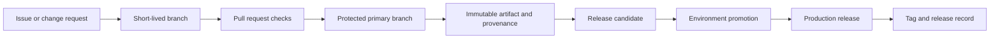

> **文档类型：** CI/CD & 自动化实施指南
> **规范性术语：** **MUST**、**MUST NOT**、**SHOULD**、**SHOULD NOT** 和 **MAY** 是要求级别。
> **适用范围：** 源分支、版本计算、发布记录、兼容性、修补程序、合并队列和单一仓库交付。
> **例外流程：** 偏离要求需要记录风险评估、补偿控制、指定风险负责人和到期日期。

|控制领域|价值|
|---|---|
|文件编号 | `CICD-11` |
|负责人|云卓越中心 |
|审核周期|至少每年一次，并且在重大平台、提供商、安全性或运营模式发生变化之后 |
|证据|分支保护、标签、版本元数据、发布清单、兼容性测试和修补程序日志记录 |

# 分支、版本控制和发布策略

> **简要决定：** 使用短期分支和不可变的发布记录，以便可以在不重建的情况下将生产追溯到已审查的源。

## 概述

分支策略控制变化如何聚合。版本控制策略确定了构建的内容。发布策略记录哪些不可变制品被批准和部署。这些实践必须协同工作，以便团队可以将生产工作负载追溯到经过审查的源，而无需重建它。

对于大多数团队来说，本指南支持基于主干的开发和短期分支。对于必须维护多个受支持版本的产品来说，长期发布分支是一个例外。

## 目标和非目标

### 目标

- 经常集成小的更改并保持主分支可发布。
- 生成不可变的、可追踪的版本和制品。
- 如果有用的话，将部署与用户可见的版本分开。
- 支持紧急修复，而不会丢失审查、证据或历史记录。
- 将相同的原则应用于应用、基础设施和配置仓库。

### 非目标

- 为每个源代码控制平台指定一个分支名称。
- 将分支视为环境。
- 为每个环境重建制品。
- 使用版本号代替兼容性文档。

## 推荐流程

主分支是集成点。功能开关、向后兼容的更改和自动化测试可以防止不完整的工作破坏其稳定性。

## 分支模型

### 主分支

- 保护它，禁止直接推送。
- 要求通过最新检查并完成审查。
- 防止历史记录重写和标签删除。
- 构建每个已接受的变更一次。
- 保持其可部署性或立即发现故障。

### 短暂的变更分支

分支应该包含一个连贯的更改，短暂保持打开状态，并在合并之前刷新。较大的更改应划分在兼容的接口或功能开关后面。

当拉取请求代表一个逻辑更改并且中间提交几乎没有增加长期价值时，首选挤压合并。当保留有意义的系列或签名的集成边界问题时，首选合并提交。记录所选约定，以便自动发布说明的行为可预测。

### 发布分支

仅当组织必须独立修补较旧的受支持产品线、稳定计划的产品系列或满足打包软件支持承诺时，才使用发布分支。

所需控制：

- 清楚地命名支持的线路，例如`release/2.x`。
- 定义支持结束日期。
- 如果可能的话，首先将修复应用到主分支，然后向后移植。
- 需要与主要分支相同的测试和安全检查。
- 切勿使用分支名称作为部署的制品标识。

### 环境分支

长期存在的 `dev`、`test` 和 `prod` 分支通常会发生漂移并产生合并歧义。当需要隔离时，首选具有环境目录或单独仓库的受保护配置分支。升级应该更改不可变的制品引用，而不是合并不相关的源历史记录。

## 版本控制策略

当组件具有已定义的公共接口时，使用语义版本控制：

- `MAJOR`：不兼容的接口或行为更改。
- `MINOR`：向后兼容能力。
- `PATCH`：向后兼容修正。
- 预发布标识符：候选版本或预览版本。

基础设施模块、流水线模板、API、库、Helm Chart和可复用配置应声明其公共接口的构成。当语义兼容性没有意义时，内部服务可以使用基于日期或基于构建的版本，但版本仍然必须是唯一且不可变的。

记录以人为本的版本和内容标识：
```text
release: 2.4.1
source_revision: 8f4c2e1...
artifact_digest: sha256:...
build_run: platform-specific immutable run identifier
```
## 标签和发布记录

- 从受保护的自动化或授权维护人员创建带注释或可加密验证的标签。
- 请勿移动或重新创建已发布的标签。
- 确保标签指向构建所使用的源版本。
- 附加发布说明、制品摘要、来源证明、SBOM 参考、批准和已知限制。
- 限制谁可以创建生产发布标签。

标签标识来源；制品摘要标识字节。保留两者。

## 发布类型

|释放类型 |触发|版本处理|典型控制 |
|---|---|---|---|
|持续交付|每个接受的更改都是可发布的 |自动化独特版本|晋级审批或策略|
|预定发布 |计划发布列车|发布候选版然后最终版 |稳定标准和变化窗口|
|修补程序 |紧急生产纠偏|补丁增量|通过完整的审计跟踪进行快速审查 |
|预览 |早期消费者反馈|预发布标识符 |非生产支持边界|
|模块或模板发布 |可复用的界面变化|语义版本 |兼容性契约和迁移说明|

## 晋级和环境映射

构建一次并通过开发、测试、登台和生产晋级相同的制品摘要。将环境配置与制品分开存储。

云账户、订阅、项目、隔间、集群和区域是部署边界，而不是版本边界。相同的版本标识应在 Azure、AWS、GCP 和 OCI 中保持可见。

## 修补程序工作流程

1. 确认严重性、所有者和受影响的版本。
2. 从维护的源代码行创建最小的安全更改。
3. 运行正常的自动验证；记录任何放弃的控制权。
4. 生成新的不可变制品和补丁版本。
5.晋级使用受保护的应急通道。
6. 验证健康状况并记录证据。
7. 后向端口或前向端口使得维护的分支不会发散。
8. 检查异常并删除临时访问权限。

切勿修改现有制品或将不同字节重新标记为同一版本。

## 数据库和契约兼容性

源回滚不保证数据回滚。使用扩展和收缩更改：

1. 添加向后兼容的架构或 API 功能。
2. 部署可以使用旧形式和新形式的代码。
3. 迁移数据并监控。
4. 在以后的版本中删除旧的表单。

声明服务、事件、API、配置和基础设施模块之间的兼容性。主要版本不会自动使破坏性迁移变得安全。

## 合并队列和主分支完整性

当许多拉取请求针对主分支时，仅针对较早的分支提示测试每个更改会产生竞争：单独传递更改在组合后可能会失败。当变更量或仓库重要性证明合理时，使用合并队列、门控集成分支或等效机制。

集成机制应该：

- 测试确切的候选合并提交。
- 保留所需的评论和状态检查。
- 当目标分支发生变化时重新评估策略。
- 防止排队更改绕过新引入的保护。
- 当假设无效时删除或重新排队更改。
- 发布用于构建的结果源修订版。

队列提高了集成可靠性，但不能取代小的更改、所有权审查或合并后监控。

## 发布清单

每个生产版本都应该有一个机器可读的清单，用于绑定源、制品、配置和部署目标：
```yaml
release: 2.4.1
source_revision: 8f4c2e1
artifacts:
  - name: orders-api
    digest: sha256:REPLACE_WITH_REAL_DIGEST
configuration_revision: 31ac993
template_version: 5.2.0
targets:
  - environment: production
    region: ca-central
compatibility:
  database_schema_min: 17
  event_contract: v3
```
清单是证据，而不是机密价值的场所。它应该是不可变的，根据需要进行签名或完整性保护，并与发布记录一起保留。

## 单一仓库注意事项

单一仓库可以支持基于主干的开发，但发布范围必须明确。使用依赖关系图、路径所有权、受影响的组件测试和特定于组件的版本计算。不要仅仅因为一个目录发生更改就增加每个组件，除非该产品有意作为一个单元发布。

对于共享库或模块：

- 记录下游兼容性。
- 防止组件版本引用未提交的同级输出。
- 在发布重大版本之前测试消费者。
- 当组件具有独立的支持义务时，保留独立的发布历史记录。

## 变更日志和发布说明质量

根据已审核的元数据生成发布说明，但需要人工审核以了解面向客户的含义。仅提交标题很少能解释迁移风险、操作影响、数据更改或删除行为。

发布说明应区分：

- 新功能。
- 缺陷修正。
- 安全修正。
- 破坏界面或行为改变。
- 需要操作员采取的行动。
- 弃用和删除日期。
- 已知的限制和回滚约束。

## 验证

- [ ] 主分支受到保护并持续验证。
- [ ] 变更分支是短暂的且范围狭窄。
- [ ] 每个版本都映射到一个源版本和制品摘要。
- [ ] 已发布的标签和制品是不可变的。
- [ ] 相同的制品通过环境进行提升。
- [ ] 发布说明描述了行为和兼容性更改。
- [ ] 支持的发布分支有所有者和结束日期。
- [ ] 修补程序已合并到所有应用的维护行中。
- [ ] 数据库更改在推出期间向后兼容。
- [ ] 执行回滚和前滚程序。

## 操作注意事项

跟踪分支年龄、合并交付时间、失败的主分支构建、发布频率、修补程序频率、版本采用和不受支持的发布线。仅在确认分支已合并或明确放弃后才自动清理过时分支。

发布自动化必须保持幂等性。如果版本或标签已存在，请安全失败而不是覆盖它。即使部署失败也保留发布清单。

## 相关主题

- [流水线即代码标准和可复用模板](pipeline-as-code-standards-and-reusable-templates.md)
- [环境晋级、审批、发布控制](environment-promotion-approval-and-release-controls.md)
- [GitOps 交付模式](gitops-delivery-patterns.md)
- [流水线故障排除与恢复](pipeline-troubleshooting-and-recovery.md)

## 参考文档

- [语义版本控制 2.0.0](https://semver.org/)
- [Git 文档：git-tag](https://git-scm.com/docs/git-tag)
- [GitHub 文档：关于受保护分支](https://docs.github.com/en/repositories/configuring-branches-and-merges-in-your-repository/managing-protected-branches/about-protected-branches)
- [Microsoft Learn：分支策略和设置](https://learn.microsoft.com/en-us/azure/devops/repos/git/branch-policies)
- [GitLab 文档：受保护的分支](https://docs.gitlab.com/user/project/repository/branches/protected/)
