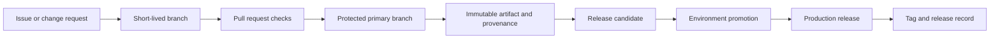

> **Document class:** CI/CD & Automation implementation guide
> **Normative terms:** **MUST**, **MUST NOT**, **SHOULD**, **SHOULD NOT**, and **MAY** are requirements levels.
> **Applicability:** Source branching, version calculation, release records, compatibility, hotfixes, merge queues, and monorepository delivery.
> **Exception process:** Deviations require a documented risk assessment, compensating controls, named risk owner, and expiry date.

| Control field | Value |
|---|---|
| Document ID | `CICD-11` |
| Owner | Cloud Center of Excellence |
| Review cycle | At least annually and after material platform, provider, security, or operating-model changes |
| Evidence | Branch protection, tags, version metadata, release manifest, compatibility tests, and hotfix records |

# Branching, Versioning, and Release Strategy

> **Decision in brief:** Use short-lived branches and immutable release records so production can be traced to reviewed source without rebuilding.

## Overview

A branching strategy controls how changes converge. A versioning strategy identifies what was built. A release strategy records which immutable artifact was approved and deployed. These practices must work together so teams can trace a production workload back to reviewed source without rebuilding it.

This guidance favors trunk-based development with short-lived branches for most teams. Long-lived release branches are an exception for products that must maintain multiple supported versions.

## Goals and non-goals

### Goals

- Integrate small changes frequently and keep the primary branch releasable.
- Produce immutable, traceable versions and artifacts.
- Separate deployment from user-visible release where useful.
- Support urgent fixes without losing review, evidence, or history.
- Apply the same principles to application, infrastructure, and configuration repositories.

### Non-goals

- Prescribing one branch name for every source-control platform.
- Treating a branch as an environment.
- Rebuilding artifacts for each environment.
- Using version numbers as a substitute for compatibility documentation.

## Recommended flow



The primary branch is the integration point. Feature flags, backward-compatible changes, and automated tests keep incomplete work from destabilizing it.

## Branching model

### Primary branch

- Protect it from direct pushes.
- Require current checks and review.
- Prevent history rewrites and tag deletion.
- Build every accepted change once.
- Keep it deployable or make failure visible immediately.

### Short-lived change branches

Branches should contain one coherent change, remain open briefly, and be refreshed before merge. Large changes should be split behind compatible interfaces or feature flags.

Prefer squash merge when a pull request represents one logical change and intermediate commits add little long-term value. Prefer merge commits when preserving a meaningful series or signed integration boundary matters. Document the chosen convention so automated release notes behave predictably.

### Release branches

Use a release branch only when the organization must patch an older supported line independently, stabilize a scheduled product train, or meet packaged-software support commitments.

Required controls:

- Name the supported line clearly, such as `release/2.x`.
- Define an end-of-support date.
- Apply fixes to the primary branch first when possible, then backport.
- Require the same tests and security checks as the primary branch.
- Never use the branch name as the deployed artifact identity.

### Environment branches

Long-lived `dev`, `test`, and `prod` branches commonly drift and create merge ambiguity. Prefer one protected configuration branch with environment directories or separate repositories when isolation is required. Promotion should change an immutable artifact reference, not merge unrelated source histories.

## Versioning policy

Use semantic versioning when a component has a defined public interface:

- `MAJOR`: incompatible interface or behavior change.
- `MINOR`: backward-compatible capability.
- `PATCH`: backward-compatible correction.
- Pre-release identifiers: release candidates or preview builds.

Infrastructure modules, pipeline templates, APIs, libraries, Helm charts, and reusable configuration should declare what constitutes their public interface. Internal services may use date- or build-based versions when semantic compatibility is not meaningful, but releases must still be unique and immutable.

Record both a human-oriented version and a content identity:

```text
release: 2.4.1
source_revision: 8f4c2e1...
artifact_digest: sha256:...
build_run: platform-specific immutable run identifier
```

## Tags and release records

- Create annotated or cryptographically verifiable tags from protected automation or authorized maintainers.
- Do not move or recreate a published tag.
- Ensure the tag points to the source revision used by the build.
- Attach release notes, artifact digests, provenance, SBOM references, approvals, and known limitations.
- Restrict who can create production release tags.

A tag identifies source; an artifact digest identifies bytes. Preserve both.

## Release types

| Release type | Trigger | Version treatment | Typical control |
|---|---|---|---|
| Continuous delivery | Every accepted change is releasable | Automated unique version | Promotion approval or policy |
| Scheduled release | Planned release train | Release candidate then final | Stabilization criteria and change window |
| Hotfix | Urgent production correction | Patch increment | Expedited review with full audit trail |
| Preview | Early consumer feedback | Pre-release identifier | Non-production support boundary |
| Module or template release | Reusable interface change | Semantic version | Compatibility contract and migration notes |

## Promotion and environment mapping

Build once and promote the same artifact digest through development, test, staging, and production. Store environment configuration separately from the artifact.

Cloud accounts, subscriptions, projects, compartments, clusters, and regions are deployment boundaries—not version boundaries. The same release identity should remain visible across Azure, AWS, GCP, and OCI.

## Hotfix workflow

1. Confirm severity, owner, and affected versions.
2. Create the smallest safe change from the maintained source line.
3. Run normal automated validation; document any waived control.
4. Produce a new immutable artifact and patch version.
5. Promote using the protected emergency path.
6. Verify health and record evidence.
7. Backport or forward-port so maintained branches do not diverge.
8. Review the exception and remove temporary access.

Never modify an existing artifact or retag different bytes as the same release.

## Database and contract compatibility

Source rollback does not guarantee data rollback. Use expand-and-contract changes:

1. Add backward-compatible schema or API capability.
2. Deploy code that can use both old and new forms.
3. Migrate data and observe.
4. Remove the old form in a later release.

Declare compatibility among services, events, APIs, configuration, and infrastructure modules. A major version does not automatically make a destructive migration safe.

## Merge queues and primary-branch integrity

When many pull requests target the primary branch, testing each change only against an earlier branch tip creates a race: individually passing changes can fail after combination. Use a merge queue, gated integration branch, or equivalent mechanism when change volume or repository criticality justifies it.

The integration mechanism should:

- Test the exact candidate merge commit.
- Preserve required reviews and status checks.
- Re-evaluate policy when the target branch changes.
- Prevent a queued change from bypassing newly introduced protections.
- Remove or requeue a change when its assumptions are invalidated.
- Publish the resulting source revision used for the build.

A queue improves integration reliability but does not replace small changes, ownership review, or post-merge monitoring.

## Release manifest

Every production release should have a machine-readable manifest that binds source, artifacts, configuration, and deployment targets:

```yaml
release: 2.4.1
source_revision: 8f4c2e1
artifacts:
  - name: orders-api
    digest: sha256:REPLACE_WITH_REAL_DIGEST
configuration_revision: 31ac993
template_version: 5.2.0
targets:
  - environment: production
    region: ca-central
compatibility:
  database_schema_min: 17
  event_contract: v3
```

The manifest is evidence, not a place for secret values. It should be immutable, signed or integrity-protected where required, and retained with the release record.

## Monorepository considerations

A monorepository can support trunk-based development, but release scope must be explicit. Use dependency graphs, path ownership, affected-component testing, and component-specific version calculation. Do not increment every component merely because one directory changed unless the product is intentionally released as a single unit.

For shared libraries or modules:

- Record downstream compatibility.
- Prevent a component release from referencing uncommitted sibling outputs.
- Test consumers before publishing a breaking major version.
- Keep independent release histories when components have independent support obligations.

## Changelog and release-note quality

Generate release notes from reviewed metadata, but require human review for customer-facing meaning. Commit titles alone rarely explain migration risk, operational impact, data changes, or removed behavior.

Release notes should distinguish:

- New capability.
- Defect correction.
- Security correction.
- Breaking interface or behavior change.
- Required operator action.
- Deprecation and removal dates.
- Known limitations and rollback constraints.

## Validation

- [ ] The primary branch is protected and continuously validated.
- [ ] Change branches are short-lived and narrowly scoped.
- [ ] Every release maps to one source revision and artifact digest.
- [ ] Published tags and artifacts are immutable.
- [ ] The same artifact is promoted through environments.
- [ ] Release notes describe behavior and compatibility changes.
- [ ] Supported release branches have owners and end dates.
- [ ] Hotfixes are merged into all applicable maintained lines.
- [ ] Database changes are backward compatible during rollout.
- [ ] Rollback and roll-forward procedures are exercised.

## Operational considerations

Track branch age, merge lead time, failed primary-branch builds, release frequency, hotfix frequency, version adoption, and unsupported release lines. Automate stale-branch cleanup only after confirming branches are merged or explicitly abandoned.

Release automation must remain idempotent. If a version or tag already exists, fail safely rather than overwrite it. Preserve the release manifest even when a deployment fails.

## Related topics

- [Pipeline as Code Standards and Reusable Templates](pipeline-as-code-standards-and-reusable-templates.md)
- [Environment Promotion, Approval, and Release Controls](environment-promotion-approval-and-release-controls.md)
- [GitOps Delivery Patterns](gitops-delivery-patterns.md)
- [Pipeline Troubleshooting and Recovery](pipeline-troubleshooting-and-recovery.md)

## References

- [Semantic Versioning 2.0.0](https://semver.org/)
- [Git documentation: git-tag](https://git-scm.com/docs/git-tag)
- [GitHub Docs: About protected branches](https://docs.github.com/en/repositories/configuring-branches-and-merges-in-your-repository/managing-protected-branches/about-protected-branches)
- [Microsoft Learn: Branch policies and settings](https://learn.microsoft.com/en-us/azure/devops/repos/git/branch-policies)
- [GitLab Docs: Protected branches](https://docs.gitlab.com/user/project/repository/branches/protected/)
