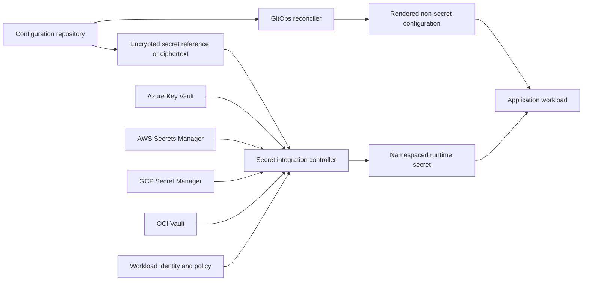
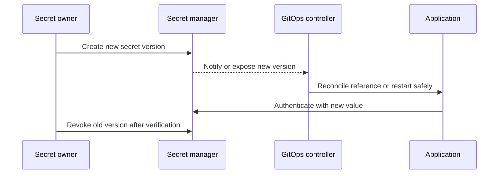

> **文档类型：** CI/CD & 自动化实施指南
> **规范性术语：** **MUST**、**MUST NOT**、**SHOULD**、**SHOULD NOT** 和 **MAY** 是要求级别。
> **适用范围：** GitOps 配置、机密引用、外部 Secret Manager、加密、轮换、协调故障安全行为。
> **例外流程：** 偏离要求需要记录风险评估、补偿控制、指定风险负责人和到期日期。

|控制领域|价值|
|---|---|
|文件编号 | `CICD-14` |
|负责人|云卓越中心 |
|审核周期|至少每年一次，并且在重大平台、提供商、安全性或运营模式发生变化之后 |
|证据|值分类、仓库策略、机密访问和轮换日志、协调运行状况和事件测试 |

# GitOps 中的配置和机密管理

> **决策简述：** 在 Git 中保留所需状态，在批准的机密系统中保留机密值，并使配置和轮换行为明确且可测试。

## 概述

GitOps 需要对所需状态进行版本控制，但并非每个值都属于纯文本 Git。非敏感配置应该是可审查的和声明性的。机密值通常应保留在专用 Secret Manager 中，并由授权工作负载或控制器在运行时检索。

当加密的机密存储在 Git 中时，密文仍然是敏感的操作数据：仓库历史记录是永久性的，解密权限可能会受到损害，元数据可能会泄露系统结构。

## 目标和非目标

### 目标

- 将应用配置与机密值分开。
- 使环境差异明确、最小化并且可审查。
- 将纯文本机密保留在仓库、日志、渲染制品和缓存之外。
- 使用工作负载身份和最小权限进行机密检索。
- 支持轮换、撤销、对账和灾难恢复。

### 非目标

- 使用 Base64 对机密进行编码并称其为加密的。
- 授予一个控制器访问每个组织机密的权限。
- 提交生成的明文清单。
- 针对每个不相关的配置更改重新启动所有工作负载。

## 参考架构

首选模式将权威机密值保存在云或企业 Secret Manager 中。 Git 仅存储检索它们所需的引用和访问策略。

## 在选择模式之前对值进行分类

|班级 |示例 |推荐地点 |
|---|---|---|
|公共配置|功能默认值、端口、非敏感端点 | git | git
|内部配置|资源名称、内部路由、调整值 |受保护的 Git 仓库 |
|敏感元数据 |机密名称、租户 ID、私有拓扑 |经过审查的暴露受限制的 Git |
|机密价值|密码、API 令牌、私钥 |Secret Manager 或批准的加密机密工作流程 |
|动态凭证 |数据库租约、云令牌|按需生成，寿命短 |

不要仅仅依赖开发人员的判断。定义组织范围的示例和自动检测。

## 配置结构

保留可复用的基础和小型环境覆盖层：
```text
apps/orders/
  base/
    deployment.yaml
    service.yaml
  overlays/
    development/
    staging/
    production/
```
- 将常用设置放在底座中。
- 将叠加层限制在真实的环境差异范围内。
- 验证完全渲染的输出，而不仅仅是单个片段。
- 避免为每个环境复制完整的清单。
- 为每个配置密钥指定所有者、预期类型、默认值和安全范围（如果可行）。
- 通过受控的生命周期删除过时的标志和值。

## 机密传递模式

### 外部 Secret Manager

控制器或工作负载从 Azure Key Vault、AWS Secrets Manager、GCP Secret Manager、OCI Vault、HashiCorp Vault 或其他批准的系统检索值。

优点：

- 明文保留在 Git 之外。
- 访问可以使用工作负载身份和 Cloud Audit Logs。
- 轮换和撤销是集中的。

风险：

- 控制器遭入侵可能会暴露其授权范围。
- 提供商中断或限制可能会延迟协调。
- 镜像 Kubernetes Secret 会创建另一个静态明文位置，除非受到保护。

这是默认的企业模式。

### Git 中的加密机密

SOPS 等工具使用 KMS、PGP 或年龄接收者来加密选定的值。协调器仅在授权环境中解密。

当离线审查、灾难恢复或平台限制证明 Git 中的密文合理时使用。按环境和租户分离密钥，将解密限制为协调器，轮换收件人，并测试仓库历史记录暴露响应。

切勿在拉取请求预览或 CI 制品中公开解密的输出。

### 密封或控制器绑定的机密

密文针对控制器持有的密钥进行加密。这可以简化命名空间工作流程，但会产生关键的备份、轮换和集群迁移责任。丢失私钥会使 Git 历史记录无法解密；泄露它可能会暴露使用该密钥加密的每个保留的密文。

### 动态机密

首选为工作负载身份生成的短期数据库凭据、证书或云令牌。动态机密可减少长期暴露，但需要更新、故障处理以及凭证刷新的应用支持。

## 多云映射

|控制|Azure|AWS | GCP |OCI |
|---|---|---|---|---|
|Secret Manager|Key Vault |Secret Manager/参数存储|Secrets Manager|Vault |
|重点服务| Key Vault / 托管 HSM | KMS / Cloud HSM |Cloud KMS/Cloud HSM | Vault KMS / 专用 KMS |
|工作负载身份|内部工作负载身份 |服务账户或工作负载身份的 IAM 角色 |工作负载身份联合|支持的工作负载或资源主体 |
|审核来源| Azure Activity Log and diagnostic logs |CloudTrail| Cloud Audit Logs|审计|

跨云使用相同的逻辑机密契约，但不要将每个机密集中在一个区域或提供商中，如果这会产生可用性或主权依赖性。

## 命名和访问边界

机密标识符应表达应用、环境、目的和版本，而不嵌入机密值。将生产和非生产保持在不同的访问边界内。
授予对最窄机密路径或对象的访问权限。分离读取值、更改元数据、轮换值、更改访问策略和删除版本的权限。人类的读取访问应该是特殊的并经过审核。

GitOps 协调器不应自动继承对租户仓库引用的每个机密的访问权限。根据租户和命名空间策略验证引用。

## 旋转和推出

当下游系统允许两个有效凭据时支持重叠。轮换、部署、验证，然后撤销。定义应用如何重新加载文件安装、环境变量和 API 检索的值。更新后的 Kubernetes Secret 并不能保证进程已使用它。

## 验证和策略控制

合并前：

1. 扫描更改的内容和历史内容以获取凭据。
2. 验证配置模式和允许的范围。
3. 在隔离环境中渲染叠加。
4. 确认渲染输出中没有出现机密值。
5. 验证机密引用、命名空间和提供商范围。
6. 拒绝来自非生产路径的生产引用。
7. 验证密文工作流程的加密收件人和密钥状态。
8. 检测破坏性删除或质量旋转。

协调后，验证预期的配置修订、机密版本、应用运行状况和审核事件，而不记录值。

## 事件响应

如果明文到达 Git：

1. 立即撤销或轮换机密。
2. 如有必要，禁用受影响的自动化或身份。
3. 确定每个仓库分支、克隆、制品、缓存以及可能包含它的日志。
4. 在重写历史之前保存证据。
5. 从当前内容中删除该值并遵循仓库历史记录策略。
6. 查看云和应用审计日志以供使用。
7. 使用新值和更窄的访问范围进行恢复。

重写历史并不能让已披露的机密再次变得值得信赖。

## 配置推出和重新加载语义

期望状态仓库必须指定配置更改如何到达正在运行的进程。常见的机制有不同的失败和回滚行为：

|机制|优势|主要风险|
|---|---|---|
| Pod 或服务修订版上的环境变量 |简单明了 |通常需要重新启动或新修订 |
|已挂载的文件 |支持就地刷新 |应用可能无法监控或验证更改|
|配置 API |动态且集中管理|运行时依赖和缓存一致性风险|
|功能开关服务 |渐进激活|隐藏的长期分支和提供商依赖|

对于每个配置键，记录更改是否是动态的、需要重新启动、需要推出还是在运行时禁止。控制器报告协调成功并不能证明应用已使用新值。

## 机密参考契约

机密引用应被视为类型化接口。定义：
```text
logical_name
provider_and_scope
expected_format
consumer_identity
refresh_method
maximum_staleness
rotation_owner
failure_behavior
```
应用应验证机密形状而不记录内容。当机密包含结构化数据时，将其架构与机密值分开进行版本控制。

避免在整个代码库中将应用与特定于提供商的机密名称耦合。使用逻辑契约并在部署配置中隔离提供商映射。

## 陈旧、中断和故障安全行为

定义 Secret Manager 或协调控制器不可用时的行为：

- 现有安装或缓存的值是否仍然有效。
- 允许的最大陈旧度。
- 是否可以启动新的副本。
- 验证材料是否必须失败关闭。
- 如何在中断之前检测证书或令牌过期。
- 当提供程序中轮换可用但未被工作负载使用时，会触发哪个告警。

不要实施无限制的高频重试。使用有界退避，公开过时版本指标，并避免提供程序恢复后出现集群舰队范围内的重启风暴。

## 配置策略示例

策略应检测：

- 未知的密钥或不受支持的架构版本。
- 非生产覆盖引用的生产端点。
- `ConfigMap`、Helm 值或 Kustomize 补丁中类似机密的值。
- 通配符机密路径。
- 禁用 TLS 或证书验证。
- 过期凭据的刷新间隔过长。
- 没有所有者和到期时间的临时覆盖。
- 配置对象的大量删除或替换。

阴性检测是强制性的。从未拒绝故意无效的赛程的策略未经证实。

## 验证

- [ ] 值在进入 Git 之前进行分类。
- [ ] 仓库和生成的制品中不存在明文机密。
- [ ] 生产和非生产使用单独的机密边界。
- [ ] 机密检索使用工作负载身份和最小权限。
- [ ] 租户仓库无法引用未经授权的机密路径。
- [ ] 加密密钥和接收者具有所有者和轮换程序。
- [ ] 应用可以安全地重新加载或更新凭据。
- [ ] 机密访问、更改、删除和失败均受到审核。
- [ ] 测试提供程序中断和限制行为。
- [ ] 执行仓库历史暴露响应和恢复。

## 操作注意事项

监控检索失败、过时版本、轮换期限、未使用的机密、过多读取、权限更改、协调错误以及使用已撤销版本的工作负载。避免在遥测中记录机密值或解密清单。

仅通过批准的密钥管理控制和测试恢复来备份加密密钥。对于外部机密管理者，记录区域复制、恢复时间目标、删除保护和 break-glass 访问。

## 相关主题

- [GitOps 交付模式](gitops-delivery-patterns.md)
- [多集群多租户 GitOps 架构](multi-cluster-and-multi-tenant-gitops-architecture.md)
- [流水线身份和机密处理](pipeline-identity-and-secret-handling.md)
- [流水线故障排除与恢复](pipeline-troubleshooting-and-recovery.md)

## 参考文档

- [Flux：SOPS 解密](https://fluxcd.io/flux/guides/mozilla-sops/)
- [External Secrets Operator 文档](https://external-secrets.io/latest/)
- [SOPS 文档](https://getsops.io/)
- [Microsoft Learn：带有 Azure Key Vault 的 Secrets Store CSI 驱动程序](https://learn.microsoft.com/en-us/azure/aks/csi-secrets-store-driver)
- [AWS Secrets Manager：最佳实践](https://docs.aws.amazon.com/secretsmanager/latest/userguide/best-practices.html)
- [GCP Secret Manager：最佳实践](https://cloud.google.com/secret-manager/docs/best-practices)
- [OCI Vault 文档](https://docs.oracle.com/en-us/iaas/Content/KeyManagement/home.htm)
