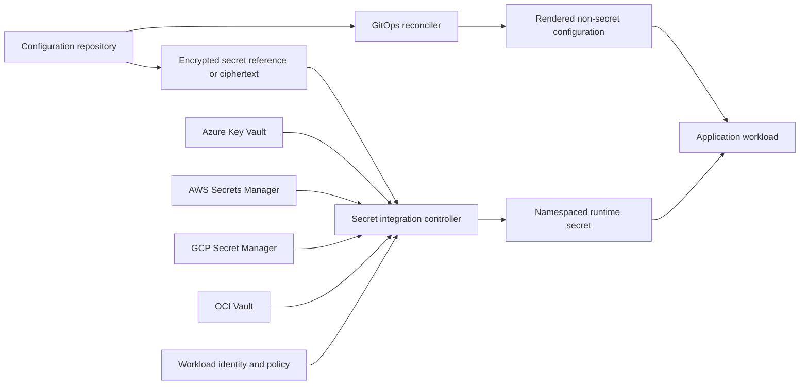
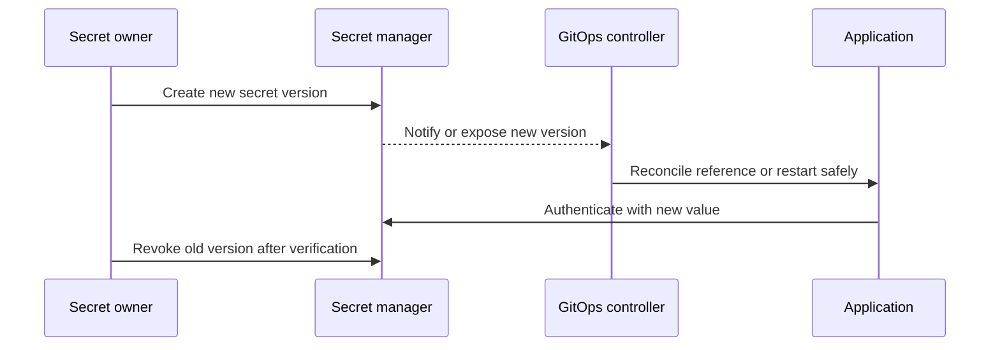

> **Document class:** CI/CD & Automation implementation guide
> **Normative terms:** **MUST**, **MUST NOT**, **SHOULD**, **SHOULD NOT**, and **MAY** are requirements levels.
> **Applicability:** GitOps configuration, secret references, external secret managers, encryption, rotation, reconciliation, and fail-safe behavior.
> **Exception process:** Deviations require a documented risk assessment, compensating controls, named risk owner, and expiry date.

| Control field | Value |
|---|---|
| Document ID | `CICD-14` |
| Owner | Cloud Center of Excellence |
| Review cycle | At least annually and after material platform, provider, security, or operating-model changes |
| Evidence | Value classification, repository policy, secret access and rotation records, reconciliation health, and incident tests |

# Configuration and Secret Management in GitOps

> **Decision in brief:** Keep desired state in Git, keep secret values in approved secret systems, and make configuration and rotation behavior explicit and testable.

## Overview

GitOps requires desired state to be versioned, but not every value belongs in plaintext Git. Non-sensitive configuration should be reviewable and declarative. Secret values should normally remain in a dedicated secret manager and be retrieved by an authorized workload or controller at runtime.

When encrypted secrets are stored in Git, the ciphertext is still sensitive operational data: repository history is permanent, decryption permissions can be compromised, and metadata may reveal system structure.

## Goals and non-goals

### Goals

- Separate application configuration from secret values.
- Make environment differences explicit, minimal, and reviewable.
- Keep plaintext secrets out of repositories, logs, rendered artifacts, and caches.
- Use workload identity and least privilege for secret retrieval.
- Support rotation, revocation, reconciliation, and disaster recovery.

### Non-goals

- Encoding secrets with Base64 and calling them encrypted.
- Giving one controller access to every organizational secret.
- Committing generated plaintext manifests.
- Restarting all workloads for every unrelated configuration change.

## Reference architecture



The preferred pattern keeps authoritative secret values in a cloud or enterprise secret manager. Git stores only the reference and access policy needed to retrieve them.

## Classify values before choosing a pattern

| Class | Examples | Recommended location |
|---|---|---|
| Public configuration | Feature defaults, ports, non-sensitive endpoints | Git |
| Internal configuration | Resource names, internal routes, tuning values | Protected Git repository |
| Sensitive metadata | Secret names, tenant IDs, private topology | Restricted Git with reviewed exposure |
| Secret value | Password, API token, private key | Secret manager or approved encrypted-secret workflow |
| Dynamic credential | Database lease, cloud token | Generated on demand with short lifetime |

Do not rely solely on a developer's judgment. Define organization-wide examples and automated detection.

## Configuration structure

Keep a reusable base and small environment overlays:

```text
apps/orders/
  base/
    deployment.yaml
    service.yaml
  overlays/
    development/
    staging/
    production/
```

- Put common settings in the base.
- Keep overlays limited to genuine environment differences.
- Validate the fully rendered output, not only individual fragments.
- Avoid copying complete manifests per environment.
- Give every configuration key an owner, expected type, default, and safe range where practical.
- Remove obsolete flags and values through a controlled lifecycle.

## Secret-delivery patterns

### External secret manager

A controller or workload retrieves values from Azure Key Vault, AWS Secrets Manager, GCP Secret Manager, OCI Vault, HashiCorp Vault, or another approved system.

Advantages:

- Plaintext remains outside Git.
- Access can use workload identity and cloud audit logs.
- Rotation and revocation are centralized.

Risks:

- Controller compromise can expose its authorized scope.
- Provider outages or throttling can delay reconciliation.
- Mirrored Kubernetes Secrets create another plaintext-at-rest location unless protected.

This is the default enterprise pattern.

### Encrypted secrets in Git

Tools such as SOPS encrypt selected values using KMS, PGP, or age recipients. A reconciler decrypts only within an authorized environment.

Use when offline review, disaster recovery, or platform constraints justify ciphertext in Git. Separate keys by environment and tenant, restrict decryption to the reconciler, rotate recipients, and test repository-history exposure response.

Never expose decrypted output in pull-request previews or CI artifacts.

### Sealed or controller-bound secrets

Ciphertext is encrypted for a controller-held key. This can simplify namespace workflows but creates key backup, rotation, and cluster-migration responsibilities. Losing the private key can make Git history undecryptable; compromising it can expose every retained ciphertext encrypted to that key.

### Dynamic secrets

Prefer short-lived database credentials, certificates, or cloud tokens generated for a workload identity. Dynamic secrets reduce standing exposure but require renewal, failure handling, and application support for credential refresh.

## Multi-cloud mapping

| Control | Azure | AWS | GCP | OCI |
|---|---|---|---|---|
| Secret service | Key Vault | Secrets Manager / Parameter Store | Secret Manager | Vault |
| Key service | Key Vault / Managed HSM | KMS / CloudHSM | Cloud KMS / Cloud HSM | Vault KMS / Dedicated KMS |
| Workload identity | Entra workload identity | IAM roles for service accounts or workload identity | Workload Identity Federation | Workload or resource principals where supported |
| Audit source | Azure Activity and diagnostic logs | CloudTrail | Cloud Audit Logs | Audit |

Use the same logical secret contract across clouds, but do not centralize every secret in one region or provider if that creates an availability or sovereignty dependency.

## Naming and access boundaries

Secret identifiers should express application, environment, purpose, and version without embedding the secret value. Keep production and non-production in different access boundaries.

Grant access to the narrowest secret path or object. Separate permissions to read values, change metadata, rotate values, alter access policy, and delete versions. Human read access should be exceptional and audited.

The GitOps reconciler should not automatically inherit access to every secret referenced by tenant repositories. Validate references against tenant and namespace policy.

## Rotation and rollout



Support overlap when the downstream system permits two valid credentials. Rotate, deploy, verify, and then revoke. Define how applications reload file-mounted, environment-variable, and API-retrieved values. An updated Kubernetes Secret does not guarantee that a process has consumed it.

## Validation and policy controls

Before merge:

1. Scan changed and historical content for credentials.
2. Validate configuration schemas and allowed ranges.
3. Render overlays in an isolated environment.
4. Confirm no secret value appears in rendered output.
5. Validate secret references, namespaces, and provider scope.
6. Reject production references from non-production paths.
7. Verify encryption recipients and key status for ciphertext workflows.
8. Detect destructive deletion or mass rotation.

After reconciliation, verify the expected configuration revision, secret version, application health, and audit event without logging the value.

## Incident response

If plaintext reaches Git:

1. Revoke or rotate the secret immediately.
2. Disable affected automation or identities if necessary.
3. Determine every repository fork, clone, artifact, cache, and log that may contain it.
4. Preserve evidence before history rewriting.
5. Remove the value from current content and follow repository-history policy.
6. Review cloud and application audit logs for use.
7. Restore with a new value and narrower access.

History rewriting does not make a disclosed secret trustworthy again.

## Configuration rollout and reload semantics

The desired-state repository must specify how a configuration change reaches the running process. Common mechanisms have different failure and rollback behavior:

| Mechanism | Strength | Main risk |
|---|---|---|
| Environment variable on pod or service revision | Simple and explicit | Usually requires restart or new revision |
| Mounted file | Supports in-place refresh | Application may not watch or validate changes |
| Configuration API | Dynamic and centrally governed | Runtime dependency and cache-consistency risk |
| Feature-flag service | Progressive activation | Hidden long-lived branches and provider dependency |

For each configuration key, document whether a change is dynamic, restart-required, rollout-required, or prohibited at runtime. A controller reporting successful reconciliation does not prove that the application consumed the new value.

## Secret-reference contract

A secret reference should be treated as a typed interface. Define:

```text
logical_name
provider_and_scope
expected_format
consumer_identity
refresh_method
maximum_staleness
rotation_owner
failure_behavior
```

Applications should validate secret shape without logging content. When a secret contains structured data, version its schema separately from the secret value.

Avoid coupling applications to provider-specific secret names throughout the codebase. Use a logical contract and isolate provider mapping in deployment configuration.

## Staleness, outage, and fail-safe behavior

Define behavior when the secret manager or reconciliation controller is unavailable:

- Whether an existing mounted or cached value remains valid.
- Maximum permitted staleness.
- Whether new replicas may start.
- Whether authentication material must fail closed.
- How certificate or token expiry is detected before outage.
- Which alert fires when rotation is available in the provider but not consumed by the workload.

Do not implement unlimited high-frequency retries. Use bounded backoff, expose stale-version metrics, and avoid fleet-wide restart storms after provider recovery.

## Configuration policy examples

Policy should detect:

- Unknown keys or unsupported schema versions.
- Production endpoints referenced by non-production overlays.
- Secret-like values in `ConfigMap`, Helm values, or Kustomize patches.
- Wildcard secret paths.
- Disabled TLS or certificate verification.
- Excessive refresh intervals for expiring credentials.
- Temporary overrides without owner and expiry.
- A large deletion or replacement of configuration objects.

Negative tests are mandatory. A policy that has never rejected an intentionally invalid fixture is unproven.

## Validation

- [ ] Values are classified before entering Git.
- [ ] Plaintext secrets are absent from repositories and generated artifacts.
- [ ] Production and non-production use separate secret boundaries.
- [ ] Secret retrieval uses workload identity and least privilege.
- [ ] Tenant repositories cannot reference unauthorized secret paths.
- [ ] Encryption keys and recipients have owners and rotation procedures.
- [ ] Applications can reload or renew credentials safely.
- [ ] Secret access, changes, deletion, and failures are audited.
- [ ] Provider outage and throttling behavior are tested.
- [ ] Exposure response and recovery are exercised.

## Operational considerations

Monitor retrieval failures, stale versions, rotation age, unused secrets, excessive reads, permission changes, reconciliation errors, and workloads using revoked versions. Avoid recording secret values or decrypted manifests in telemetry.

Back up encryption keys only through approved key-management controls and test restoration. For external secret managers, document regional replication, recovery-time objectives, deletion protection, and break-glass access.

## Related topics

- [GitOps Delivery Patterns](gitops-delivery-patterns.md)
- [Multi-Cluster and Multi-Tenant GitOps Architecture](multi-cluster-and-multi-tenant-gitops-architecture.md)
- [Pipeline Identity and Secret Handling](pipeline-identity-and-secret-handling.md)
- [Pipeline Troubleshooting and Recovery](pipeline-troubleshooting-and-recovery.md)

## References

- [Flux: SOPS decryption](https://fluxcd.io/flux/guides/mozilla-sops/)
- [External Secrets Operator documentation](https://external-secrets.io/latest/)
- [SOPS documentation](https://getsops.io/)
- [Microsoft Learn: Secrets Store CSI Driver with Azure Key Vault](https://learn.microsoft.com/en-us/azure/aks/csi-secrets-store-driver)
- [AWS Secrets Manager: Best practices](https://docs.aws.amazon.com/secretsmanager/latest/userguide/best-practices.html)
- [GCP Secret Manager: Best practices](https://cloud.google.com/secret-manager/docs/best-practices)
- [OCI Vault documentation](https://docs.oracle.com/en-us/iaas/Content/KeyManagement/home.htm)
