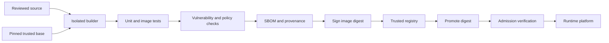

> **文档类型：** CI/CD 与自动化强制性工程标准
> **规范性术语：** **MUST**、**MUST NOT**、**SHOULD**、**SHOULD NOT** 和 **MAY** 是要求级别。
> **适用范围：** 容器构建上下文、依赖项、镜像来源、注册表、升级、准入、运行时切换和紧急重建。
> **例外流程：** 偏离要求需要记录风险评估、补偿控制、指定风险负责人和到期日期。

|控制领域|价值|
|---|---|
|文件编号 | `CICD-12` |
|负责人|云卓越中心 |
|审核周期|至少每年一次，并且在重大平台、提供商、安全性或运营模式发生变化之后 |
|证据| Dockerfile 和构建日志、依赖锁、扫描结果、SBOM 和证明、摘要升级、准入和重建测试 |

# 容器构建和发布最佳实践

> **简要决定：** 构建一次，通过摘要进行识别，验证来源证明和安全门，并在环境中晋级相同的镜像字节。

## 概述

容器镜像是一个可部署的软件制品，而不仅仅是运行 `docker build` 的结果。生产级流程必须控制构建上下文、基础镜像、依赖项、权限、元数据、漏洞状态、来源证明、注册表和升级路径。

构建一次，通过摘要识别结果，并跨云和环境晋级相同的字节。

## 目标和非目标

### 目标

- 生成最少的、可复制的、可归属的镜像。
- 防止凭证和不必要的工具进入层。
- 使用镜像摘要生成并保留安全证据。
- 通过受信任的注册中心发布并无需重建即可晋级。
- 在 Azure、AWS、GCP、OCI 和一致的 Kubernetes 平台上一致运行。

### 非目标

- 将成功的构建视为镜像安全的证据。
- 使用可变标签作为生产部署标识。
- 在每个生产镜像中安装调试工具。
- 在镜像层中嵌入环境配置或机密。

## 参考交付流程

## Dockerfile 和构建上下文标准

- 使用多阶段构建，以便编译器和包管理器不会进入运行时镜像。
- 从受信任的发布者处选择维护的、最小的基础。
- 通过摘要固定基础以实现可重复性，并通过经过审查的自动化进行更新。
- 使用 `.dockerignore` 排除源代码控制元数据、凭据、构建不需要的测试、本地制品和大型目录。
- 仅安装所需的运行时包并删除同一层中的包管理器缓存。
- 故意使用`COPY`；当只需要选定的输出时，切勿复制整个仓库。
- 在工作负载允许的情况下，设置具有稳定 UID 和 GID 的显式非根 `USER`。
- 使用绝对 `WORKDIR` 和执行形式 `ENTRYPOINT` 或 `CMD`。
- 在 `ARG`、`ENV`、文件或层中不存储密码、令牌、私钥或云凭证。
- 使用 BuildKit 机密或 SSH 安装进行构建时访问，并确认最终镜像中不存在该材料。

结构示例：
```dockerfile
# syntax=docker/dockerfile:1
FROM example-build-image@sha256:BUILD_DIGEST AS build
WORKDIR /src
COPY package-lock.json package.json ./
RUN --mount=type=cache,target=/root/.npm npm ci
COPY src ./src
RUN npm test && npm run build

FROM example-runtime-image@sha256:RUNTIME_DIGEST
WORKDIR /app
COPY --from=build --chown=10001:10001 /src/dist ./dist
USER 10001:10001
EXPOSE 8080
ENTRYPOINT ["node", "dist/server.js"]
```
占位符镜像和摘要必须替换为批准的值。如果未添加特定于工作负载的运行状况、依赖性和运行时控制，请勿复制此示例。

## 再现性和依赖性控制

- 提交锁定文件并使用确定性包管理器模式。
- 固定构建工具和自动化步骤，而不仅仅是应用依赖项。
- 采集源修订、构建器身份、构建参数、基本摘要、依赖项锁定和结果摘要。
- 在可行的情况下标准化时间戳或其他不确定性输入。
- 定期重建以合并修补的基础和依赖项。
- 比较需要高保证的重复构建。

构建缓存可以提高性能，但跨越了信任边界。按仓库和信任级别分隔缓存命名空间，验证远程缓存源，并且永远不要将机密放置在缓存层中。

## 镜像元数据和标记

发布一些有用的参考文档，同时将摘要视为权威：
```text
registry.example/app/orders:2.4.1
registry.example/app/orders:git-8f4c2e1
registry.example/app/orders@sha256:...
```
标签可以提高发现率，但可以移动。生产清单应使用摘要或不可变地解析和记录它的平台机制。

包括源仓库、源修订、版本、创建时间、许可证和文档的标准标签。当镜像可以离开组织时，请勿包含机密仓库 URL 或内部数据。

## 验证和安全门

所需的检查应包括：

1. Dockerfile linting 和策略验证。
2. 针对构建的镜像进行单元和集成测试。
3. 软件包和操作系统漏洞扫描。
4. 机密扫描源、构建上下文、层、历史记录和文件系统。
5. 根据需要检查恶意软件或组织特定的内容。
6. 运行时检查非根执行、可写路径、端口、信号和健康行为。
7. 以可接受的格式生成 SBOM。
8. 与摘要绑定的来源证明或构建证明。
9. 使用受保护或无密钥身份创建签名。

定义严重性阈值、可利用性注意事项、异常所有权和最大异常生命周期。扫描仪中断绝不能悄无声息地将所需的门转换为成功。

## 注册和晋级架构

|能力|Azure|AWS | GCP |OCI |
|---|---|---|---|---|
|托管注册表| Azure Container Registry |Amazon ECR|Artifact Registry | OCI Container Registry |
|工作负载边界|订阅或注册|账户或仓库 |项目或仓库 |租户、隔间或仓库 |
|运行时示例 | AKS、Container Apps、App Service | EKS、ECS、App Runner | GKE、Cloud Run | OKE，Container Instances |

对敏感注册表、最低权限推拉身份、加密、审计日志、保留策略、支持的不可变标签以及适合地理位置的复制使用私有端点或受控出口。

对于多 Cloud Deploy，可以从经批准的可访问注册表中提取通用摘要，也可以复制确切的清单和层。验证目标摘要是否匹配；不要在每个云中独立重建。

## 多架构镜像

在独立的、受支持的构建器中构建每个架构并发布 OCI 镜像索引。测试每个目标架构。记录索引摘要和特定于平台的镜像摘要，因为漏洞发现可能因操作系统和体系结构而异。

## 准入和运行时交接

部署平台应验证：

- 镜像来源是经批准的注册表。
- 允许摘要并与发布记录匹配。
- 签名和来源证明符合策略。
- 所需的 SBOM 和扫描证据存在并且是最新的。
- 除非明确批准，否则镜像不会以 root 身份运行。
- 存在运行时安全上下文、资源限制、运行状况探测和网络策略。

未经验证的签名只是生成证据，而不是执行。

## 构建隔离和网络策略
构建器是享有特权的供应链组件。按仓库和信任类隔离构建，并且更喜欢一次性构建器。可以访问不受限制的内部网络或云元数据的构建可以将依赖项受损扩大为基础设施受损。

构建网络策略应定义：

- 批准的软件包注册表和镜像。
- 依赖性解析后是否允许源下载。
- 使用短期凭证访问私有模块。
- 除非明确要求，否则拒绝云元数据端点。
- 不受信任的拉取请求构建的单独出口。
- 日志记录被拒绝的目的地，而不泄露包含凭据的 URL。

对于更高保证的制品，请使用分阶段或封闭模型：首先解析并验证依赖项，然后从经过批准的依赖项集进行构建，并具有最少的网络访问权限或没有网络访问权限。

## 基础镜像生命周期和紧急重建

通过摘要固定基础镜像可以提高可重复性，同时也可以冻结漏洞。维护自动化，以检测批准的上游基础发生变化或新的漏洞情报何时影响固定摘要。

响应过程应该：

1. 识别来自受影响基地的所有下游镜像。
2. 在干净的环境中使用更新后的批准基地进行重建。
3. 重新运行测试、SBOM 生成、扫描、来源证明和签名。
4. 通过正常的发布控制来晋级新的摘要。
5. 根据策略隔离或拒绝易受攻击的摘要。
6. 在事件或回滚义务需要时保留旧制品。

不要覆盖现有标签来隐藏易受攻击的镜像。发布新的不可变结果并更新部署引用。

## 运行时镜像契约

镜像生产者必须发布运行时平台的操作假设：

- 必需的 UID/GID 和可写路径。
- 监听端口和协议。
- 入口点和信号处理行为。
- 启动、准备情况和活跃度期望。
- 临时存储要求和最大增长。
- CPU 架构和操作系统系列。
- 所需的 Linux 功能或 seccomp 例外。
- 预期的配置和机密接口。

此契约可防止交付流水线将镜像传递给具有未定义运行时行为的 Kubernetes、App Service、Container Apps、ECS、Cloud Run 或 OCI 服务。

## 认证策略

证据应与准确的摘要绑定，并至少包括：
```text
source revision
builder identity
build definition version
base-image digest
dependency lock hashes
SBOM reference
test and scan result
provenance and signature
```
定义谁可以颁发每个证明以及谁验证它。在没有独立信任边界的情况下，由同一受损作业产生的证明的证据价值有限。

## 验证

- [ ] 基础镜像经过批准、最小化并由摘要固定。
- [ ] 多阶段构建从运行时镜像中排除构建工具。
- [ ] 构建上下文、图层、历史记录和缓存中不存在机密。
- [ ] 依赖项和构建工具已固定。
- [ ] 镜像测试和安全门在最终镜像上运行。
- [ ] SBOM、来源证明、扫描结果和签名参考摘要。
- [ ] 生产部署使用不可变的摘要。
- [ ] 注册表推送和运行时拉取身份使用最小权限。
- [ ] 多云副本保留相同的内容。
- [ ] 测试了重建、撤销、回滚和保留过程。

## 操作注意事项

监控基础镜像的寿命、严重漏洞、未签名的镜像、复制失败、拉取失败、存储增长、未使用的标签以及过去支持部署的镜像。隔离受损的摘要并在删除之前识别使用它们的每个环境。

保留必须保留回滚和调查所需的制品。垃圾收集应根据可达性和策略进行操作，而不仅仅是标记年龄。

## 相关主题

- [实用的 CI/CD 蓝图](practical-ci-cd-blueprint.md)
- [流水线身份和机密处理](pipeline-identity-and-secret-handling.md)
- [共享运行器安全与清理规范](shared-runner-security-and-hygiene.md)
- [环境晋级、审批、发布控制](environment-promotion-approval-and-release-controls.md)

## 参考文档

- [Docker 文档：构建最佳实践](https://docs.docker.com/build/building/best-practices/)
- [Docker 文档：构建机密](https://docs.docker.com/build/building/secrets/)
- [Kubernetes：镜像](https://kubernetes.io/docs/concepts/containers/images/)
- [OCI 镜像格式规范](https://github.com/opencontainers/image-spec)
- [SLSA：软件制品的供应链级别](https://slsa.dev/)
- [Sigstore 文档](https://docs.sigstore.dev/)
