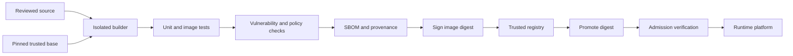

> **Document class:** CI/CD & Automation mandatory engineering standard
> **Normative terms:** **MUST**, **MUST NOT**, **SHOULD**, **SHOULD NOT**, and **MAY** are requirements levels.
> **Applicability:** Container build contexts, dependencies, image provenance, registries, promotion, admission, runtime handoff, and emergency rebuilds.
> **Exception process:** Deviations require a documented risk assessment, compensating controls, named risk owner, and expiry date.

| Control field | Value |
|---|---|
| Document ID | `CICD-12` |
| Owner | Cloud Center of Excellence |
| Review cycle | At least annually and after material platform, provider, security, or operating-model changes |
| Evidence | Dockerfile and build records, dependency locks, scan results, SBOM and attestations, digest promotion, admission, and rebuild tests |

# Container Build and Release Best Practices

> **Decision in brief:** Build once, identify by digest, verify provenance and security gates, and promote the same image bytes across environments.

## Overview

A container image is a deployable software artifact, not merely the result of running `docker build`. A production-grade process must control the build context, base image, dependencies, privileges, metadata, vulnerability posture, provenance, registry, and promotion path.

Build once, identify the result by digest, and promote the same bytes across clouds and environments.

## Goals and non-goals

### Goals

- Produce minimal, reproducible, attributable images.
- Prevent credentials and unnecessary tooling from entering layers.
- Generate and retain security evidence with the image digest.
- Publish through trusted registries and promote without rebuilding.
- Run consistently on Azure, AWS, GCP, OCI, and conformant Kubernetes platforms.

### Non-goals

- Treating a successful build as proof that an image is safe.
- Using mutable tags as the production deployment identity.
- Installing debugging tools in every production image.
- Embedding environment configuration or secrets in image layers.

## Reference delivery flow



## Dockerfile and build-context standards

- Use multi-stage builds so compilers and package managers do not enter the runtime image.
- Select a maintained, minimal base from a trusted publisher.
- Pin the base by digest for reproducibility and update it through reviewed automation.
- Use `.dockerignore` to exclude source-control metadata, credentials, tests not needed for build, local artifacts, and large directories.
- Install only required runtime packages and remove package-manager caches in the same layer.
- Use `COPY` deliberately; never copy the entire repository when only selected outputs are needed.
- Set an explicit non-root `USER` with stable UID and GID when the workload permits.
- Use an absolute `WORKDIR` and exec-form `ENTRYPOINT` or `CMD`.
- Store no passwords, tokens, private keys, or cloud credentials in `ARG`, `ENV`, files, or layers.
- Use BuildKit secret or SSH mounts for build-time access and confirm the material is absent from the final image.

Example structure:

```dockerfile
# syntax=docker/dockerfile:1
FROM example-build-image@sha256:BUILD_DIGEST AS build
WORKDIR /src
COPY package-lock.json package.json ./
RUN --mount=type=cache,target=/root/.npm npm ci
COPY src ./src
RUN npm test && npm run build

FROM example-runtime-image@sha256:RUNTIME_DIGEST
WORKDIR /app
COPY --from=build --chown=10001:10001 /src/dist ./dist
USER 10001:10001
EXPOSE 8080
ENTRYPOINT ["node", "dist/server.js"]
```

The placeholder images and digests must be replaced with approved values. Do not copy this example without adding workload-specific health, dependency, and runtime controls.

## Reproducibility and dependency control

- Commit lock files and use deterministic package-manager modes.
- Pin build tools and actions, not only application dependencies.
- Capture the source revision, builder identity, build arguments, base digest, dependency lock, and resulting digest.
- Normalize timestamps or other nondeterministic inputs where practical.
- Rebuild periodically to incorporate patched bases and dependencies.
- Compare repeated builds where high assurance is required.

Build cache improves performance but crosses a trust boundary. Separate cache namespaces by repository and trust level, verify remote cache sources, and never place secrets in cached layers.

## Image metadata and tagging

Publish several useful references while treating the digest as authoritative:

```text
registry.example/app/orders:2.4.1
registry.example/app/orders:git-8f4c2e1
registry.example/app/orders@sha256:...
```

Tags improve discovery but can move. Production manifests should use the digest or a platform mechanism that resolves and records it immutably.

Include standard labels for source repository, source revision, version, creation time, licenses, and documentation. Do not include confidential repository URLs or internal data when images can leave the organization.

## Validation and security gates

Required checks should include:

1. Dockerfile linting and policy validation.
2. Unit and integration tests against the built image.
3. Package and operating-system vulnerability scanning.
4. Secret scanning of source, build context, layers, history, and filesystem.
5. Malware or organization-specific content checks where required.
6. Runtime checks for non-root execution, writable paths, ports, signals, and health behavior.
7. SBOM generation in an accepted format.
8. Provenance or build attestation bound to the digest.
9. Signature creation with a protected or keyless identity.

Define severity thresholds, exploitability considerations, exception ownership, and maximum exception lifetime. A scanner outage must not silently convert a required gate into success.

## Registry and promotion architecture

| Capability | Azure | AWS | GCP | OCI |
|---|---|---|---|---|
| Managed registry | Azure Container Registry | Amazon Elastic Container Registry | Artifact Registry | OCI Container Registry |
| Workload boundary | Subscription or registry | Account or repository | Project or repository | Tenancy, compartment, or repository |
| Runtime examples | AKS, Container Apps, App Service | EKS, ECS, App Runner | GKE, Cloud Run | OKE, Container Instances |

Use private endpoints or controlled egress for sensitive registries, least-privilege push and pull identities, encryption, audit logging, retention policies, immutable tags where supported, and geographically appropriate replication.

For multi-cloud deployment, either pull a common digest from an approved reachable registry or replicate the exact manifest and layers. Verify that the destination digest matches; do not rebuild independently in each cloud.

## Multi-architecture images

Build each architecture in an isolated, supported builder and publish an OCI image index. Test every target architecture. Record both the index digest and platform-specific image digests because vulnerability findings can differ by operating system and architecture.

## Admission and runtime handoff

The deployment platform should verify:

- Image source is an approved registry.
- Digest is allowed and matches the release record.
- Signature and provenance satisfy policy.
- Required SBOM and scan evidence exists and is current.
- Image does not run as root unless explicitly approved.
- Runtime security context, resource limits, health probes, and network policy are present.

Signing without verification is only evidence generation, not enforcement.

## Build isolation and network policy

The builder is a privileged supply-chain component. Isolate builds by repository and trust class, and prefer disposable builders. A build that can access unrestricted internal networks or cloud metadata can convert a dependency compromise into infrastructure compromise.

Build-network policy should define:

- Approved package registries and mirrors.
- Whether source downloads are permitted after dependency resolution.
- Access to private modules using short-lived credentials.
- Denial of cloud metadata endpoints unless explicitly required.
- Separate egress for untrusted pull-request builds.
- Logging of denied destinations without leaking URLs containing credentials.

For higher-assurance artifacts, use a staged or hermetic model: resolve and verify dependencies first, then build from an approved dependency set with minimal or no network access.

## Base-image lifecycle and emergency rebuilds

Pinning a base image by digest improves reproducibility but also freezes vulnerabilities. Maintain automation that detects when the approved upstream base changes or new vulnerability intelligence affects the pinned digest.

The response process should:

1. Identify all downstream images derived from the affected base.
2. Rebuild in a clean environment with the updated approved base.
3. Re-run tests, SBOM generation, scanning, provenance, and signing.
4. Promote the new digest through normal release controls.
5. Quarantine or deny the vulnerable digest according to policy.
6. Preserve the old artifact where incident or rollback obligations require it.

Do not overwrite an existing tag to conceal the vulnerable image. Publish a new immutable result and update deployment references.

## Runtime-image contract

The image producer must publish operational assumptions for the runtime platform:

- Required UID/GID and writable paths.
- Listening ports and protocols.
- Entrypoint and signal-handling behavior.
- Startup, readiness, and liveness expectations.
- Temporary-storage requirement and maximum growth.
- CPU architecture and operating-system family.
- Required Linux capabilities or seccomp exceptions.
- Expected configuration and secret interfaces.

This contract prevents the delivery pipeline from handing an image to Kubernetes, App Service, Container Apps, ECS, Cloud Run, or OCI services with undefined runtime behavior.

## Attestation policy

Evidence should be bound to the exact digest and include at minimum:

```text
source revision
builder identity
build definition version
base-image digest
dependency lock hashes
SBOM reference
test and scan result
provenance and signature
```

Define who may issue each attestation and who verifies it. An attestation produced by the same compromised job without an independent trust boundary has limited evidentiary value.

## Validation

- [ ] Base images are approved, minimal, and pinned by digest.
- [ ] Multi-stage builds exclude build tools from runtime images.
- [ ] Secrets are absent from build context, layers, history, and cache.
- [ ] Dependencies and build tools are pinned.
- [ ] Image tests and security gates run on the final image.
- [ ] SBOM, provenance, scan result, and signature reference one digest.
- [ ] Production deployment uses an immutable digest.
- [ ] Registry push and runtime pull identities use least privilege.
- [ ] Multi-cloud replicas preserve identical content.
- [ ] Rebuild, revocation, rollback, and retention procedures are tested.

## Operational considerations

Monitor base-image age, critical vulnerabilities, unsigned images, failed replications, pull failures, storage growth, unused tags, and images deployed past support. Quarantine compromised digests and identify every environment using them before deletion.

Retention must preserve artifacts required for rollback and investigation. Garbage collection should operate on reachability and policy, not tag age alone.

## Related topics

- [A Practical CI/CD Blueprint](practical-ci-cd-blueprint.md)
- [Pipeline Identity and Secret Handling](pipeline-identity-and-secret-handling.md)
- [Shared Runner Security and Hygiene](shared-runner-security-and-hygiene.md)
- [Environment Promotion, Approval, and Release Controls](environment-promotion-approval-and-release-controls.md)

## References

- [Docker Docs: Building best practices](https://docs.docker.com/build/building/best-practices/)
- [Docker Docs: Build secrets](https://docs.docker.com/build/building/secrets/)
- [Kubernetes: Images](https://kubernetes.io/docs/concepts/containers/images/)
- [OCI Image Format Specification](https://github.com/opencontainers/image-spec)
- [SLSA: Supply-chain Levels for Software Artifacts](https://slsa.dev/)
- [Sigstore documentation](https://docs.sigstore.dev/)
