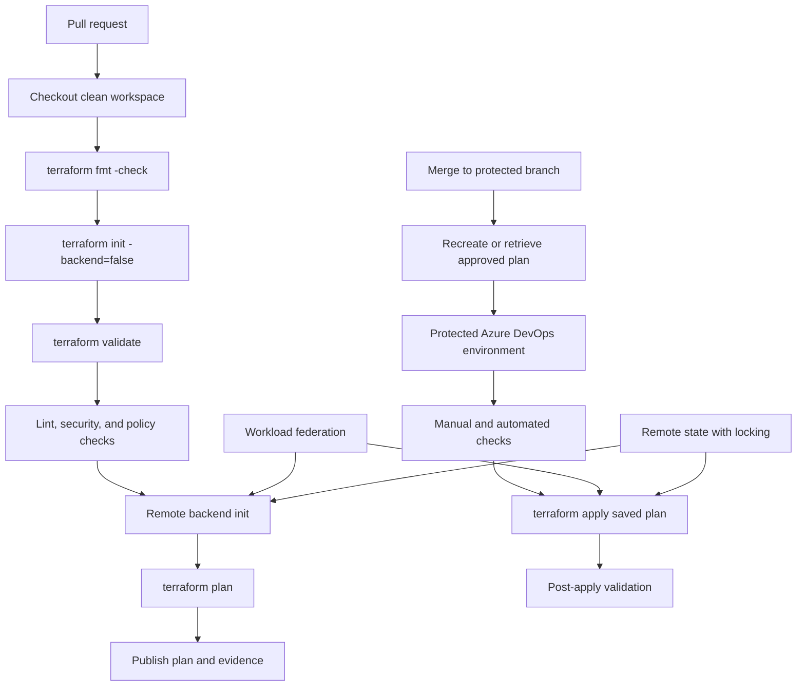

> **文档类型：** CI/CD & 自动化实施指南
> **规范性术语：** **MUST**、**MUST NOT**、**SHOULD**、**SHOULD NOT** 和 **MAY** 是要求级别。
> **适用范围：** 通过 Azure DevOps 为 Azure、AWS、GCP、OCI、Kubernetes、SaaS 和混合目标进行 Terraform 交付。
> **例外流程：** 偏离要求需要记录风险评估、补偿控制、指定风险负责人和到期日期。

|控制领域|价值|
|---|---|
|文件编号 | `CICD-02` |
|负责人|云卓越中心 |
|审核周期|至少每年一次，并且在重大平台、提供程序、安全性或运营模式发生变化之后 |
|证据|拉取请求检查、计划制品、联合服务连接、批准、状态锁定和部署后结果 |

# 使用 Azure DevOps 部署 Terraform

> **简要决定：** 将拉取请求验证与已批准的应用分开，并将每次应用绑定到经过审查的、受保护的计划和联邦身份。

## 概述

Azure DevOps 可以针对任何提供程序运行 Terraform。可靠的设计是双轨流水线：

- 拉取请求执行格式化、验证、静态分析、策略检查和非破坏性计划。
- 受控部署路径将经过审查的、不可变的计划应用于受保护的环境。

流水线平台是 Azure DevOps；目标可以是 Azure、AWS、GCP、OCI、Kubernetes、SaaS API 或组合。

## 目标和非目标

### 目标

- 单独验证、计划和应用。
- 使用工作负载身份联合或环境本地身份而不是静态凭据。
- 通过锁定和限制访问远程存储 Terraform 状态。
- 保留晋级到应用阶段的确切计划。
- 通过环境检查和序列化部署来保护生产。
- 使故障可以恢复，而无需进行不安全的状态操作。

### 非目标

- 从每个分支自动应用。
- 在不相关的环境中共享一个状态文件或身份。
- 将 `terraform plan` 视为批准替代品。
- 在未隔离的持久通用运行器上执行生产应用。

## 参考架构

## 仓库布局

标准化布局减少了流水线分支和意外状态耦合。
```text
infra/
  modules/
    network/
    compute/
  live/
    dev/
      main.tf
      providers.tf
      backend.hcl
      terraform.tfvars
    staging/
    prod/
  policy/
  tests/
azure-pipelines.yml
.pipeline/
  templates/
    terraform-validate.yml
    terraform-plan.yml
    terraform-apply.yml
```
将环境特定的后端配置保留在可复用模块之外。模块不应决定状态的存储位置或它控制的生产订阅、账户、项目或隔间。

## 状态设计

Terraform 状态可以包含敏感属性，是一种协调机制。它需要比普通构建制品更强的控制。

### 必需的属性

- 远程存储。
- 锁定或等效的并发保护。
- 传输和静态加密。
- 版本控制或可恢复快照。
- 仅限相关流水线和管理员访问。
- 用于独立部署环境的单独状态密钥或工作区。
- 审计日志记录。

### 多云后端示例

|后端 |典型用途|锁定注意事项|
|---|---|---|
| Azure Blob Storage |以 Azure 为中心的组织 |使用受支持的 AzureRM 后端锁定和受限数据平面访问 |
|Amazon S3 |以 AWS 为中心的组织 |使用后端支持的锁定配置和存储桶版本控制 |
| Cloud Storage |以 GCP 为中心的组织 |使用对象版本控制和后端锁定语义 |
| OCI Object Storage |以 OCI 为中心的组织 |验证后端/提供程序能力和操作锁定模型 |
| HCP Terraform |多云集中执行 |状态、锁定、运行、策略和远程执行由服务管理 |

不要通过可以在日志或进程列表中采集的命令行参数公开后端凭据。

## 流水线标识

### Azure 目标

使用为工作负载身份联合配置的 Azure Resource Manager 服务连接。当联合可用时，避免使用客户端机密和证书。

常见的任务模式是将 `AzureCLI@2` 与 `addSpnToEnvironment: true` 结合使用，然后将联合令牌和身份字段映射到 Terraform 环境变量。
```yaml
steps:
  - checkout: self
    clean: true
    fetchDepth: 1
    persistCredentials: false

  - task: AzureCLI@2
    displayName: Terraform plan with federated identity
    inputs:
      azureSubscription: sc-terraform-dev
      scriptType: bash
      scriptLocation: inlineScript
      addSpnToEnvironment: true
      inlineScript: |
        set -euo pipefail
        export ARM_USE_OIDC=true
        export ARM_CLIENT_ID="$servicePrincipalId"
        export ARM_TENANT_ID="$tenantId"
        export ARM_OIDC_TOKEN="$idToken"
        export ARM_SUBSCRIPTION_ID="$(az account show --query id -o tsv)"

        terraform -chdir=infra/live/dev init \
          -input=false \
          -backend-config=backend.hcl
        terraform -chdir=infra/live/dev plan \
          -input=false \
          -lock-timeout=5m \
          -out="$(Pipeline.Workspace)/dev.tfplan"
```
确切的提供程序和后端变量取决于 Terraform 提供程序版本和服务连接设计。固定并测试提供程序版本；不要假设主要版本的身份验证行为是相同的。

### AWS 目标

当组织建立受支持的 OIDC 信任路径时，Azure DevOps 可以与 AWS 联合，也可以在具有实例/任务角色的 AWS 托管代理上运行。首选设计是仅限于一个账户和环境的短期角色凭据。

不要将不受限制的 AWS 访问密钥存储为通用流水线变量。如果某个密钥暂时无法避免，请将其隔离，积极轮换，然后用联合替换。

### GCP 目标

使用工作负载身份联合将流水线身份交换为短期 Google 凭证，然后在需要时模拟范围狭窄的服务账户。避免使用 JSON 服务账户密钥。

### OCI 目标

OCI 部署通常使用以下模型之一：

- 用于托管 Terraform 执行的 OCI Resource Manager。
- OCI 上使用实例主体的自托管代理。
- OCI 原生执行环境的工作负载或资源主体。
- 租户中支持和批准的外部令牌交换或身份传播。
- 专用的 API 签名主体作为受约束的后备。

在未验证确切的 OCI 身份功能、区域、租户类型和提供程序支持的情况下，请勿声明 GitHub 或 Azure 样式的 OIDC 功能对等性。

## 验证

验证应该在没有生产权限的情况下运行。
```yaml
trigger: none

pr:
  branches:
    include:
      - main

stages:
  - stage: Validate
    jobs:
      - job: TerraformValidation
        pool:
          vmImage: ubuntu-latest
        steps:
          - checkout: self
            clean: true
            fetchDepth: 1
            persistCredentials: false

          - bash: |
              set -euo pipefail
              terraform fmt -check -recursive
              terraform -chdir=infra/live/dev init -backend=false -input=false
              terraform -chdir=infra/live/dev validate
            displayName: Format and validate

          - bash: |
              set -euo pipefail
              tflint --recursive
            displayName: Lint

          - bash: |
              set -euo pipefail
              checkov -d infra --quiet
            displayName: Security policy scan
```
故意省略了工具安装。在生产中，使用预构建的签名代理镜像或固定校验和与版本的受控安装模板。

### 验证控制集

-`terraform fmt -check -recursive`。
- `terraform init -backend=false` 用于语法和提供程序初始化，无需状态访问。
-`terraform validate`。
- 提供程序锁定文件审查和验证。
- TFLint 或等效的提供程序感知 linting。
- 安全性和合规性扫描。
- 模块的单元或集成测试。
- 针对所呈现的计划的策略即代码。
- 模块输入和输出的文档检查。

## 规划流水线

计划是针对特定环境的。它取决于变量、提供程序版本、状态、身份和数据源结果。因此，为开发而生成的计划不是生产计划。

推荐的计划控制：

1. 初始化确切的环境后端。
2.运行`terraform plan -out=<file>`。
3. 使用 `terraform show` 渲染人类可读的计划。
4. 生成机器可读的 JSON 计划以进行策略评估。
5. 发布二进制计划、JSON 输出、工具版本、锁定文件、提交 SHA 和环境标识符。
6. 保护制品不被修改。
7. 由于远程状态和外部数据可能会发生变化，因此计划会在短时间内过期。
```bash
terraform plan -input=false -lock-timeout=5m -out=tfplan
terraform show -no-color tfplan > tfplan.txt
terraform show -json tfplan > tfplan.json
```
请勿从 `tfplan.txt` 应用或在批准后重新生成计划而不重复批准决定。

## 应用流水线

使用针对受保护环境的 Azure DevOps 部署作业。
```yaml
- stage: ApplyProduction
  dependsOn: PlanProduction
  condition: succeeded()
  lockBehavior: sequential
  jobs:
    - deployment: TerraformApply
      environment: production-infrastructure
      strategy:
        runOnce:
          deploy:
            steps:
              - download: current
                artifact: terraform-plan-prod

              - task: AzureCLI@2
                inputs:
                  azureSubscription: sc-terraform-prod
                  scriptType: bash
                  scriptLocation: inlineScript
                  addSpnToEnvironment: true
                  inlineScript: |
                    set -euo pipefail
                    export ARM_USE_OIDC=true
                    export ARM_CLIENT_ID="$servicePrincipalId"
                    export ARM_TENANT_ID="$tenantId"
                    export ARM_OIDC_TOKEN="$idToken"
                    export ARM_SUBSCRIPTION_ID="$(az account show --query id -o tsv)"

                    cd "$(Pipeline.Workspace)/terraform-plan-prod"
                    terraform apply -input=false -auto-approve tfplan
```
`-auto-approve` 标志仅在应用已通过外部控制的已保存计划时才应用。当用于在一个命令中创建和应用未经审查的计划时，这是不安全的。

## 批准和发布控制

对 Azure DevOps 环境、服务连接、代理池、变量组或其他受保护资源进行批准和检查，而不是仅依赖 YAML。编辑 YAML 的拉取请求不得删除其自己的生产批准要求。

建议的生产检查：

- 需要独立于变更作者的人工批准者。
- 需要受保护的发布分支的分支控制。
- 如有需要，请检查营业时间或更改窗口。
- 外部策略或变更记录验证。
- 独占锁或顺序锁行为。
- 所需的模板执行。
- 限制服务连接的使用。

## 运行器清理

### Microsoft 托管代理

它们为每个作业提供了一个全新的环境并降低了持久性风险，但如果没有额外的网络设计，它们可能无法到达私有端点。它们仍然需要最低权限的令牌和受控的依赖关系。

### 自托管代理

尽可能使用临时代理。对于持久代理：

- 按信任级别和环境分配单独的池。
- 不要在可生产的池上运行不受信任的拉取请求代码。
- 在每次作业后删除工作区、凭据、SSH 材料、Terraform 插件缓存和临时文件。
- 限制出站网络访问。
- 修补操作系统、代理、Terraform、云 CLI 和帮助工具。
- 监控未经授权的进程和配置更改。
- 使用具有最小本地权限的非交互式服务账户。

## Git `extraheader` 和凭证清理

Azure Pipelines 可以通过 Git `http.extraheader` 配置来传递仓库授权。这对于子模块或附加仓库很有用，但粗心的持久性可能会将凭据泄露给重用代理上的后续命令或作业。

使用这些规则：

- 保留 `persistCredentials: false` 除非需要稍后进行 Git 写入。
- 首选 `git -c http.<url>.extraheader=... <command>`，因此标头应用于一个命令。
- 切勿打印编码的授权值。
- 使用后删除仓库本地和全局标头。
- 在作业之间清理代理工作区。

清理示例：
```bash
set +e
git config --local --unset-all http.extraheader
git config --global --unset-all http.extraheader
find "$HOME" -name .gitconfig -type f -maxdepth 3 -print
set -e
```
如果 Azure DevOps 写入特定于 URL 的密钥（例如 `http.https://dev.azure.com/<organization>.extraheader`），则可能需要进行更广泛的清理。在取消设置之前枚举键而不打印机密值：
```bash
git config --local --name-only --get-regexp '^http\..*\.extraheader$' || true
git config --global --name-only --get-regexp '^http\..*\.extraheader$' || true
```
## 部署验证

应用后：

- 仅当输出可以安全公开时才运行 `terraform output -json`。
- 通过提供程序 API 确认云资源健康状况。
- 运行连接或服务级别冒烟测试。
- 检查是否存在预期的状态序列和数据血缘。
- 采集应用结果、资源标识符和发布元数据。
- 安排漂移检测而不是依赖手动发现。

预定的漂移计划必须是只读的，并且不得自动应用广泛的更改。

## 恢复和状态安全

### 常见故障类别

|失败|正确响应 |
|---|---|
|主动运行持有后端锁 |等待;不要强行解锁|
|验证终止运行后的陈旧锁 |确认所有者和状态，然后使用受控强制解锁 |
|部分应用 |重新运行计划以了解实际状态；更喜欢向前滚动 |
|提供程序/API 瞬态错误 |仅在检查幂等性和状态后重试 |
|状态版本损坏|在变更控制下恢复经过验证的先前状态版本 |
|资源存在于状态之外 |故意导入或协调；请勿盲目删除|
|机密或令牌泄露 |撤销、轮换、保留证据和清理日志/制品 |

切勿将手动编辑 Terraform 状态作为第一响应。使用受支持的状态命令、导入、移动和版本恢复以及备份和同行评审。

## 模块和提供程序供应链控制

Terraform 自动化在初始化和规划期间执行提供程序二进制文件和模块代码。将两者视为可执行依赖项。

所需控制：

- 提交并审查`.terraform.lock.hcl`。
- 限制提供程序版本并验证校验和。
- 将注册表模块固定到不可变版本。
- 将 Git 来源的模块固定到提交，而不是分支。
- 根据需要限制对批准的注册表或镜像的出站访问。
- 在采用之前审查提供程序和模块所有权。
- 保留锁定文件和模块选择以及计划证据。

受保护的流水线模板应拒绝生产路径中未经批准的模块源和意外的提供程序更改。

## 破坏性变更控制

对于高影响力计划来说，一般性批准是不够的。解析 JSON 计划并对操作进行分类，例如：

- 资源删除或替换。
- 身份、角色、策略或联盟变更。
- 网络周边、路由、DNS、防火墙或私有端点更改。
- 状态后端或加密更改。
- 数据库、存储或备份策略更改。
- 超出批准阈值的较大扇出变化。

需要额外的审阅者或机密操作的变更记录。 Terraform 的文本摘要对于企业风险分类来说过于粗略。

## 规划制品兼容性和处理

保存的计划可能包含敏感值，并与用于创建它的配置、工作路径、Terraform 版本、提供程序选择、变量和状态耦合。将其作为受限部署制品进行保护。

控制应验证：

- 源提交和环境匹配。
- 计划校验和或制品证明。
- 相同的 Terraform CLI 和提供程序版本。
- 批准的最高计划年龄。
- 计划和应用在不同代理上运行时控制文件系统布局。
- 不发布公共请求评论或广泛可读的制品。
- 保留和调查窗口期满后删除。

如果任何绑定发生变化，请生成新计划并重复批准。

## 退役并销毁工作流程

生产销毁应该使用单独的、显式调用的工作流程，而不是正常的部署参数。

工作流程应要求：

- 命名目标和状态密钥。
- 资源清单和依赖性审查。
- 数据保留和备份确认。
- 防止通配符或空目标值。
- 独立批准。
- 新的破坏计划。
- 销毁后验证和状态处置。
- DNS、身份、机密和监控清理的证据。

不允许消费者在没有更强控制的情况下在常规可复用模板中设置 `destroy: true`。

## 操作清单

- [ ] Terraform 和提供程序版本已固定。
- [ ] 依赖关系锁定文件已提交并审核。
- [ ] 状态为远程、加密、版本控制和锁定。
- [ ] 开发和生产使用单独的状态和身份。
- [ ] 拉取请求在没有生产权限的情况下运行。
- [ ] 计划输出以人类和机器可读的形式保留。
- [ ] 应用使用已审核的已保存计划。
- [ ] 生产使用受保护的 Azure DevOps 环境。
- [ ] 并发应用被序列化。
- [ ] Git 凭证和 `extraheader` 条目在使用后将被删除。
- [ ] 自托管代理被隔离和清理。
- [ ] 日志记录漂移、回滚和状态恢复过程。

## 相关主题

- [实用的 CI/CD 蓝图](practical-ci-cd-blueprint.md)
- [流水线身份和机密处理](pipeline-identity-and-secret-handling.md)
- [共享运行器安全与清理规范](shared-runner-security-and-hygiene.md)
- [环境晋级、审批、发布控制](environment-promotion-approval-and-release-controls.md)

## 参考文档

- [Microsoft 示例：具有工作负载身份联合的 Azure DevOps Terraform](https://learn.microsoft.com/en-us/samples/azure-samples/azure-devops-terraform-oidc-ci-cd/azure-devops-terraform-oidc-ci-cd/)
- [Microsoft：配置 Azure Resource Manager 工作负载身份服务连接](https://learn.microsoft.com/en-us/azure/devops/pipelines/release/configure-workload-identity)
- [Microsoft: Azure DevOps 环境](https://learn.microsoft.com/en-us/azure/devops/pipelines/process/environments)
- [Microsoft: 流水线审批和检查](https://learn.microsoft.com/en-us/azure/devops/pipelines/process/approvals)
- [Microsoft: 从流水线安全访问仓库](https://learn.microsoft.com/en-us/azure/devops/pipelines/security/secure-access-to-repos)
- [Microsoft: 使用 Azure Pipelines 构建 GitHub 仓库](https://learn.microsoft.com/en-us/azure/devops/pipelines/repos/github)
- [HashiCorp：自动化运行 Terraform](https://developer.hashicorp.com/terraform/tutorials/automation/automate-terraform)
- [HashiCorp：Terraform 初始化](https://developer.hashicorp.com/terraform/cli/commands/init)
- [HashiCorp：Terraform 应用](https://developer.hashicorp.com/terraform/cli/commands/apply)
