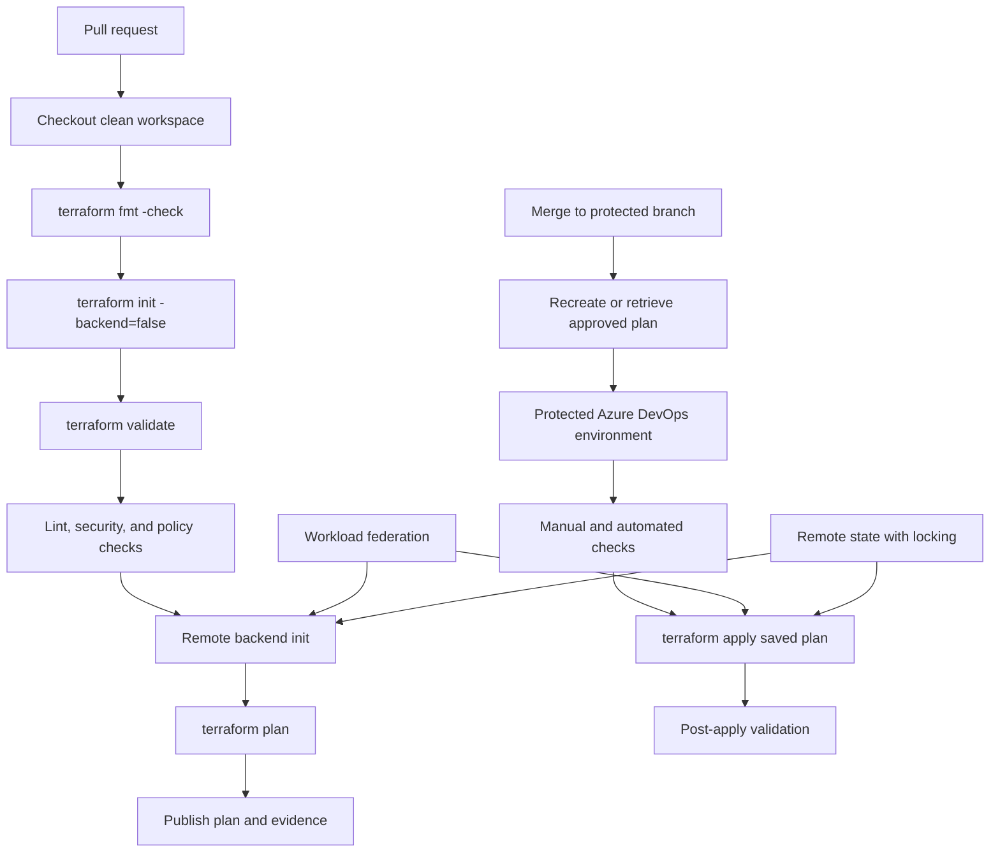

> **Document class:** CI/CD & Automation implementation guide
> **Normative terms:** **MUST**, **MUST NOT**, **SHOULD**, **SHOULD NOT**, and **MAY** are requirements levels.
> **Applicability:** Terraform delivery through Azure DevOps for Azure, AWS, GCP, OCI, Kubernetes, SaaS, and hybrid targets.
> **Exception process:** Deviations require a documented risk assessment, compensating controls, named risk owner, and expiry date.

| Control field | Value |
|---|---|
| Document ID | `CICD-02` |
| Owner | Cloud Center of Excellence |
| Review cycle | At least annually and after material platform, provider, security, or operating-model changes |
| Evidence | Pull-request checks, plan artifact, federated service connection, approvals, state locks, and post-deployment results |

# Deploying Terraform with Azure DevOps

> **Decision in brief:** Separate pull-request validation from approved apply, and bind every apply to a reviewed, protected plan and federated identity.

## Overview

Azure DevOps can run Terraform against any provider. The reliable design is a two-path pipeline:

- Pull requests perform formatting, validation, static analysis, policy checks, and a non-destructive plan.
- A controlled deployment path applies a reviewed, immutable plan to a protected environment.

The pipeline platform is Azure DevOps; the target can be Azure, AWS, GCP, OCI, Kubernetes, SaaS APIs, or a combination.

## Goals and non-goals

### Goals

- Separate validation, plan, and apply.
- Use workload federation or environment-local identity rather than static credentials.
- Store Terraform state remotely with locking and restricted access.
- Preserve the exact plan promoted to apply.
- Protect production with environment checks and serialized deployment.
- Make failures recoverable without unsafe state manipulation.

### Non-goals

- Applying automatically from every branch.
- Sharing one state file or identity across unrelated environments.
- Treating `terraform plan` as an approval substitute.
- Running production applies on a persistent, general-purpose agent without isolation.

## Reference architecture



## Repository layout

A normalized layout reduces pipeline branching and accidental state crossover.

```text
infra/
  modules/
    network/
    compute/
  live/
    dev/
      main.tf
      providers.tf
      backend.hcl
      terraform.tfvars
    staging/
    prod/
  policy/
  tests/
azure-pipelines.yml
.pipeline/
  templates/
    terraform-validate.yml
    terraform-plan.yml
    terraform-apply.yml
```

Keep environment-specific backend configuration outside reusable modules. A module should not decide where state is stored or which production subscription, account, project, or compartment it controls.

## State design

Terraform state can contain sensitive attributes and is a coordination mechanism. It requires stronger controls than a normal build artifact.

### Required properties

- Remote storage.
- Locking or equivalent concurrency protection.
- Encryption in transit and at rest.
- Versioning or recoverable snapshots.
- Access restricted to the relevant pipeline and administrators.
- Separate state keys or workspaces for independently deployable environments.
- Audit logging.

### Multi-cloud backend examples

| Backend | Typical use | Locking considerations |
|---|---|---|
| Azure Blob Storage | Azure-centric organizations | Use supported AzureRM backend locking and restricted data-plane access |
| Amazon S3 | AWS-centric organizations | Use the backend's supported locking configuration and bucket versioning |
| GCP Storage | GCP-centric organizations | Use object versioning and backend locking semantics |
| OCI Object Storage | OCI-centric organizations | Verify backend/provider capabilities and operational locking model |
| HCP Terraform | Multi-cloud central execution | State, locking, runs, policy, and remote execution are managed by the service |

Do not expose backend credentials through command-line arguments that can be captured in logs or process listings.

## Pipeline identity

### Azure target

Use an Azure Resource Manager service connection configured for workload identity federation. Avoid client secrets and certificates when federation is available.

A common task pattern is to use `AzureCLI@2` with `addSpnToEnvironment: true`, then map the federated token and identity fields to Terraform environment variables.

```yaml
steps:
  - checkout: self
    clean: true
    fetchDepth: 1
    persistCredentials: false

  - task: AzureCLI@2
    displayName: Terraform plan with federated identity
    inputs:
      azureSubscription: sc-terraform-dev
      scriptType: bash
      scriptLocation: inlineScript
      addSpnToEnvironment: true
      inlineScript: |
        set -euo pipefail
        export ARM_USE_OIDC=true
        export ARM_CLIENT_ID="$servicePrincipalId"
        export ARM_TENANT_ID="$tenantId"
        export ARM_OIDC_TOKEN="$idToken"
        export ARM_SUBSCRIPTION_ID="$(az account show --query id -o tsv)"

        terraform -chdir=infra/live/dev init \
          -input=false \
          -backend-config=backend.hcl
        terraform -chdir=infra/live/dev plan \
          -input=false \
          -lock-timeout=5m \
          -out="$(Pipeline.Workspace)/dev.tfplan"
```

The exact provider and backend variables depend on the Terraform provider versions and service-connection design. Pin and test the provider versions; do not assume authentication behavior is identical across major versions.

### AWS target

Azure DevOps can federate to AWS when the organization establishes a supported OIDC trust path, or it can run on an AWS-hosted agent with an instance/task role. The preferred design is short-lived role credentials scoped to one account and environment.

Do not store an unrestricted AWS access key as a general pipeline variable. If a key is temporarily unavoidable, isolate it, rotate it aggressively, and replace it with federation.

### GCP target

Use Workload Identity Federation to exchange the pipeline identity for a short-lived Google credential, then impersonate a narrowly scoped service account where required. Avoid JSON service-account keys.

### OCI target

OCI deployments commonly use one of these models:

- OCI Resource Manager for managed Terraform execution.
- A self-hosted agent on OCI using an instance principal.
- A workload or resource principal for an OCI-native execution environment.
- External token exchange or identity propagation where supported and approved in the tenancy.
- A dedicated API-signing principal as a constrained fallback.

Do not claim GitHub- or Azure-style OIDC parity without validating the exact OCI identity feature, region, tenancy type, and provider support.

## Validation

Validation should run without production privileges.

```yaml
trigger: none

pr:
  branches:
    include:
      - main

stages:
  - stage: Validate
    jobs:
      - job: TerraformValidation
        pool:
          vmImage: ubuntu-latest
        steps:
          - checkout: self
            clean: true
            fetchDepth: 1
            persistCredentials: false

          - bash: |
              set -euo pipefail
              terraform fmt -check -recursive
              terraform -chdir=infra/live/dev init -backend=false -input=false
              terraform -chdir=infra/live/dev validate
            displayName: Format and validate

          - bash: |
              set -euo pipefail
              tflint --recursive
            displayName: Lint

          - bash: |
              set -euo pipefail
              checkov -d infra --quiet
            displayName: Security policy scan
```

Tool installation is intentionally omitted. In production, use a prebuilt, signed agent image or a controlled installation template that pins checksums and versions.

### Validation control set

- `terraform fmt -check -recursive`.
- `terraform init -backend=false` for syntax and provider initialization without state access.
- `terraform validate`.
- Provider lock-file review and verification.
- TFLint or equivalent provider-aware linting.
- Security and compliance scanning.
- Unit or integration tests for modules.
- policy-as-code against the rendered plan.
- Documentation checks for module inputs and outputs.

## Plan pipeline

A plan is environment-specific. It depends on variables, provider versions, state, identity, and data-source results. Therefore, a plan generated for development is not a production plan.

Recommended plan controls:

1. Initialize the exact environment backend.
2. Run `terraform plan -out=<file>`.
3. Render a human-readable plan using `terraform show`.
4. Produce a machine-readable JSON plan for policy evaluation.
5. Publish the binary plan, JSON output, tool versions, lock file, commit SHA, and environment identifier.
6. Protect the artifact against modification.
7. Expire plans after a short period because remote state and external data can change.

```bash
terraform plan -input=false -lock-timeout=5m -out=tfplan
terraform show -no-color tfplan > tfplan.txt
terraform show -json tfplan > tfplan.json
```

Do not apply from `tfplan.txt` or regenerate a plan after approval without repeating the approval decision.

## Apply pipeline

Use an Azure DevOps deployment job targeting a protected environment.

```yaml
- stage: ApplyProduction
  dependsOn: PlanProduction
  condition: succeeded()
  lockBehavior: sequential
  jobs:
    - deployment: TerraformApply
      environment: production-infrastructure
      strategy:
        runOnce:
          deploy:
            steps:
              - download: current
                artifact: terraform-plan-prod

              - task: AzureCLI@2
                inputs:
                  azureSubscription: sc-terraform-prod
                  scriptType: bash
                  scriptLocation: inlineScript
                  addSpnToEnvironment: true
                  inlineScript: |
                    set -euo pipefail
                    export ARM_USE_OIDC=true
                    export ARM_CLIENT_ID="$servicePrincipalId"
                    export ARM_TENANT_ID="$tenantId"
                    export ARM_OIDC_TOKEN="$idToken"
                    export ARM_SUBSCRIPTION_ID="$(az account show --query id -o tsv)"

                    cd "$(Pipeline.Workspace)/terraform-plan-prod"
                    terraform apply -input=false -auto-approve tfplan
```

The `-auto-approve` flag is appropriate only when applying a saved plan that has already passed external controls. It is unsafe when used to create and apply an unreviewed plan in one command.

## Approvals and release controls

Place approvals and checks on Azure DevOps environments, service connections, agent pools, variable groups, or other protected resources rather than relying only on YAML. A pull request that edits YAML must not be able to delete its own production approval requirement.

Recommended production checks:

- Required human approver independent of the change author.
- Branch control requiring a protected release branch.
- Business-hours or change-window check where required.
- External policy or change-record validation.
- Exclusive lock or sequential lock behavior.
- Required template enforcement.
- Restricted service-connection use.

## Runner hygiene

### Microsoft-hosted agents

They provide a fresh environment per job and reduce persistence risk, but they may not reach private endpoints without additional networking design. They still require least-privilege tokens and controlled dependencies.

### Self-hosted agents

Use ephemeral agents whenever possible. For persistent agents:

- Allocate separate pools by trust level and environment.
- Do not run untrusted pull-request code on production-capable pools.
- Remove workspaces, credentials, SSH material, Terraform plugin caches, and temporary files after every job.
- Restrict outbound network access.
- Patch the OS, agent, Terraform, cloud CLIs, and helper tools.
- Monitor for unauthorized processes and configuration changes.
- Use a non-interactive service account with minimal local privilege.

## Git `extraheader` and credential cleanup

Azure Pipelines can pass repository authorization through Git `http.extraheader` configuration. This is useful for submodules or additional repositories, but careless persistence can leak credentials to later commands or jobs on a reused agent.

Use these rules:

- Keep `persistCredentials: false` unless a later Git write is required.
- Prefer `git -c http.<url>.extraheader=... <command>` so the header applies to one command.
- Never print the encoded authorization value.
- Remove repository-local and global headers after use.
- Clean the agent workspace between jobs.

Example cleanup:

```bash
set +e
git config --local --unset-all http.extraheader
git config --global --unset-all http.extraheader
find "$HOME" -name .gitconfig -type f -maxdepth 3 -print
set -e
```

A broader cleanup may be required if Azure DevOps writes a URL-specific key such as `http.https://dev.azure.com/<organization>.extraheader`. Enumerate keys before unsetting them without printing secret values:

```bash
git config --local --name-only --get-regexp '^http\..*\.extraheader$' || true
git config --global --name-only --get-regexp '^http\..*\.extraheader$' || true
```

## Deployment verification

After apply:

- Run `terraform output -json` only when outputs are safe to expose.
- Confirm cloud resource health through provider APIs.
- Run connectivity or service-level smoke tests.
- Check that the expected state serial and lineage are present.
- Capture the apply result, resource identifiers, and release metadata.
- Schedule drift detection rather than relying on manual discovery.

A scheduled drift plan must be read-only and must not automatically apply broad changes.

## Recovery and state safety

### Common failure categories

| Failure | Correct response |
|---|---|
| Backend lock held by active run | Wait; do not force unlock |
| Stale lock after verified terminated run | Confirm owner and state, then use controlled force-unlock |
| Partial apply | Re-run plan to understand actual state; prefer roll forward |
| Provider/API transient error | Retry only after checking idempotency and state |
| State version corruption | Restore a validated prior state version under change control |
| Resource exists outside state | Import or reconcile deliberately; do not delete blindly |
| Secret or token leaked | Revoke, rotate, preserve evidence, and clean logs/artifacts |

Never edit Terraform state manually as a first response. Use supported state commands, imports, moves, and version restoration with backups and peer review.

## Module and provider supply-chain controls

Terraform automation executes provider binaries and module code during initialization and planning. Treat both as executable dependencies.

Required controls:

- Commit and review `.terraform.lock.hcl`.
- Constrain provider versions and verify checksums.
- Pin registry modules to immutable versions.
- Pin Git-sourced modules to a commit, not a branch.
- Restrict outbound access to approved registries or mirrors where required.
- Review provider and module ownership before adoption.
- Preserve the lock file and module selections with plan evidence.

A protected pipeline template should reject unapproved module sources and unexpected provider changes in production paths.

## Destructive-change controls

A generic approval is insufficient for high-impact plans. Parse the JSON plan and classify operations such as:

- Resource deletion or replacement.
- Identity, role, policy, or federation changes.
- Network perimeter, route, DNS, firewall, or private-endpoint changes.
- State-backend or encryption changes.
- Database, storage, or backup-policy changes.
- Large fan-out changes above an approved threshold.

Require additional reviewers or a change record for classified operations. Terraform's textual summary alone is too coarse for enterprise risk classification.

## Plan artifact compatibility and handling

A saved plan may contain sensitive values and is coupled to the configuration, working path, Terraform version, provider selections, variables, and state used to create it. Protect it as a restricted deployment artifact.

Controls should verify:

- Source commit and environment match.
- Plan checksum or artifact attestation.
- Identical Terraform CLI and provider versions.
- Approved maximum plan age.
- Controlled filesystem layout when plan and apply run on different agents.
- No publication to public pull-request comments or broadly readable artifacts.
- Deletion after the retention and investigation window expires.

If any binding changes, generate a new plan and repeat approval.

## Decommission and destroy workflow

Production destruction should use a separate, explicitly invoked workflow rather than a normal deployment parameter.

The workflow should require:

- Named target and state key.
- Resource inventory and dependency review.
- Data-retention and backup confirmation.
- Protection against wildcard or empty target values.
- Independent approval.
- Fresh destroy plan.
- Post-destroy verification and state disposition.
- Evidence of DNS, identity, secret, and monitoring cleanup.

Do not permit a consumer to set `destroy: true` in an otherwise routine reusable template without stronger controls.

## Operational checklist

- [ ] Terraform and provider versions are pinned.
- [ ] The dependency lock file is committed and reviewed.
- [ ] State is remote, encrypted, versioned, and locked.
- [ ] Development and production use separate state and identities.
- [ ] Pull requests run without production privileges.
- [ ] Plan output is retained in human- and machine-readable forms.
- [ ] Apply uses the reviewed saved plan.
- [ ] Production uses a protected Azure DevOps environment.
- [ ] Concurrent applies are serialized.
- [ ] Git credentials and `extraheader` entries are removed after use.
- [ ] Self-hosted agents are isolated and cleaned.
- [ ] Drift, rollback, and state-recovery procedures are documented.

## Related topics

- [A Practical CI/CD Blueprint](practical-ci-cd-blueprint.md)
- [Pipeline Identity and Secret Handling](pipeline-identity-and-secret-handling.md)
- [Shared Runner Security and Hygiene](shared-runner-security-and-hygiene.md)
- [Environment Promotion, Approval, and Release Controls](environment-promotion-approval-and-release-controls.md)

## References

- [Microsoft sample: Azure DevOps Terraform with workload identity federation](https://learn.microsoft.com/en-us/samples/azure-samples/azure-devops-terraform-oidc-ci-cd/azure-devops-terraform-oidc-ci-cd/)
- [Microsoft: Configure an Azure Resource Manager workload identity service connection](https://learn.microsoft.com/en-us/azure/devops/pipelines/release/configure-workload-identity)
- [Microsoft: Azure DevOps environments](https://learn.microsoft.com/en-us/azure/devops/pipelines/process/environments)
- [Microsoft: Pipeline approvals and checks](https://learn.microsoft.com/en-us/azure/devops/pipelines/process/approvals)
- [Microsoft: Secure access to repositories from pipelines](https://learn.microsoft.com/en-us/azure/devops/pipelines/security/secure-access-to-repos)
- [Microsoft: Build GitHub repositories with Azure Pipelines](https://learn.microsoft.com/en-us/azure/devops/pipelines/repos/github)
- [HashiCorp: Running Terraform in automation](https://developer.hashicorp.com/terraform/tutorials/automation/automate-terraform)
- [HashiCorp: Terraform init](https://developer.hashicorp.com/terraform/cli/commands/init)
- [HashiCorp: Terraform apply](https://developer.hashicorp.com/terraform/cli/commands/apply)
