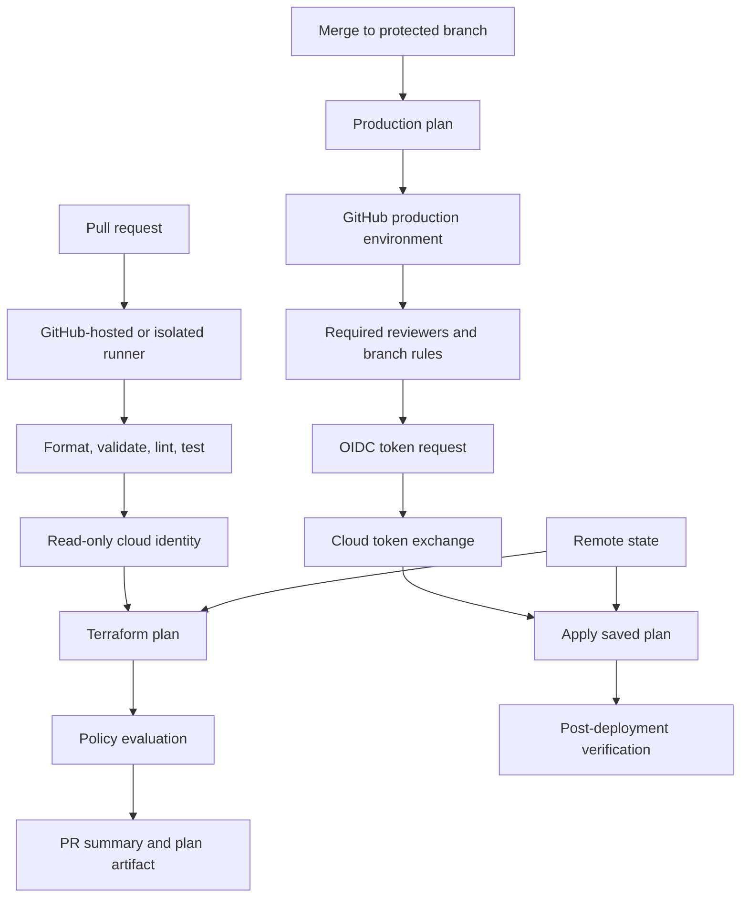

> **文档类型：** CI/CD & 自动化实施指南
> **规范性术语：** **MUST**、**MUST NOT**、**SHOULD**、**SHOULD NOT** 和 **MAY** 是要求级别。
> **适用范围：** 通过 GitHub Actions 针对多云和混合基础设施目标进行 Terraform 交付。
> **例外流程：** 偏离要求需要记录风险评估、补偿控制、指定风险负责人和到期日期。

|控制领域|价值|
|---|---|
|文件编号 | `CICD-03` |
|负责人|云卓越中心 |
|审核周期|至少每年一次，并且在重大平台、提供程序、安全性或运营模式发生变化之后 |
|证据|工作流程权限、OIDC 信任、计划制品、环境批准、Action 固定和部署检查 |

# 使用 GitHub Actions 部署 Terraform

> **简要决定：** 使用最低权限的 GitHub 工作流程、OIDC 联合、受保护的环境和不可变的计划证据来进行 Terraform 更改。

## 概述

GitHub Actions 可以提供简洁的 Terraform 交付工作流程，但默认的便利功能并不是完整的安全模型。生产设计必须明确控制令牌权限、Action 版本、环境、状态、运行器和云联合。

推荐的模式是：

- 拉取请求：验证并生成可审查的计划，无需生产写入访问权限。
- 受保护的分支：创建或检索特定于环境的计划。
- 受保护的 GitHub 环境：使用短期云凭据进行批准和应用。

## 目标和非目标

### 目标

- 使用 OIDC 或云原生工作负载身份而不是长期机密。
- 仅授予`GITHUB_TOKEN`每个作业所需的权限。
- 固定第三方 Actions 版本和可复用工作流程。
- 单独计划并应用身份。
- 使用 GitHub 环境和并发控制保护生产。
- 支持 Azure、AWS、GCP、OCI 和混合目标。

### 非目标

- 运行 Terraform apply 来应用来自分叉的拉取请求。
- 提供仓库范围内的机密不受限制的生产访问。
- 信任可变 Action 标签作为不可变的供应链输入。
- 在不受信任的生产作业中重用持久的自托管运行器。

## 参考架构

## 仓库布局
```text
.github/
  workflows/
    terraform-pr.yml
    terraform-deploy.yml
  actions/
    terraform-validate/
infra/
  modules/
  live/
    dev/
    staging/
    prod/
policy/
```
更喜欢少量可复用的工作流程，而不是将大型流水线复制到每个环境目录中。可复用的工作流程应公开工作目录、云、环境和服务身份的显式输入。

## 工作流程权限

在工作流程或作业级别设置权限。不要依赖仓库默认值。
```yaml
permissions:
  contents: read
```
使用 GitHub OIDC 的云登录通常需要：
```yaml
permissions:
  contents: read
  id-token: write
```
`id-token: write` 允许作业请求 OIDC 令牌。它本身并不授予云访问权限；云端信任策略决定是否接受 token 以及授予哪些权限。

仅将 `pull-requests: write` 授予必须发布计划评论的作业。仅当作业实际使用 `packages: write`、`security-events: write` 或其他权限时才授予它们。

## Actions 和依赖完整性

对于生产工作流程：

- 将第三方 Actions 固定到完整提交 SHA。
- 在注释中记录相应的发布标签以方便维护。
- 使用 Dependabot 或其他受控机制来建议更新。
- 检查 Actions 代码和传递依赖项的更改。
- 限制组织允许的操作和可复用工作流程。
- 优先使用官方云身份验证 Action，但仍需固定其版本。

语法说明：
```yaml
- uses: actions/checkout@<full-commit-sha> # v4.x
```
主版本标签更容易阅读，但仍然是可变的。它不等同于不可变的提交引用。

## 拉取请求验证工作流程
```yaml
name: terraform-pr

on:
  pull_request:
    paths:
      - 'infra/**'
      - '.github/workflows/terraform-*.yml'

permissions:
  contents: read
  pull-requests: write

concurrency:
  group: terraform-pr-${{ github.event.pull_request.number }}
  cancel-in-progress: true

jobs:
  validate:
    runs-on: ubuntu-latest
    steps:
      - uses: actions/checkout@<full-commit-sha>

      - uses: hashicorp/setup-terraform@<full-commit-sha>
        with:
          terraform_version: 1.x.y

      - name: Format
        run: terraform fmt -check -recursive

      - name: Initialize without backend
        working-directory: infra/live/dev
        run: terraform init -backend=false -input=false

      - name: Validate
        working-directory: infra/live/dev
        run: terraform validate
```
不要为该作业提供生产环境或生产云角色。对于需要云数据源的计划，请使用只读、特定于拉取请求的身份，其信任策略拒绝不受信任的仓库和不安全事件。

## 云认证模式

### Azure

在 Microsoft Entra ID 中配置联合凭据，其主题与仓库和受保护的 GitHub 环境匹配。然后使用 AzureRM 提供程序支持的官方 Azure 登录操作或环境变量。
```yaml
permissions:
  contents: read
  id-token: write

steps:
  - uses: azure/login@<full-commit-sha>
    with:
      client-id: ${{ vars.AZURE_CLIENT_ID }}
      tenant-id: ${{ vars.AZURE_TENANT_ID }}
      subscription-id: ${{ vars.AZURE_SUBSCRIPTION_ID }}
```
使用环境变量作为非机密标识符。将 Entra 联邦凭证与需要生产保护的 GitHub 环境主体绑定。

### AWS

将 GitHub 配置为 IAM OIDC 提供程序，并使用受令牌声明约束的信任策略创建 IAM 角色。该角色应该特定于环境和账户。
```yaml
permissions:
  contents: read
  id-token: write

steps:
  - uses: aws-actions/configure-aws-credentials@<full-commit-sha>
    with:
      role-to-assume: ${{ vars.AWS_DEPLOY_ROLE_ARN }}
      aws-region: ${{ vars.AWS_REGION }}
```
根据需要使用仓库、分支、环境、受众和组织声明来限制 IAM 信任策略。接受组织中每个仓库的信任策略创建了一条广泛的横向路径。

### GCP

创建工作负载身份池和提供程序、映射 GitHub 声明并限制属性条件。然后，工作流可以获取短期凭证，并可以选择模拟服务账户。
```yaml
permissions:
  contents: read
  id-token: write

steps:
  - uses: google-github-actions/auth@<full-commit-sha>
    with:
      workload_identity_provider: ${{ vars.GCP_WIF_PROVIDER }}
      service_account: ${{ vars.GCP_SERVICE_ACCOUNT }}
```
不要存储服务账户 JSON 密钥，除非已记录在案的平台限制阻止联合。

### OCI

OCI 需要显式的架构验证。推荐的选项是：

- 触发 OCI Resource Manager 来执行 Terraform 运行。
- 在 OCI 中使用带有实例主体的临时运行器。
- 使用 OCI 原生工作负载或资源主体。
- 评估 OCI 外部 JWT 交换或身份传播信任（如果支持）。
- 仅使用范围严格的 API 签名主体作为后备。

不要将广泛的 OCI API 私钥放入仓库机密中，并假设屏蔽可以使设计安全。机密屏蔽不能防止恶意工作流代码窃取凭证。

## 环境范围内的部署工作流程
```yaml
name: terraform-deploy

on:
  push:
    branches: [main]
    paths:
      - 'infra/**'
  workflow_dispatch:

permissions:
  contents: read

concurrency:
  group: terraform-prod
  cancel-in-progress: false

jobs:
  plan:
    runs-on: ubuntu-latest
    permissions:
      contents: read
      id-token: write
    outputs:
      artifact-name: ${{ steps.meta.outputs.artifact-name }}
    steps:
      - uses: actions/checkout@<full-commit-sha>
      - uses: hashicorp/setup-terraform@<full-commit-sha>
        with:
          terraform_version: 1.x.y

      - id: meta
        run: echo "artifact-name=tfplan-${GITHUB_SHA}" >> "$GITHUB_OUTPUT"

      - name: Authenticate to cloud
        run: ./scripts/cloud-login.sh

      - name: Plan
        working-directory: infra/live/prod
        run: |
          set -euo pipefail
          terraform init -input=false -backend-config=backend.hcl
          terraform plan -input=false -lock-timeout=5m -out=tfplan
          terraform show -no-color tfplan > tfplan.txt
          terraform show -json tfplan > tfplan.json

      - uses: actions/upload-artifact@<full-commit-sha>
        with:
          name: ${{ steps.meta.outputs.artifact-name }}
          path: |
            infra/live/prod/tfplan
            infra/live/prod/tfplan.txt
            infra/live/prod/tfplan.json
          retention-days: 5

  apply:
    needs: plan
    runs-on: ubuntu-latest
    environment: production
    permissions:
      contents: read
      id-token: write
    steps:
      - uses: actions/checkout@<full-commit-sha>
      - uses: hashicorp/setup-terraform@<full-commit-sha>
        with:
          terraform_version: 1.x.y
      - uses: actions/download-artifact@<full-commit-sha>
        with:
          name: ${{ needs.plan.outputs.artifact-name }}
          path: infra/live/prod
      - name: Authenticate to cloud
        run: ./scripts/cloud-login.sh
      - name: Apply approved plan
        working-directory: infra/live/prod
        run: terraform apply -input=false -auto-approve tfplan
```
该示例显示了结构，而不是完整的生产工作流程。添加制品证明、策略门、计划新鲜度检查和特定于云的身份验证。

## 计划的完整性和新鲜度

二进制 Terraform 计划与平台、Terraform 版本、提供程序选择、配置、变量和状态快照相关。控制应验证：

- 该计划是根据正在部署的同一提交生成的。
- Terraform 和提供程序版本匹配。
- 制品未被修改。
- 该计划尚未超出组织的新鲜度窗口。
- 自规划以来，状态没有发生重大变化。

对于高风险环境，请考虑在批准之前立即重新生成计划，并在批准后在同一受控工作流程中应用它。批准后不要默默地重新生成它。

## GitHub 环境和批准

创建单独的环境，例如 `development`、`staging` 和 `production`。

用于生产：

- 需要审稿人。
- 在支持和适当的情况下防止自我审查。
- 限制部署分支或标签。
- 在支持的情况下防止绕过环境保护。
- 仅在环境中存储特定于生产的变量或机密。
- 当需要外部证据时，使用自定义部署保护规则。

在保护规则通过之前，作业无法访问环境机密。这是比手动 `workflow_dispatch` 输入更强的边界。

## 运行器安全与清理

### GitHub 托管的运行器

当网络访问允许时默认使用它们。它们降低了持久性风险，因为每个作业都会收到一个新的托管环境。一旦获取 OIDC 令牌或机密，仍将作业视为特权作业。

### 自托管运行器

GitHub 明确警告自托管运行器不提供相同的清洁环境保证。更喜欢临时的、自动扩缩容的运行器，包括用于基于 Kubernetes 的 scale sets 的 Actions Runner Controller。

控制：

- 每个运行器实例一项作业。
- 根据信任和环境将运行器群体分开。
- 没有用于分叉或不受信任的拉取请求的生产级运行器。
- 最小主机权限。
- 限制出口和私有网络路由。
- 在运行器破坏之前导出中央日志。
- 签名和修补基础镜像。
- 没有跨信任边界共享的持久 Docker 套接字。
- 磁盘上没有长期存在的云凭据。

## 验证和策略

标准化的 Terraform 工作流程应包括：

- 格式检查。
- 无后端初始化和验证。
- 提供程序锁定文件检查。
- 绒毛。
- 安全性和合规性扫描。
- 模块测试。
- 针对特定环境的计划。
- JSON 计划策略评估。
- 破坏性变化检测。
- 需要对身份、网络、状态和生产变更进行审查。

避免将未脱敏的计划发布到公共拉取请求。 Terraform 计划可能会公开提供程序标记不充分或涉及敏感操作的名称、地址、ID 和值。

## 验证

应用后：

- 运行有针对性的烟雾测试。
- 验证已部署的账户、项目、订阅或隔间。
- 采集资源 ID 和预期版本。
- 检查联合主体的 Cloud Audit Logs。
- 比较 Terraform 状态和实际服务运行状况。
- 发布简明的部署摘要。

## 故障排除和恢复

|症状|调查|
|---|---|
| `id-token` 不可用 |确认工作权限和事件背景 |
|云拒绝令牌 |检查发布者、受众、主题和映射的声明 |
|不同工作的计划有所不同|确认工具版本、变量、状态和制品完整性 |
|制品失踪|检查作业依赖性、名称、保留和权限 |
|后台锁|在任何强制解锁之前验证活动运行 |
|自承载污染 |隔离运行器、轮换凭证、重建镜像 |
|环境审批未触发|确认作业引用了确切的环境名称 |
| Fork PR 尝试云接入 |从分叉触发的作业中删除身份权限和机密 |

## 事件模型安全性

GitHub 事件类型具有不同的信任属性。不要仅仅因为工作流文件存储在受保护的分支上就授予部署标识。

使用 `pull_request_target` 需要特别小心：它在基本仓库上下文中运行，并且可以访问基本仓库权限和机密。切勿将其与不受信任的拉取请求代码的签出和执行结合起来。仅将其用于狭义设计的元数据或标签工作流程。

对于 Terraform：

- 分叉拉取请求不会收到云写入身份。
- 同一仓库拉取请求应使用仅验证或狭义只读身份。
- 生产身份需要受保护的分支或标签以及受保护的环境。
- 可复用工作流程必须验证调用者仓库、引用和提供的环境输入。
- 手动调度不得绕过分支和环境限制。

## 可复用工作流信任边界

可复用的工作流程是可执行的供应链代码。将跨仓库工作流引用固定到不可变提交或受控发布，并限制哪些仓库可以调用特权工作流。

被调用的工作流程应该：

- 本身声明最小权限。
- 接受键入的环境和工作目录输入。
- 拒绝任意 shell 片段和不受信任的制品名称。
- 对于特权工作流程，避免使用 `secrets: inherit`。
- 将 OIDC 信任绑定到所调用的工作流程或受支持的环境。
- 在发布证据中日志记录调用者和被调用者工作流程的修订。

当受信任的工作流在特权作业中执行未经审查的调用者提供的代码时，它无法保证该代码的安全。

## 计划-制品机密性和完整性

即使控制台渲染对某些字段进行了脱敏，Terraform 计划也可以包含敏感值。将二进制计划和 JSON 表示视为受限制品。

- 限制下载到部署工作流程和授权审阅者。
- 使用短期保留。
- 将制品名称和校验和绑定到源提交和目标环境。
- 拒绝来自分叉或不受信任的事件上下文的制品。
- 切勿应用由用户控制的工作流程上传的计划。
- 避免在问题评论中包含完整的计划 JSON。
- 新的生产计划批准后删除被取代的计划。

## 所需的阴性测试

测试工作流程在以下情况下是否失败：

- `id-token: write` 不存在。
- 仓库、分支、环境或受众声明错误。
- 分叉尝试到达特权运行器或环境。
- 呼叫者提供未经授权的工作目录。
- 计划校验和、提交或环境不匹配。
- 操作或可复用的工作流程参考是可变的或未经批准的。
- 两个生产运行竞争同一个并发组。

仅积极的部署测试并不能证明信任边界。

## 操作清单

- [ ] 工作流程权限被显式最小化。
- [ ] 第三方 Actions 固定到完整提交 SHA。
- [ ] 拉取请求无法获取生产凭证。
- [ ] OIDC 信任策略限制仓库和环境声明。
- [ ] 状态为远程、版本控制、加密和锁定。
- [ ] 计划和应用是单独控制的作业。
- [ ] 应用使用已审核的已保存计划。
- [ ] 生产使用受保护的 GitHub 环境。
- [ ] 并发性可防止重叠生产。
- [ ] 自托管运行器是短暂的或严格隔离的。
- [ ] 保留应用后的健康检查和审核证据。

## 相关主题

- [实用的 CI/CD 蓝图](practical-ci-cd-blueprint.md)
- [流水线身份和机密处理](pipeline-identity-and-secret-handling.md)
- [共享运行器安全与清理规范](shared-runner-security-and-hygiene.md)
- [环境晋级、审批、发布控制](environment-promotion-approval-and-release-controls.md)

## 参考文档

- [GitHub：OpenID Connect 参考](https://docs.github.com/en/actions/reference/security/oidc)
- [GitHub：在云提供程序中配置 OIDC](https://docs.github.com/en/actions/how-tos/secure-your-work/security-harden-deployments/oidc-in-cloud-providers)
- [GitHub：部署和环境](https://docs.github.com/en/actions/reference/workflows-and-actions/deployments-and-environments)
- [GitHub：安全使用参考](https://docs.github.com/en/actions/reference/security/secure-use)
- [GitHub：自托管运行器参考](https://docs.github.com/en/actions/reference/runners/self-hosted-runners)
- [Microsoft 示例：具有 Azure 工作负载身份联合的 GitHub Actions Terraform](https://learn.microsoft.com/en-us/samples/azure-samples/github-terraform-oidc-ci-cd/github-terraform-oidc-ci-cd/)
- [AWS：创建 IAM OIDC 身份提供程序](https://docs.aws.amazon.com/IAM/latest/UserGuide/id_roles_providers_create_oidc.html)
- [GCP：用于部署流水线的工作负载身份联合](https://cloud.google.com/iam/docs/workload-identity-federation-with-deployment-pipelines)
- [Oracle：用 JSON Web 令牌交换 UPST](https://docs.oracle.com/en-us/iaas/Content/Identity/api-getstarted/json_web_token_exchange.htm)
- [HashiCorp：自动化运行 Terraform](https://developer.hashicorp.com/terraform/tutorials/automation/automate-terraform)
