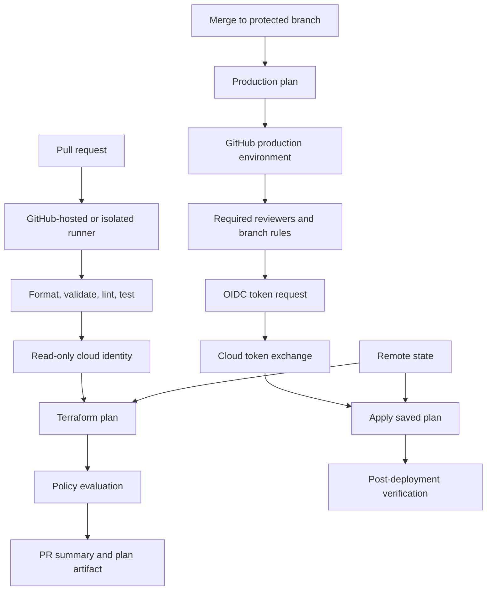

> **Document class:** CI/CD & Automation implementation guide
> **Normative terms:** **MUST**, **MUST NOT**, **SHOULD**, **SHOULD NOT**, and **MAY** are requirements levels.
> **Applicability:** Terraform delivery through GitHub Actions for multi-cloud and hybrid infrastructure targets.
> **Exception process:** Deviations require a documented risk assessment, compensating controls, named risk owner, and expiry date.

| Control field | Value |
|---|---|
| Document ID | `CICD-03` |
| Owner | Cloud Center of Excellence |
| Review cycle | At least annually and after material platform, provider, security, or operating-model changes |
| Evidence | Workflow permissions, OIDC trust, plan artifact, environment approvals, action pinning, and deployment checks |

# Deploying Terraform with GitHub Actions

> **Decision in brief:** Use least-privilege GitHub workflows, OIDC federation, protected environments, and immutable plan evidence for Terraform changes.

## Overview

GitHub Actions can provide a concise Terraform delivery workflow, but the default convenience features are not a complete security model. A production design must explicitly control token permissions, action versions, environments, state, runners, and cloud federation.

The recommended pattern is:

- Pull request: validate and generate a reviewable plan with no production write access.
- Protected branch: create or retrieve the environment-specific plan.
- Protected GitHub environment: approve and apply using short-lived cloud credentials.

## Goals and non-goals

### Goals

- Use OIDC or cloud-native workload identity instead of long-lived secrets.
- Grant the `GITHUB_TOKEN` only the permissions required by each job.
- Pin third-party actions and reusable workflows.
- Separate plan and apply identities.
- Protect production with GitHub environments and concurrency controls.
- Support Azure, AWS, GCP, OCI, and hybrid targets.

### Non-goals

- Running Terraform apply for pull requests from forks.
- Giving a repository-wide secret unrestricted production access.
- Trusting mutable action tags as immutable supply-chain inputs.
- Reusing a persistent self-hosted runner across untrusted and production jobs.

## Reference architecture



## Repository layout

```text
.github/
  workflows/
    terraform-pr.yml
    terraform-deploy.yml
  actions/
    terraform-validate/
infra/
  modules/
  live/
    dev/
    staging/
    prod/
policy/
```

Prefer a small number of reusable workflows rather than copying a large pipeline into every environment directory. Reusable workflows should expose explicit inputs for working directory, cloud, environment, and service identity.

## Workflow permissions

Set permissions at workflow or job level. Do not rely on repository defaults.

```yaml
permissions:
  contents: read
```

A cloud login using GitHub OIDC normally requires:

```yaml
permissions:
  contents: read
  id-token: write
```

`id-token: write` permits the job to request an OIDC token. It does not itself grant cloud access; the cloud-side trust policy decides whether the token is accepted and what permissions are issued.

Grant `pull-requests: write` only to the job that must post a plan comment. Grant `packages: write`, `security-events: write`, or other permissions only when the job actually uses them.

## Action and dependency integrity

For production workflows:

- Pin third-party actions to a full commit SHA.
- Record the corresponding release tag in a comment for maintainability.
- Use Dependabot or another controlled mechanism to propose updates.
- Review changes to action code and transitive dependencies.
- Restrict which actions and reusable workflows the organization permits.
- Prefer official cloud authentication actions, but still pin them.

Illustrative syntax:

```yaml
- uses: actions/checkout@<full-commit-sha> # v4.x
```

A major-version tag is easier to read but remains mutable. It is not equivalent to an immutable commit reference.

## Pull-request validation workflow

```yaml
name: terraform-pr

on:
  pull_request:
    paths:
      - 'infra/**'
      - '.github/workflows/terraform-*.yml'

permissions:
  contents: read
  pull-requests: write

concurrency:
  group: terraform-pr-${{ github.event.pull_request.number }}
  cancel-in-progress: true

jobs:
  validate:
    runs-on: ubuntu-latest
    steps:
      - uses: actions/checkout@<full-commit-sha>

      - uses: hashicorp/setup-terraform@<full-commit-sha>
        with:
          terraform_version: 1.x.y

      - name: Format
        run: terraform fmt -check -recursive

      - name: Initialize without backend
        working-directory: infra/live/dev
        run: terraform init -backend=false -input=false

      - name: Validate
        working-directory: infra/live/dev
        run: terraform validate
```

Do not give this job a production environment or production cloud role. For plans that need cloud data sources, use a read-only, pull-request-specific identity whose trust policy rejects untrusted repositories and unsafe events.

## Cloud authentication patterns

### Azure

Configure a federated credential in Microsoft Entra ID whose subject matches the repository and protected GitHub environment. Then use the official Azure login action or environment variables supported by the AzureRM provider.

```yaml
permissions:
  contents: read
  id-token: write

steps:
  - uses: azure/login@<full-commit-sha>
    with:
      client-id: ${{ vars.AZURE_CLIENT_ID }}
      tenant-id: ${{ vars.AZURE_TENANT_ID }}
      subscription-id: ${{ vars.AZURE_SUBSCRIPTION_ID }}
```

Use environment variables for non-secret identifiers. Bind the Entra federated credential to the GitHub environment subject where production protection is required.

### AWS

Configure GitHub as an IAM OIDC provider and create an IAM role with a trust policy constrained by token claims. The role should be environment- and account-specific.

```yaml
permissions:
  contents: read
  id-token: write

steps:
  - uses: aws-actions/configure-aws-credentials@<full-commit-sha>
    with:
      role-to-assume: ${{ vars.AWS_DEPLOY_ROLE_ARN }}
      aws-region: ${{ vars.AWS_REGION }}
```

Restrict the IAM trust policy with repository, branch, environment, audience, and organization claims as appropriate. A trust policy that accepts every repository in an organization creates a broad lateral path.

### GCP

Create a workload identity pool and provider, map GitHub claims, and restrict attribute conditions. The workflow can then obtain a short-lived credential and optionally impersonate a service account.

```yaml
permissions:
  contents: read
  id-token: write

steps:
  - uses: google-github-actions/auth@<full-commit-sha>
    with:
      workload_identity_provider: ${{ vars.GCP_WIF_PROVIDER }}
      service_account: ${{ vars.GCP_SERVICE_ACCOUNT }}
```

Do not store a service-account JSON key unless a documented platform limitation prevents federation.

### OCI

OCI requires explicit architectural validation. Recommended options are:

- Trigger OCI Resource Manager to perform Terraform runs.
- Use an ephemeral runner in OCI with an instance principal.
- Use an OCI-native workload or resource principal.
- Evaluate OCI external JWT exchange or identity-propagation trust where supported.
- Use a tightly scoped API-signing principal only as a fallback.

Do not place a broad OCI API private key in a repository secret and assume masking makes the design safe. Secret masking does not prevent credential theft by malicious workflow code.

## Environment-scoped deployment workflow

```yaml
name: terraform-deploy

on:
  push:
    branches: [main]
    paths:
      - 'infra/**'
  workflow_dispatch:

permissions:
  contents: read

concurrency:
  group: terraform-prod
  cancel-in-progress: false

jobs:
  plan:
    runs-on: ubuntu-latest
    permissions:
      contents: read
      id-token: write
    outputs:
      artifact-name: ${{ steps.meta.outputs.artifact-name }}
    steps:
      - uses: actions/checkout@<full-commit-sha>
      - uses: hashicorp/setup-terraform@<full-commit-sha>
        with:
          terraform_version: 1.x.y

      - id: meta
        run: echo "artifact-name=tfplan-${GITHUB_SHA}" >> "$GITHUB_OUTPUT"

      - name: Authenticate to cloud
        run: ./scripts/cloud-login.sh

      - name: Plan
        working-directory: infra/live/prod
        run: |
          set -euo pipefail
          terraform init -input=false -backend-config=backend.hcl
          terraform plan -input=false -lock-timeout=5m -out=tfplan
          terraform show -no-color tfplan > tfplan.txt
          terraform show -json tfplan > tfplan.json

      - uses: actions/upload-artifact@<full-commit-sha>
        with:
          name: ${{ steps.meta.outputs.artifact-name }}
          path: |
            infra/live/prod/tfplan
            infra/live/prod/tfplan.txt
            infra/live/prod/tfplan.json
          retention-days: 5

  apply:
    needs: plan
    runs-on: ubuntu-latest
    environment: production
    permissions:
      contents: read
      id-token: write
    steps:
      - uses: actions/checkout@<full-commit-sha>
      - uses: hashicorp/setup-terraform@<full-commit-sha>
        with:
          terraform_version: 1.x.y
      - uses: actions/download-artifact@<full-commit-sha>
        with:
          name: ${{ needs.plan.outputs.artifact-name }}
          path: infra/live/prod
      - name: Authenticate to cloud
        run: ./scripts/cloud-login.sh
      - name: Apply approved plan
        working-directory: infra/live/prod
        run: terraform apply -input=false -auto-approve tfplan
```

The example shows structure, not a complete production workflow. Add artifact attestations, policy gates, plan freshness checks, and cloud-specific authentication.

## Plan integrity and freshness

A binary Terraform plan is tied to the platform, Terraform version, provider selections, configuration, variables, and state snapshot. Controls should verify:

- The plan was produced from the same commit being deployed.
- The Terraform and provider versions match.
- The artifact was not modified.
- The plan has not exceeded the organization's freshness window.
- The state has not changed materially since planning.

For high-risk environments, consider regenerating the plan immediately before approval and applying it after approval within the same controlled workflow. Do not silently regenerate it after approval.

## GitHub environments and approvals

Create separate environments such as `development`, `staging`, and `production`.

For production:

- Require reviewers.
- Prevent self-review where supported and appropriate.
- Restrict deployment branches or tags.
- Prevent bypass of environment protections where supported.
- Store only production-specific variables or secrets in the environment.
- Use custom deployment protection rules when external evidence is required.

A job cannot access environment secrets until the protection rules pass. This is a stronger boundary than a manual `workflow_dispatch` input.

## Runner security and hygiene

### GitHub-hosted runners

Use them by default when network access permits. They reduce persistence risk because each job receives a fresh hosted environment. Still treat the job as privileged once it obtains an OIDC token or secret.

### Self-hosted runners

GitHub explicitly warns that self-hosted runners do not provide the same clean-environment guarantee. Prefer ephemeral, autoscaled runners, including Actions Runner Controller for Kubernetes-based scale sets.

Controls:

- One job per runner instance.
- Separate runner groups by trust and environment.
- No production-capable runner for forked or untrusted pull requests.
- Minimal host permissions.
- Restricted egress and private network routes.
- Central logs exported before runner destruction.
- Signed and patched base images.
- No persistent Docker socket shared across trust boundaries.
- No long-lived cloud credentials on disk.

## Validation and policy

A normalized Terraform workflow should include:

- Format check.
- Backend-free initialization and validation.
- Provider lock-file check.
- Linting.
- Security and compliance scanning.
- Module tests.
- Environment-specific plan.
- JSON plan policy evaluation.
- Destructive-change detection.
- Required review for identity, network, state, and production changes.

Avoid posting an unredacted plan to a public pull request. Terraform plans can expose names, addresses, IDs, and values that the provider marks insufficiently or that are operationally sensitive.

## Validation

After apply:

- Run targeted smoke tests.
- Verify the deployed account, project, subscription, or compartment.
- Capture resource IDs and expected versions.
- Inspect cloud audit logs for the federated principal.
- Compare Terraform state and actual service health.
- Publish a concise deployment summary.

## Troubleshooting and recovery

| Symptom | Investigation |
|---|---|
| `id-token` unavailable | Confirm job permissions and event context |
| Cloud rejects token | Inspect issuer, audience, subject, and mapped claims |
| Plan differs between jobs | Confirm tool versions, variables, state, and artifact integrity |
| Artifact missing | Check job dependency, name, retention, and permissions |
| Backend lock | Verify active run before any force-unlock |
| Self-hosted contamination | Quarantine runner, rotate credentials, rebuild image |
| Environment approval not triggered | Confirm job references the exact environment name |
| Fork PR attempts cloud access | Remove identity permissions and secrets from fork-triggered jobs |

## Event-model security

GitHub event types have different trust properties. Do not grant deployment identity merely because a workflow file is stored on the protected branch.

Particular caution is required with `pull_request_target`: it runs in the base-repository context and can access base-repository permissions and secrets. Never combine it with checkout and execution of untrusted pull-request code. Use it only for narrowly designed metadata or labeling workflows.

For Terraform:

- Fork pull requests receive no cloud write identity.
- Same-repository pull requests should use validation-only or narrowly read-only identity.
- Production identity requires a protected branch or tag and a protected environment.
- Reusable workflows must validate caller repository, ref, and supplied environment inputs.
- Manual dispatch must not bypass branch and environment restrictions.

## Reusable-workflow trust boundary

A reusable workflow is executable supply-chain code. Pin cross-repository workflow references to an immutable commit or controlled release and restrict which repositories may call privileged workflows.

The called workflow should:

- Declare minimal permissions itself.
- Accept typed environment and working-directory inputs.
- Reject arbitrary shell fragments and untrusted artifact names.
- Avoid `secrets: inherit` for privileged workflows.
- Bind OIDC trust to the called workflow or environment where supported.
- Record both caller and called-workflow revisions in release evidence.

A trusted workflow cannot make unreviewed caller-provided code safe when it executes that code in the privileged job.

## Plan-artifact confidentiality and integrity

Terraform plans can include values that are sensitive even when console rendering redacts some fields. Treat the binary plan and JSON representation as restricted artifacts.

- Limit download to the deployment workflow and authorized reviewers.
- Use short retention.
- Bind artifact name and checksum to the source commit and target environment.
- Reject artifacts from fork or untrusted event contexts.
- Never apply a plan uploaded by a user-controlled workflow.
- Avoid including full plan JSON in issue comments.
- Delete superseded plans after a new production plan is approved.

## Required negative tests

Test that the workflow fails when:

- `id-token: write` is absent.
- The repository, branch, environment, or audience claim is wrong.
- A fork attempts to reach a privileged runner or environment.
- A caller supplies an unauthorized working directory.
- The plan checksum, commit, or environment does not match.
- An action or reusable workflow reference is mutable or unapproved.
- Two production runs contend for the same concurrency group.

Positive deployment tests alone do not prove the trust boundary.

## Operational checklist

- [ ] Workflow permissions are explicitly minimized.
- [ ] Third-party actions are pinned to full commit SHAs.
- [ ] Pull requests cannot obtain production credentials.
- [ ] OIDC trust policies restrict repository and environment claims.
- [ ] State is remote, versioned, encrypted, and locked.
- [ ] Plan and apply are separate controlled jobs.
- [ ] Apply uses the reviewed saved plan.
- [ ] Production uses a protected GitHub environment.
- [ ] Concurrency prevents overlapping production applies.
- [ ] Self-hosted runners are ephemeral or rigorously isolated.
- [ ] Post-apply health checks and audit evidence are retained.

## Related topics

- [A Practical CI/CD Blueprint](practical-ci-cd-blueprint.md)
- [Pipeline Identity and Secret Handling](pipeline-identity-and-secret-handling.md)
- [Shared Runner Security and Hygiene](shared-runner-security-and-hygiene.md)
- [Environment Promotion, Approval, and Release Controls](environment-promotion-approval-and-release-controls.md)

## References

- [GitHub: OpenID Connect reference](https://docs.github.com/en/actions/reference/security/oidc)
- [GitHub: Configure OIDC in cloud providers](https://docs.github.com/en/actions/how-tos/secure-your-work/security-harden-deployments/oidc-in-cloud-providers)
- [GitHub: Deployments and environments](https://docs.github.com/en/actions/reference/workflows-and-actions/deployments-and-environments)
- [GitHub: Secure use reference](https://docs.github.com/en/actions/reference/security/secure-use)
- [GitHub: Self-hosted runners reference](https://docs.github.com/en/actions/reference/runners/self-hosted-runners)
- [Microsoft sample: GitHub Actions Terraform with Azure workload identity federation](https://learn.microsoft.com/en-us/samples/azure-samples/github-terraform-oidc-ci-cd/github-terraform-oidc-ci-cd/)
- [AWS: Create an IAM OIDC identity provider](https://docs.aws.amazon.com/IAM/latest/UserGuide/id_roles_providers_create_oidc.html)
- [GCP: Workload Identity Federation for deployment pipelines](https://cloud.google.com/iam/docs/workload-identity-federation-with-deployment-pipelines)
- [Oracle: Exchange a JSON Web Token for a UPST](https://docs.oracle.com/en-us/iaas/Content/Identity/api-getstarted/json_web_token_exchange.htm)
- [HashiCorp: Running Terraform in automation](https://developer.hashicorp.com/terraform/tutorials/automation/automate-terraform)
